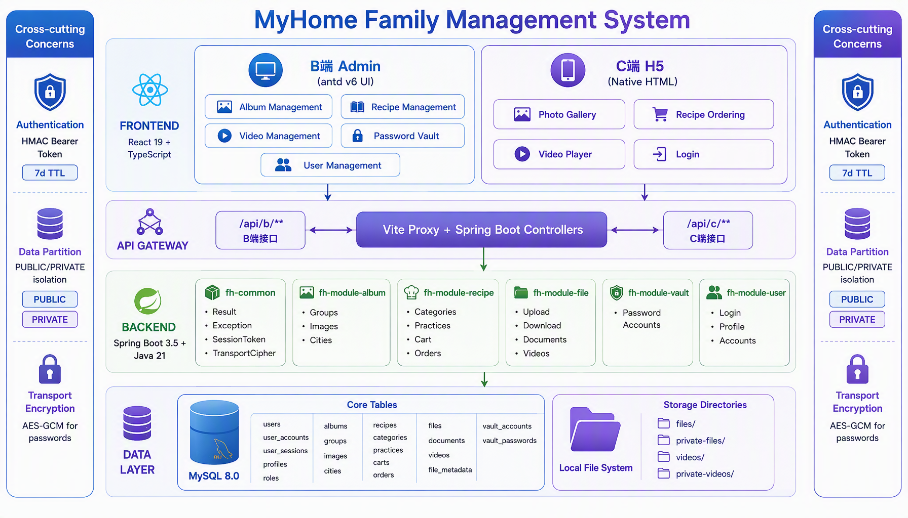

# MyHome 家庭管理系统 - 知识库

本项目整理了 MyHome 家庭管理系统的完整知识库，包括架构设计、技术栈、开发规范、业务口径和实践经验。

## 目录结构

```
MyHome-Knowledge/
├── README.md                    # 本文件
├── architecture/                # 架构设计
│   ├── system-overview.md       # 系统总览
│   ├── module-design.md         # 模块设计
│   └── data-model.md            # 数据模型
├── technical-stack/             # 技术栈
│   ├── backend.md               # 后端技术栈
│   ├── frontend.md              # 前端技术栈
│   └── database.md              # 数据库
├── development-standards/       # 开发规范
│   ├── coding-conventions.md    # 编码规范
│   ├── api-design.md            # API 设计规范
│   └── database-conventions.md  # 数据库规范
├── business-context/            # 业务上下文
│   ├── domain-models.md         # 领域模型
│   ├── user-stories.md          # 用户故事
│   └── feature-list.md          # 功能清单
├── memories/                    # 记忆点（经验教训）
│   ├── feedback/                # 用户反馈与行为模式
│   ├── project-decisions/       # 项目决策记录
│   └── technical-notes/         # 技术笔记
├── plans/                       # 方案文档
│   └── phase1-roadmap.md        # 一期方案
└── references/                  # 参考资料
    ├── tools-reference.md       # 工具参考
    ├── troubleshooting.md       # 故障排查
    └── best-practices.md        # 最佳实践
```

## 系统架构图



## 快速开始

### 核心概念

**MyHome** 是一个面向家庭的综合管理系统，涵盖：
- 📸 **相册管理**：家庭相册 + 私人相册，支持分组、城市分布、图片上传
- 🍳 **菜谱管理**：菜品分类、做法配置、点餐下单、订单统计
- 🎥 **视频管理**：家庭视频 + 私人视频，原生播放支持
- 🔐 **密码本**：账号密码保管，传输层加密
- 👤 **账号体系**：多用户登录、权限管理、个人中心

### 技术架构

- **后端**：Spring Boot 3.5 + Java 21 + MyBatis-Plus + Flyway
- **前端**：React 19 + TypeScript 5.9 + Vite 8 + pnpm monorepo
- **数据库**：MySQL 8.0
- **存储**：本地文件系统 + FileSystemResource（HTTP Range 支持）

### 关键特性

1. **数据分区隔离**：PUBLIC（公共）/ PRIVATE（个人）双域隔离
2. **会话令牌认证**：HMAC-SHA256 签名 Bearer Token，7天有效期
3. **传输层加密**：口令传输 AES 加盐加密
4. **版本化购物车**：共享购物车原子幂等消费
5. **预签名流式播放**：VideoPlayTicket 6h 签名票据

## 使用说明

本知识库适用于：
- 新成员快速了解项目架构和业务逻辑
- 开发人员查阅编码规范和最佳实践
- 产品经理理解功能设计和用户故事
- 运维人员排查问题和部署系统

## 维护说明

- **记忆点**：来自实际开发过程中的经验教训和用户反馈
- **方案文档**：记录各阶段的设计决策和实施细节
- **技术规范**：随项目演进持续更新

---

*最后更新：2026-09-23*
