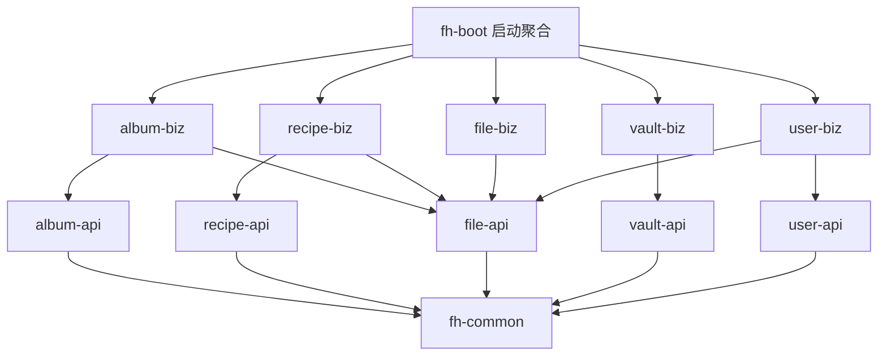

# 家庭 Home 一期技术方案

> 代号 `family-home`，Maven groupId `com.familyhome`，artifactId 前缀 `fh-`。
> 本文档是一期（相册 + 菜谱 + 密码本）的落地方案，含仓库结构、模块边界、表结构、接口清单、图片链路、前端方案与部署。
> **v5 起本文档是"方案 + M1 实况"**：凡 M1 已经落地并验证过的地方，写的是实际实现（含踩到的坑），不只是设计意图。
> **注意**：M2 之后（文件域、相册、菜谱、做法/点单/订单、文件管理）的实现实况**没有逐轮回填本文档**。
> 2026-09-20 集中回填了一批明显滞后的地方（§2 范围、§3 决策表的 C 端范围/菜单数/EXIF、§4.2 的 `album_image` DDL 与封面 SQL、
> §5.4、§6.5/§6.7/§6.9、§7.1~§7.4、§9 里程碑状态），手法统一是**保留设计原文、在其后加"实现实况"标注**，
> 因为"当时为什么那么设计"本身也是这份文档的价值。**但这不等于全文对齐**——§5.3 之外的接口清单仍可能有个别字段过时。
> 当前口径一律以两个仓库的 `README.md` 为准（§5.3 文件域那张表已按实况补过接口）。
> **v6（2026-09-21）单独回填了账号体系**：§0 口径表、§4.4、§5.3 账号接口、§5.7、§7.3 两端登录/当前用户/添加人、§10 风险 1
> 这几处是**照着实现改过的**；其余章节仍是"设计原文 + 零散实况标注"。
> **v7（2026-09-21）回填了 C 端接口层**：§5.4 整节重写为已实现的 `/api/c/**` 清单，§5.3/§7.3/§8.3/§9/§10 风险 1 里
> "C 端直接打 B 端接口"那些句子已按实况改掉。**这轮回填范围比 v6 大**（因为这一项改动本身就是跨章节的），
> 但同样不等于全文对齐——§5.3 菜谱那两张表里仍留着已作废的标签/类型字段，只为记录当时的设计。
> **v8（2026-09-21）回填了口令登录与个人中心**：凡 v6 那轮回填过的章节（§0 口径表、§1、§2、§4.4、§5.3 账号那张表、§5.4、
> §5.7、§5.8、§7.3、§7.4）里"登录填手机号""没有密码"的说法**已按实况改掉**，§9 补了一行 M6、§10 在风险 1 与风险 11
> 各加了一段 v8 标注。**改不掉的历史句子都留了 ⚠️ 或括注**，全文其余章节仍是"设计原文 + 零散实况标注"。
> **v9（2026-09-21）回填了"超管也碰不到别人的口令"**：v8 那一轮里"管理员在账号管理页重置口令 / 编辑账号"的能力**已整体下线**，
> 本文档凡提到"重置密码 / 编辑账号 / `PUT /api/b/user/{id}` / 四条 ADMIN 接口"的地方都按实况改掉或加了 ⚠️（§0 口径表、§1、§2、
> §4.4、§5.3 账号那张表、§5.4、§5.7、§7.3、§7.4、§9、§10 风险 1）。**本轮零迁移、零新列**，Flyway head 仍是 `V502`。
> **v10（2026-09-22）回填了"账号管理页可以设谁是超管"**：v9 那三条 ADMIN 接口变回四条（多一条**只写 `role` 一列**的 `PUT /api/b/user/{id}/role`），
> 本文档凡"三条""角色不在这个页面改""管理员唯一能替别人定的字段是头像"的说法都已按实况改掉（§0 口径表、§1、§4.4、§5.3、§5.4、§5.7、
> §7.3、§7.4、§9、§10 风险 1）。**口令那一格一点没放开**：管理员仍然看不到、也改不了任何人的口令。零迁移，Flyway head 仍是 `V502`。
> **v11（2026-09-22）回填了"口令前后端都走加盐加解密"**：五处口令出入口的请求体/响应体里从此**只有传输层密文**，明文只存在于两端的进程内
> （§0 口径表新增一行、§4.4、§5.2、§5.3 那三处口令接口、§5.7、§5.8、§8.3、§10 风险 11 都按实况改掉或加了 ⚠️）。
> **存储层一个字没动**（`password_hash` 仍是 PBKDF2、`password_enc` 仍是那把 vault 密钥的 AES-256-GCM），零迁移，Flyway head 仍是 `V502`。
> 本轮换来一条硬约束：**前端只能用 Web Crypto，页面必须在 https 或 localhost 下打开**，所以它进了 §8.3 的部署前置条件。
> **v12 / v13（历史）**：V210 引入 `album_group.scope`，随后开放 C 端「私人相册」；旧版仅分组分区的口径已被 v14 替代。
> **v14（当前）**：B 端「家庭相册」「个人相册」为平级一级菜单，子项均按图片管理 / 相册分组 / 图片分布排序；分组、图片、城市全部按分区隔离，个人数据属于当前账号。
> V211 为 `album_image`、`album_city` 增加 `scope + owner_id`（FAMILY 的 owner 为 0，PERSONAL 为当前账号）；分组继续用 `scope + creator_id`，图片 `creator_id` 保留真实上传人。历史跨分区共行拆成独立图片行，暂共享 fileId，删除前检查全相册活引用。
> B/C album 接口 `query.scope` 缺省一律 FAMILY（新建分组仍取 body）；裸 ID 跨分区/跨属主 404、个人列表无身份 401、批量先验全部、禁止跨区关联。详见 §4.2、§5.3/§5.4、§6.7/§6.9、§7.3；~~可伪造身份头~~（**v15 已堵：身份换成服务端签发的 HMAC Bearer token**，见上方 v15 条）和静态 URL 风险仍在（风险 14），**不代表完整安全隔离已完成**。
> **本轮已验证（2026-09-22）**：本地 `family_home` 的 V211 迁移 `success=1`、最新后端 JDK 21 启动；独立迁移 12 断言、真实 API 570 断言全通过，`pnpm typecheck` 与 admin/h5 build 再次成功。浏览器菜单、上传/分布/预览、切账号清旧状态及旧路由重定向已验证；**不含截图视觉验收或重测登录**，详情与未清理数据见下方 v14 当前状态。
> **v15（2026-09-22，当前）：身份凭据从可伪造的 `X-User-Id` 头换成服务端签发的 HMAC Bearer token，越权洞已堵。** 旧机制里"你是谁"完全由客户端自报，服务端只查"这个 id 还在不在"，于是任何人 `curl -H 'X-User-Id: 1'` 就成了大宝（ADMIN）——能列全家账号（含手机号）、建号删号、改角色、reveal 密码本明文、读写别人私人分区，登录时那次口令核对形同虚设。现在：登录成功后端用 `SessionToken`（fh-common）签一枚 `v1.<userId>.<exp>.<base64url(HMAC-SHA256)>` 令牌（TTL 7 天），前端单独存 `fh-auth-token`、每个请求带 `Authorization: Bearer <token>`，`CurrentUserInterceptor` 验签 + 验有效期通过才认人；**`X-User-Id` 整条下线、无任何回退**（留回退等于把洞重开）。令牌只含 `userId + exp`、**不含 role**，每次请求现查 DB 拿最新角色，所以改角色/删号当场生效。密钥 `fh.auth.token-secret`（dev 公开默认值、prod 仅 `FH_AUTH_TOKEN_SECRET` 且缺失即启动失败，与 vault key / transport salt 同口径）。**本文档下面凡说"没有 token/session""身份头可伪造""不认证"的句子都是 v15 之前的历史定性，一律以本条为准**；§5.7、§8.3、§10 风险 1/14 已按 v15 改写过。静态文件 URL 仍不鉴权（风险 14 保留）。**本轮已验证**：curl——伪造 `X-User-Id` 无令牌 → 401、ADMIN 令牌 → 200、MEMBER 令牌调账号管理 → 403、篡改令牌 → 401、B/C 真实登录签发可用令牌、口令错 → 400；浏览器——admin 登录存令牌（展示对象不含令牌）、账号管理页在令牌下加载全表、篡改令牌 → 401 → 清缓存 → 回登录页，h5 登录存令牌、私人相册 `/me` 与 PERSONAL covers 均 200。零迁移，Flyway head 仍是 `V503`。
> **v17（2026-09-23，当前）：B 端新增「视频管理」（公共视频 / 个人视频），支持在线预览播放。** 视频与文档一样是 `file_object` 的行，用 `biz_type='video'` 区分，**不另建业务表**（元数据 `file_object` 全都有，与 `DocumentFileService` 当初"文档不建表"同一口径）；分区沿用密码本/文件那套 `DataScope.PUBLIC/PRIVATE` + `DataPartition`（PUBLIC owner=0、PRIVATE 当前账号、ADMIN 无例外、跨区裸 ID 404、owner 服务端定）。**唯一一条迁移 V107（file 号段）**：把 V106 的 `chk_file_object_private_document` 换成 `chk_file_object_private_partition`，放行 `document`/`video` 两种 `biz_type` 进 PRIVATE 分区（图片行恒 PUBLIC/0，不受影响）。四条 B 端接口挂 `/api/b/video`：`GET`（列表，query `scope` 缺省 PUBLIC，每行带一枚现签播放票据）、`POST`（multipart 上传，`file` + `scope`，类型由服务端按文件名解析、非视频 415）、`DELETE /{id}`（软删行 + 物理删文件，走 `fileFacade.markDeletedAndPurge`）、`GET /{id}/stream?ticket=`（**唯一不验登录令牌的一条**，靠短时签名票据鉴权）。**播放鉴权 = 预签名票据 `VideoPlayTicket`**（HMAC-SHA256、TTL 6h、复用 `fh.auth.token-secret`，格式 `v1.<id>.<scope>.<ownerId>.<exp>.<sig>`）：因为 `<video src>` 由浏览器直接发 GET、带不上 `Authorization` 头，而又必须支持 HTTP Range 才能 seek/快进；**刻意不复用登录令牌 `SessionToken`**（令牌是身份凭证、绝不能进 URL/nginx log，票据只授予"读这一支、这一段时间"）。`stream()` 返回 `ResponseEntity<Resource>` 包 `FileSystemResource`（**必须是 FileSystemResource，不是 InputStreamResource**，Spring MVC 才会自动处理 Range/206），并按票据里的 id+scope+ownerId 回查行、校验私人路径前缀，任何不符 404。上传走 `FileStorageWriter.writeVideoStream`（`DigestInputStream` 单次落盘算 md5，**不进内存 byte[]、不做秒传**），multipart 上限 500MB/512MB。公共视频落 `videos/`、私人落 `private-videos/{ownerId}/`（私人根 = 同级 `root+"-private"`，永不静态 alias，`WebMvcConfig` 拦私有前缀出 `/files/**`）。**播放器选 xgplayer 3.0.26**（框架无关 ES module，`new Player({el,url,...})`，官方 React 包停在 2.x 不兼容 React 19，故手写 ref+effect 封装）：开箱即用倍速（0.5~3x）、快进（进度条拖 + 键盘 ←/→ 5s）、全屏/网页全屏/画中画、断点续播；**选集**由外层 `VideoPlayerModal` 拿视频列表当播放列表实现（上一支/下一支）；**清晰度是能力在、无可切**——播放器支持多码率，但单支上传的 MP4 没有第二档码流，所以控制栏不出现清晰度选择（不是缺功能，是没做转码）。**本轮已验证（浏览器 + 编译，全绿）**：公共/私人上传、xgplayer 挂载并经签名流 URL 播放、倍速菜单 0.5~3x（rate=2 生效）、快进/seek（currentTime 跳转 + Range 206）、选集播放列表 1/2↔2/2 切换（每支现签票据）、全屏/网页全屏、私人隔离（公共 2 支时私人空、私人用 PRIVATE 票据 ownerId=1 出流）、两分区删除（"删除成功"→列表归 0）；admin `typecheck` clean、`build` exit 0；测试数据全清（磁盘 0 文件、两分区列表均"共 0 支视频"）。零新表，Flyway head 从 `V503` 推进到含 `V107`（file 号段）。**本文档下面凡说"没有视频 / 视频管理不存在"的旧定性一律以本条为准。**
> **v22（2026-09-23，当前）：购物车从"一菜一行"改成"一人一菜一行"，同菜不同加购人各占一行、不再合并。** v19~v21 那三轮里 `recipe_cart_item` 的唯一键仍是 `uk_recipe(recipe_id)`——一道菜全车只有一行，`creator_id` 只是"最后把它加进车的人"。于是大宝先加 3 份佛跳墙、小宝再加 3 份同一道，后端 `ON` 到同一行、`qty` 被覆盖成 3 而不是各留各的，前端分模块时这道菜只会落进"最后加它的那个人"的模块，另一个人的份数凭空消失。本轮把它彻底改成一人一菜一行：**`V505`（user 号段）** 先把存量 `creator_id IS NULL` 的行洗成大宝（`SET @daibao := (SELECT id FROM app_user WHERE name='大宝' ...)`，与 V501/V504 同构），再 `MODIFY creator_id BIGINT UNSIGNED NOT NULL`、`DROP INDEX uk_recipe`、`ADD UNIQUE KEY uk_recipe_creator(recipe_id, creator_id)`。**为什么落 user 域 V5xx 而不是 recipe 域 V3xx**：洗数据要读 `app_user`（V500 才建），已有库靠 `out-of-order` 补跑没问题，但**从零重建时迁移按版本号顺序执行，V3xx 排在 V500 前面子查询会直接报错**——与 V504 完全同一个理由（本轮第一版误放 recipe/V320，已删除、重编号到 user/V505）。服务层 `RecipeCartServiceImpl.setItem` 在 `cartState.lock()` 之后、两个分支之前先取 `Long creatorId = CurrentUserHolder.requireUserId()`：改量/删行的 `selectOne`/`delete` 都带上 `.eq(recipeId).eq(creatorId)`，**只动调用人自己那道菜的那一行**，同菜别人的行各改各的、互不覆盖（`removeItem` 也从"按 recipeId 删"改成"按 recipeId+creatorId 删"）；插入分支写 `creatorId`。清空仍是整辆车（`clearCart` 不带 creatorId，全家共用一辆车、清空是家庭动作）。`RecipeOrderServiceImpl.reorderOrder`（再来一单写回车）同样先取身份、只回写调用人自己名下的行；`createOrder`/`appendCartToOrder` 逐车行插订单明细（`recipe_order_item` 无 (order_id,recipe_id) 唯一键，本就容得下同菜多行）。前端 h5 `OrderPage`：新增 `meId = useCurrentUser()?.id`，派生 `myCart`（只收 `item.creatorId === meId` 的行）供卡片步进器 / 详情浮层 / 加购读写，`cartItems`（抽屉与分模块展示）仍从 `snapshot.items` 全量重建；`setQty` 乐观更新只替换本人那一行（filter 按 `recipeId && creatorId===meId`、插入带 `creatorId: meId`）；`totalQty` 改成对整车 `snapshot.items` 求和（车栏那个数字是全家的）。抽屉里**本人行渲染步进器（可 +/−），他人行渲染只读 `×qty`**（新类 `.fh-order__sheet-qty`）；`OrderConfirmPage` 逐车行按 `creatorId` 分模块、天然一人一行，无需改动。**本轮已验证（浏览器实测混合车 + 后端行隔离）**：V505 应用后 `uk_recipe_creator` 生效、0 条 NULL creator；小宝改 recipe17 只动 `creator_id=2` 那行、大宝改只动 `creator_id=1` 那行，互不覆盖；抽屉呈"大宝 9 份（佛跳墙 ×5 带步进器）+ 小宝 3 份（佛跳墙 ×3 只读）"两个模块、同一道佛跳墙在两个模块各一行，确认页同口径、车栏合计 12 份；h5 `typecheck` clean；测试数据全清、车恢复大宝原三行（recipe17×1 / recipe1×2 / recipe21×2）。**本文档下面凡说"购物车一菜一行 / `uk_recipe` 唯一约束 / `creator_id` 只记录最后加它的人"的旧定性一律以本条为准。**
> **v21（2026-09-23）：购物车与确认页的分模块模块头带头像，账号字典 `/options` 起携带 `avatarUrl`。** v20 的模块头只有昵称 + 份数合计，本轮按用户口径在模块头左侧加一枚头像。后端**不新增接口**：把既有的 `UserOptionVO`（h5 能查到别人头像的唯一那本字典）扩一列 `avatarUrl`——`AppUserService.options()` 复用已有的私有 `avatarUrls(users)`（批量 `fileFacade.mapByIds`、优先缩略图），options 仍是"一次全表 + 一次跨域批量"的口径、不进循环；B/C 两端同 VO 同实现，两个 controller 的 javadoc 同步改写。h5 `utils/userNames.ts` 的模块缓存从 `Map<number,string>` 升级成 `Map<number,{name,avatarUrl}>`，同一份缓存派生 `useUserNames` / `useUserAvatars` 两个 hook（仍只打一次请求）；渲染处头像走 `shared/image` 的 `resolveUserAvatar`——没传过头像的账号（`avatarUrl=null`，如大宝）落默认剪影，有头像的账号（如小宝）显示真缩略图，两枚 20px 圆头像类 `.fh-order__sheet-creator-avatar` / `.fh-confirm__creator-avatar`。**本轮零迁移**（`avatar_file_id` 列 V500 就有，Flyway head 仍 V504）。**本轮已验证**：`GET /api/c/user/options` 实回 `avatarUrl`（大宝 null、小宝缩略图 URL）；浏览器混合车下抽屉与确认页两个模块头分别呈"大宝 = 默认剪影 + 4 份、小宝 = 真实头像 + 1 份"；验证后移除测试行、车恢复大宝三行；h5 `typecheck` clean。**本文档与 README 下面凡说"字典只有 {id,name}""模块头 = 昵称 + 份数"的表述以本条为准。**
> **v20（2026-09-23）：购物车与确认订单页的加购人改成「按人分模块」展示。** v19 是每道菜行尾挂一行灰字昵称，一车三个人的菜就要读三遍名字；本轮按用户口径改成**一个人一个模块**：h5 `OrderPage` 抽屉与 `OrderConfirmPage` 各加一个 `cartGroups`/`rowGroups` 的 `useMemo`（JS `Map` 分组，key = `creatorId`、NULL 归 `"none"` 一组），**组内保持加菜顺序、组顺序 = 该人第一道菜出现的顺序**，模块头一行 = 昵称 + 该人份数合计（`.fh-order__sheet-creator` / `.fh-confirm__creator` 两个类从"行内灰字"改造成"模块头"），行内那行灰字删掉。模块头不渲染的两种情况沿用 v19 的三条渲染规则：`creatorId` 为 NULL 的那一组、以及账号字典还没到的那一刻（label 为 null 就整块不渲染，避免"已删除账号"闪一下）；字典里查不到的 id 仍落 `DELETED_USER_NAME`。分组只动展示层，**后端零改动**（`creatorId` 仍是 v19 那列、insert-only 口径不变）。**本轮已验证（浏览器实测混合车）**：以小宝令牌 `PUT /api/c/recipe/cart` 加一道无做法的菜（`creator_id=2`），抽屉与确认页都呈现「大宝 4 份（佛跳墙/红烧肉/蛋炒饭）+ 小宝 1 份（南昌拌粉）」两个模块、行内无名字；在抽屉里对小宝那行点 +/− 一轮，`GET /api/c/recipe/cart` 回读该行仍 `creatorId=2`（改量不重写加购人）；验证后移除测试行、车恢复大宝三行。h5 `typecheck` clean。**本文档与 README 下面凡说"加购人是每行一行灰字"的表述以本条为准。**
> **v19（2026-09-23）：购物车条目带「加购人」，C 端购物车抽屉与确认订单页各展示一处。** v6 那轮给七张表加了 `creator_id`，唯独漏了购物车——当时车还是"家庭共用单车、无用户维度"（V304 表注释），加购人这个概念不存在；账号体系落地后"谁把这道菜加进车的"才有意义。本轮：**`V319`（recipe 号段）给 `recipe_cart_item` 加可空 `creator_id`**（不建索引、只存 id，与 V316 那三张表同口径）；**`RecipeCartServiceImpl.setItem` 只在插入分支写 `creator_id`**（`CurrentUserHolder.requireUserId()`，成为第 9 个创建行方法），update 分支（改量/改做法）**不重写**——与 `recipe_order`"继续加菜不改下单人"同一条口径；`snapshot()` 的 `CartItemDTO` 多带 `creatorId` 回给前端。存量三条 NULL 行由 **user 域 `V504`** 按 V501 的写法洗成大宝（按昵称子查询取 id、`WHERE creator_id IS NULL`）；**回填不跟 V319 写在一起**是因为它要读 `app_user`（V500 才建），已有库靠 out-of-order 补跑没问题、从零重建时 V319 排在 V500 前面子查询会直接报错——schema 各域自己改、数据一次性在 user 域洗，与 V501 是同一个理由。前端 h5 两处（`OrderPage` 购物车抽屉、`OrderConfirmPage`）在菜名/做法摘要下加一行灰字昵称，读 `useUserNames()` 那本 `Map` 字典，**取值必须 `.get(id)`**（本轮第一版写成 `userNames[id]`，Map 的下标访问恒为 undefined、那一格静默不渲染，是"看不到加购人"的真因之一）。**本轮已验证**：`mvn clean package` + 重启，Flyway 应用 V319（out of order）与 V504、head 到 `v504`，`SHOW COLUMNS` 见 `creator_id`、存量三行洗成 1；浏览器以大宝登录，购物车抽屉三行与确认订单页三行均显示"大宝"；再以小宝令牌 `PUT /api/c/recipe/cart` 新加一道菜，库落 `creator_id=2`、抽屉该行显示"小宝"（验证后已把这条测试行移除、车恢复原三行）。**本文档下面凡说"购物车无用户维度/没有加购人"的旧定性以本条为准**（"家庭共用单车、一菜一行、uk_recipe 唯一约束"不变，这一列只记录最后把它加进来的人）。
> **v18（2026-09-23，当前）：C 端支持看视频（家庭视频 / 私人视频，只读）。** v17 把视频整个域只挂 `/api/b`、H5 没有视频页；本轮给 H5 开一条**只读**通道——看列表 + 播放，但**不能上传、不能删除**（管理仍只在 B 端）。后端在 C 端自有接口层补 `VideoCController`（`/api/c/video`：`GET` 列表带现签 `playUrl` + `GET /{id}/stream?ticket=` 播放流，**无 POST/DELETE**），响应裁剪成 `VideoClientVO`（只留 `id,name,fileType,fileSize,playUrl`）；`VideoService` 把 `playUrl` 基址参数化（`STREAM_BASE_B`/`STREAM_BASE_C`，`listForClient` 走 C 基址、`list` 仍走 B 基址，**B 端行为逐字不变**）。票据 `VideoPlayTicket` **与路径无关**（只绑 id+scope+ownerId+sig），故两端共用同一套签发/校验；分区/鉴权/隔离与 B 端完全一致（`requireUserId`、PRIVATE 只出本人、ADMIN 无例外、跨属主 404、票据不符 403、缺 ticket 400）。前端 h5 用**原生 `<video controls playsInline>`、不引 xgplayer**（h5 零组件库原则；故 C 端无倍速菜单/选集侧栏，选集靠浮层上一支/下一支、不取模）：新增 `api/video.ts`、`pages/VideoPage.tsx`（**scope 参数化**一页复用家庭/私人）+ `VideoPage.css`，首页 `entries.ts` 补 `VIDEO`/`PERSONAL_VIDEO` 两卡、`HomePage` 补路径与图标、`App.tsx` 加路由 `/video`、`/video/personal`；`playUrl` 根相对 + vite proxy 直用，**不需 admin 那套 `resolvePlayUrl` 前缀**；h5 为 `formatFileSize` 多引 `@family-home/shared/format`（第五个子路径）。**零迁移**（V107 已在 v17 应用）。**本轮已验证（浏览器 + curl，全绿）**：首页两卡 → 列表（scope 正确）→ 原生 video 经签名流出流（readyState 4 + 解码帧 + stream 200/206）、选集切换；私人隔离（小宝看不到大宝 PRIVATE、curl `[]` + UI 空态，但仍看 PUBLIC）；伪造/缺失票据被拒（400/403/401）；h5 typecheck clean、build exit 0；测试数据全清。**本文档下面凡说"H5 没有视频页 / 视频只挂 B 端"的旧定性一律以本条为准（"不扩视频管理"半句仍成立——C 端只读）。**
> **v16（2026-09-23）：个人中心支持本人自助换头像。** 此前头像是"只在建号那一刻由管理员定、之后两端都没有换头像入口"的字段（见 §5.3、§7.3 那几条历史 ⚠️），本轮把这条路只开给"本人改自己"：`GET /api/b/user/profile` 的返回体从 `{id,name,phone}` 扩成 `{id,name,phone,avatarFileId,avatarUrl}`（`avatarUrl` 优先缩略图、供这一页预览与保存时原样带回），`PUT /api/b/user/profile` 从 `{name,phone}` 扩成 `{name,phone,avatarFileId?}`——**头像走的是个人中心那三条只 `requireUserId()`、不判 ADMIN 的自助接口**，管理员替别人换头像这条路仍然没有。前端 `ProfilePage.tsx` 账号信息卡顶部加一行「头像」：`Avatar` 预览 + 「更换头像」按钮，选完文件先过 `shared/image` 的 `compressImage`（canvas→JPEG）再 `uploadAvatar`（`POST /api/b/file/upload`，`bizType=USER_AVATAR`）拿 id，**头像放组件 `useState` 不进 Form values**（避开 `FormModal` 那套"取消后残留上一次 id"的坑），点保存随 `{name,phone,avatarFileId}` 一起提交；成功后 `refreshMe()` 覆盖本机 `fh-current-user`，侧栏/顶栏头像跟着更新。**代价：能换、清不掉**——后端 `updateById` 的 NOT_NULL 策略下 `avatarFileId` 为 null 就跳过这一列，所以"没换头像"不会把原来那张清掉，但也没有"恢复默认剪影"的入口（两端都没有）。**本轮零迁移、零新列**（`avatar_file_id` 列 V500 就有），Flyway head 仍是 `V503`。**已验证**：浏览器实测选图上传 200 → 预览换成新图 → 保存 → `PUT /profile` 200 → `/me` 200 → `localStorage['fh-current-user'].avatarUrl` 与顶栏头像更新 → 刷新后表单预览与顶栏都从新的 `GET /profile` 拿到持久化头像 → 库 `app_user.avatar_file_id` 落值；验证后已把测试账号头像复位为 NULL。**本文档下面凡说"头像只在建号那一刻定 / 两端都没有换头像入口 / 改头像的能力整个不存在"的句子都是 v16 之前的历史定性，一律以本条为准。**
> **已下线概念**：**菜品"标签"（`recipe_tag`）这个概念已整体删除**（2026-09-18，V314 删掉 `recipe_tag` + `recipe_tag_rel` 两张表，> 后端字典接口/DTO 字段、B 端表单项与筛选、C 端卡片 chip 一并去掉）。本文档下面凡是提到"标签 / `tagIds` / `recipe_tag`"的地方都是**历史方案**，保留只为说明当时为什么那么设计。
> 同类已删：菜谱"类型"（V303 重构为"分类"，多对多改一菜一分组）、C 端"餐段"标签条（V313 删掉当初种的早/午/晚三个标签）。

## 变更记录

**C 端支持看视频（家庭视频 / 私人视频，只读，2026-09-23，当前）**：v17 把视频管理整个域只挂在 `/api/b`、H5 没有视频页（与密码本/文件同口径）。本轮按需求"c端支持看视频"给 H5 开一条**只读**通道——能看列表、能播放，但**不能上传、不能删除**（管理动作仍只在 B 端「视频管理」）。沿用 v17 的全部后端机制（`file_object` `biz_type='video'`、`DataScope.PUBLIC/PRIVATE` 分区、`VideoPlayTicket` 6h 签名流、`FileSystemResource` 出 Range），只在 C 端自有接口层 `/api/c/**` 上补一条读路径 + 一个 h5 页面。

- **C 端只读接口（`/api/c/video`，新增 `VideoCController`）**：两条——`GET`（列表，query `scope` 缺省 PUBLIC，每行带现签 `playUrl`）、`GET /{id}/stream?ticket=`（播放流，支持 Range）。**没有 `POST`/`DELETE`**（敲过去 405）——上传与删除是管理动作，C 端刻意不给。走 v14 起的 C 端自有接口层口径：独立 `controller/c/` 类，只在**同一份 service** 上做路径/响应裁剪，不转发 `/api/b`、不写第二套实现。
- **响应裁剪（`VideoClientVO`）**：C 端 VO 只留 `id, name, fileType, fileSize, playUrl`，砍掉 `creatorId/ownerId/scope/mimeType/createTime` 这些 C 端用不到的内部字段（与相册/菜谱 C 端 VO 同口径）。
- **service 基址参数化（`VideoService`）**：`playUrl` 里要带前缀——B 端是 `/api/b/video/{id}/stream`、C 端是 `/api/c/video/{id}/stream`，票据本身与路径无关（只绑 id+scope+ownerId+sig），所以两端共用同一套签发/校验，只是拼 URL 的基址不同。加两个常量 `STREAM_BASE_B`/`STREAM_BASE_C`，`list(scope)` 仍走 B 基址（`listForClient(scope)` 走 C 基址），私有 `list(DataScope, String streamBase)` 统一实现。**B 端行为逐字不变**（默认参数转发到带基址的重载）。
- **鉴权/隔离与 B 端完全一致**：`DataPartition.forRequest(scope)` 内部 `requireUserId()`（PUBLIC 列表也要登录），PRIVATE 只出当前账号的、ADMIN 无私人读例外、跨属主裸 ID 404；播放仍靠 `VideoPlayTicket`（**不复用登录令牌**，令牌绝不进 URL/nginx log），票据空/烂/签名错/过期/id 不符一律 403，缺 `ticket` 参数 400。私人视频根永不静态 alias，流走签名票据这一条。
- **前端（h5）**：`api/video.ts`（`VideoScope='PUBLIC'|'PRIVATE'`、`VideoItem{id,name,fileType,fileSize,playUrl}`、`listVideos(scope='PUBLIC')` → `getJson('/api/c/video?scope='+scope)`，用 h5 原生 fetch 薄封装、不引 axios）；`pages/VideoPage.tsx`（**scope 参数化**：`{scope='PUBLIC'}:{scope?:VideoScope}` 一页复用家庭/私人两档；列表加载带 cancelled flag 防竞态；`step(index,delta)` 选集、**不取模**（到边界 clamp，C 端不做循环）；keydown Esc/←/→；header 返回 `navigate('/')`；三态：加载中 / error+重新加载 / empty「还没有视频…」；卡片 `<button class="fh-video__card">` + PRIVATE 角标 + 名称 + `{fileType} · {formatFileSize(fileSize)}`；播放浮层 `<div class="fh-video__player">` 带 × 关闭、标题、上一支/下一支（仅 >1 时显示）、`<video key={current.id} controls autoPlay playsInline src={current.playUrl}>`、计数「N / M」）。**播放器用 h5 原生 `<video>`、不引 xgplayer**——h5 原则"不引组件库/保持 C 端零构建耦合"，原生 controls 已够看/seek/全屏；这也意味着 C 端没有倍速/选集侧栏那套 B 端 xgplayer 能力（倍速靠浏览器原生菜单，选集靠浮层里的上一支/下一支）。`playUrl` 是根相对路径，h5 base `/` + vite proxy `/api`→:8080，故 `<video src>` 直接用、**不需要 admin 那套 `resolvePlayUrl` 前缀**。`VideoPage.css` 走 fh-video BEM。
- **首页两入口 + 路由**：`constants/entries.ts` 的 `EntryCode` 加 `VIDEO`/`PERSONAL_VIDEO`，`HOME_ENTRIES` 在「家常菜谱」后补「家庭视频」（渐变 #7b2ff7→#f107a3）「私人视频」（#56ab2f→#a8e063）两张卡；`HomePage.tsx` 的 `PATH_BY_CODE`（VIDEO→`/video`、PERSONAL_VIDEO→`/video/personal`）与 `ICON_PATH_BY_CODE`（VIDEO=屏幕+播放三角、PERSONAL_VIDEO=挂锁+播放三角）各补两条；`App.tsx` 加路由 `/video`（scope PUBLIC）+ `/video/personal`（scope PRIVATE），`key` 含 `user.id` 切号重挂。C 端视频**只读**：上传/删除仍只在 B 端，密码本也不下沉 C 端（口径不变）。
- **shared 多引一个子路径**：h5 原引 `@family-home/shared` 的四个纯 TS 子路径（`./image`、`./brand`、`./auth`、`./crypto`），本轮为 `formatFileSize` 多引 `./format`（第五个），仍不引 admin 的 axios 封装与任何组件库。
- **零迁移**：视频域 V107 已在 v17 应用，C 端只读不碰 schema，Flyway head 不变。
- **验收（浏览器 + curl，全绿）**：首页两张视频卡渲染 → 点入家庭视频列表（PUBLIC，scope 正确）→ 原生 `<video>` 播放浮层经签名流 URL 出流（`readyState=4` + 解码出 320×240 帧 + `list_network_requests` 见 stream 200 全量与 206 Range，证明服务的是合法可 seek 媒体）→ 选集上一支/下一支切换正常；私人视频隔离：小宝（id 2）看不到大宝（id 1）的 PRIVATE 片（curl `[]` + UI 空态「还没有视频…」），但仍能看到 PUBLIC；伪造/缺失票据被拒（400 缺 ticket / 403 票据不符 / 401 无身份）；h5 `typecheck` clean、`build` exit 0。测试数据全清（2 支测试视频删除、C 端两列表归空、磁盘 0 支遗留 webm、临时文件移除）。测试片 `duration=0.001` 是 MediaRecorder 产的 webm 缺 duration 元数据所致、非 bug（readyState 4 + 解码帧 + 206 已证明流可用）。两个 README + 视频记忆 + 本方案已同步。
- **边界**：C 端只读，管理（上传/删除）仍只在 B 端；播放靠 6h 票据，URL 泄漏=这段时间内可读这一支（可接受，与登录令牌不同级）；静态文件 URL 仍不鉴权（视频不走静态 URL 故不受影响）；h5 用原生 video，没有 xgplayer 的倍速菜单/选集侧栏/清晰度（清晰度本就"能力在、无可切"，因未转码）。

**视频管理（公共视频 / 个人视频）+ 在线预览播放（2026-09-23）**：B 端「文件管理」与「密码本」之间新增一级菜单「视频管理」（`PlaySquareOutlined`），下设「公共视频 / 个人视频」（`/video/public`、`/video/private`，旧 `/video` 重定向公共页）。需求原话是"加一个视频管理，需要包含公共视频和个人视频，视频支持预览播放，播放器你看看有哪些，选一个功能比较多一点的，比如倍速，清晰度，快进，选集等等"——播放器由我选定 **xgplayer 3.0.26**。

- **不另建业务表**：视频是 `file_object` 的行、`biz_type='video'`（文档是 `document`、图片是 `ALBUM_IMAGE`/`RECIPE_IMAGE`/`USER_AVATAR`），元数据 `file_object` 全都有，视频相对文档没有多出来的业务语义，与 `DocumentFileService` 当初"文档不建表"的取舍同一口径。**唯一一条迁移 V107（file 号段，不是早期计划的 V600）**：V106 那条 `chk_file_object_private_document` 只放行 `document` 进 PRIVATE，私人视频会被它挡下，所以 `DROP` 掉换成 `chk_file_object_private_partition CHECK (scope='PUBLIC' OR BINARY biz_type IN ('document','video'))`。图片行恒 PUBLIC/0（`FileFacadeImpl.upload` 写死），这条约束对图片无影响。（应用时 MySQL 会报一句 `'BINARY expr' is deprecated` 的良性 warning，迁移 `success=1`；已应用的迁移绝不回头改。）
- **分区沿用密码本/文件那一套**：`DataScope.PUBLIC/PRIVATE` + `DataPartition.forRequest(scope)`（内部 `requireUserId()`），PUBLIC owner=0、PRIVATE owner=当前账号、**ADMIN 无私人读例外**、跨区/跨属主裸 ID 一律 404、owner 服务端定不由请求指定。列表/上传/删除都要求登录。
- **四条 B 端接口（`/api/b/video`）**：`GET`（列表，最近上传在前，query `scope` 缺省 PUBLIC，**每行带一枚现签的播放票据** `playUrl`）、`POST`（multipart `file` + query `scope`，类型由服务端按文件名解析校验、**非视频 415**，前端不传也不能传）、`DELETE /{id}`（软删记录 + 物理删文件，走 `fileFacade.markDeletedAndPurge(List.of(id))`，与文档/图片同口径）、`GET /{id}/stream?ticket=`（播放流，支持 HTTP Range）。
- **播放鉴权 = 预签名短时票据（`VideoPlayTicket`）**：`<video src>` 由浏览器直接发 GET、**带不上 `Authorization` 头**，而视频（尤其私人）又必须鉴权、还必须支持 Range 才能 seek/快进——交集就是业界通行的预签名 URL。列表接口（本身要登录）为每支视频现签一枚 **TTL 6h、只绑这一支** 的票据（HMAC-SHA256，格式 `v1.<id>.<scope>.<ownerId>.<exp>.<base64url-sig>`，**复用 `fh.auth.token-secret`**，不新增配置项），播放接口只验这枚票据的签名+有效期。**刻意不复用登录令牌 `SessionToken`**：令牌是"有效期内的身份凭证"，一旦落进 nginx access log 就等于把身份摊出去（用户明令禁止令牌进日志/URL）；票据只授予"读这一支、这一段时间"，泄漏了也调不动别的接口、很快过期，进 URL 可接受。拦截器对没有 Bearer 头的请求按匿名放行，所以 stream 这一条能走到 controller 由票据把关。`verify()` 对空/格式烂/签名不对/过期/id 不符一律抛 `USER_FORBIDDEN`（403，不细分原因）。
- **`stream()` 返回 `ResponseEntity<Resource>` 包 `FileSystemResource`**（**必须是 `FileSystemResource`、不是 `InputStreamResource`**，Spring MVC 才会自动处理 Range 请求、返回 206 部分内容，这是能 seek 的前提）。响应头 `Accept-Ranges: bytes`、`Content-Disposition: inline`、`CacheControl.noStore()`、`X-Content-Type-Options: nosniff`。它**不盲信票据**：按票据里的 id+scope+ownerId 回查 `file_object` 行、并校验私人路径前缀与 scope+ownerId 一致，任何不符 404。
- **上传走流式**：`FileStorageWriter.writeVideoStream(InputStream, ext, partition)`——`DigestInputStream` 在单次落盘中算 md5，**不读进内存 byte[]、不做秒传/去重**（视频大，且每支独立成行）。`VideoType.resolve(originName)` 解析扩展名+mime（白名单 `mp4/m4v/mov/webm/mkv/avi/ogv/3gp/ts/mpg/mpeg/flv/wmv`，mime 表查不到的按扩展名补默认），非视频抛 `FILE_TYPE_UNSUPPORTED`（415）；扩展名清洗规则与 `DocumentType` 一致（只留 `[a-z0-9]`、≤16 字符，因为它拼进落盘 `fileKey`，是路径注入入口）。multipart 上限在 `application.yml` 放到 500MB/512MB。
- **存储路径**：公共 `videos/yyyy/MM/dd/uuid.ext`、私人 `private-videos/{ownerId}/yyyy/MM/dd/uuid.ext`（`FileStorageConfig.PRIVATE_VIDEO_PREFIX`，`privatePrefixOf(fileKey)` 同时认 `private-documents/` 与 `private-videos/`）。私人根 = 公共根同级 `root+"-private"`（运行时 `/Users/xxmlp/family-home-data/files-private`），**永不静态 alias**，`WebMvcConfig` 拦私有前缀出 `/files/**`。删除用 `markDeletedAndPurge`（软删行 + 提交后物理删文件）。
- **前端（admin）**：`api/video.ts`（`resolvePlayUrl(playUrl)` = `import.meta.env.BASE_URL.replace(/\/$/,'') + playUrl`、`listVideos`、`uploadVideo` 带 `onUploadProgress` + `timeout:0`、`deleteVideo`）；`features/video/useVideos.ts`（`VIDEO_KEY=['video']`，`useVideos`/`useUploadVideo`/`useDeleteVideo`）；`features/video/VideoPlayer.tsx`（xgplayer 封装：`playbackRate [0.5,0.75,1,1.25,1.5,2,3]`、`keyboard.seekStep 5`、`memoryPlay`、`volume 0.8`、`lang 'zh-cn'`、`ignores ['danmu']`、`screenShot false`、`loop false`，src 变化销毁重建=切集）；`features/video/VideoPlayerModal.tsx`（width 960，右侧播放列表=**选集**，上一支/下一支 `go(delta)` 取模、"N / M"）；`features/video/UploadVideoModal.tsx`（`accept="video/*"`、`Progress`、`useValidationSession`）；`pages/video/VideoListPage.tsx`（`scope` prop、`PageShell`、`Table`）。路由 `/video`→`/video/public`、`/video/public`、`/video/private`（`key={dataKey(scope)}` 切分区重挂）；`AdminLayout` 新增 `sub-video` 菜单组（公共视频/个人视频），排在 `sub-file` 与 `sub-vault` 之间，`resolveSelectedKey`/`resolveOpenKeys` 各加 `/video` 分支。**页面路由刻意用单数 `/video`**（静态前缀是 `/files`，且播放走 `/admin/api/b/video/{id}/stream` 命中 `/admin/api` 代理，不冲突）。
- **清晰度限制（必须记明）**：xgplayer 支持多码率清晰度切换，但**单支上传的 MP4 没有第二档码流**（没做转码），所以控制栏不出现清晰度选择——**能力在、无可切**，不是缺功能。倍速/快进/选集/全屏均开箱可用。
- **验收（浏览器 + 编译，全绿）**：公共上传 2 支、xgplayer 挂载并经签名流 URL 播放（muted 下 `currentTime` 推进）、倍速菜单 0.5~3x（rate=2 生效）、快进/seek（`currentTime=5` + 拖拽 + 上一轮已验 Range 206）、选集播放列表 1/2↔2/2 切换（侧栏列两支、每次 fetch 现签票据）、全屏 + 网页全屏、私人上传 + 隔离（公共 2 支时私人空；私人用 PRIVATE 票据 ownerId=1 出流，readyState 4 + duration 10 + videoError null 证明签名流服务的是合法媒体）、两分区删除（"删除成功"→列表归 0）。admin `typecheck` clean、`build` exit code 0。测试数据全清：磁盘 0 视频文件（公共 `files/videos/` + 私人 `files-private/private-videos/`）、两分区 UI 列表均"共 0 支视频"（软删行留存属设计；空日期目录残留无害）。
- **边界**：私人视频播放靠 6h 票据，票据 URL 泄漏=这段时间内可读这一支（可接受，与登录令牌不同级）；静态文件 URL 仍不鉴权（风险 14 保留，视频不走静态 URL 故不受影响）；没做转码，故无真正多码率清晰度；H5 不扩视频管理（与密码本/文件同口径，只挂 B 端）。两个 README 已同步。⚠️ **v18（2026-09-23）起"H5 没有视频页"不再成立**：H5 新增**只读**视频页（`/api/c/video` 列表 + 原生 `<video>` 播放浮层 + 首页家庭视频/私人视频两入口），但"不扩视频**管理**"这半句仍然成立——上传/删除仍只在 B 端，C 端不能写（详见上方 v18 变更记录）。

**个人中心支持本人自助换头像（2026-09-23）**：v9/v10 之后头像一直是"只在建号那一刻由管理员定、之后两端都没有换头像入口"的字段，本轮给本人开了一条自助换头像的路（管理员替别人换头像仍然没有）。

- **后端**：`UserProfileUpdateRequest` 加 `Long avatarFileId`（null = 不改头像）；`AppUserService.updateProfile()` 多一行 `patch.setAvatarFileId(request.getAvatarFileId())`——走 `updateById` 的 NOT_NULL 策略，null 就跳过这一列，所以"没换头像"不会把原来那张清掉（代价：能换、清不掉）；`profile()` 与 `UserProfileVO` 补 `avatarFileId` + `avatarUrl`（后者由现成的 `avatarUrls(...)` 批量解析 fileId→缩略图 URL，取不到退原图），供这一页预览与保存时原样带回。接口路径/权限一个字没动：换头像走的还是个人中心那三条只 `requireUserId()`、不判 ADMIN 的自助接口（`PUT /api/b/user/profile`），目标恒等于当前登录者。**零迁移、零新列**（`avatar_file_id` 列 V500 就有），Flyway head 仍是 `V503`。
- **前端**：`ProfilePage.tsx` 账号信息卡顶部加一行「头像」——`Avatar`（`resolveUserAvatar` 兜底默认剪影）+「更换头像」`Upload`。选完文件 `compressImage`（canvas→JPEG，避 HEIC 415，与新增账号/相册/菜谱封面同一条路）→ `uploadAvatar`（`POST /api/b/file/upload`，`bizType=USER_AVATAR`）拿 `id`，存进组件 `useState`（**不进 antd Form values**，避开 `FormModal` 那套"取消后残留上一次上传 id"的坑），点「保存」随 `{name,phone,avatarFileId}` 一起发 `PUT /api/b/user/profile`；成功后 `useUpdateProfile` 的 `refreshMe()` 覆盖本机 `fh-current-user`（含 `avatarUrl`），侧栏/顶栏头像当场更新。`api/user.ts` 的 `UserProfile` 加 `avatarFileId`/`avatarUrl`、`updateProfile` 入参加 `avatarFileId?`。
- **验收（浏览器，全绿）**：选图上传 `POST /api/b/file/upload` 200 → 表单内 `Avatar` 预览换成上传图 → 保存 `PUT /api/b/user/profile` 200 → `GET /me` 200 → `localStorage['fh-current-user'].avatarUrl` 与顶栏头像更新 → 刷新后表单预览与顶栏都从新的 `GET /profile` 拿到持久化头像 → 库 `app_user.avatar_file_id` 落值（截图 `/tmp/fh-profile-avatar.png` 目视确认）。验证后已 `UPDATE app_user SET avatar_file_id=NULL WHERE id=1` 把测试账号复位为默认剪影。admin `typecheck` 通过。
- **边界**：只开"本人改自己"，管理员替别人换头像仍无入口（建号那一刻定一张是唯一例外）；没有"恢复默认剪影"的入口（两端都没有）。§5.3、§7.3 那几条"头像只在建号那一刻定 / 改头像的能力整个不存在"的历史句已加 ⚠️ v16 标注；两个 README 已同步。

**身份凭据换成服务端签发的 HMAC Bearer token，堵掉 `X-User-Id` 越权（2026-09-22）**：旧机制身份完全由客户端自报的请求头 `X-User-Id` 决定，服务端只查"这个 id 的账号还在不在"，于是任何能连到 8080 的客户端 `curl -H 'X-User-Id: 1'` 就冒充大宝（ADMIN）——列全家账号（含手机号）、建号删号、改角色、reveal 密码本明文、读写别人私人分区，登录那次口令核对形同虚设。本轮把它换成服务端签名、带有效期、改一个字符就验不过的令牌：

- **后端**：`fh-common` 新增 `SessionToken`（手写 JDK `HmacSHA256`，不引 JWT 库，与 `TransportCipher` 同手法），格式 `v1.<userId>.<exp epoch 秒>.<base64url_nopad(HMAC-SHA256(前三段))>`，TTL 7 天（`TTL_SECONDS`），签名用定长时间比较（`MessageDigest.isEqual`）；`verify()` 对空/格式烂/签名不对/过期一律抛 `USER_NOT_LOGIN`（401，不细分原因免得给探针）。密钥 `fh.auth.token-secret`（dev 一个公开默认值、prod 仅环境变量 `FH_AUTH_TOKEN_SECRET`，缺失/短于 32 字符/非 ASCII 即 `IllegalStateException` 启动失败，与 vault key、transport salt 同口径）。`fh-boot` 新增 `AuthTokenConfig` 装配 bean。
- **拦截器**：`CurrentUserInterceptor` 改读 `Authorization: Bearer <token>`。三档——① 没带头 → 匿名放行（读接口本就允许匿名，写接口由 `requireUserId()`/`requireAdmin()` 自己挡）；② 带了头但非 `Bearer ` 前缀 → 记 warn、按匿名放行；③ 带了 Bearer 但验不过 → 直接 401（**不落回匿名**）。验签通过才拿令牌里的 userId 去 `AppUserService.resolve()` 换现值。**令牌只含 userId + exp、不含 role**，每次请求现查 DB 拿最新角色，所以改角色/删号当场生效、不需要重登（令牌里没有可被陈旧利用的权限快照）。`X-User-Id` 整条下线、**无任何回退**。
- **登录签发**：`AppUserService.login()` 成功后多签一枚令牌，返回体在 `{id,name,role,avatarUrl}` 之外多一个 `token` 字段（B/C 两端同一份 `login()`）。
- **前端**：`packages/shared/src/auth` 把展示对象与令牌**分两格存**——`fh-current-user`（`{id,name,role,avatarUrl}`）与 `fh-auth-token`。导出改为 `getAuthToken`/`setAuthToken`（令牌）、`getCurrentUserId`（仅作"身份有没有切换"的比对锚点，**不再当请求头送出去**）、`AUTH_HEADER`（`'Authorization'`）/`BEARER_PREFIX`（`'Bearer '`，与后端 `CurrentUserHolder` 逐字对齐）；旧的 `getCurrentUserIdHeader`/`USER_HEADER` 删除。`setCurrentUser` 只动展示对象（`normalize` 一遍，令牌不会混进展示缓存），`clearCurrentUser` 把两样一起清。两端 HTTP 层（admin `lib/http.ts`、h5 `utils/request.ts`）每次发请求现读令牌、有值就写 `Authorization: Bearer <token>`、无值不带；401（含令牌过期/验不过、账号被删）统一清账号 + 令牌、回登录页。令牌是凭据，不进日志/query cache。
- **为什么分开存**：展示对象会被 `/me` 的返回整格覆盖（`refreshMe`），而 `/me` 不带令牌；若把令牌塞进同一对象，一次开机自校就会把它抹掉。
- **测试/dev-seed**：`deploy/auth-token.mjs`（`node deploy/auth-token.mjs <userId>` 铸 dev 令牌、`--verify <token>` 解出 userId）与 `deploy/dev-seed.sh`、`verify_v14_api.py` 改用 Bearer 令牌；集成测试用 `SessionToken` 铸令牌。
- **验收（curl + 两端浏览器，全绿）**：curl——伪造 `X-User-Id` 无令牌 → 401、ADMIN 令牌 → 200、MEMBER 令牌调账号管理 → 403、篡改令牌 → 401、B/C 真实登录签发可用令牌、口令错 → 400；浏览器——admin 登录存令牌（展示对象不含令牌）、账号管理页在令牌下加载全表、篡改令牌 → 401 → 清缓存 → 回登录页，h5 登录存令牌、私人相册 `/me` 与 PERSONAL covers 均 200。读接口匿名放行（首页无令牌也渲染）是设计而非回归。
- **边界**：静态文件 URL 仍不鉴权（风险 14 保留）；令牌密钥泄露仍是风险，但已不是"零成本冒充"。§8.3 的 nginx 内网白名单从"挡住越权的唯一手段"降级为纵深防御。零迁移，Flyway head 仍是 `V503`。两个 README 与本文档 §0 口径表、§4.4、§5.3、§5.4、§5.7、§7.3、§8.3、§9、§10 风险 1/14 已同步。

**公共 / 私人密码与文件（2026-09-22）**：B 端密码本下设「公共密码 / 私人密码」（`/vault/public`、`/vault/private`），文件管理下设「公共文件 / 私人文件」（`/file/public`、`/file/private`），旧入口均重定向公共页。两套页面分别复用，不扩 H5。历史记录全部归 PUBLIC，PRIVATE 属当前账号；分区和属主由服务端确定，创建后不可移动，ADMIN 不绕过私人隔离，creator 仍是实际创建人。全部两域入口（含文件分类、下载、reveal）须身份，无身份 401，跨分区/属主 ID 404；预检、唯一索引和列表都按相同分区判定。文件分类也独立，文件原名与密码内容不判重。

V106/V404 新增分区字段与约束，不改已应用迁移，不删除或改名历史内容。私人文档落到公共存储根的同级 `原目录名-private`，静态 `/files/**` 不映射该目录；列表不返回私人 URL，下载通过身份头+属主校验返回 attachment/no-store 二进制。跨域图片映射排除文档，PUBLIC 秒传不读 PRIVATE 源，PRIVATE 仅在同属主文档内秒传，各次上传仍是独立记录和路径。部署须持久化、备份私人根，不得给其配置静态 alias。

前端缓存与组件会话含 scope/userId，切换即清旧筛选、浮层及口令，迟到 reveal/下载响应不回填，文档保持单文件上传且固定发起身份，关闭或切号后旧响应不回填；私人下载临时 objectURL 用后释放。首页保持六卡，仅统计并链接公共文件/密码。`X-User-Id` 仍可伪造，未升级可信 token/session，本轮不宣称解决全站认证或私人相册静态 URL 边界。

**验收结果（2026-09-22 实测）**：后端 113 项回归全绿——`VaultDocumentPartitionIntegrationTest` 55、`DuplicateValidationIntegrationTest` 45、`DuplicateExceptionHandlerTest` 13，0 失败/0 错误/0 跳过（真实 MySQL 8、独立 target 存储根、合成用户与口令）。V106/V404 已应用（`success=1`），存量三域行数/存活数/元数据校验和迁移前后完全一致：vault 8 行 2 存活、documents 10 行 0 存活、categories 3 行 3 存活（校验和排除口令列）。前端 `typecheck`（shared/admin/h5）与 admin `build` 通过。浏览器实测：四子菜单与旧入口重定向、PUBLIC 同名记录可在两分区并存、PRIVATE reveal 精确保留口令首尾空格、切号后私人记录与明文即消失、跨属主下载返回 404、私人下载走 Blob+objectURL 且用后释放（created=revoked=1、字节一致）、PUBLIC 静态链接可取回原字节、迟到 reveal 与迟到删除响应均被会话守卫丢弃（无迟到明文、无迟到「已删除」提示）、首页六卡仅统计公共（公共文件 0 / 公共密码 2）；私人逻辑前缀误放公共根时静态解析器返回 404。本轮全部合成数据已清理（DB 行硬删、物理文件清除、诊断全局随重载清空），存量校验和复位到基线。

**业务字段去重（2026-09-22，当前）**：菜名（未删除）、菜品分类、做法分组各自全局唯一；文件分类仅同 PUBLIC/PRIVATE 分区唯一（私人按当前账号）；做法选项仅同组唯一；相册分组仅同分区唯一（家庭共享，个人按当前账号）；存活账号的昵称、手机号各自唯一；密码本仅同 PUBLIC/PRIVATE 分区内按「名称 + 账号」联合唯一。不比较密码内容，不限制文件原名或城市复用。写入口 trim，预检与索引沿用 MySQL `utf8mb4_0900_ai_ci`（忽略大小写/重音）；下架仍占名、软删生成键变 NULL，允许反复删除重建，编辑排除自身。新迁移 V105/V212/V318/V403/V503 已应用到本地 MySQL，存量审计无冲突，未自动删改历史数据；其他环境若有冲突须先人工确认处理方式，不跳过约束。

B 端新增 `POST /api/b/validation/duplicate`，固定 kind 查询完整数据库，只返回是否重复，不受列表分页/筛选影响；POST 避免手机号/账号出现在 URL。账号资料校验只允许本人，新建账号校验仅管理员；个人相册属主取当前身份，不由表单指定。业务写入口独立检查，数据库并发撞名统一返回 409 和固定中文，不输出 SQL 或重复值。做法组选项差量更新先锁组、验证 ID、释放删除项名称、事务内临时改名后写最终名，保留原有选项 ID，支持名称交换；失败整笔回滚。菜品编辑/删除共用行锁，禁止旧状态回写复活已删除菜品。dev 显式关闭 user/vault dao 的 DEBUG 参数日志。

前端共用 250ms 防抖表单校验与行内编辑组件，错误不清输入，关闭/卸载/换账号/换上下文时旧异步结果作废；密码本两字段联动，不读取密码。B 端 `/me` 回填也增加身份对象校验，避免迟到响应覆盖换账号或注销。JDK 21 package、45 例真实 MySQL 回归、10 例异常映射，以及双端 build/typecheck 均通过；浏览器已实测内联拦截、编辑排除自身、跨组/相册分区允许同名、乱序校验不回显旧错误、关窗不继续写入、迟到 `/me` 不恢复旧身份。独立浏览器还验证了账号昵称/手机号、个人资料、密码本联合字段及文件分类的真实判重；故障注入验证判重网络失败时阻止提交、解除后恢复，这组检查不覆盖有效数据的成功保存。完整验收范围及清理结果以两个仓库 README 的本轮记录为准。

**C 端头像下拉（2026-09-22，当前）**：按最新要求删除「切换账号」，头像下拉仅保留「注销」，不含个人中心。注销调用 `clearCurrentUser()` 清本机身份、不删除账号，刷新或再次访问仍须选账号并输入密码登录；`App.tsx` 对 `/me` 增加失效标记与当前身份校验，注销前的延迟响应不能重新写回账号。H5 类型检查、生产构建与改动格式检查通过；浏览器验证仅一项、点击注销、释放延迟的真实 `/me` 响应后仍未登录、刷新后密码为空且登录按钮禁用、直接进入点餐 URL 仍显示登录页，账号候选仍保留。诊断 fetch 包装和临时变量已移除，最终停留注销后的首页登录界面。本轮截图工具报可视表面不可用，未完成新截图视觉验收；先前两项版的截图/四档容器宽度、Tab/Esc 验证仅作历史记录，未重测口令登录。

**B 端头像下拉精简 + 管理员账号不可删（2026-09-22，当前）**：B 端 `CurrentUserBlock` 下拉删除「切换账号」，仅留「个人中心 / 注销」——切换账号与注销动作完全相同（都只 `clearCurrentUser()`），换人靠注销后重新登录，不再单设入口；`UserSwitchOutlined` 导入与 onClick 的 switch 分支一并移除，`useUsers.ts`/`UserRoleSwitch.tsx` 里三处提到「切换账号」的过时注释同步校正。账号删除规则收紧成**目标是 ADMIN 一律不可删**：`AppUserService.delete()` 改为命中 ADMIN 直接 403「管理员账号不能删除，请先取消其管理员角色」，删掉了原来的「不能删自己」与「至少保留一个管理员」两个分支（操作人必是 ADMIN，故删自己已被这条覆盖；管理员删不掉，最后一个管理员自然还在）。前端 `UserManagePage` 两处删除按钮的门槛从 `record.id !== me.id` 改为 `record.role !== 'ADMIN'`，管理员行不显示删除，要删管理员得先在「角色」列把他降成成员、降下来删除按钮才出现；`updateRole()` 的提权/降权两道护栏不变。验收：JDK 21 `package` BUILD SUCCESS、前端三包 typecheck 全绿；curl 实测删管理员自己与删另一个管理员均 403（新提示语）、临时成员建号→删除成功（软删后从存活列表消失，验收行 id=805 已硬删还原）；浏览器实测大宝（ADMIN）行无删除按钮、小宝（MEMBER）行有，把小宝升为 ADMIN 后删除按钮消失、降回 MEMBER 后重现，库最终复位为大宝 ADMIN / 小宝 MEMBER。

**B 端侧栏菜单调序（2026-09-22，当前）**：按用户要求把「菜谱」「点单管理」两组排到「家庭相册」之前。只动 `AdminLayout.tsx` 的 `MENU_ITEMS` 常量顺序（新排列：首页 / 菜谱 / 点单管理 / 家庭相册 / 个人相册 / 文件管理 / 密码本），key、路由、`resolveSelectedKey`/`resolveOpenKeys` 高亮与展开逻辑一律不变——纯展示顺序。验收：admin typecheck 通过；浏览器（531px 窄屏走抽屉菜单）实测一级项顺序为 首页/菜谱/点单管理/家庭相册/个人相册/文件管理/密码本，随后关闭抽屉复原。README 一级菜单列举与代码 JSDoc 已同步。

**日志保留 7 天 + 超期自动删（2026-09-22，当前）**：prod 日志只保留 7 天。`application-prod.yml` 在 `logging.file.name=/data/family-home/logs/server.log` 之外加 `logging.logback.rollingpolicy.max-history=7` + `clean-history-on-start=true`，`file-name-pattern` 沿用 Spring Boot 默认（`${LOG_FILE}.%d{yyyy-MM-dd}.%i.gz`）。logback 按天（单文件超 10MB 再按序号）滚动归档，**每次滚动时自动删掉超过 7 天的归档**，`clean-history-on-start` 保证应用重启（含跨天停机）时也清一次——这就是「超过 7 天定时删除」，不另写 `@Scheduled`/cron。dev 没配 `logging.file.name`、只打控制台，所以日志保留是 prod 的事。验收：临时第二实例（端口 8099、dev profile + CLI 覆盖 `logging.file.name` 与 rollingpolicy）预置 `server.log.{2026-09-08,2026-09-14,2026-09-21}.0.gz`，启动后 09-08/09-14 被自动删、09-21 保留，`Started FamilyHomeApplication` 且 8099 http=200；随后清理临时实例与文件，主 8080（dev、控制台日志）不受影响仍 http=200；`mvn -DskipTests package` BUILD SUCCESS。README「日志口径」与 prod 配置说明已同步。

**共享购物车幂等与轮询（2026-09-22）**：全家仍共用一台购物车。V317 新建 `recipe_cart_state`（固定 id=1、version）和 `recipe_cart_checkout`（以 cart_version 唯一记录订单与加菜目标），两表均有 create_time/update_time。所有车读写先持有 state 行锁；创建订单/加菜与清车、回执、版本推进同事务。GET/PUT/DELETE cart 返回 `{version,items}`，PUT body 与 DELETE query 必带所见版本，旧版绝对数量写入拒绝并回读；POST orders 和 append 只传 `{version}`。相同版本同操作同目标返回原结果，普通下单与加菜互斥；回执优先于当前版本检查，旧成功重试不会消费新车。删除订单保留回执，回放返回 `RECIPE_ORDER_NOT_FOUND`/404，不会再建单。加菜锁序为车 state → 主单，与完成/取消/删除串行；详情主单及明细同事务读取。

点餐页、确认页、详情页初始立即刷新，每次读取完成后 3 秒再读，后台暂停、可见/焦点恢复立即读。写入与旧轮询响应有代际屏障；确认页轮询加菜目标状态，终态置灰提交。未知下单结果在当前页保留原版与明细，重试不改成新车；明确 4xx 拒绝后刷新。未知结果上下文不跨整页刷新；订单列表与点过次数不新增轮询。

本轮验证：后端 package、H5 类型检查/build、V317 迁移成功；实际 MySQL 的 12 组并发检查通过（含 12 路双账号重复创建/加菜、不同操作/目标竞争、终态/再来一单竞争、防旧版覆盖及删除回放），脚本清理核验通过。浏览器真实前台约 3 秒刷新已测，另模拟隐藏/恢复分支；延迟 GET、丢响应同版重试不动新车、另一账号下单后确认页清空、目标状态置灰、详情数量/状态/删除识别均通过，详情截图已查看。浏览器临时注入已随页面重载清除。浏览器测试订单 #38（COMPLETED，8 份）、#40（PENDING，7 份）清理被工具自动模式拦截，未绕过、仍待清理；购物车已空、原有 10 单保留。此处不覆盖下方相册 v14 的历史限制。

**C 端首页九宫格（2026-09-22）**：首页现有家庭相册、私人相册、家常菜谱改成每行三列的图标入口，图标在上、名称在下，不新增功能或空白占位，原路由和当前账号展示保留。h5 类型检查与生产构建通过；浏览器实测三个入口均能跳转并加载内容，320/375/531/720px 容器宽度下均为三列且入口无横向溢出，检查后恢复原容器样式。截图工具报可视表面不可用，未完成截图视觉验收；原生键盘事件在隐藏页面未触发导航，键盘端到端验证未完成（入口为原生 button）。

**当前头像菜单调整（2026-09-22，交互已验证）**：B 端点击头像，下拉对所有角色仅按「切换账号 / 个人中心 / 注销」排列；桌面侧栏底部与窄屏顶栏右侧共用 `CurrentUserBlock`。个人中心用 `navigate('/profile')` 进入，侧栏移除该项，页面路由及所有角色访问能力保留；账号管理仍仅 ADMIN 在侧栏可见，不在头像下拉中。切换账号与注销均沿用 `clearCurrentUser()` 清除本地身份、由登录门槛显示登录页，注销不是删账号。相册子项仍按图片管理 / 相册分组 / 图片分布排序。admin 类型检查通过；浏览器实测 ADMIN/MEMBER 三项顺序、个人中心跳转与成员访问、切换账号后重新登录成员、注销清身份回登录页且账号保留均通过。窄屏抽屉无个人中心；通过临时模拟 `matchMedia` 验证桌面展开/收起态头像菜单与侧栏清单，个人中心页面不会误高亮其他菜单；测试后恢复原生断点与原侧栏偏好。未做截图视觉验收；下方 v14、v8 等验收记录仍为历史。

**v14（当前）** — 家庭相册与个人相册升为平级一级菜单，各自管理分组、图片及城市分布。V211 在图片/城市上增加 `scope + owner_id`，分组仍以 `scope + creator_id` 判归属；图片上传人不充当个人属主。B/C album 接口统一 `query.scope` 默认 FAMILY（建分组仍为 body.scope），列表和裸 ID 读写均校验分区/属主，批量操作全部校验后才写，关联不得跨区。新 file 必须本人上传，已被另一 scope 使用的 fileId 必须重传；组内按 md5 去重，只在同一分区复用 image。历史共行按家庭/个人账号拆行，保留元信息、真实上传人、创建/更新时间；暂共享 fileId，删除先检查全 album 活引用保护另一侧。城市仅重算当前分区。前端相册 query cache 使用 `['album', scope, userId, ...]`，路由/账号切换重挂；H5 保留已有私人入口，页面、绑定及 cities 补齐 scope。私人分组仍不显示上下架开关，C 端只看上架图/组，ungrouped 仅 FAMILY。

**v14 当前验收（2026-09-22）**：后端 package 已通过，最新后端已用 JDK 21 本地启动；本地 `family_home` 的 V211 迁移 `success=1`，独立迁移 **12 项断言通过**；全端 `pnpm typecheck`、admin/h5 build 再次成功。
- **真实 API**：`family-home-server/fh-boot/target/verify_v14_api.py` 最新日志 `verify_v14_api_20260922-163033-906ed5.jsonl` 的 **570 项断言全通过（含请求/清理核验）**。覆盖家庭及两账号共 3 分区、B/C 跨分区/跨属主 404、个人纯列表无身份 401、groupId 定向私人查询无身份 404（预期隐藏资源，非缺陷）、批量失败原子性、跨区 fileId 拒绝、同字节分区独立、4 轮同 fresh fileId 并发仅一方领取；历史共享文件删一侧另一侧 URL 200，最后引用删除后 URL 404。脚本自建 **8 组 19 文件已清理**。
- **浏览器交互**：双平级菜单各 3 子项；B 个人图片管理上传候选仅个人组，上传成功并改城市为杭州；个人分布杭州 1 与家庭杭州 5/北京 1 独立，点击城市弹窗图片加载成功。C 私人相册可见 B 上传，详情固定组另传 1 图、原图预览成功，家庭列表与上传候选不混私人组；B 旧 `/album/personal` 重定向至 `/album/personal/groups`。在 C 预览、B 编辑弹窗中通过现有 `auth.setCurrentUser` 注入切小宝，旧图/弹窗清空（C 定向旧组显示不存在，B 图数 0），随后恢复大宝；**这是 store 切换测试，不是重测登录**。
- **限制与收尾**：浏览器 surface 隐藏导致截图失败，**不宣称截图视觉验收**。不同 fileId 并发城市重算尚未压测，仍有竞争风险；沿用 `X-User-Id` 可伪造、静态 URL 无鉴权的旧安全边界，不能称整体安全已完成（风险 14）。浏览器测试 **group15「隔离验收v14-大宝」（PERSONAL/账号 1）及 image38/file67、image102/file125 两图仍保留：UI 删除被工具 Auto mode 安全限制拦截，未执行、未绕过；拦截后已只读确认仍在架**。

**v13（历史摘要，当前已由 v14 替代）** — 开放 C 端「私人相册」，复用列表/详情/上传组件；当时只复用 V210、图片共行与城市全局统计，已不是当前合同。旧版浏览器结果不计入 v14 验收。

**v12（2026-09-22，历史记录；以下整段含第 1–8 点及实测记录，全部已被 v14 当前口径替代，不作为现实现或本轮验收依据）** — 需求一句话："**相册管理下面再加一个个人相册菜单，用来管理私人的图片**"。落地口径：`album_group` 多一列 **`scope`**（album 号段 **V210**：`FAMILY` / `PERSONAL`，`NOT NULL DEFAULT 'FAMILY'`），**不另建 `personal_album` 表**；B 端「相册」那一项下多一个「个人相册」菜单，列表页与详情页**复用家庭那一档的两个组件**，只是多传一个 `scope` prop。这一档要兑现的承诺只有一条：**私人相册在 C 端一律不出**。

1. **为什么是加一列而不是加一张表**：两档相册的字段、拖拽排序、张数统计（`album_image_group_rel` + 只数在架）、级联删除（软删图 + 物理删文件）完全一样，差别只有一处"谁能看见"。另建一张表等于把 `AlbumGroupService` 那一套（`list`/`create`/`update`/`delete`/`bindImages`/封面分桶）复制第二份，而相册域所有既有口径都是靠关联表与三态 `status` 拼出来的——复制一份就多一处迟早写歪的地方。属主也不另开 `owner_id`：`creator_id`（v6 那七列）在这一档语义上就是"谁建的 = 谁能看见"，多一列只会多一处需要同步的东西。
2. **迁移形状是"加列 + 默认值给存量那个值"，不需要回填 `UPDATE`**：`DEFAULT 'FAMILY'` 就是存量的答案（V210 之前不存在私人相册），所以一条 `ALTER TABLE ... ADD COLUMN` 做完。`AlbumScope` 是 `fh-common` 里的**普通 Java enum**（不实现 `IEnum`、不配 `@EnumValue`），MP 按枚举名读写，与库里的 `VARCHAR(16)` 对得上。
3. **`scope` 与 `status` 正交，但 `PERSONAL` 那一档用不到 `status`**：下架的全部作用是"对 C 端隐藏"，而私人相册本来就不出现在 C 端，所以那一页的卡片上**不渲染上下架开关**（`AlbumGroupActions` 里 `record.scope !== 'PERSONAL'` 才渲染），恒为 `ON_SHELF`。给一个点了什么都不会变的开关，等于让人以为它管着别的事。
4. **`scope` 不在可改之列**：`PUT /api/b/album/groups/{id}` 的入参只有 `{ name?, status? }`，`AlbumGroupUpdateRequest` 里根本没有 `scope` 这个字段。想把一本私人相册变成家庭相册，只能删了重建——给 PUT 开这一格等于"改个名字顺带把一本私人相册推到全家面前"。
5. **`AlbumGroupService.list(keyword, scope)` 三个分支，默认那一支不是"全部相册"**：`FAMILY` = 「相册分组」那一页 + C 端候选；`PERSONAL` = 只 `creator_id = requireUserId()`（所以这一档不由前端传"我要看谁的"）；**不传** = 家庭全部 + 我自己建的私人相册，给图片管理页的分组筛选、上传弹窗候选、图片编辑弹窗与首页那句"共 N 个分组"用。最后一支是本轮**最容易踩的一处**：新调用方忘了传 `scope`，会静默拿到混合口径而不是"全部相册"（§10 风险 14 末尾那条 ⚠️）。
6. **C 端四个落点，两种形状**：`listCovers()` 与上传候选 `listGroupOptions()` 是"**查的时候就只给 `FAMILY`**"；而 `GET /api/c/album/images?groupId=` 与 `POST /api/c/album/groups/{id}/images` 吃的是 URL 上的裸 id，绕过那两份列表，所以各自先过一道新增的 `AlbumGroupService.requireVisibleOnClient(groupId)`——`PERSONAL` 按「分组不存在」处理（404 `ALBUM_GROUP_NOT_FOUND`，**不给"这本存在但是私人的"这种额外信息**，与一个真不存在的 id 同一说法）。写路径那一道是本轮实测时补的：只有候选列表过滤 = "C 端选不到，但照样能写进去"。h5 一行都没改，因为详情页那层 `gate` 本来就是拿封面列表判的，私人相册不在里面 → 已经显示"相册不存在"；那一层是**客户端**门槛，服务端这一道才是真的。
7. **前端复用而非新建页面**：`GroupListPage` / `ImageGridPage` / `AlbumGroupFormModal` / `AlbumGroupActions` 各多一个 `scope`，影响的是"查哪一档、点卡片进哪条路径、措辞怎么说"（`detailPath(scope, id)`，个人页标题/按钮/空态/计数/`Popconfirm` 全部走 `isPersonal ? … : …`）。下拉里的私人相册靠 `albumGroupLabel()` 挂一个「（个人）」后缀；`ImageEditModal` 分组候选**刻意不传 `scope`**——`PUT /images/{id}/groups` 是整组覆盖，选择器里看不见的相册等于被这一次保存悄悄解绑。上传弹窗里那个"+ 新增分组"永远建家庭相册（这一页没有"这是谁的相册"的上下文）。
8. **代价记在 §10 风险 14**：`scope` 是可见性分区，不是权限边界。B 端只做到了"列出来只有自己的"，改/删/绑与图片分页吃的都是裸 id，一律不判属主（与风险 1 同一口径，本轮刻意不给相册单独加一层 `requireOwner()`——半套权限模型比没有更难解释，且 v6 那套自报身份头本来就是可伪造的）。C 端那一面相反，四处全堵，可以在网络上验证。

本轮**已实测**（两端浏览器 + curl）。C 端：大宝建一本私人相册并传一张图后，`/api/c/album/groups/covers` 与 `/groups/options` 里没有它；`GET /api/c/album/images?groupId=<私人 id>` 与 `POST /api/c/album/groups/<私人 id>/images` 在**属主与非属主两种身份下**都回 404「分组不存在」（这两个请求是**在真实 h5 页面上下文里**发的，不是只从 curl）；h5 手敲 `/album/<私人 id>` 显示"相册不存在"，与一个不存在的 id 同一表现；家庭相册的封面卡与详情页照旧、张数不变。B 端：「个人相册」空态文案、UI 里新建（弹窗只有名字一格，不带 scope 选择）、详情页上传（**没有分组选择器**，因为分组已由 URL 定死）、图片落到该相册；「相册分组」那一页三张家庭卡片全部带上下架开关、没有私人相册混进来；图片管理页的卡片标签与筛选下拉里出现"某某（个人）"。清理时踩到的口径也留在文档里：**删分组会级联软删图 + 物理删文件**，所以测试图若与家庭相册共用一张 `album_image`，必须**先删关联行**再删那本相册（实测"级联删除图片 0 张"即这张图安全）。两个 README、§0/§4.2/§4.3/§5.3/§5.4/§7.3/§8.3/§10 已同步。

**v11（2026-09-22）** — 需求一句话："**所有的密码加密解密都需要通过一个盐去做加解密，前后端都需要加解密**"。落地口径是与用户确认过的两条：**只加传输段**（前端提交前加密 → 服务端在业务入口解密 → 下游一行不改；反方向只有密码本 reveal），**前端用 Web Crypto API**（不引任何依赖）。零新表、零新列、零迁移（Flyway head 仍是 `V502`）。

1. **传输段与存储段是两把钥匙、两段链路，别混**。存储段照旧：`app_user.password_hash` 仍是 `pbkdf2_sha256$200000$...`，`vault_account.password_enc` 仍是 `fh.vault.password-key` 那把密钥的 AES-256-GCM。传输段新增：`base64(12 字节随机 IV ‖ AES-GCM 密文+128 位 tag)`，密钥由**同一个盐**经 PBKDF2-HMAC-SHA256 派生（10 万轮、256 位输出；盐字符串同时当 PBKDF2 的口令材料和 salt 用，UTF-8 编码）。所以"明文口令"现在只存在于两端的进程内：浏览器里是那一次 `encryptPassword()` 的入参，服务端是 `decryptAndCheckLength()` 栈里那几十纳秒，**既不落库也不进日志**。
2. **三方实现必须逐字节对齐**（这是本轮真正的风险点）：Java `TransportCipher`（`fh-common`）、node 助手 `deploy/transport-crypto.mjs`、前端 `@family-home/shared/crypto` 各写一遍，靠同一套参数与同一份编码约定对齐。三个坑记在这里：① **盐必须纯 ASCII 且 ≥16 字符**——`PBEKeySpec` 与 Web Crypto 对非 ASCII 口令的编码方式不同，含中文的盐会两解不一致，所以 `TransportCipher` 构造函数直接拒（`IllegalStateException`，启动即失败而不是等到第一次登录）；② 明文按 UTF-8 编码，与服务端 `new String(plain, UTF_8)` 对称；③ TS 5.9 的 `BufferSource` 只认普通 `ArrayBuffer`，`Uint8Array<ArrayBufferLike>` 通不过类型检查，`fromBase64` 的返回类型要显式写成 `Uint8Array<ArrayBuffer>`。
3. **配置项两端成对**：服务端 `fh.transport-crypto.salt`（`application.yml` 留空，dev 走 `FH_TRANSPORT_CRYPTO_SALT`）↔ 前端构建期 `VITE_FH_TRANSPORT_CRYPTO_SALT`（dev 默认值与 dev 服务端那份是同一个字符串）。**两值不等只有一个症状**：口令类接口全部 400"口令无法解密，请刷新页面后重试（前后端加密参数不一致）"——GCM 认证失败不会告诉你差在哪，所以错误文案直接点破"前后端加密参数不一致"，而不是骗用户"密码错了"（这一屏用户根本没输过口令）。启动日志只打"就绪 + 算法"，**盐本身不进日志**。
4. **五处口令出入口全部改口径，且加密只放在 api 层**：B 端登录、C 端登录、个人中心改口令（`oldPassword` + `newPassword` 两格都加密）、密码本新建/编辑（请求体）、密码本 reveal（响应体）。放在 `api/user.ts` / `api/vault.ts` 而不是各页面的 `onSubmit`，是因为全站口令的出入口就这五处，收在一处才好保证没有漏网的那条；页面组件与表单一个都没改。反方向的 reveal 才需要"服务端加密、前端解密"，其余四条只有上行。
5. **两条长度规则从 DTO 挪到了 service**（这是本轮唯一的语义变更）：`@Size(max=256)` 之类的 bean 校验**不能再挂在口令字段上**——密文比明文长（明文 + 12 字节 IV + 16 字节 tag 再 Base64），挂在密文上会把每一个合法请求都挡成 400。规则本身一条没减：口令最长 256 字符，只是改在**解密之后**判（vault `decryptAndCheckLength()`、user 侧新密码 6–64 同理）。vault 那条"留空表示不改密码"也照旧成立，判空判的是**密文在不在**（`StringUtils.hasText`），所以只改名的编辑请求体里根本没有 `password` 这个键，不会撞"请输入密码"。
6. **§5.8 那句"reveal 是唯一返回明文的路径"从此要改口径**：它是唯一能把明文取回用户眼前的路径，但**明文不再离开后端**——出去的那一串是传输层密文，只有本机那份 Web Crypto 解得开。密码本页面上仍然"口令列不存在、只在点查看时才出现"。
7. **换来的硬约束：部署必须上 https**（已写进 §8.3）。`crypto.subtle` 只在 secure context 存在（https 或 localhost），所以 `requireSubtle()` 在拿不到时**中文报错**"当前环境不支持 Web Crypto…请通过 https 或 localhost 访问本页面"，而不是抛一个 `undefined` 的 TypeError。dev 不受影响（两个端口都是 localhost），但**用局域网 IP 打开 demo 会当场登不进去**——这一条要在部署时和 §8.3 那个 `/api/c/**` 写接口策略一起定。
8. **工具与死代码**：`deploy/transport-crypto.mjs` 既是第三份实现（用来证明参数对得上），也是 dev 联调助手（`<明文>` 出密文、`-d <密文>` 解回来、`--roundtrip` 自检），`deploy/dev-seed.sh` 已改成"种演示数据时发密文、验收 reveal 时解回来"。前端那份 `selfCheckTransport()` 与导出的三个常量因为零调用方已删（同一份自检在 node 助手里有真实用途，留着）。

本轮**已实测**（两端浏览器 + curl + node）。浏览器侧装了 XHR/fetch 双拦截，直接看到了线上载荷：密码本新建 `{"name":...,"account":...,"password":"FwfvG1G8Gg8SEsXW85SwKOhXuvznbuI1XJRtwkduFN1qq5SBPUu0t7gm"}`（14 字符明文 → 42 字节 → 56 字符 Base64，逐字节对得上）、reveal 响应体同样是密文而弹窗里显示的是明文、只改名的 PUT 请求体里**没有** `password` 键、个人中心 `{"oldPassword":"...","newPassword":"..."}` 两格都是密文、C 端登录 `{"userId":1,"password":"wOHhPz7DpHccU8kIm6CrBwY51X3dDw0CB8jCyUhqbqJymw=="}` 200。功能链路：改口令来回（123456 → 临时值 → 123456）两次都 200 且随即用新口令登进 C 端；原密码填错 → 400"原密码不正确"（**说明服务端解出来的明文真去比对了哈希**）；每次 reveal 的密文都不同（随机 IV 生效）；同一行只改名之后再 reveal 仍是原口令。四条负例：明文直登、空串、乱码密文、**用另一个盐加密的密文**，全部 400 且分别是"口令无法解密…"与"password 请输入密码"，**没有任何一条退化成"接受明文"**。Java↔node 双向也验过（node 解开了服务端 reveal 的密文、node 造的密文 Java 解得开）。**验收结束已把 dev 库还原**：密码本 id 1 的口令改回 `wx_Demo#2026`、本轮造的 id 8 已删、大宝口令仍是 `123456`。两个 README 与 §0/§4.4/§5.2/§5.3/§5.7/§5.8/§8.3/§10 已同步。

**v10（2026-09-22）** — 需求一句话："**账号管理页，可以设置谁可以是超管，默认大宝这个账号是超管**"。这一句往 v9 收掉的那格权力里**只放回一列**：`role`。默认超管本来就是 `V500` 种子里的大宝，所以**零新表、零新列、零新迁移**（Flyway head 仍是 `V502`），改的是"这一列由谁写"。

1. **账号管理从三条 ADMIN 接口变回四条**：列表 / 新建 / **改角色** / 删除。新增那条刻意不叫 `PUT /{id}`，而是 **`PUT /api/b/user/{id}/role`**，入参只有一个 `role`（`UserRoleUpdateRequest`），一次只写一列。**为什么不开回 `PUT /{id}`**：那个形状是"什么都能改"，早先正是它顺带带上了"管理员替别人重置口令"——v9 删掉的是整条接口，本轮要回来的只是其中一列。
2. **`role` 于是成了全库唯一由管理员替别人写的字段**（v9 那句"唯一由管理员定的字段是头像、且只在建号那一刻"要更正：头像仍是建号那一刻定，角色则在这一页定、且建完之后随时可改）。昵称/手机号/口令三项的入口仍然只有个人中心那一个，且只能改自己；**管理员依然看不到任何人的口令**（`UserAdminVO` 没有那个字段、`password_hash` 标着 `@TableField(select=false)`，这两条一个字没动）。
3. **`updateRole()` 自己的两条护栏**（2026-09-22 起 `delete()` 改成"目标是 ADMIN 一律不可删"，两者不再同形）：① 目标当前是 ADMIN 且要降成 MEMBER 时先数 `countByRole(ADMIN)`，`<= 1` 就 403"至少保留一个管理员，否则没人能再管理账号"——否则最后一个管理员把最后一格降完，这一页就永久没人进得去了；② `id ==` 当前登录者时 403"不能修改自己的角色，请让另一位管理员操作"。后者不只是"没必要"：**本机 localStorage 那一格 `role` 不会跟着变**，自己把自己降掉的话菜单照旧露着、每个接口都 403，是最难看懂的一种坏状态。值域只有 `ADMIN`/`MEMBER` 两个字符串，判在 service 层（400"角色只能是 ADMIN 或 MEMBER"）——全仓库本来就不使用 `@Pattern`，这一处也照旧。
4. **新建弹窗刻意不加角色格**：角色只有一个写入口（表格里那一枚开关），`UserCreateRequest` 再收一个 `role` 就是同一件事两条路，而且它会摆在"新建成员还是新建管理员被顺手点错"的那一步上。要提权的人，建完当场在表格里点一下即可。
5. **前端**：`api/user.ts` 多一个 `UserRole` 联合类型与 `updateUserRole(id, role)`；`features/user/UserRoleSwitch.tsx` 一个新组件，与相册那两枚开关同一口径（**开关本身就是状态**、不另配 Tag、不给 `size="small"`，两字中文塞不进小轨道；mutation 挂在每一行自己身上，所以只有被点的那一枚转圈）；`UserManagePage` 的「角色」列宽 96，**自己那一行渲染只读 `RoleTag`、别人那一行渲染开关**，窄屏卡片共用同一个 `renderRole(record)`，两种断点因此不会走岔。`useUpdateUserRole` 失效 `['user']` 前缀，成功文案"角色已更新"。
6. **提权之后要不要重新登录：不要**。登录态就是一个 id，角色是每次进页面 `/me` 校准回来的（`useSyncMe`）——被提权的人下一次进 B 端菜单里就多「账号管理」，被降权的人下一次就少掉。本机那一格过期的 `role` 只影响菜单露不露，**判据始终在服务端那四道 `requireAdmin()`**。

本轮**已实测**（两端浏览器 + curl）：`PUT /{id}/role` 提权/降权都是 200 且 toast「角色已更新」、表格随即刷新；非法值 → 400"角色只能是 ADMIN 或 MEMBER"、空串 → 400"role 请选择角色"（`GlobalExceptionHandler` 统一拿字段名做前缀，与既有的 `name 请输入昵称` 同一形状）；MEMBER 调（改别人或改自己）→ 403"只有管理员能管理账号"；无身份 → 401"请先选择登录账号"；两个管理员时彼此降权可用、最后一个管理员降自己 → 先撞"至少保留一个管理员"；`PUT /api/b/user/{id}` 仍是 **405**（整行编辑那条没有回来，`/{id}/role` 是另一个路径模板）；`UserAdminVO` 仍无任何口令字段。B 端宽屏表格「角色」列自己那行是 Tag、别人那行是开关且双向可点；窄屏卡片同一枚。MEMBER 登录后菜单无「账号管理」、直敲 `/admin/user` 仍是 403 页而不是空表；把本机缓存写成 MEMBER 而库里已是 ADMIN 时，`/me` 校准后菜单自动出现。C 端首页与登录不受影响。两端 console 零应用层告警（只有我故意打出去的那几条 403/401/400/405 探测请求会留在 console 里）。两个 README 与 §0/§1/§4.4/§5.3/§5.4/§5.7/§7.3/§7.4/§9/§10 已同步。**验收结束把库恢复成大宝 ADMIN / 小宝 MEMBER**——"默认只有一个超管"仍然是实况，只是它现在可以改了。

**v9（2026-09-21）** — 需求一句话："**账号管理页，哪怕是超管也不能看到密码，超管也不能编辑账号，只有登陆者才能在个人中心页修改自己的账号，超管只能在账号管理页添加账号**"。这一句推翻的正是 v8 自己刚加的那条"管理员在账号管理页重置口令"（以及更早的"编辑账号"），所以本轮**零新表、零新列、零新迁移**（Flyway head 仍是 `V502`），改的全是"谁能改什么"这一层。

1. **账号管理从四条 ADMIN 接口缩成三条**：`GET`（列表）/ `POST`（新建）/ `DELETE /{id}`（删除）。`UserAdminService`（`AppUserService`）里对应只剩 `list` / `create` / `delete` 三处 `requireAdmin()`。**"改别人"这个动作在整个服务端不存在了**——`update()` 方法与 `UserUpdateRequest` 类都删了，`PUT /api/b/user/{id}` 这条 mapping 也删了。
2. **新建账号不再收口令**：`UserCreateRequest` = `{name, phone, avatarFileId?}`，**没有 `password` 字段**。`password_hash` 是 `NOT NULL`，所以初始口令由服务端常量 `AppUserService.DEFAULT_INITIAL_PASSWORD = "123456"` 算哈希后写库——刻意写成常量而不是配置项：它与 `V500`/`V502` 两行种子里那个 123456 本来就是同一个值，散成配置只会让"新库能不能登"变成两处要同时对的东西。**结果是管理员连自己刚建的那个账号的口令都不接触**。Jackson 对多传的 `password` 键静默忽略（本轮已实测），所以手工构造请求体也设不进口令。
3. **昵称、手机号、口令三项，全系统只剩个人中心这一个入口**，而且只能改自己的（`PUT /api/b/user/profile` / `PUT /api/b/user/profile/password`，只 `requireUserId()`）。自助改口令**要原密码**这一条没动。
4. **头像是唯一由管理员定的字段，且只在建号那一刻**（`avatarFileId` 只有 `POST` 收）。两端都没有换头像入口，个人中心也没有——自助换头像等于多开一条"谁都能往存储里塞文件"的路径。⚠️ **v10 起这一条不再成立**：管理员能替别人写的字段变成了「角色」，而且不是只在建号那一刻——`PUT /api/b/user/{id}/role` 随时可改。头像回到"唯一只在建号时定的字段"这个位置，口令则从头到尾谁都不替别人定。⚠️ **v16（2026-09-23）起"两端都没有换头像入口"也不再成立**：本人可在个人中心自助换头像（`PUT /api/b/user/profile` 也收 `avatarFileId`，只 `requireUserId()`、不判 ADMIN），管理员替别人换头像仍无入口；"谁都能往存储里塞文件"的顾虑由"这条路只开给本人改自己"化解（详见上方 v16 变更记录）。
5. **前端**：`features/user/UserFormModal.tsx`（新增/编辑共用）拆成 `UserCreateModal.tsx` 一个只管新建的弹窗，字段是 头像 / 昵称 / 手机号，**没有密码格**；`api/user.ts` 删掉 `updateUser`，`UserCreateInput` 收 `{name, phone, avatarFileId?}`；`useCreateUser` 成功文案 `"账号已创建，初始密码 123456"`——**这是 123456 在产品里唯一露出的地方**（不是表单字段、不是表格列、不是弹窗里的解释性灰字，只是保存后那一句 toast）。账号管理表格的列仍是 头像/昵称/手机号/角色/添加时间/操作，**没有口令列**（VO 里本就没有），操作列只剩「删除」、自己那一行连删除都不摆。
6. **保留「删除」是这一轮的取舍**：它是管理员对"别人能不能登进来"唯一的控制权，也是成员把口令彻底忘了之后唯一的出口。**代价明说**：删号重建会把这个人历史上加过的图片/菜品/订单在"添加人"一列洗成"已删除账号"（`creator_id` 只存 id、昵称现查字典）；昵称或手机号打错字，管理员也修不了，只能本人去个人中心改。将来要补"forgot password"，得补成**不经过管理员**的路（例如凭手机号自助重置），别把管理员重置那条开回来。

本轮**已实测**（两端浏览器 + curl）：列表 VO 无任何口令字段；`POST` 多传 `password` 被忽略、新建账号用 123456 能登、用别的口令 400；`PUT /api/b/user/{id}` → **405 METHOD_NOT_ALLOWED**（`DELETE /{id}` 还占着同一路径模板，所以不是 404——§10 风险 7 那个坑第四次出现，别把它读成"编辑接口还在"）；MEMBER 调列表/新建/删除 → 403；无身份 → 401；个人中心三条照常。B 端 MEMBER 登录后菜单无「账号管理」、直敲 `/admin/user` 出 `Result 403`「只有管理员能管理账号」、个人中心两张卡回填与保存可用（改昵称后侧栏与 localStorage 同步）；ADMIN 侧表格无口令列、无编辑按钮、新建弹窗只有三格、toast 带初始口令、删除三条测试账号后只剩大宝/小宝；C 端登录页下拉只剩两个账号、大宝 + 123456 能进首页。两端 console 零告警。两个 README 与 §0/§1/§2/§4.4/§5.3/§5.4/§5.7/§7.3/§7.4/§9/§10 已同步。

**v8（2026-09-21）** — 需求一句话："**b端，加一个个人中心页，账号再加一个密码，个人中心页可以修改自己的账号名称、手机号、密码，登录的时候，不用填手机号，只需要选择账号，填写密码**"。这一句推翻了 v6 那条"没有密码、登录靠手机号核对"的核心设计，所以本轮改的是**登录这一条链路两端各一处 + 一个新页面 + 一个新列**。

1. **`app_user` 加 `password_hash VARCHAR(128) NOT NULL`（`V502`）**，用 **PBKDF2-HMAC-SHA256**（20 万轮、每行 16 字节随机盐、串里带迭代次数），**不是**密码本那套 AES-256-GCM：vault 要"存进去还能拿回明文"，登录只要"验一下对不对"，在这里用可逆加密等于"密钥一泄露全库口令可读"。**不新增密钥、配置项与依赖**（JDK 自带；离线仓库里没有 spring-security）。两行种子的初始口令都是 `123456`。`AppUserDO.passwordHash` 标 `@TableField(select=false)`，全库只有 `login()` 与 `updatePassword()` 各一次 `selectPasswordHashById` 读它——**哈希出不了 DAO**，任何查询接口都不返回它。
2. **登录 = 下拉选账号 + 填密码**，两端同步改（`UserLoginRequest` 与 `AppUserService.login()` 是共用的，留一条"手机号分支"就是第二套口径）。错误码 `USER_PHONE_MISMATCH` → **`USER_PASSWORD_MISMATCH`，且刻意是 400 不是 401**：401 会被两端 HTTP 层当成"登录态失效"清掉本机缓存，那句告诉用户"该改哪个输入框"的中文就再也看不见了。**手机号退成纯资料项**（列还在、账号管理页还在展示、判重一条没减）。
3. **B 端新增「个人中心」`/profile`**：两张卡两个「保存」——账号信息（昵称 + 手机号，`GET`/`PUT /api/b/user/profile`；⚠️ v16 起这张卡顶部多一行「头像」，`PUT` 也多收一个可空 `avatarFileId`）与修改密码（原/新/确认，`PUT /api/b/user/profile/password`）。这一页**所有人可见**（服务端那三条只 `requireUserId()`、不判角色，MEMBER 管得了自己），**C 端没有这一页、也就没有 `/api/c/user/profile`**（判据仍是"谁有调用方才给哪条路径"）。自助改口令**要原密码**（授权=登录态，防"设备没锁屏被家人顺手拿起来"）；管理员在 `PUT /api/b/user/{id}` 重置**不看原密码**（授权=`requireAdmin()`），`password` 留空即不改（前端把键整个省掉）。⚠️ **v9 已把后半句整个下线**：管理员不再重置、也不再编辑。
4. **账号管理的新建/编辑弹窗多一个密码格**，两种语义两套 label：新建"初始密码"必填、编辑"重置密码"可空。这一条解决的是 v6 留下的死路——原来"有人忘了口令"只能删号重建，而那会把这个人加过的东西在"添加人"一列洗成"已删除账号"。⚠️ **v9 把这一条整个撤掉了**（超管不该接触任何人的口令），那条死路于是又回来了，取舍见 v9 第 6 点。
5. **口径统一：口令一律不 trim**（登录、个人中心、管理员新建/重置三处，前端也不 trim），昵称/手机号照旧 trim。明文与哈希**都不进日志**，`PBEKeySpec` 用完 `clearPassword()`。（⚠️ v9 之后"管理员新建/重置"两处已不存在，这一条只剩登录与个人中心两处）

本轮**有一个新迁移**（`V502`，Flyway head 从 v501 到 v502）、**一个新列、零张新表、零个新接口路径前缀**（`/api/b/user/profile*` 三条）。两个 README 与 §0/§1/§2/§4.4/§5.3/§5.4/§5.7/§5.8/§7.3/§7.4/§9/§10 已同步。**已实测**（两端浏览器）：B 端错误口令 400 + 中文提示、正确口令登录、个人中心查重（"已有同名账号：小宝"）、改名改手机号后侧栏与 localStorage 同步、改口令后旧口令 400 / 新口令 200、确认框不一致只出内联报错不发请求、账号管理新建必填初始密码、编辑留空不改口令（哈希逐字节不变）、管理员重置后原口令失效、MEMBER 登录后看不到账号管理但进得去个人中心、h5 登录两条路径。（⚠️ 末了这几项里"新建必填初始密码 / 编辑 / 管理员重置"三格在 v9 已整体下线，这段只作为当时的实测记录保留）

**v7（2026-09-21）** — 需求只有一句："**c端不要复用b端的接口**"。这推翻的是本文档从 v4 一直保留到现在的那条债：C 端（h5）此前所有请求都直接打 `/api/b/**`。落地形态见 §5.4（整节已按实况重写）。

1. **五个域各有一个 `controller/c/`，C 端面上有了 `/api/c/**`**：album / recipe / 购物车 / 订单 / file / user 六组 controller，**全部委托给已有的 service**——Java 层复用不受这条约束限制，约束针对的是 HTTP 路径。凡是 C/B 两端数据口径不同的地方（C 只读在架、C 要全量列表），是把 service 里的实现**抽成共享私有方法**（`listOnShelf()` / `toDtoList()` / `aggregateStats()` / `withCoverUrls()`），不是复制一份。
2. **零 B 端调用方的接口是"移动"不是"新增"**，B 端那侧同时删掉，一共五处：`GET /api/b/album/groups/covers`、
   `/api/b/recipe/cart` 三条（`RecipeCartController` 整个类没了）、`POST /api/b/recipe/orders`（下单）、
   `POST /api/b/recipe/orders/{id}/again`、`POST /api/b/recipe/orders/{id}/append`。
   判"移动还是两端各留一条"是从 HTTP 面验的，不是靠读代码：`/again` 与 `/append` 现在是 404（`{id}` 下面只剩 complete/cancel/DELETE 那几个方法，所以 405 都撞不上），
   而 `POST /api/b/recipe/orders` 与 `GET /api/b/album/groups/covers` 是 **405 METHOD_NOT_ALLOWED**——路径模板还在，只是被同路径的别的方法占着（§10 风险 7 那条坑第三次出现，别当成相册或订单模块炸了）。
   **反过来说，两端都有调用方的就老老实实各留一条**：`/options`、`/cities`、`categories`、`practices`、
   `orders/{id}/complete`、`orders/{id}/cancel`、`file/upload`、`user` 那三条，B/C 各一份、共用同一个 service 方法。
   唯一"看着像移动但其实从来不存在"的是 `GET /api/b/album/groups/options`——C 端下拉候选以前是拉整份 B 端分组列表再前端 `filter`，
   现在换成一条真正的 C 端接口，服务端过滤。
3. **C 端读接口把"在架"写死在服务端**，并且**列表一次给全量**（不分页）。于是 h5 那三处 `pageSize=100` 的把戏全部消失——原先相册封面、菜品、订单统计都是"前端假装分页、实际拉全表"，现在这个语义由后端承担，前端也不用再自己 `filter(status === 'ON_SHELF')`。
4. ⚠️ **这一条改写了 §8.3 与 §10 风险 1 的结论，是本轮唯一的实质风险增量**：白名单方案的前提是"C 端只有只读口"，而现在 C 端有**写接口**（`POST /api/c/album/groups/{id}/images`、购物车 PUT、`POST /api/c/recipe/orders` 及其 complete/cancel/again/append）。所以"4G 下 C 端能看、`/api/b/**` 全 403"这句话**不再等价于"外人不能写数据"**——公网用户现在能往家里相册传图、能下单。详见 §8.3 末尾新增的实况标注。

本轮**没有新迁移**（Flyway 仍在 v501）、没有新表、没有新列；两个 README 与 §5.3/§5.4/§7.3/§8.3/§9/§10 已同步。**已实测**：h5 相册两页 + 上传（含 EXIF 落库）+ 点餐全链路（加购/必选做法拦截/下单/继续加菜/已完成/再来一单/取消/列表/统计）+ 登录，B 端四页回归，两端控制台零报错。

**v6（2026-09-21）** — 新增**账号体系与「添加人」**，这是本轮唯一的新需求，但它是**跨域的一次改动**：推翻 §3 决策表与 §1 范围里"一期完全不做鉴权 / 不做登录与成员模型"那两条。**版本段号继续复用规则**：v5 的"3 项"是第五轮，v6 是第六轮。

1. **新域 `user`（全家成员，V5xx 号段）**：`app_user`（两态 `deleted`）+ 种子两行大宝（ADMIN）/小宝（MEMBER），登录 = 下拉选账号 + 填手机号核对，**没有密码、没有 token、没有 session**。前端把结果写本机 localStorage，"登录一次即可"。见 §4.4、§5.3 账号那张表。**⚠️ 这一条的"填手机号核对 / 没有密码"已被 v8 推翻**（现在登录用 PBKDF2 口令，手机号退成资料项）；**"没有 token/session"已被 v15 推翻**（登录成功签发一枚 7 天 HMAC Bearer 令牌，前端单独存 `fh-auth-token`、每个请求带 `Authorization: Bearer`）；"登录一次即可"仍然成立（令牌 7 天内免重登）。
2. **七张表加 `creator_id`，存量数据一次性洗成大宝**（`V501`）：`file_object`、`album_group`、`album_image`、`recipe`、`recipe_category`、`recipe_order`、`vault_account`。C 端订单上的这一列就是"下单人"。
3. **身份传递（v15 起）是请求头 `Authorization: Bearer <token>`**，`fh-boot` 一个拦截器验签后进 ThreadLocal，判权限在 service 层（`requireUserId()` / `requireAdmin()`）。**⚠️ 这一条在 v15 改写了 §8.3 与 §10 风险 1 的结论**：旧版认的是客户端自报的 `X-User-Id`、**不认证**（任何能连到 8080 的客户端都可以手搓一个头冒充大宝），现在身份是服务端用只有它自己知道的密钥签出来、带 7 天有效期、改一个字符就验不过的令牌，**越权冒充已堵**。应用层账号挡的是家里人手滑与越权改数据；公网暴露时 nginx 内网白名单从"挡住越权的唯一手段"降级为纵深防御（详见 §5.7 实况标注与 §8.3）。
4. **账号管理只有 ADMIN 看得**：菜单与页面两处隐藏，账号管理那四条接口（列表/新建/改/删）每个都 `requireAdmin()`；`UserCreateRequest` **刻意不收 `role` 字段**，新建恒为 MEMBER（否则等于把"谁能管理账号"这条唯一的规则废掉）。（⚠️ v9 起"改"那一条整条下线，只剩列表/新建/删除三条；⚠️ **v10 又把"改角色"这一格放回来**，但只以一列的形状——`PUT /{id}/role`。这一条的结论仍然成立，只是理由换了：新建不收 `role` 不再因为"改不了"，而是因为**角色只有一个写入口**，弹窗里再摆一格就是同一件事两条路。见下面 v10 变更记录。）
5. **账号有头像**，为空时两端渲染默认剪影 SVG（`shared/image` 的 `resolveUserAvatar`，与 §7.3 的菜品默认封面同一套做法）。
6. **B/C 两端都展示当前用户**：B 端侧栏底部 + 窄屏顶栏（同一份 `CurrentUserBlock`），C 端首页一张"当前是谁"卡。

本轮同时把 §5.7 / §10 风险 1 的"无鉴权"措辞改成"有账号、无认证"，并在 §4.4 记下"添加人只存 id、昵称在前端查字典"这条口径的理由。

**v5（2026-09-17）** — 三项新需求 + M1 实况回填。**版本段号有复用**：v4 的"5 项"是第四轮答复，v5 的"3 项"是第五轮请求，别混。

新需求：

1. **前端能组件化的全部组件化**（§7.4 新增，含组件清单与"为什么不抽"的清单）。M1 的 6 个占位页原来各自手抄一遍"标题 + Alert + 两段一样的 ul"，现在统一为 `PageShell` / `CapabilityList` / `PagePlaceholder`；写操作、弹窗表单、宽窄屏列表各收成一个复用件。**（后两个已随占位页于 2026-09-20 删除，`PageShell` 保留且成为所有 B 端页面的外壳——见 §7.4 表的实况标注。）**
2. **相册分组支持图片置顶**（§4.2 `album_image.pinned`、§5.3 排序口径）。落地形态是 **DDL + 口径已定、接口随 M3**——相册域目前只有表，没有任何实体/服务，图片网格页要等 M2 的文件域才有缩略图可渲染。理由见 §9 M3 行。
3. **新增第四业务域 `vault`（密码本）**，字段按你给的口径：名称、账号、密码、创建时间、更新时间、状态[有效/已删除]（§4.2 `vault_account`、§5.3 vault 接口、**§5.8 密码本的额外约束**）。密码 AES-256-GCM **可逆**加密，且**任何查询接口都不返回它**。

M1 实况回填（这一轮暴露的设计缺陷，不写下来下次还会踩）：

4. **Flyway 版本段方案有缺陷，已用 `out-of-order: true` 修**（§4.1、§10 风险 12）。"一域一段"在共享一张 `flyway_schema_history` 表的前提下，会让后加入域的更小版本号被判定为 out of order 并**直接启动失败**。
5. **技术选型版本全部按实测更正**：JDK 21 / Boot 3.5.16 / MyBatis-Plus 3.5.17 / React 19.3.0 / antd **6.6.4** / Vite 8.3.0 / react-router **7** / pnpm 12（§7.1）。v4 写的 "React 18 + antd v5 + router v6" 与实装差了一个大版本，antd v6 改掉了 5 个我正在用的 prop（§7.1 末尾）。
6. **开发期不用 docker 起 MySQL**，改 brew 本地跑（§8.1）。
7. **§7.2 第 1 点写错了，已纠正**：断点判定没有用 `Grid.useBreakpoint()`，实际是 `shared` 里自写的 `useIsDesktop` / `useIsMobile`。
8. **`MybatisPlusConfig` 是 M1 后半段补的**：漏了分页拦截器会让 `selectPage` **静默返回全表**——编译、启动、单测全绿，直到数据变多才看得出来（§4.1、§10 风险 13）。
9. §5.8 / §7.4 新增；§0 加 5 行已定口径；§10 加 3 条风险；§9 里程碑状态更新为 M1 已验收。

**v4（2026-09-17）** — 按第四轮答复改写，5 项待确认全部收口：

1. **菜谱删除时一并删除图片文件**（推翻 v3 的"不删文件"）：`DELETE /api/b/recipe/recipes/{id}` 置 `status=DELETED` 的同时，物理删除该菜谱全部图片。**语义影响**：菜谱的 `DELETED` 状态从此不可恢复，三态里真正可逆的只有 `ON_SHELF ↔ OFF_SHELF`（§6.7、§10 风险 4）。
2. **分组排序改为拖拽**：引入 `@dnd-kit/core` + `@dnd-kit/sortable`（`react-beautiful-dnd` 已被 Atlassian 归档，不用）。触摸端长按触发拖拽，与图片网格页的长按多选不冲突——两者在不同页面（§7.1、§7.2、§7.3）。
3. **秒传判定范围确认为全局**：只要盘上有相同字节就硬链接复用，跨分组跨菜谱。v3 方案不变。
4. **`recipe_image` 不加图片描述字段**，只有 `sort`。v3 方案不变。
5. **C 端降级：一期开发重心在 B 端**。C 端 home 两张卡片改用**前端静态数据**渲染，后端 `/api/c/home/entries` **一期不实现**，随二期 C 端内页一起做。因此 **v3 §5.5 整节作废**，连带删掉 `HomeSummaryDTO`、两个域 `-api` 的 `getHomeSummary()`、`fh-boot` 的 `HomeClientController`，以及 `fh-boot → album-api / recipe-api` 两条依赖（§2、§3.1、§5.4、§5.5、§9）。这是本轮唯一的工作量净削减。

**v3（2026-09-17）** — 按第三轮答复改写，8 项全部落地：

1. **标签/类型删除改为级联解绑**（原"禁止删除 + 前端置灰"方案作废）：删标签时先清空 `recipe_tag_rel` 里的关联再删字典记录，前端改为二次确认"将从 N 道菜谱上移除该标签"。错误码 `TAG_IN_USE` / `TYPE_IN_USE` 取消（§5.3）。
2. **相册分组改回两态**：`album_group` 用 `deleted TINYINT`，可以用 MyBatis-Plus `@TableLogic`；图片/菜谱仍是三态手写过滤。这个不对称的实现影响见 §4.1 和 §10 风险 5。**（这一条已于 2026-09-20 推翻：分组要上下架了，`deleted` 列被 V208 删掉、换成三态 `status`，见 §0 口径表与 §4.3。）**
3. **分组加 `sort` 字段**，不加 description / cover_file_id / album_date。排序 UI 用上移/下移按钮（§4.2、§5.3、§7.3）。
4. **删除分组级联删除其下全部图片**（含物理删文件），确认沿用 v2 方案，前端强二次确认（§6.7）。
5. **`file_object` 加 `md5`，实现秒传去重**。这一条连锁改动最大：为保持"一条 file_object 对应一个业务引用"的删除语义，秒传用**硬链接复用物理文件 + 新建 file_object 记录**，而不是共享同一条记录（§6.9）。同时新增业务层查重（同一分组内不允许重复图）。
6. **`album_image` 加 `lng` / `lat`**，一期只存不用。**这推翻了 v2 §6.6 坑 2 的方案**：前端 canvas 转码会丢掉全部 EXIF，所以 EXIF 解析必须移到前端，后端只做 fallback（§6.5、§6.6 已改写）。
7. **nginx 内网网段白名单**：新增 §8.3 完整解释这是什么、防什么、什么时候可以不要，配置改用 `geo` + `if return 403`（比 v2 那版 location 正则可靠）。
8. **菜谱图片改为多张**：新增 `recipe_image` 表，`recipe.cover_file_id` 删除，封面 = `sort` 最小的那张（与相册分组封面口径一致，都不单独存封面字段）。表总数 7 → 9（§4.2、§5.3）。

**v2（2026-09-17）** — 前后端拆两个独立仓库；菜谱改标签+类型双维度多对多；三态状态；相册图片升级为一等实体；软删+物理删语义；C 端卡片跳占位页。

**v1（2026-09-17）** — 初版（monorepo、菜谱含食材/步骤子表、category 枚举）。已被 v2/v3 全部推翻。

---

## 0. 已定口径

| 决策项 | 结论 | 理由 |
|---|---|---|
| 仓库形态 | **前后端两个独立 git 仓库**，同级目录 | 用户要求；代价是 compose 用镜像编排而非跨仓库 build context（§8.2） |
| 图片存储 | 本地磁盘 + 静态资源映射 | 零外部依赖；代价是**只能单实例部署**（§10 风险 2） |
| 鉴权 | **v6 推翻原结论、v8 再改一次口径、v15 补上认证**：一期现在做"有账号、有口令、**有逐请求认证**"——登录 = 下拉选账号 + 填这个账号的**密码**（PBKDF2 哈希核对），通过后服务端签发一枚 7 天 HMAC Bearer 令牌，身份走请求头 `Authorization: Bearer <token>`，判权限在 service 层。**nginx 内网白名单从"公网暴露时的第一道"降级为纵深防御**（v15） | 原口径"完全不做"（只在家用局域网访问，§8.3、§10 风险 1）。加账号是为了**区分"这是谁添加的"**和"账号管理只给大宝看"。~~口令只在 `/login` 那一次被比对，之后的头依然是可伪造的，没有 token/session~~（**v15 推翻**：旧版那个自报的 `X-User-Id` 头任何人手搓一个就能冒充大宝列账号/建删号/改角色/reveal 密码本/读写他人私人分区，现在身份只认服务端签名的令牌，伪造头不再被读取，§4.4、§5.7）。v8 补口令不是因为"手机号不够安全"，而是用户明确要"账号再加一个密码"——手机号印在每个人身上，谁都能替家里人填；密码至少要求"知道那台设备归谁"。**v9 把 ADMIN 的权力收得更窄**：`requireAdmin()` 当时只覆盖"看名单、加人、删人"三件事。**v10 往回放开一列**：`requireAdmin()` 现在覆盖"看名单、加人、**定谁是超管**、删人"四件事，管理员能替别人写的**只有 `role` 这一格**（一条一次只动一列的 `PUT /api/b/user/{id}/role`）；昵称/手机号/口令一个字段照旧改不了，口令也照旧看不到（§4.4） |
| B 端 web/h5 | 一套 React 工程 + 响应式 | 适配点集中在导航和列表两处（§7.2） |
| 数据库 | MySQL 8 + Flyway | 一期本地 brew 跑，生产 docker（§8.1、§8.2） |
| 服务形态 | **单体多模块**，按业务域拆 Maven module | 未来拆系统按模块边界切，见 §3 三条防腐约束 |
| 业务域数量 | **五个**：file / album / recipe / vault（密码本，v5 新增）/ **user（账号，v6 新增）** | vault 是唯一不依赖 `file-api` 的纯文本域；user 反过来**也不被任何域依赖**——各写接口要的"当前是谁"来自 `fh-common` 的 `CurrentUserHolder`（ThreadLocal），`fh-module-user` 只提供账号本身的 CRUD，其他五个域一行都不 import 它 |
| 菜谱/图片状态 | 三态 `ON_SHELF` / `OFF_SHELF` / `DELETED` | "已删除"是状态值而非独立字段 |
| 相册分组状态 | **三态** `status`（`ON_SHELF` / `OFF_SHELF` / `DELETED`），**没有 `deleted` 列** | 2026-09-20 用户加的口径：分组要能下架。原先"两态 `deleted`、分组没有下架语义"由此作废；下架 = 整本相册对 C 端隐藏，B 端照旧可管，且**不往图片身上蔓延**（§4.3、§5.3、§6.7） |
| 相册分区（v14） | 分组用 V210 `scope + creator_id`；V211 为 `album_image` / `album_city` 增加 `scope + owner_id`：FAMILY 的 owner 为 0，PERSONAL 为当前账号。图片 `creator_id` 仍为真实上传人；分组、图片、城市全隔离，禁止跨区关联或复用 image | B/C album 的 `query.scope` 缺省 FAMILY（建组取 body.scope）；裸 ID 跨区/跨属主 404，个人列表无身份 401，批量先验全部。B 端可管理下架数据，私人分组卡仍无上下架开关；C 端只看上架图/组，ungrouped 仅 FAMILY。历史共行拆行但暂共享 fileId，删除先查全 album 活引用；这不是完整权限安全（风险 14） |
| 密码本状态 | **两态** `deleted TINYINT`（= 用户口径的"有效/已删除"） | 与 `file_object` 同构；账号没有"下架"语义，不要为统一去改三态（`album_group` 已改三态，不再是它的同构对象） |
| 口令存储 | AES-256-GCM **可逆**加密，**任何查询接口都不返回密文** | 用户要"存储"口令，必须能还原；可逆即残留风险（§10 风险 11）。⚠️ 这一行说的是**存储段**；v11 起线上载荷另有**传输段**那一层，两把钥匙互不知情，见下面「口令怎么走线上（v11）」那一行与 §5.8 ⑦ |
| 图片置顶 | `pinned TINYINT` 布尔，**不是 `sort`**；排序 `pinned DESC, create_time DESC, id DESC` | 用户要的是"排最前"，不是任意排序（§4.2、§5.3） |
| 图片删除 | 本分区 DB 软删并清关联，**不可恢复**；仅全 album 无活引用的 fileId 才标删/清盘 | V211 历史拆行暂共享 fileId，必须保护另一侧仍在使用的文件（§6.7、风险 14） |
| 菜谱删除 | 置 `status = DELETED`，**同时物理删除该菜谱全部图片** | 用户指定；与图片口径一致，`DELETED` 不可恢复（§6.7） |
| 分组删除 | 校验分区/属主后级联删除组内本分区图片、清关联；另一分区的独立 image 不删 | 文件清盘前查全 album 活引用，保护历史共享 fileId（§6.7） |
| 分组排序 | `sort` 字段 + **拖拽排序**（dnd-kit），拖完批量全量重排提交 | 用户指定 |
| 标签/类型删除 | **级联解绑**：先清关联再删字典 | 用户指定；**标签一支已整体删除（V314），这一口径现在由分类/做法/文件分类字典继承** |
| 图片去重 | 存储层 MD5 秒传仍可全局硬链接复用字节；业务层仅组内 md5 去重，不跨分区复用 image | 新 file 必须本人上传，另一 scope 已用 fileId 要重传；同分区允许多组关联一行（§6.9） |
| EXIF 元数据 | **前端提取**（lng/lat/拍摄时间）随表单上传，后端 fallback | canvas 转码会丢 EXIF，后端解析拿不到（§6.6）。**实况**：确实是前端提取，但不是"随 multipart 上传"——三个 `@RequestPart` 已删，EXIF 只随**绑定项**进 `album_image`（§6.5） |
| 菜谱图片 | 多张，`recipe_image` 一对多，封面 = sort 最小，**无单图描述** | 用户指定 |
| C 端范围（v14） | home 采用静态三列九宫格入口：**家庭相册 / 私人相册 / 家常菜谱**；两档相册列表/详情、上传、点餐、订单列表/详情。⚠️ **v18（2026-09-23）起九宫格是五张卡**：再补 **家庭视频 / 私人视频** 两入口（`/video`、`/video/personal`），C 端视频**只读**（看列表 + 原生 `<video>` 播放，不能上传/删除） | 独立走 `/api/c/**`，不调用 B 端接口；不含密码本。私人入口已存在，本轮页面、读图/绑定及 cities 补 scope，城市按当前分区；接口见 §5.4、路由见 §7.3。构建已通过，本地启动及本轮浏览器交互已验证（范围与限制见 v14 当前验收）。**v18 视频只读那一条见上方 v18 变更记录与 §5.4 视频域** |
| 密码本是否上 C 端 | **不上**。`/api/c/**` 没有 vault，前端 C 端 home 也没有这张卡片 | 口令只在 B 端 + 内网白名单后面（§5.8）。**v7 之后这一条是全文最干净的一条**：h5 现在**一个 `/api/b/**` 调用都没有**（`grep` 过 `packages/h5/src`，只剩注释里提到 B 路径），所以"C 端没有密码本"不再是一句设计意图，而是可以在网络层验证的事实 |
| B 端一级菜单（当前） | 首页 / **家庭相册 / 个人相册** / 菜谱 / 点单管理 / 文件管理 / 密码本 / 账号管理 | 家庭相册、个人相册为**平级一级菜单**，三项子菜单均按图片管理 / 相册分组 / 图片分布排序；个人相册属于当前账号。账号管理仅 ADMIN 可见，且不在头像下拉中，其余侧栏项所有角色可见。个人中心不再作为侧栏项，`/profile` 路由保留、所有角色可用；头像下拉固定且仅按「切换账号 / 个人中心 / 注销」排序，切换账号与注销均只清本地身份回登录页，不删账号。路由及旧 `/album/personal` 重定向见 §7.3 |
| 添加人（v6） | **只存 `creator_id`**，七张表各一列；昵称由前端查账号字典渲染（**v7 起两端各一条路径**：B 端 `/api/b/user/options`、C 端 `/api/c/user/options`），**服务端一律不 join** | 家庭场景账号个位数，join 只是把字典表拖进每条查询；且"账号被删了也要能看出这条是谁加的"靠 id 缺失 → 渲染"已删除账号"就能表达（§4.4、§7.3）。两条 `/options` 是**同一个 service 方法**，返回体也同一个 VO，只差路径 |
| 登录态存哪 | **本机 localStorage 两格分开存**（v15）：`fh-current-user` 存展示对象（`{id,name,role,avatarUrl}`，会被 `/me` 整格覆盖），`fh-auth-token` 单独存服务端签发的那枚 HMAC Bearer 令牌；请求层每次发请求现读令牌那一格注入 `Authorization: Bearer <token>`。**为什么分开存**：`/me` 校准只覆盖展示对象、不返回令牌，若塞进同一格一次校准就会把令牌抹掉。admin 与 h5 端口不同、各存一份互不影响；退出/401 时两格一起清。**这一格里没有口令、也没有手机号**（v8）：口令一个字节都不落地，手机号自 v8 起连登录都不核对、要用的人自己去 `/api/b/user/profile` 取 | "登录一次即可、后续默认用该账号"的用户口径（令牌 7 天内免重登）；代价是换设备要重新点一次下拉 + 输一次口令（§4.4、§7.3） |
| 登录口令怎么存 | `app_user.password_hash`：**PBKDF2-HMAC-SHA256**（20 万轮 / 每行随机盐 / 串里带迭代次数），`@TableField(select=false)`，唯一读者是 `login()` 与 `updatePassword()` 各自那次 `selectPasswordHashById`。**写入口只有两个**（v9）：本人那次 `updatePassword()`、和建号时那个服务端常量 `DEFAULT_INITIAL_PASSWORD = "123456"`；管理员既读不到也写不了，账号管理页上没有任何一格与口令有关（**v10 放回来的那一格是 `role`，不是口令**） | 与 §5.8 密码本"可逆加密 + 永不出接口"是**两套东西，别统一**：vault 要能拿回明文（reveal），登录只要验一下；这里用可逆加密等于"密钥一泄露 → 全库口令可读"，而且本域没有任何一处需要还原明文。也不引 spring-security/BCrypt（离线仓库没这个坐标）（§4.4） |
| 口令怎么走线上（v11） | **传输段加盐加解密**：五处口令出入口（B/C 端登录、个人中心改口令两格、密码本新建/编辑、密码本 reveal）的**线上载荷一律是密文**，形状 `base64(12 字节随机 IV ‖ AES-256-GCM 密文+tag)`，密钥由**同一个盐**经 PBKDF2-HMAC-SHA256（10 万轮）派生。盐两端成对：服务端 `fh.transport-crypto.salt` ↔ 前端构建期 `VITE_FH_TRANSPORT_CRYPTO_SALT`。**存储层一点没改**（`password_hash` 仍 PBKDF2、`password_enc` 仍那把 vault 密钥的 AES-GCM），明文只活在两端进程内 | 用户口径"前后端都需要加解密"落在**传输段而不是端到端**（与用户确认过）：端到端要服务端也拿不到明文，而 `login()` 必须拿到明文才能算 PBKDF2、reveal 必须拿到明文才能还给用户，那等于把这两条功能拆掉。加密只写在 api 层不写在页面，因为全站口令出入口就这五处。**代价**：`crypto.subtle` 只在 secure context 有 → **部署必须 https**（§8.3）；它是"防链路上顺手一看"而不是 TLS 的替代品（§10 风险 11） |
| 账号头像 | 走 `file_object`（`bizType=USER_AVATAR`），`app_user.avatar_file_id` 可为空，空则两端渲染默认剪影 SVG | 与 §7.3 菜品默认封面同一套做法；⚠️ 将来做"无引用文件清理"时这一列是一个引用方，**软删账号那一行也还指着它的头像**（server README 已记） |
| JDK / 框架 | **JDK 21** + Spring Boot **3.5.16** + MyBatis-Plus **3.5.17** | 实测版本；Boot 3.5.x 是 3.3 EOL 后的实际可选线（§7.1） |
| 前端 | Vite **8.3.0** + React **19.3.0** + antd **6.6.4** + react-router **7** + pnpm workspace（shared / admin / h5） | 实测版本；antd v6 有 5 处 prop 改名（§7.1） |
| 乐观锁 | **一期不做** | 家庭场景基本单人操作；vault 编辑靠"空口令=不改"结构性规避（§10 风险 10） |

---

## 1. 范围

**一期做**

- B 端左侧一级菜单（**一期开发重心**）：
  - **相册**：相册分组增删改查 + 拖拽排序；分组内图片增删改查（上传、改城市、上下架、**置顶**、删除、按城市筛选）；重复图自动跳过。
  - **菜谱**：菜品增删改查 + 上下架 + 多图；标签管理（CRUD）；类型管理（CRUD）；列表按标签、类型、关键词过滤分页。
  - **密码本**（v5 新增）：不同平台的账号口令增删改查 + 关键词搜索 + 分页；口令加密存储、单独接口显式查看，列表与详情都不返回密文。
  - **账号管理**（v6 新增）：全家成员的昵称/手机号/头像/口令增删改查，**只有 ADMIN（大宝）看得到这个菜单**；新建恒为 MEMBER，角色不在这个页面改（§4.4、§5.3）。v8 给这一页加了"初始密码（新建必填）/重置密码（编辑留空即不改）"那一格。⚠️ **v9 把这一行改写成"只有加人和删人"**：不增删改查里的"改"没有了，口令那一格从头到尾不存在（新建用服务端常量 123456、编辑整条下线），列表 VO 里也没有任何口令字段。头像仍是唯一由管理员定的字段，且只在建号那一刻（⚠️ v10 起这条让位给「角色」，见下一句；⚠️ v16 起本人可在个人中心自助换头像，管理员仍只在建号那一刻定一张）。**v10（2026-09-22）改掉的正是"角色不在这个页面改"这半句**：这一页现在多一枚「角色」列的开关，管理员可以在这里把人提为超管或降为成员（默认超管只有 `V500` 种子里的大宝）；"改"仍然只有这一列，昵称/手机号/口令照旧归个人中心，口令格照旧一个都没有。
  - **个人中心**（v8 新增，**只在 B 端**）：当前登录者改自己的昵称/手机号/密码（⚠️ v16 起还能换头像，`PUT /api/b/user/profile` 多收一个可空 `avatarFileId`），`/api/b/user/profile*` 三条只要求身份、不判角色，所以 MEMBER 也看得见这一项。C 端没有这一页（§7.3）。**v9 起它是这三项（昵称/手机号/口令）在全系统的唯一入口**——管理员侧那条"替别人改"的路已经没了（v10 只放回来 `role` 一列，与这三项无关；v16 头像也只开"本人改自己"这一条，管理员仍只在建号那一刻定初值）。
- 两端登录页（v6 新增）：未选用户时先进登录页，下拉选账号 + **填这个账号的密码**（v8 起；原来是填手机号），成功后记在本机、后续默认该账号；B/C 两端都展示"当前是谁"（§7.3）。
- C 端（v14）：保留 home 静态三卡「家庭相册 / 私人相册 / 家常菜谱」及真实内页；相册列表/详情、上传与城市候选全部按 scope/当前账号分区，复用组件。**密码本不上 C 端**（§5.8）；旧 M1「两卡 + 占位页」范围已失效，本轮私人上传/预览、家庭列表与候选隔离已验证，范围与限制见 v14 当前验收。
- 后端：`/api/b/**` 全量实现（含 `/api/b/vault/**`）；**`/api/c/**` 一期一个都不实现**。
- 部署：docker-compose 一键起（mysql + server + web/nginx）。

> **这段是 M1 时写的范围，五处已被实际进度改掉**（逐条细节见 §6/§7 各"实现实况"）：
> ① B 端一级菜单从三个变成七个（多出 首页、点单管理、文件管理、账号管理）；
> ② 菜谱的"标签 + 类型"双维度已收敛为"分类 + 做法"——标签一支整体删除（V314），类型重构成分类且一菜一分组；
> ③ 相册图片当时**没有上下架操作**（`status` 三态只在库里和查询过滤里，UI 上只有 `DELETED` 一个出口）；这一条差已在 2026-09-20 补平，见 §7.3 实现实况最后一段；
> ④ C 端不止 home + 占位页，且占位页已于 2026-09-20 删除；
> ⑤ **"`/api/c/**` 一期一个都不实现"这一条已于 2026-09-21（v7）推翻**：C 端相册/点餐/购物车/订单/文件上传/登录
>    全部走 `/api/c/**`，h5 侧 `/api/b/**` 零调用（清单见 §5.4）。所以 ④ 曾经的那句"C 端读的是 `/api/b/**`"现在也不成立了。

**一期不做**

- ~~登录鉴权、家庭成员/权限模型~~ **v6 推翻一半、v8 又推进一格、v15 补上认证**：做了"账号是谁"（`app_user` + 登录 + 添加人 + ADMIN 才管账号）、"登录核一次口令"（v8），**v15 起每个请求都认证**——登录成功服务端签一枚 7 天 HMAC Bearer 令牌，前端每个请求带 `Authorization: Bearer <token>`，拦截器验签 + 验有效期才认人，可伪造的 `X-User-Id` 头已整条下线、无回退（见 §4.4 与 §10 风险 1）。v14 已做基于现有身份的分组/图片/城市分区及 B/C 裸 ID 分区/属主校验（风险 14）；仍不做的部分：每个资源的读写权限矩阵、注册、**忘记密码/找回**（v9 之后仍然是"没有找回"，而且比 v8 更窄——管理员那条"替别人重置"也下线了，登不进去只能删号重建，见 §5.3）。静态文件 URL 仍不鉴权（风险 14）
- 账号头像的**裁剪/方形裁切**（上传走相册同一套 `compressImage`：等比压缩转 JPEG，形状由渲染容器决定——B 端 antd `Avatar` 是圆，C 端 `.fh-home__user-avatar` 那张 32px 也是圆角裁）
- 视频
- **C 端全部后端接口**（含 home 聚合接口），随二期 C 端内页一起做
- C 端 home 卡片的真实计数与封面（一期用静态文案 + 兜底插图）
- C 端相册/菜谱内页；**C 端密码本（永远不做，不只是不做）**
- 菜谱的食材清单、分步骤图文（v1 曾设计，v2 砍掉，只保留单字段"做法描述"）
- 感知哈希（pHash）视觉查重——md5 只能防字节级重复，见 §6.9 局限
- 地图视图、按 GPS 自动填城市（lng/lat 一期只存不用）
- 回收站 / 已删除内容恢复（图片和菜谱的物理文件都已删，做不到）
- 多实例部署、分库分表
- 口令的**导入/导出、批量查看、修改历史**（§5.8：一次只能解一条，导出等于把全库明文交给一个文件）
- 图片的**跨分组置顶**、置顶内二次拖拽排序（`pinned` 是布尔，不是 sort 值，§4.2）

---

## 2. 仓库结构

两个独立仓库，**要求同级目录 clone**（部署脚本依赖这个约定）：

```
<workspace>/
├── plans/                          # 方案文档，不属于任何仓库
│
├── family-home-server/             # 独立 git 仓库
│   ├── pom.xml                     # parent，统一依赖版本
│   ├── fh-common/                  # Result / PageResult / 异常 / 错误码 / 三态枚举 / 工具类
│   ├── fh-boot/                    # 唯一启动模块：main、全局配置、静态资源映射、
│   │                               #   MybatisPlusConfig（分页拦截器）、全局异常处理、Flyway
│   ├── fh-module-file/
│   │   ├── fh-module-file-api/     # FileFacade + FileDTO（跨域唯一入口）
│   │   └── fh-module-file-biz/     # controller/service/dao/entity + LocalStorageClient + 秒传
│   ├── fh-module-album/
│   │   ├── fh-module-album-api/
│   │   └── fh-module-album-biz/
│   ├── fh-module-recipe/
│   │   ├── fh-module-recipe-api/
│   │   └── fh-module-recipe-biz/
│   ├── fh-module-vault/            # v5 新增：密码本
│   │   ├── fh-module-vault-api/    # 一期空（只有包声明）——本域没有任何跨域调用方
│   │   └── fh-module-vault-biz/    # 唯一存放明文凭据的域；不依赖 file-api
│   ├── fh-module-user/             # v6 新增：账号（全家成员）
│   │   ├── fh-module-user-api/     # 一期空——**没有任何域 import 它**
│   │   └── fh-module-user-biz/     # app_user CRUD + 口令哈希核对（PBKDF2）+ `/api/b/user/**`（含个人中心三条）+ `/api/c/user/**` 三条
│   └── deploy/
│       ├── docker-compose.yml
│       ├── Dockerfile-server
│       └── dev-seed.sh             # v5：灌 3 条演示账号 + 打印 reveal，用于手工验收
│
└── family-home-web/                # 独立 git 仓库
    ├── pnpm-workspace.yaml
    ├── package.json
    ├── Dockerfile                  # 多阶段：pnpm build 两个包 → nginx:alpine
    ├── packages/
    │   ├── shared/                 # axios 封装、TS 类型、断点 hook、日期格式化、
    │   │                           #   （M2）图片转码与 EXIF 提取（§6.5）
    │   │                           #   （v6）当前登录账号 localStorage 单例 + 默认头像（§4.4）
    │   ├── admin/                  # B 端（web + h5 响应式，antd v6）
    │   └── h5/                     # C 端（不引组件库，UI 全手写 fh-* 样式，见 §7.2）
    └── nginx/
        └── default.conf            # 前端容器内 nginx，含内网白名单（§8.3）
```

图片转码与 EXIF 提取放 `shared` 包（`shared/src/image/`），因为它是纯前端逻辑且 admin/h5 都可能用到。

`shared` 用 `package.json#exports` 开子路径（`./http`、`./hooks`、`./format`、`./image`、`./brand`、**`./auth`**（v6）），**不做大 barrel**。理由：h5 包不装 antd，如果 `shared` 的入口把带 antd 的东西 re-export 出来，h5 一 import 就会把 antd 拖进它的 bundle（一期 h5 只要 310KB，加 antd 直接翻倍）。子路径让"哪个包能拿什么"由 import 语句决定，而不是靠约定。`./auth` 是纯 TS（localStorage + `useSyncExternalStore`），所以 v6 之后 h5 也引它——h5 现在引的三个子路径是 `./image`、`./brand`、`./auth`。

> **仓库远端**：`family-home-server` → `https://github.com/yanxing-mlp/MyHome.git`，`family-home-web` → `https://github.com/yanxing-mlp/MyHome-React.git`。
> ⚠️ 两个仓库都是**公开**的，而 `application-dev.yml` 里带着一个 dev 主密钥（`FH_VAULT_PASSWORD_KEY` 的默认值）和一个 dev MySQL 无密码的口径。dev 密钥进公开仓库本身可接受（它只加解密 dev 库里的演示数据），但**前提是 dev 库里绝不录真实口令**。生产密钥只走环境变量，仓库里没有（§5.8、§8.2）。

> 当前工作区根目录残留一个**零提交**的 `.git`（v1 阶段建的，当时是 monorepo）。`plans/`、`family-home-server/`、`family-home-web/` 都已写进它的 `.git/info/exclude`，不会干扰两个子仓库。M1 时在两个项目目录里各自 `git init`；根目录那个空 `.git` 你可以手动 `rm -rf .git` 清掉（我在自动模式下执行不了破坏性命令）。

---

## 3. 后端模块拆分与防腐约束

### 3.1 为什么是 `api` / `biz` 二分

每个业务域拆成两个 Maven module：

- `-api`：只放 Facade 接口 + 跨域传输 DTO。**不含实现、不含 entity、不含 mapper**。
- `-biz`：放 controller / service / dao / entity / converter，以及本域 Facade 的实现。

一期 Facade 就是同进程的 `@Service`，跨域调用靠 `@Autowired` 注入接口。未来拆系统时把 `-api` 的实现换成 Dubbo/Feign 客户端，**调用方代码零改动**。



`album-biz → file-api` 允许；`album-biz → file-biz` **禁止**。

**vault 是唯一不依赖 `file-api` 的域**——它只存文本，没有文件。这条依赖方向上"少一条边"不是偷懒，而是它确实不该有：密码本将来若要放头像/二维码图片，那时再加 `vault-biz → file-api` 是加依赖，不是改架构。

> **v6 实况**：**"vault 是唯一不依赖 `file-api` 的域"这一条原样成立**，`user-biz` 依赖了 `file-api`（它要把 `avatar_file_id` 换成 `avatarUrl`，走的是 `FileFacade.mapByIds()`，正是 §3.2 约束 2 要的那个形状，没有 join 表）。
> 真正的新形态是反过来那条：**`user` 是五个域里唯一"没有任何域 import 它"的域**，连跨域读账号都不例外——其他四个域要的"当前是谁"来自 `fh-common` 的 `CurrentUserHolder`（ThreadLocal，由 `fh-boot` 的拦截器写入），要的"添加人昵称"来自前端字典（§4.4）。`fh-module-{file,album,recipe,vault}-biz` 里 grep 不到一个 `com.familyhome.user` 的 import。这比 vault 那条更彻底：vault 只是"暂时"不需要文件，user 是**结构上**不需要被调用——账号是横切关注点，不是下游服务。

> v3 时 `fh-boot` 还依赖 `album-api` + `recipe-api`（为了 C 端 home 聚合接口）。v4 砍掉 C 端接口后这两条依赖消失，`fh-boot` 现在只做启动聚合，不含任何业务逻辑——这是更干净的形态，二期加 home 聚合接口时再引入。

**M1 落地验证（v5）**：加第四个域时，其他三个域的代码**一行都没改**。改动只有 5 处，全部在"聚合层"：根 `pom.xml`（module + dependencyManagement）、`fh-boot/pom.xml`（一条依赖）、`FamilyHomeApplication` 的 `@MapperScan`、`application.yml` 的两处（Flyway locations + type-aliases 包名）、以及 vault 自己的两个新目录。这正是 §3 这套拆分的回报，也是它值那点前期成本的证据。

### 3.2 三条硬约束

这三条比模块划分本身更重要，它们决定未来能不能真的拆开：

1. **跨域只能依赖对方 `-api`**。禁止 import 对方 biz 包下任何类，包括 entity 和 mapper。
2. **禁止跨域 SQL join**。相册分组卡片要显示封面 URL（C 端 `GET /groups/covers`；B 端分组列表不放封面，见 §5.3），必须调 `FileFacade.mapByIds(fileIds)` 拿 `Map<Long, FileDTO>` 再内存组装。一旦写了 `album_image JOIN file_object`，两个域就焊死在同一个库里。
3. **一域一表前缀 + 一 Flyway 目录**。`file_*` / `album_*` / `recipe_*` / `vault_*`，DDL 分别放 `fh-boot/src/main/resources/db/migration/{file,album,recipe,vault}/`，版本号段 V1xx / V2xx / V3xx / **V4xx**。v6 加了第五个目录 `user/`，号段 **V5xx**。

> **这条约束的"版本号段"设计在 M1 后半段被证伪了一半**，见 §4.1 末尾与 §10 风险 12：目录可以按域分，版本号**不能**按域段隔离（因为 `flyway_schema_history` 只有一张表）。结论是"目录分域 + 版本段仅作可读性提示 + 必须开 `out-of-order`"。

> 同域内部 join 不受限（`recipe JOIN recipe_tag_rel` 随便写）。

**md5 查重是这三条约束的一次真实压力测试**：album 域要判断"这张图在本分组里是否已存在"，需要 md5，而 md5 在 file 域。正确做法是 `FileFacade.mapByIds()` 返回的 `FileDTO` 带上 `md5` 字段，album 域拿 Map 在内存里比对——**不是**去 join `file_object`。§6.9 的实现严格按这个走。

### 3.3 biz 模块内包结构

以 recipe 为例：

```
com.familyhome.recipe
├── api                              # 在 fh-module-recipe-api
│   ├── RecipeFacade.java            #   一期无跨域调用方，接口先建着备用
│   └── dto/  RecipeDTO.java
└── biz                              # 在 fh-module-recipe-biz
    ├── controller
    │   ├── b/   RecipeAdminController, RecipeTagAdminController, RecipeTypeAdminController
    │   └── c/   （一期为空，C 端接口全部不做）
    ├── service/     RecipeService, RecipeImageService, RecipeTagService, RecipeTypeService
    ├── manager/     FileManager（封装对 FileFacade 的调用与批量组装）
    ├── dao/         RecipeMapper, RecipeImageMapper, RecipeTagMapper, RecipeTypeMapper,
    │                RecipeTagRelMapper, RecipeTypeRelMapper
    ├── entity/      RecipeDO, RecipeImageDO, RecipeTagDO, RecipeTypeDO, RecipeTagRelDO, RecipeTypeRelDO
    ├── converter/   手写，不引 MapStruct
    └── model/
        ├── bo/
        ├── vo/admin/  RecipeAdminVO, RecipeTagAdminVO, ...
        └── vo/client/ （一期为空）
```

**B/C 端只在 controller 和 VO 层分叉，service 层共用。** C 端 VO 是独立类而非 B 端 VO 加 `@JsonView`。一期 `controller/c` 和 `vo/client` 都是空目录（保留包结构，二期直接往里加）。

**vault 是这个包结构的一个合法变体**（v5 已落地，M3/M4 抄它而不是抄 recipe）：

```
com.familyhome.vault.biz
├── controller/b/  VaultAccountController       #   没有 c/：密码本永远不做 C 端（§5.8）
├── service/       VaultAccountService
├── manager/       VaultCipherManager           #   AES-256-GCM 加解密；密钥校验在构造器
├── dao/           VaultAccountMapper           #   extends BaseMapper + 一条 @Select 取密文
├── entity/        VaultAccountDO               #   @Getter/@Setter，刻意不用 @Data
└── model/
    ├── request/   VaultAccountCreateRequest, VaultAccountUpdateRequest
    └── vo/admin/  VaultAccountAdminVO（无口令字段）, VaultPasswordVO（只有 id + password）
```

差异两处：`manager/` 装的是**加解密**而不是 FileFacade 组装；`vo/admin` 里多一个 `VaultPasswordVO`——它是全库唯一能把明文带出进程的返回类型，所以它的类名里就写着它是什么。`converter/` 一期没建：vault 的 DO→VO 只有 4 个字段直拷，手写两行 setter 比建一个类更清楚。

---

## 4. 数据库设计

### 4.1 通用约定

| 项 | 约定 |
|---|---|
| 主键 | `BIGINT UNSIGNED AUTO_INCREMENT`。真到分库分表再换雪花，届时只改 ID 生成器 |
| 字符集 | `utf8mb4` / `utf8mb4_0900_ai_ci` |
| 时间 | `create_time` / `update_time` 用 `DATETIME(3)`，DB 默认值 + `ON UPDATE`。业务语义上 `create_time` = 添加/上传时间，`update_time` = 修改时间，直接对外暴露 |
| 三态状态 | `recipe` / `album_image` / **`album_group`** 用 `status VARCHAR(16)`（`ON_SHELF`/`OFF_SHELF`/`DELETED`）。存枚举名而非 tinyint，便于直接看库排查 |
| 两态删除 | `file_object`、**`vault_account`**、**`app_user`（v6）** 用 `deleted TINYINT`，可挂 MyBatis-Plus `@TableLogic` 自动过滤。**`album_group` 曾经是这一伙的，V208 起改三态**（要下架就得三态，两态装不下） |
| 添加人（v6） | 七张表各一列 `creator_id BIGINT UNSIGNED DEFAULT NULL`（`file_object` / `album_group` / `album_image` / `recipe` / `recipe_category` / `recipe_order` / `vault_account`）。**可空**：迁移前存量为 NULL，由 `V501` 一次性洗成大宝；**不加外键**，账号删了那一列照样留着（§4.4）。⚠️ **v19（2026-09-23）补第八张：`recipe_cart_item`**（加购人，`V319` 加列、存量由 `V504` 洗；只有插入分支写它，改量/改做法不重写）。⚠️ **v22（2026-09-23）把购物车这张从"可空加购人"改成"一人一菜一行"**：`V505` 洗完 NULL 后 `creator_id NOT NULL`、唯一键 `uk_recipe` → `uk_recipe_creator(recipe_id, creator_id)`，`setItem` 改量/删行两个分支都带 `.eq(creatorId)` 只动本人那一行（不再是"insert-only、改量不重写"），`clearCart` 仍整车清；它是八张表里唯一 `creator_id NOT NULL` 的例外（详见上方 v22 变更记录） | 昵称由前端查账号字典渲染（B 端 `/api/b/user/options`、C 端 `/api/c/user/options`，v7 起各一条），服务端不 join（§3.2 约束 2 的同一理由） |
| 三态的代价 | `recipe` / `album_image` / `album_group` **不能用 `@TableLogic`**（"未删除"有 ON_SHELF/OFF_SHELF 两个值，MP 的 `logic-not-delete-value` 只支持单值），所有查询必须手写 `status <> 'DELETED'`，见 §10 风险 5 |
| 凭据列 | `vault_account.password_enc` 在实体上标 **`@TableField(select = false)`**：MP 生成的每一条 SELECT 都不带这一列，所以"忘记过滤"在物理上不可能发生。取密文只有一条显式 `@Select`（§5.8） |
| 字典表 | `recipe_tag` / `recipe_type` 硬删除，删除时**级联清空关联表**（用户指定）。**（`recipe_tag` 已由 V314 删表；剩下的分类/做法/文件分类字典仍是这一口径）** |
| 关联/子表 | `recipe_tag_rel` / `recipe_type_rel` / `recipe_image` 物理删除 + **全量覆盖式保存**（编辑时按 recipe_id 全删再批量插）。它们没有独立生命周期 **（前两张关联表分别由 V314 / V303 下线，现在是 `recipe_category_rel` + `recipe_practice_rel`）** |
| 冗余计数 | **不加**。分组的 `imageCount`、标签的 `recipeCount` 都用 `GROUP BY` 批量查 |
| 封面字段 | **不存**。分组封面取该分组最新一张上架图，菜谱封面取 `recipe_image.sort` 最小的一张。避免"封面图被删后要重算"的一致性维护 |

**M1 落地的两处框架配置（都是踩过才知道的，别在 M3 又删掉）**：

1. **`MybatisPlusConfig` 必须注册 `PaginationInnerInterceptor`**。`selectPage()` 在**没有**这个拦截器时不报错——它正常执行、正常返回 `Page` 对象，只是 `LIMIT` 从来没拼上去，于是"返回一页"变成"返回全表"，`total` 也不对。编译、启动、单测（小数据集）全绿，是唯一一个"数据多了才暴露"的坑。一期只配分页拦截器（`maxLimit=100`、`overflow=false`），并且**刻意不配**：
   - `OptimisticLockerInnerInterceptor` —— 与 §10 风险 10 的"一期不做乐观锁"口径一致。这里还有一层：`@Version` 注解在这个拦截器缺失时**静默无效**，比"少配一个 bean"更危险，所以将来真要加锁时必须同时加两处。
   - `BlockAttackInnerInterceptor` —— 防全表 update/delete 的兜底，家庭单人场景收益低；MyBatis-Plus 的 `updateById` / `deleteById` 都带 id 条件，走不到裸 SQL。
2. **`mybatis-plus.global-config` 里刻意不配全局 `logic-delete-field`**。同库并存两种删除机制（两态 `deleted` + 三态 `status`），全局配一个逻辑删除字段名会让三态那三张表也被自动追加条件、或让两态实体上多余的 `@TableLogic` 语义变得含混。所以只在实体字段上逐个标 `@TableLogic`，全局留空。`application.yml` 里这条注释就写在配置旁边。

**Flyway：目录按域分，版本号段按域分，但必须开 `out-of-order`（v5 实测纠正）**

一期是单库，五个域（v6 起；写这段时是四个）共用**一张** `flyway_schema_history`。"一域一个号段"（file V1xx / album V2xx / recipe V3xx / vault V4xx / **user V5xx**）能让各域加迁移时**不撞号**，但代价是：后加的迁移版本号**必然可能小于**已应用的最大版本号。M1 实测就是这个坑——库里已应用 100/200/300/301 之后，给 album 新开一条 `V201__add_album_image_pinned.sql`，Flyway 直接拒绝启动：

```
Detected resolved migration not applied to database: 201.
To allow executing this migration, set -outOfOrder=true.
```

因为 201 < 301，Flyway 的默认策略把它当成"别人漏掉的乱序迁移"。所以配置里 `spring.flyway.out-of-order: true` **不是可选优化，是号段方案的必要配套**；不开它，"将来按域整目录搬走去拆库"这个设计目标根本走不通（每次给老域补迁移都会卡住启动）。

代价说清楚：**版本号写错成更小的值，Flyway 不会拦你**（它现在会照单执行），只能靠号段约定 + review 兜（§10 风险 12）。

另外一条写在 `application.yml` 注释里、这里再强调一次：**已应用的迁移文件不能再改**。改了内容 checksum 就变，`validate-on-migrate: true` 会让应用启动直接失败。给已上线的表加列只能新开一条 `ALTER`——`V201` 的存在本身就是因为 `V200` 已经应用过了。

### 4.2 DDL

```sql
-- ========== file 域 ==========
CREATE TABLE `file_object` (
  `id`          BIGINT UNSIGNED NOT NULL AUTO_INCREMENT,
  `file_key`    VARCHAR(255)    NOT NULL                COMMENT '相对存储根的路径，如 2026/09/17/uuid.jpg',
  `thumb_key`   VARCHAR(255)    DEFAULT NULL            COMMENT '缩略图相对路径，生成失败则为空',
  `origin_name` VARCHAR(255)    NOT NULL                COMMENT '上传时原始文件名',
  `md5`         CHAR(32)        NOT NULL                COMMENT '文件内容 MD5，秒传去重用',
  `mime_type`   VARCHAR(64)     NOT NULL,
  `ext`         VARCHAR(16)     NOT NULL,
  `file_size`   BIGINT UNSIGNED NOT NULL                COMMENT '字节',
  `width`       INT UNSIGNED    DEFAULT NULL,
  `height`      INT UNSIGNED    DEFAULT NULL,
  `hard_link`   TINYINT         NOT NULL DEFAULT 0      COMMENT '1=物理文件是硬链接（秒传产生），排查用',
  `biz_type`    VARCHAR(32)     NOT NULL                COMMENT 'ALBUM_IMAGE / RECIPE_IMAGE',
  `deleted`     TINYINT         NOT NULL DEFAULT 0      COMMENT '1=物理文件已删除，记录仅留审计',
  `create_time` DATETIME(3)     NOT NULL DEFAULT CURRENT_TIMESTAMP(3),
  `update_time` DATETIME(3)     NOT NULL DEFAULT CURRENT_TIMESTAMP(3) ON UPDATE CURRENT_TIMESTAMP(3),
  PRIMARY KEY (`id`),
  UNIQUE KEY `uk_file_key` (`file_key`),
  KEY `idx_md5` (`md5`),
  KEY `idx_biz_create` (`biz_type`, `create_time`)
) ENGINE=InnoDB DEFAULT CHARSET=utf8mb4 COMMENT='文件对象';

-- ========== album 域 ==========
-- ↑ 实现实况（V208，2026-09-20）：`deleted TINYINT` 与 `idx_deleted_sort` 已不存在，
--   换成了下面这一列三态 `status`。两态装不下"下架"，所以分组和图片、菜谱对齐成三态：
--   ON_SHELF / OFF_SHELF / DELETED。删除分组不再走 `@TableLogic`，是显式置 DELETED；
--   过滤条件全部手写 `status <> 'DELETED'`（少了这一行，已删分组就会重新出现在列表里）。
--   不补新索引：查询用的是 `status <> 'DELETED'`，这是个范围谓词，索引帮不上忙。

-- v14 相册关键结构汇总；这里不是可执行的完整迁移，索引/回填以既有 Flyway 脚本为准。
CREATE TABLE `album_group` (
  `id`          BIGINT UNSIGNED NOT NULL AUTO_INCREMENT,
  `name`        VARCHAR(64)     NOT NULL                COMMENT '分组名，如 2026 春节',
  `scope`       VARCHAR(16)     NOT NULL DEFAULT 'FAMILY' COMMENT 'FAMILY / PERSONAL，V210',
  `creator_id`  BIGINT UNSIGNED DEFAULT NULL            COMMENT '创建人；PERSONAL 分组的属主',
  `sort`        INT             NOT NULL DEFAULT 0      COMMENT '越大越靠前；新建时取本分区 max(sort)+1',
  `status`      VARCHAR(16)     NOT NULL DEFAULT 'ON_SHELF' COMMENT 'ON_SHELF/OFF_SHELF/DELETED',
  `create_time` DATETIME(3)     NOT NULL DEFAULT CURRENT_TIMESTAMP(3),
  `update_time` DATETIME(3)     NOT NULL DEFAULT CURRENT_TIMESTAMP(3) ON UPDATE CURRENT_TIMESTAMP(3),
  PRIMARY KEY (`id`)
) ENGINE=InnoDB DEFAULT CHARSET=utf8mb4 COMMENT='相册分组（三态状态 + 家庭/个人两档归属）';

-- 分组继续以 scope + creator_id 判归属，不加 owner_id；FAMILY 不按创建人分区。
-- 图片及城市则由 V211 增加 scope + owner_id：FAMILY owner_id=0，PERSONAL owner_id=当前账号。
-- 图片的 creator_id 是真实上传人，不能用它代替个人分区的 owner_id。
CREATE TABLE `album_image` (
  `id`          BIGINT UNSIGNED NOT NULL AUTO_INCREMENT,
  `scope`       VARCHAR(16)     NOT NULL DEFAULT 'FAMILY' COMMENT 'FAMILY / PERSONAL，V211',
  `owner_id`    BIGINT UNSIGNED NOT NULL DEFAULT 0      COMMENT 'FAMILY=0；PERSONAL=所属账号，V211',
  `creator_id`  BIGINT UNSIGNED DEFAULT NULL            COMMENT '真实上传人，迁移不改写',
  `file_id`     BIGINT UNSIGNED NOT NULL                COMMENT '图片文件；历史拆行可暂共享',
  `city`        VARCHAR(32)     DEFAULT NULL            COMMENT '城市，自由文本',
  `lng`         DECIMAL(10,7)   DEFAULT NULL            COMMENT 'EXIF GPS 经度，一期只存不用',
  `lat`         DECIMAL(10,7)   DEFAULT NULL            COMMENT 'EXIF GPS 纬度，一期只存不用',
  `shoot_time`  DATETIME(3)     DEFAULT NULL            COMMENT '拍摄时间，取 EXIF；无则等于 create_time',
  `status`      VARCHAR(16)     NOT NULL DEFAULT 'ON_SHELF' COMMENT 'ON_SHELF/OFF_SHELF/DELETED',
  `pinned`      TINYINT         NOT NULL DEFAULT 0      COMMENT '1=置顶',
  `create_time` DATETIME(3)     NOT NULL DEFAULT CURRENT_TIMESTAMP(3) COMMENT '上传时间',
  `update_time` DATETIME(3)     NOT NULL DEFAULT CURRENT_TIMESTAMP(3) ON UPDATE CURRENT_TIMESTAMP(3),
  PRIMARY KEY (`id`),
  KEY `idx_city` (`city`),
  KEY `idx_file` (`file_id`),
  KEY `idx_geo` (`lng`, `lat`)
) ENGINE=InnoDB DEFAULT CHARSET=utf8mb4 COMMENT='相册图片（三态状态）';

-- album_city 已由 V203 建表；V211 的新增分区列（仅展示列，不代替完整迁移）：
ALTER TABLE `album_city`
  ADD COLUMN `scope` VARCHAR(16) NOT NULL DEFAULT 'FAMILY',
  ADD COLUMN `owner_id` BIGINT UNSIGNED NOT NULL DEFAULT 0;
-- 城市候选、图片数及重算都以 scope + owner_id 为边界，同名城市不再跨分区合并。
-- album_image.group_id 与 idx_group_status_time 已由 V207 删除；关系仍是 album_image_group_rel。
-- 多对多只允许同分区：家庭一档，个人按账号各一档，不允许 image 关联到跨区/跨属主分组。
-- V211 将历史共行按这些分区拆成独立 image 行；同 owner 多组保留一行并重连关联。
-- 拆行保留 city/lng/lat/shoot_time/status/pinned、真实上传人和 create_time/update_time，
-- 已删组的私人图片也保留个人 owner，不回流家庭；暂共享 fileId，删除前查全 album 活引用（§6.7）。

-- ========== recipe 域 ==========
CREATE TABLE `recipe` (
  `id`          BIGINT UNSIGNED NOT NULL AUTO_INCREMENT,
  `name`        VARCHAR(64)     NOT NULL                COMMENT '菜名',
  `description` TEXT            DEFAULT NULL            COMMENT '做法描述',
  `status`      VARCHAR(16)     NOT NULL DEFAULT 'ON_SHELF' COMMENT 'ON_SHELF/OFF_SHELF/DELETED',
  `create_time` DATETIME(3)     NOT NULL DEFAULT CURRENT_TIMESTAMP(3) COMMENT '添加时间',
  `update_time` DATETIME(3)     NOT NULL DEFAULT CURRENT_TIMESTAMP(3) ON UPDATE CURRENT_TIMESTAMP(3) COMMENT '修改时间',
  PRIMARY KEY (`id`),
  KEY `idx_status_update` (`status`, `update_time`)
) ENGINE=InnoDB DEFAULT CHARSET=utf8mb4 COMMENT='菜谱';

CREATE TABLE `recipe_image` (
  `id`          BIGINT UNSIGNED NOT NULL AUTO_INCREMENT,
  `recipe_id`   BIGINT UNSIGNED NOT NULL,
  `file_id`     BIGINT UNSIGNED NOT NULL,
  `sort`        INT             NOT NULL DEFAULT 0      COMMENT '越小越前，sort 最小的是封面',
  `create_time` DATETIME(3)     NOT NULL DEFAULT CURRENT_TIMESTAMP(3),
  PRIMARY KEY (`id`),
  UNIQUE KEY `uk_recipe_sort` (`recipe_id`, `sort`),
  KEY `idx_recipe` (`recipe_id`),
  KEY `idx_file` (`file_id`)
) ENGINE=InnoDB DEFAULT CHARSET=utf8mb4 COMMENT='菜谱图片（多张，物理删除 + 全量覆盖）';

CREATE TABLE `recipe_tag` (
  `id`          BIGINT UNSIGNED NOT NULL AUTO_INCREMENT,
  `name`        VARCHAR(32)     NOT NULL                COMMENT '标签名',  -- ← 整表已由 V314 DROP（"标签"概念整体删除；原先写死"午餐/晚餐/早餐"，那三个值随餐段概念在 V313 删掉）
  `create_time` DATETIME(3)     NOT NULL DEFAULT CURRENT_TIMESTAMP(3),
  `update_time` DATETIME(3)     NOT NULL DEFAULT CURRENT_TIMESTAMP(3) ON UPDATE CURRENT_TIMESTAMP(3),
  PRIMARY KEY (`id`),
  UNIQUE KEY `uk_name` (`name`)
) ENGINE=InnoDB DEFAULT CHARSET=utf8mb4 COMMENT='菜谱标签字典（硬删除 + 级联解绑）';   -- ← V314 已 DROP TABLE

CREATE TABLE `recipe_type` (
  `id`          BIGINT UNSIGNED NOT NULL AUTO_INCREMENT,
  `name`        VARCHAR(32)     NOT NULL                COMMENT '类型名：荤/素/汤/其他',
  `create_time` DATETIME(3)     NOT NULL DEFAULT CURRENT_TIMESTAMP(3),
  `update_time` DATETIME(3)     NOT NULL DEFAULT CURRENT_TIMESTAMP(3) ON UPDATE CURRENT_TIMESTAMP(3),
  PRIMARY KEY (`id`),
  UNIQUE KEY `uk_name` (`name`)
) ENGINE=InnoDB DEFAULT CHARSET=utf8mb4 COMMENT='菜谱类型字典（硬删除 + 级联解绑）';

CREATE TABLE `recipe_tag_rel` (
  `id`          BIGINT UNSIGNED NOT NULL AUTO_INCREMENT,
  `recipe_id`   BIGINT UNSIGNED NOT NULL,
  `tag_id`      BIGINT UNSIGNED NOT NULL,
  `create_time` DATETIME(3)     NOT NULL DEFAULT CURRENT_TIMESTAMP(3),
  PRIMARY KEY (`id`),
  UNIQUE KEY `uk_recipe_tag` (`recipe_id`, `tag_id`),
  KEY `idx_tag` (`tag_id`)
) ENGINE=InnoDB DEFAULT CHARSET=utf8mb4 COMMENT='菜谱-标签关联（多对多）';   -- ← 整表已由 V314 DROP

CREATE TABLE `recipe_type_rel` (
  `id`          BIGINT UNSIGNED NOT NULL AUTO_INCREMENT,
  `recipe_id`   BIGINT UNSIGNED NOT NULL,
  `type_id`     BIGINT UNSIGNED NOT NULL,
  `create_time` DATETIME(3)     NOT NULL DEFAULT CURRENT_TIMESTAMP(3),
  PRIMARY KEY (`id`),
  UNIQUE KEY `uk_recipe_type` (`recipe_id`, `type_id`),
  KEY `idx_type` (`type_id`)
) ENGINE=InnoDB DEFAULT CHARSET=utf8mb4 COMMENT='菜谱-类型关联（多对多）';

-- ========== vault 域（v5 新增，第 10 张表）==========
CREATE TABLE `vault_account` (
  `id`          BIGINT UNSIGNED NOT NULL AUTO_INCREMENT,
  `name`        VARCHAR(64)     NOT NULL                COMMENT '平台名，如 微信 / steam / QQ',
  `account`     VARCHAR(128)    NOT NULL                COMMENT '账号 / 邮箱 / 手机号，明文（本身不是机密，且要能搜索）',
  `password_enc` VARCHAR(1024)  NOT NULL                COMMENT '密码密文，任何查询接口都不返回它（实体上标了 select=false）',
  `deleted`     TINYINT         NOT NULL DEFAULT 0      COMMENT '两态：0=有效 1=已删除（用户口径的"状态[有效、已删除]"）',
  `create_time` DATETIME(3)     NOT NULL DEFAULT CURRENT_TIMESTAMP(3) COMMENT '添加时间',
  `update_time` DATETIME(3)     NOT NULL DEFAULT CURRENT_TIMESTAMP(3) ON UPDATE CURRENT_TIMESTAMP(3) COMMENT '修改时间',
  PRIMARY KEY (`id`),
  KEY `idx_deleted_update` (`deleted`, `update_time`)
) ENGINE=InnoDB DEFAULT CHARSET=utf8mb4 COLLATE=utf8mb4_0900_ai_ci COMMENT='密码本（两态删除，密码加密存储）';
```

**v5 的两条增量迁移**（一期上线后新加的列/表，都以独立文件走 Flyway，不动已应用过的 V200/V300）：

```sql
-- db/migration/album/V201__add_album_image_pinned.sql
ALTER TABLE `album_image`
  ADD COLUMN `pinned` TINYINT NOT NULL DEFAULT 0 COMMENT '1=分组内置顶；置顶图排在未置顶图之前' AFTER `status`;

-- db/migration/vault/V400__create_vault_account.sql
CREATE TABLE `vault_account` ( ... );   -- 完整定义见上
```

**图片置顶为什么是布尔而不是 `sort`**（v5 需求 2 的取舍，写在 V201 的注释里）：

- 你要的是"把这几张放最前"，不是"给图片排任意顺序"。一个 `TINYINT` 就够；引入 `sort` 就得再回答一堆没人问的问题（新建图 sort 取几？两张都设 1 谁在前？取消置顶要不要重排？）。
- `album_group` 已经有 `sort` + dnd-kit 拖拽了。图片再来一套同名的排序机制，读代码的人会以为两者语义相同，其实一个是"人工指定全序"、一个是"少数几条钉住"。
- **不加新索引**。图片查询永远带 `status <> 'DELETED'`，这是个范围条件，`idx_group_status_time` 在这个条件下本来就走不出有序读，多一个 `pinned` 到索引里只是让写更贵。**置顶图最多十几张，排序开销在 filesort 里，不在索引里。**

Flyway 初始化数据（`recipe/V301__init_recipe_dict.sql`，**v5 更正文件名**：v4 这里写的 `V1__...` 与实际的号段命名不一致）：

```sql
INSERT INTO `recipe_tag`  (`name`) VALUES ('午餐'), ('晚餐'), ('早餐');  -- ← 已作废：这三个标签只为 C 端"餐段"标签条而种，餐段概念 2026-09-18 整体删除（V313 删数据）；同一天"标签"这个概念本身也被删（V314 DROP 两张表）。已应用的 V301 不能改，所以新建库仍会先种这三行、再被 V313/V314 清掉
INSERT INTO `recipe_type` (`name`) VALUES ('荤'), ('素'), ('汤'), ('其他');
```

### 4.3 设计取舍

- **`idx_md5` 是普通索引不是唯一索引**：`file_object` 是软删除（`deleted=1`），唯一索引会让"删掉再传同一张图"直接冲突；改成 `uk(md5, deleted)` 也不行，同一 md5 删两次就撞了。所以用普通索引 + 应用层查 `md5 = ? AND deleted = 0`。
- **`hard_link` 字段**：秒传产生的记录，物理文件是硬链接而非独立文件。这个字段纯粹为排查用（`du` 统计、备份校验、将来清理时判断能不能直接删），业务逻辑不读它。
- **`lng`/`lat` 用 `DECIMAL(10,7)`**：7 位小数约 1cm 精度，足够；用 float/double 会有精度漂移，地图视图上点位会抖。`idx_geo` 一期用不上（没有地理查询），但建索引成本为零，将来做"附近"或地图聚合时不用改表。
- **`recipe_image.uk_recipe_sort`**：保证同一菜谱内 sort 不重复，封面（sort 最小）唯一确定。全量覆盖保存时先 delete 再 insert，不会撞唯一键。
- **标签/类型字典硬删除 + `uk_name`**：总量就几个到几十个，硬删最干净，名字还能复用。软删除会和 `uk_name` 冲突（改 `uk(name, deleted)` 又会让"删掉再建同名"留两条记录）。**（标签这一支已随 V314 整体删除；今天仍生效的是分类/做法/文件分类字典，口径原样照搬。）**
- **级联解绑而非禁止删除**（v3 按你的要求改）：删标签时 `DELETE FROM recipe_tag_rel WHERE tag_id = ?` 再删字典记录，一个事务内完成。`recipeCount` 字段仍然返回，但用途从"置灰按钮"变成"二次确认弹窗文案"。**（同上：分类/做法分组沿用这套"先清关联再硬删字典"的口径。）**
- **`city` 仍为自由文本，统计已有 `album_city`（V203）**：v14 / V211 增加 scope + owner_id，B/C cities 都按当前分区返回候选与在架图片数；两端用 Select 并允许输入新城市，地图也读本分区，重算不影响其他分区。
- **分组封面不存字段**，批量子查询取最新一张上架图：

  ```sql
  SELECT i.group_id, i.file_id
  FROM album_image i
  JOIN ( SELECT group_id, MAX(id) AS mid
         FROM album_image
        WHERE status = 'ON_SHELF' AND group_id IN (?, ?, ?)
        GROUP BY group_id ) t ON i.id = t.mid
  ```

  **实现实况：这段 SQL 没有照原样实现**，两个原因。① `group_id` 那列已经不存在（图片↔分组多对多，见上方 `album_image` 的标注），归属只能问 `album_image_group_rel`；② 一个分组除了封面还要张数，"每分组 `LIMIT 1`"的写法会打成 N+1。当前分桶先限定请求 scope/属主及可见分组，再取同分区图片和关联，按 `pinned DESC, create_time DESC, id DESC` 排序分桶；不再全库扫出家庭与私人共用的桶。B 端列表和 C 端封面复用统计逻辑，B 端可含下架、C 端只含上架图/组；C 端从各桶取封面。**（2026-09-20 补：B 端这一侧现在只取桶里的张数，不取封面，"桶内第一张就是封面"只对 C 端成立；B 端那个 `coverThumbUrl` 字段连同 `list()` 里换 URL 的那步一起删了，见 §5.3）**
- **`recipe.description` 用 TEXT**：做法描述可能上千字。TEXT 不能设默认值，nullable 即可。
- **菜谱名搜索不建索引**：`LIKE '%x%'` 走不了索引，家庭菜谱几百条量级全表扫毫秒级。
- **`file_object` 用 `deleted` 两态而非三态 status，这是有意的不一致**：三态 status 表达"内容可见性"（上架/下架），只适用于业务内容实体；`file_object` 是技术实体，文件只有"在"和"不在"，没有"下架"语义。
- **家庭/个人相册复用服务与页面，不共享跨分区图片行（v14）**：分组仍用 V210 的 `scope + creator_id`；V211 为图片、城市增加 `scope + owner_id`，FAMILY owner=0，PERSONAL owner=当前账号，图片 `creator_id` 独立保留真实上传人。B/C 列表、裸 ID、批量与关联操作均按同一分区检查，C 端另限上架图/组。同分区可多组引用一行 image，跨区必须独立行；历史共行由迁移拆分，暂共享 fileId，删除前查全 album 活引用。城市只重算当前分区。代码复用不等于数据共用，更不等于完整认证或静态资源鉴权已完成（§5.3/§5.4、风险 14）。

**vault 域的取舍（v5）**

- **`name` 不建唯一约束**：同平台多账号是真实场景（两个微信、家里和公司两套 steam）。加了 `uk_name` 就会在用户录第二个微信号时变成一个看不懂的 409。
- **不给 `name` 建索引**：没有任何查询按名字精确匹配，搜索走 `keyword` 的 `LIKE '%kw%'`，本来就走不了索引。家庭量级几十条，全表扫是微秒级。原先写了 `idx_name`，属于"看着像该有但没有查询用它"，删了。
- **`password_enc` 用 `VARCHAR(1024)`**：口令上限按请求校验是 256 **字符**。最坏情况是 emoji（JS 里 1 字符 = 2 个 UTF-16 码元 = 最多 4~8 字节），256 字符 → ~1024 字节明文；密文 = 12(iv) + 密文 + 16(tag) 再 base64，膨胀约 4/3 → **720 上下**。1024 有余量。早期我按"256 字节 → 380"算错过一次，别照那个数字收紧列宽。
- **两态 `deleted` 而不是三态 `status`**：你给的口径是"状态[有效、已删除]"——这**就是**两态，不是三态。账号没有"下架"语义。所以 `vault_account` 与 `file_object` 同构（挂 `@TableLogic`），**不**与 `recipe`/`album_image`/`album_group` 同构。不要为了"全库统一"去改三态。**（这一条原文写的是"`vault_account` 与 `album_group` 同构"；2026-09-20 分组因为要下架改成了三态，同构对象换成 `file_object`，判断本身没变。）**
- **编辑时"口令留空 = 不改"，而不是"必须重填"**：这条同时解决了两个问题——用户改个平台名不至于要把密码重新抄一遍；以及不需要乐观锁去防"并发编辑把口令冲掉"。实现上靠 MyBatis-Plus `updateById` 的 NOT_NULL 更新策略：`passwordEnc` 为 null 时那一列根本不进 `SET`。
- **不加 `has_password` 字段**：`password_enc` 是 `NOT NULL`，这个常量 `true` 的字段只会让人以为存在"没口令的账号"。
- **`account` 存明文**：密码本身不是机密（微信昵称、邮箱到处都在），而且它必须能被 SQL 直接搜索。加密它会让 `LIKE` 失效，换来的是一个假想收益。

### 4.4 账号域与「添加人」（v6，口令那一列 v8 加）

```sql
-- V500__create_app_user.sql（原文照抄，注释见迁移文件）
CREATE TABLE `app_user` (
  `id`              BIGINT UNSIGNED NOT NULL AUTO_INCREMENT,
  `name`            VARCHAR(32)     NOT NULL                COMMENT '昵称，如 大宝。两端展示、"添加人"都显示它',
  `phone`           VARCHAR(32)     NOT NULL                COMMENT '登录时校验的手机号，明文（不是凭据）',
  `avatar_file_id`  BIGINT UNSIGNED DEFAULT NULL            COMMENT '头像，指向 file_object；为空时两端给默认头像',
  `role`            VARCHAR(16)     NOT NULL DEFAULT 'MEMBER' COMMENT 'ADMIN=可管理账号 / MEMBER=普通成员',
  `deleted`         TINYINT         NOT NULL DEFAULT 0,
  `create_time`     DATETIME(3)     NOT NULL DEFAULT CURRENT_TIMESTAMP(3),
  `update_time`     DATETIME(3)     NOT NULL DEFAULT CURRENT_TIMESTAMP(3) ON UPDATE CURRENT_TIMESTAMP(3),
  PRIMARY KEY (`id`),
  KEY `idx_deleted_id` (`deleted`, `id`)
) COMMENT='全家成员（两态删除）';

-- V501__backfill_creator_id_to_daibao.sql
SET @daibao := (SELECT id FROM app_user WHERE name='大宝' AND deleted=0 LIMIT 1);
-- 随后 7 条 UPDATE：file_object / album_group / album_image / recipe /
-- recipe_category / recipe_order / vault_account，全部带 WHERE creator_id IS NULL

-- V502__add_password_hash_to_app_user.sql（v8）
ALTER TABLE `app_user`
  ADD COLUMN `password_hash` VARCHAR(128) NOT NULL COMMENT '登录口令，PBKDF2 哈希…不存明文、不可逆，任何查询接口都不返回它' AFTER `phone`,
  MODIFY COLUMN `phone` VARCHAR(32) NOT NULL COMMENT '手机号，个人资料项（V502 起不再是登录核对项）',
  MODIFY COLUMN `name`  VARCHAR(32) NOT NULL COMMENT '昵称…也是登录页下拉框的文案';
-- 两行种子各填一串哈希（同一个明文 123456，盐不同所以串不同）；update_time 显式写回原值，
-- 加列不该让账号管理页的"更新时间"突然变成迁移那一刻
```

**为什么单独一个域**："谁加的"要能被相册/菜谱/文件/密码本四个域同时引用，而它们之间唯一的公共依赖是 `fh-common`（§3 的依赖方向）。账号既不属于相册也不属于菜谱，塞进任一已有域都会凭空多出一条跨域边。**表名用 `app_user` 而不是 `user_*`** 是这一节里唯一破例的地方，两个理由叠在一起：`USER` 在 MySQL 里是保留字，`user_order` 这种名字读起来像"用户的订单"而不是"下单人"；更要紧的是 §3.2 那条"一域一前缀"的用途是**将来整目录搬走时能靠表名认领归属**，`app_user` 这个前缀反而更像"应用级公共表"，跟它实际的身份（横切关注点，谁都不 import 它）一致。

**两态 `deleted`，不是三态 `status`**：账号没有"下架"语义，判断口径与 §4.3 密码本那条完全一样——只有"下架"这档中间状态才值得上三态。挂 `@TableLogic`，与 `file_object` / `vault_account` 同构。

**`password_hash`（v8）为什么是哈希、不是 §5.8 那套 AES-256-GCM**：两个域对"口令"的需求正好相反。密码本要"存进去还能把明文拿回来给别人看"（`reveal`），那是可逆加密唯一说得通的场景；登录只要"验一下对不对"，本域没有任何一处需要还原明文。在这里用可逆加密，等于把"密钥 + 库同时泄露"的代价从"看得到一批口令"放大成"看得到全部口令，而且当场可读"。所以格式是 `pbkdf2_sha256$迭代次数$base64(盐)$base64(哈希)`：PBKDF2-HMAC-SHA256（**JDK 自带**，不引 BCrypt/spring-security，离线 `mvn -o` 仓库里没这个坐标）、20 万轮（本机 50–100ms，一天登一次）、每行 16 字节随机盐、比较用 `MessageDigest.isEqual`（常数时间，避免"前缀重合几字节"的计时侧信道）。**迭代次数写在串里而不是纯常量**：否则将来调高它会把存量口令一次性全废掉，而"密码不对"这句话在本系统里没有自助恢复路径。**不新增密钥、不新增配置项**：这一列的值不依赖任何环境变量，换机器、改这个类都不影响存量口令验得过。⚠️ 别"顺手统一"成 `VaultCipherManager`，也别给**这一列**加解密工具——v11 那把 `TransportCipher` 管的是**线上那一段**，与这一列无关，两把钥匙互不知情（`derive()` 那一套参数与传输段的 PBKDF2 只是同名，轮数、盐、用途都不同：存储段 20 万轮 + 每行随机盐、目标是"验一下对不对"；传输段 10 万轮 + 全局那一个盐、目标是"让载荷看不出是口令"）。

**口令怎么走线上（v11）**：`login` / `updatePassword` 收到的 `password` 是**传输层密文**，`AppUserService` 在业务入口先 `transportCipher.decrypt(...)` 拿到明文，再走 v8 那套哈希逻辑——**下游一行没改**：`UserPasswordManager` 照旧只认明文入参、`password_hash` 照旧是 `pbkdf2_sha256$200000$...`（实测：本轮改动之后库里那串长度仍是 90，且旧口令在新链路上照样登得进）。三条值得记的：① **解密之后才有长度概念**，所以"新密码 6–64 位"从 `@Size` 变成了 service 里的 `requireNewPasswordLength`，DTO 上只留 `@NotBlank`（校验点在密文上等于把每个合法请求都判成非法）；② 解不开统一一句"口令无法解密，请刷新页面后重试（前后端加密参数不一致）"，**不伪装成"密码错误"**——这一屏用户可能根本没输过东西（reveal 那侧同理）；③ `TransportCipher` 是 `fh-common` 里的普通类（那个模块连 spring-context 都不依赖），bean 在 `fh-boot` 的 `TransportCryptoConfig` 里用 `@Value("${fh.transport-crypto.salt:}")` 建，**盐为空 = 启动即失败**（构造函数还挡下"含非 ASCII 字符"与"短于 16 位"，因为这三方实现的编码差异会在运行时表现为"全都解不开"，那种症状太难查）。

**`name` / `phone` 均加存活记录唯一索引（V503）**：生成列在 `deleted=0` 时取 TRIM 后的值，否则取 NULL；MySQL 唯一索引允许多个 NULL，因此可以反复删号重建，不再有仅应用层判重的并发窗口。旧 V500 不修改。前端输入时做只读预检，写接口再校验；并发冲突由数据库裁决并转成 409 中文提示，编辑排除自身。不限制密码值，初始密码和哈希口径不变。

**谁能改哪几项（v9 收口、v10 放开一列；这一段是本域唯一的权限规则）**：只有两条判据——`requireAdmin()` 管"看名单、加人、**定谁是超管**、删人"四件事，`requireUserId()` 管"个人中心那三条改的就是我自己"。两条之间**没有"管理员把整行改掉"这一档**：管理员能替别人写的**只有 `role` 一列**（v10），形状是一条一次只动一列的 `PUT /api/b/user/{id}/role`，并且挡住"改自己"与"降掉最后一个管理员"。昵称、手机号、口令三项在本系统各只有一个入口，都在个人中心，且只能改自己；`updateProfile` 的入参里连 `role` 和 `password` 两个键都没有。口令的写入口只有两个（本人那次 `updatePassword()`、建号时那个服务端常量），读入口只有 `login()` 一次比对，**管理员从头到尾接触不到任何人的口令**——包括他自己刚建的那个，v10 也没有把这一条放开一丝。头像仍只在建号那一刻由管理员定（`avatarFileId` 只有 `POST` 收），此后两端都没有换头像入口。这套窄权力的定价也说清楚：成员忘了口令 → 只能删号重建（历史行的"添加人"会洗成"已删除账号"）；昵称/手机号打错字 → 管理员也修不了。⚠️ 将来要补"找回密码"，请补成**不经过管理员**的路（例如凭手机号自助重置），别把 v8 那条 `PUT /api/b/user/{id}` 开回来——v10 放开"改角色"时刻意没有走"把那条编辑接口恢复回来、只是前端不放口令格"这条路，就是这个原因。

**`creator_id` 三条口径**：

1. **只存 id，昵称在前端查字典**。服务端不 join `app_user`，七个业务对象的返回体里都只有 `creatorId`（recipe 那三个是 `-api` 里的 `RecipeDTO` / `RecipeCategoryDTO` / `RecipeOrderDTO`，相册/文件/密码本是 `-biz` 下的 `*VO`），**没有任何一个 `creatorName` 字段**。这是 §3.2 约束 2（禁止跨域 SQL join）的直接适用：一旦写了 `recipe JOIN app_user`，五个域就焊死在同一个库上了。代价是每个渲染"添加人"的位置都要先拿到 `GET /api/b/user/options` 那份 `{id, name}` 小字典，所以那个接口的返回**刻意只有昵称**（`UserOptionVO`），不带手机号——它是一本会被到处 import 的字典。**`app_user` 自己反而没有 `creator_id` 列**：这一期"添加人"是用户点名的 8 处（订单/图片/分组/菜品/分类/文件/密码本/C 端下单人），账号管理页不在其中——能加账号的人本来就只有一个管理员，加了是一列常量，表里也就没有这一列。
2. **`creator_id` 可空，不建外键**。NULL = 这条记录早于账号体系（或写入方没带头），前端那一格什么都不渲染（不放 `-` 占位，与"没值就不渲染"全局口径一致）；有 id 但字典里查不到 = 账号已删除，渲染"已删除账号"。外键会把"删账号"变成"删不掉的账号"，而这里恰恰希望账号能删、记录还留着。
3. **只有新建写、编辑不动**。七个 service 的创建路径都取 `CurrentUserHolder.requireUserId()`，更新路径一律不把 `creator_id` 放进 `SET`（MyBatis-Plus 的 NOT_NULL 更新策略顺手保证了这点，与密码本"空口令 = 不改"同一机制）。

**存量数据为什么用 `V501` 洗、而不是留在业务代码里**：用户口径是"帮我洗个数据，添加人是大宝"。这条只能是一次性迁移，因为它要覆盖七张表的**全部历史行**，写在 service 里等于每次读都判一次"是不是 NULL"。**为什么它在 user 号段而不是各域号段**：加列那四条各域自己写（`V104` file / `V209` album / `V316` recipe / `V402` vault），但它们全都排在 `V500` 建表之前——跑的时候 `app_user` 还不存在，没有可引用的 id。所以**schema 各域自己改、数据一次性在 `V501` 洗**。将来真按域拆库，`V501` 要拆成七段跟着各自的库跑，它是一次性脚本而不是长期口径。⚠️ **v19（2026-09-23）的第八张表 `recipe_cart_item` 沿用同一条分工**：加列在 recipe 号段 `V319`（只 `ADD COLUMN`、不碰 `app_user`），存量回填在 user 号段 `V504`（`SET @daibao := (SELECT id FROM app_user WHERE name='大宝' ...)` + `WHERE creator_id IS NULL`，与 V501 逐字同构）。理由比 v6 那次更硬：已有库上 V319 靠 `out-of-order` 补跑时 `app_user` 确实在，但**从零重建时迁移按版本号顺序执行，V319 排在 V500 前面**，把回填写进 V319 会让新库直接启动失败。

两个写法上的讲究：① **按昵称子查询取 id，不写死 `1`**——`V500` 的种子让大宝当前确实是 `id=1`，但"第一个自增值永远是 1"不该被依赖（手动补过数据、换库重放迁移都会让它悄悄把添加人挂到别人身上，而且不报错）；查不到大宝时子查询返回 NULL，那七条 `UPDATE` 把 `creator_id` 写成 NULL，前端就不渲染，不会把添加人写成一个不存在的 id。② **只洗 `WHERE creator_id IS NULL`**，让这一条可重放，也不会覆盖将来有人手动补的带添加人的行。

**种子为什么在建表迁移里、不在 `dev-seed.sh` 里**：`V501` 要按昵称取大宝的 id 回填七张表，库里没这两行则洗数据洗不出东西——种子是 `V501` 的前置依赖，不能交给一个"手动才跑"的脚本。`dev-seed.sh` 只造演示数据（相册/菜谱/订单）；成员是"系统配置"级别的东西，跟着 schema 走。

---

## 5. 接口设计

### 5.1 URL 规范

```
/api/{b|c}/{业务域}/{资源}
```

第二段是端，**第三段是业务域**。未来拆服务时网关直接按 `/api/b/album/**` 路由到新服务，前端一行不用改。

> **v7（2026-09-21）实现实况**：第二段这个"端"到这里才真的存在过。一期从头到尾只有 `/api/b/**`，
> `/api/c/**` 这一段在 M1~M6 一直是空集，所以 §5.4 那节"一期不实现"是当时的实况。现在两端各有自己的路径，
> 但这**不是一层转发**：`controller/c/` 下的类与 `controller/b/` 是并列的两组 `@RestController`，
> 各自委托同一批 service，包结构按端切开（`controller/b/AlbumGroupController.java` vs `controller/c/AlbumCController.java`），
> 所以拆网关时那两条前缀能各指各的，也能只放行 `/api/c/**`（这正是 §8.3 那条白名单要的东西）。
> 反过来也记一句：**Java 层复用不受这条路径约束**——用户口径是"C 端不要复用 B 端的**接口**"，
> 不是"C 端不要复用 B 端的**代码**"，两端读同一份 SQL 是刻意的，分叉的只有返回体裁剪与"在架"写死在哪一侧。

### 5.2 统一响应

```json
// 成功
{ "code": "0", "message": "success", "data": { } }

// 失败
{ "code": "FILE_TYPE_UNSUPPORTED", "message": "不支持的图片格式，请在手机上重新选择图片", "data": null }
```

- **HTTP 状态码语义化**：400 参数错误、404 资源不存在、405 方法不支持、409 重名冲突、413 文件过大、415 文件类型不支持、500 服务异常。业务错误码放 body 的 `code`。前端 axios 拦截器统一把非 2xx 转成 `message.error`。
- 错误码用**字符串常量**（`ALBUM_GROUP_NOT_FOUND`、`FILE_TYPE_UNSUPPORTED`、`TAG_NAME_DUPLICATED`、`VAULT_ACCOUNT_NOT_FOUND`），不维护数字码段。
- **`message` 必须是可直接展示的中文**，前端因此不需要按 code 分支就能弹提示。需要特判的（409 重名）由调用方处理。`BizException.notFound(...)` 一律映射 404，`ConstraintViolationException`（`@Validated` 打在方法参数上那种）映射 400。
- **v11 传输段解密失败不新开错误码**：`TransportCipher` 只抛 `BAD_REQUEST` → 400 + 中文 `message`（解不开是"口令无法解密，请刷新页面后重试（前后端加密参数不一致）"，空值是"请输入密码"，与 `@NotBlank` 那句一字不差）。理由与"口令错为什么不映射 401"同一类：这一格的前端处理跟"参数错误**完全一样**（弹 `message`、不按 code 分支），而它不是一个需要调用方特判的业务态——盐不一致与用户手滑粘了一串 base64，用户下一步动作相同（刷新重试）。多一个字符串常量只会多一处"前端没分支所以永远看不到它"的死码。
- 分页统一返回：

```json
{ "list": [], "total": 128, "pageNo": 1, "pageSize": 20, "hasMore": true }
```

> **v5 实测补一条**：`Result` 序列化出来**多了一个 `success` 布尔字段**（`{"code":"0", ..., "success":true}`）。它来自一个 `isSuccess()` getter，不是我设计的契约字段。前端**不读它**（判成功只看 `code === '0'`），所以留着无害；但写接口文档/对拍时别说它不存在。二期真要收敛响应体时，加 `@JsonIgnore` 即可，属于不破坏调用方的改动。

### 5.3 B 端接口清单

> **v7（2026-09-21）改口径**：这一节下面写的是"**只有** B 端在用的接口"。C 端不再借用这里任何一条（§5.4）。
> 判断"留在 B 端还是搬到 C 端"的依据是**这条接口有没有 B 端调用方**，不是它语义上像不像"C 端功能"：
> 有 B 端调用的（相册分组列表、图片列表、上下架…）**只在 `/api/b` 上**；零 B 端调用而只有 C 端调用的
> （分组封面、分组下拉候选、购物车、下单、C 端订单列表/详情/统计、C 端上传、C 端登录三件）**只在 `/api/c` 上**，
> 后者从 B 端**删掉了**——留一条没人调的 B 路径，等于给 §8.3 那条内网白名单多开一个公网用不到的门。

**文件域**

| 方法 | 路径 | 说明 |
|---|---|---|
| POST | `/api/b/file/upload` | multipart。参数 `file` + `bizType`，可选 `lng`/`lat`/`shootTime`（前端从 EXIF 提取，§6.5）。返回 `{ fileId, url, thumbUrl, width, height, size, md5, duplicated }`，`duplicated=true` 表示命中秒传 |
| GET | `/api/b/file/storage-info` | 存储路径信息 `{ rootDirectory, urlPrefix, structure }`。前端只在相册两个列表页头部那个问号图标的 Tooltip 里展示，不直接显示路径 |
| GET | `/api/b/file/documents` | **文件管理**：文档列表，参数 `categoryId` 可选，最近上传在前，**一期不分页** |
| POST | `/api/b/file/documents` | multipart 上传一份文档：`file` + `categoryId`（必选）。**不限格式**（2026-09-21 起，原先只收 `csv/md/doc/docx`），**类型仍由服务端按文件名解析**，前端不传类型、用户也不选类型 |
| DELETE | `/api/b/file/documents/{id}` | 软删记录 + 提交后物理删文件（与图片同一条 `markDeletedAndPurge`）。只认 `biz_type=document` 行 |
| GET | `/api/b/file/categories` | 文件分类字典，全量不分页 |
| POST | `/api/b/file/categories` | 新建 `{ name }`，重名 409。**没有改名/删除接口**——分类入口挂在文件管理页的下拉框里内联新建 |

> **文件管理的三条已定口径**（已落地并验收，别重新设计）：
> ① **不另建业务表**。文档的元数据 `file_object` 全都有，唯一多出来的业务属性是"分类"，用可空列 `category_id`
>    承载（V101），`biz_type = 'document'` 与图片行区分；文件类型看 `ext` 就够，不再存一列。
> ② **类型在服务端解析**，浏览器给的 `Content-Type` 一律不信（各浏览器对 `.md`/`.doc` 给的五花八门、为空也常见）。
>    **2026-09-21 改口径：不限格式。** 原先"扩展名在 `csv/md/doc/docx` 内 → 真实字节对得上（`doc` 查 OLE 头、`docx` 查 ZIP 头、
>    `csv/md` 查文本）"那套两步校验（`DocumentFileType`）整体删除——既然什么扩展名都收，"内容与扩展名不符"就不再是一个错误。
>    现在只剩两件事要做（`DocumentType`）：把扩展名**洗成 `[a-z0-9]`、最多 16 字符**（它会拼进落盘的 `fileKey`，这是路径注入的入口，
>    唯一不能放的是这条），再拿它查 Spring 的 mime 表（`md` 表里没有，代码里补 `text/markdown`；查不到 → `application/octet-stream`）。
>    没有扩展名的文件照样收，`ext` 存空串。校验顺序仍是"先分类 → 再解析类型 → 才写盘"，只是类型解析已经不会再失败了。
>    multipart 上限没动（单文件 20MB / 单请求 100MB，超了返回 413 + 中文提示）。
> ③ **不开放下载接口**。文件就在 `/files/**` 静态映射下，列表里的 `url` 直接可访问；一期也没有"重命名"。

**相册域 — 分组（v14 当前合同）**

**B/C 所有 album 接口统一接收 `query.scope`，缺省为 `FAMILY`；唯一参数位置例外是新建分组，仍取 `body.scope`（缺省 FAMILY）**。scope 表示本次操作分区，不是修改资源归属的字段；PERSONAL 的属主只能来自当前账号。分组以 `scope + creator_id`、图片/城市以 `scope + owner_id` 校验，FAMILY owner=0。个人列表无身份 401；裸 ID 跨分区/跨属主、已删除或不存在统一 404；无身份访问私人裸 ID 也不能放行。批量排序/删除/绑定及整组覆盖必须**先验全部目标再写入**，不可部分成功或先删关联后发现越界；禁止跨分区/跨属主关联。

| 方法 | 路径 | 说明 |
|---|---|---|
| POST | `/api/b/album/groups` | 新建 `{name, scope?}`，要求身份，`creator_id` 为当前账号；在本分区取排序值。scope 由家庭/个人页面固定传入，缺省 FAMILY |
| GET | `/api/b/album/groups` | 全量、不分页；`keyword`、`scope`（默认 FAMILY）。FAMILY 仅家庭分组，PERSONAL 仅当前账号分组，**不再有混合列表分支**。只排 DELETED，含下架分组；返回 `imageCount/status/scope`，不含封面，张数按本分区关联统计 |
| PUT | `/api/b/album/groups/{id}` | `query.scope` 先校验目标归属，再按 `{name?, status?}` 各自判 null 更新；空白名 400。不允许改 scope/属主。私人分组卡仍无上下架开关，但 C 端仍检查 ON_SHELF |
| PUT | `/api/b/album/groups/sort` | `query.scope` + `{items:[{id,sort}]}`；仅重排当前分区可见分组，全部 ID 校验通过才写。前端拖完按 `N..1` 提交 |
| DELETE | `/api/b/album/groups/{id}` | `query.scope` 校验后置 DELETED，级联软删本分区组内图片并清关联；文件删除先查**全 album 未删除图片引用**，历史另一分区仍在用则保留 file 与物理文件（§6.7） |

> **分组列表为什么不分页**：拖拽排序和分页天然冲突——跨页拖不动，且"重排为 N..1"的语义要求前端手里有完整列表。家庭相册分组量级是几十个，全量返回一次几百字节，没有分页的必要。这也是 `PUT /groups/sort` 能做全量重排的前提。图片列表仍然分页（单分组可能上千张）。

**相册域 — 图片**

| 方法 | 路径 | 说明 |
|---|---|---|
| POST | `/api/b/album/groups/{groupId}/images` | `query.scope` + `{items:[{fileId,city,lng,lat,shootTime}]}`；先验目标组和全部文件，再绑定。新 file 必须本人上传，另一 scope 已用的 fileId 必须重传；不得跨分区/属主复用 image。同分组 md5 去重，返回 `{added,skippedDuplicates}`；同分区已有 image 可关联多个组，元数据只在新建行写入（§6.9） |
| GET | `/api/b/album/images` | 分页，`pageNo/pageSize/groupId/city/status/scope`；scope 默认 FAMILY，PERSONAL 仅 `owner_id=当前账号`，无身份 401。有 groupId 先校验其分区/属主。只排 DELETED（可筛状态），排序 `pinned DESC, create_time DESC, id DESC`；城市/EXIF/置顶由此返回，无单张详情接口 |
| PUT | `/api/b/album/images/{id}` | `query.scope` 校验后按 `{city?,status?}` 分别更新；影响在架城市数时仅重算本分区 |
| PUT | `/api/b/album/images/{id}/pin` | `query.scope` 校验后置顶/取消 `{pinned:true}`；不得用另一分区/属主的 ID 修改 |
| DELETE | `/api/b/album/images/{id}` | `query.scope` 校验后软删并清关联；全 album 无活引用的 file 才标删并清盘 |
| DELETE | `/api/b/album/images` | `query.scope` + body `{ids:[]}`；全部 ID 先校验，再删除/重算本分区/检查文件活引用 |
| GET | `/api/b/album/cities` | `query.scope` 默认 FAMILY；城市候选及在架图片数来自当前 `scope + owner_id` 的 album_city，PERSONAL 无身份 401，非全局统计 |

> **实现实况：这两张表少了一批 M3 之后为多分组/地图补的接口**（在 `AlbumGroupController` / `AlbumImageController` / `AlbumCityController`，路径前缀 `/api/b/album`）：
> `GET /images/{id}/groups`（带 query.scope，先校验图片，只读本分区关联）、
> **`PUT /images/{id}/groups`（带 query.scope，整组覆盖前校验图片与全部目标组均属同分区/属主；禁止跨区关联，不得先删再验）**、
> `POST /cities/recalculate`（带 query.scope，缺省 FAMILY，只重算当前分区；正常写入在事务末尾同样只重算本分区，见 §6.7）。
> **（v7 更新：这一批里原本还有一条 `GET /groups/covers`——C 端相册页的封面列表，含合成的"其他"卡，
> 只出 `status=ON_SHELF` 的分组。它自始至终只有 C 端调用方，2026-09-21 从 `AlbumGroupController` 搬进了
> `AlbumCController`（服务层的 `listCovers()` 一行没动，只是换了暴露它的那个类），现在只在 `/api/c/album/groups/covers` 上。
> 同一天新建的 C 端下拉候选 `/api/c/album/groups/options` 也不在这张表里，见 §5.4。）**
> 还有一处措辞过时：`GET /cities` 不是喂 datalist，两端都是 `Select`（B 端上传弹窗与编辑弹窗、C 端浮层），
> 城市统计另有一张 `album_city` 表（V203）给地图分布页用。
>
> **反过来，原本设计了、最后两端都没人调的四条接口，2026-09-20 一起删了**：
> `GET /groups/{id}`（分组详情）、`GET /images/{id}`（图片详情）、
> `POST /images/{id}/groups`（追加绑定）、`DELETE /images/{id}/groups/{groupId}`（从某个分组摘掉）。
> 改分组只有"整组覆盖"一条路——B 端编辑弹窗打开时先 `GET /images/{id}/groups` 拿现有归属，
> 提交时把勾选结果整份 `PUT` 回去，所以"追加一条 / 摘掉一条"那两条从来没有人用。
> 服务端的 `addImageToGroups` 因为被 `setImageGroups` 内部复用而降为 private，`removeImageFromGroup`
> 与两个 `getDetail` 直接删除。**注意别把"路径没了"当成 404**：`/groups/{id}` 与 `/images/{id}`
> 上还留着 PUT/DELETE，对它们发 GET 命中的是"方法不支持"，走的是下面那条 405。
> **（v7 同一条坑第三次踩到，所以这句留着别删）**：这轮从 B 端搬走五条 mapping 之后，`POST /api/b/recipe/orders`
> 与 `GET /api/b/album/groups/covers` 探回来的是 **405**，`/again`、`/append`、`/api/b/recipe/cart` 探回来的是 **404**——
> 差别只在"同一条路径模板上还有没有别的方法"（`orders/{id}` 下面还挂着 complete/cancel/DELETE，`groups/{id}` 下面还挂着 PUT/DELETE，
> 而 `cart` 那个类整个没了）。**判断一条接口是不是真被搬走了，看 `controller/b/` 里还有没有那条 mapping，不要看状态码。**

> **置顶的三条实现口径**（已写进 `fh-module-album-biz` 的 `package-info.java`，M3 直接照做，不再重新设计）：
> 1. 排序进 `AlbumImageService#baseQuery()`，**B/C 两端共用同一份**——置顶的意义就是"打开分组第一眼看到"，C 端不跟随等于没置顶。
> 2. pin/unpin **不能动 `update_time`**。该列带 `ON UPDATE CURRENT_TIMESTAMP`，所以 UPDATE 语句必须显式带 `update_time = update_time` 把时钟钉住；否则"我置顶了一下，修改时间变了"，而未置顶图正是按 `create_time` 排的，列表会自己跳。
> 3. 置顶只在**分组内**生效，不做跨分组、不参与任何跨分组查询。
>
> **为什么 v5 只交付 DDL 不交付这个接口**：相册域一期到 M1 结束仍然只有表、没有实体/服务，图片网格页要等 M2 文件域提供 `thumbUrl` 才能渲染。现在硬做 `/pin` 需要 mock 图片数据、无法端到端验证，且 M3 落地相册 CRUD 时会整个重写。所以 `pinned` 列先建好（V201 已跑过，**表结构不用再动**）、口径先定死，接口随 M3 一起交付。

**菜谱域 — 菜品**

| 方法 | 路径 | 说明 |
|---|---|---|
| POST | `/api/b/recipe/recipes` | 新建 `{ name, description, imageFileIds[], tagIds[], typeIds[] }`。`imageFileIds` 的顺序即 `sort`，第一张是封面。一个事务内落主表 + 3 张子表 |
| GET | `/api/b/recipe/recipes` | 分页列表，参数 `pageNo/pageSize/keyword/tagIds/typeIds/status`。每项含 `coverUrl`、`imageCount`、`tags[]`、`types[]` |
| GET | `/api/b/recipe/recipes/{id}` | 详情，含 `images[]`（按 sort）、`tags[]`、`types[]` |
| PUT | `/api/b/recipe/recipes/{id}` | 全量更新：主表 update；`recipe_image`/`recipe_tag_rel`/`recipe_type_rel` delete-then-batch-insert。**被移除的图片要执行文件删除**（§6.7） |
| DELETE | `/api/b/recipe/recipes/{id}` | 置 `status = DELETED`，**并物理删除该菜谱全部图片**（§6.7）。`recipe_image` 关联记录保留 |
| PUT | `/api/b/recipe/recipes/{id}/status` | 上架/下架 `{ status }`，只接受 `ON_SHELF`/`OFF_SHELF` |

> 上面这张菜谱 CRUD 表里所有 `tagIds` / `tags[]` 都已作废（V314 删标签概念），`typeIds` / `types[]` 由 V303 换成单数 `categoryId` / `category`；`imageFileIds[]` 一期实际是单张封面。当前请求/响应字段以 `family-home-server/README.md` 的接口一览为准。

**菜谱域 — 标签管理**（**整节已作废**：2026-09-18 "标签"概念整体删除，`/api/b/recipe/tags` 四个端点连同 `RecipeTagController` / `RecipeTagService` / `RecipeTagDO` / `RecipeTagRelDO` / 两个 Mapper / `RecipeTagDTO` / `CreateTagRequest` 全部删除，`recipe_tag` 与 `recipe_tag_rel` 两表由 V314 DROP；下表保留只为记录当时的设计）

| 方法 | 路径 | 说明 |
|---|---|---|
| GET | `/api/b/recipe/tags` | 全量列表（不分页），每项含 `recipeCount`，用于删除前的二次确认文案 |
| POST | `/api/b/recipe/tags` | 新建 `{ name }`，重名返回 409 `TAG_NAME_DUPLICATED` |
| PUT | `/api/b/recipe/tags/{id}` | 改名。改名不影响已有关联（关联存的是 id） |
| DELETE | `/api/b/recipe/tags/{id}` | **级联解绑**：事务内先 `DELETE FROM recipe_tag_rel WHERE tag_id=?`，再删字典记录。返回 `{ unboundRecipes: n }` |

**菜谱域 — 类型管理**：与标签完全同构，路径 `/api/b/recipe/types`，错误码 `TYPE_NAME_DUPLICATED`。

**密码本域（v5，已实现并端到端验证）**

| 方法 | 路径 | 说明 |
|---|---|---|
| GET | `/api/b/vault/accounts` | 分页列表，参数 `keyword`（命中 `name` 或 `account`，`LIKE '%kw%'`）+ `pageNo` + `pageSize`（`@Max(100)`）。按 `update_time DESC, id DESC`。**返回体里没有口令字段**——不是掩码，是字段压根不存在 |
| POST | `/api/b/vault/accounts` | 新建 `{ name, account, password }`。`name`≤64、`account`≤128、都 `@NotBlank`。返回新 id。**⚠️ v11：这里的 `password` 是传输层密文**（`base64(IV‖密文+tag)`），所以字段上**不能挂 `@Size`**——密文比明文长，挂上去会把每个合法请求都挡成 400；"明文≤256"这条规则挪到了 service 里解密之后（`decryptAndCheckLength`） |
| PUT | `/api/b/vault/accounts/{id}` | 更新 `{ name, account, password? }`。**`password` 省略或空 = 不改口令**（§4.3；v11 起判的是**密文在不在**，只改名的请求体里根本没有这个键，所以既不会撞"请输入密码"、也不会白白重新加密一次）。404 `VAULT_ACCOUNT_NOT_FOUND` |
| DELETE | `/api/b/vault/accounts/{id}` | 两态软删（`@TableLogic`）。删完列表和 reveal 都立刻查不到 |
| POST | `/api/b/vault/accounts/{id}/password/reveal` | **取回明文的那一条路径**，返回 `{ id, password }`。刻意用 POST（§5.8）。**⚠️ v11：响应里那个 `password` 不是明文**，是同一把盐的传输层密文，只有前端 `decryptPassword()` 解得开——明文不再出现在网络载荷里，这一条因此是"唯一能把口令取回用户眼前"的路径，而不是"唯一明文出后端"的路径 |

`pageSize` 越界（>100）走 `ConstraintViolationException` → 400，消息里点名是哪个参数。列表与 reveal 都对"已删除"返回同一句"该账号已被删除，请刷新后重试"，不区分"不存在"和"无权限"。

**账号域（v6，已实现并端到端验证）**

| 方法 | 路径 | 说明 |
|---|---|---|
| GET | `/api/b/user/options` | **不需要身份**（它们本来就是"还没登录时要打的接口"，见下面那条说明）：`[{ id, name }]`，给两端登录页的下拉、也是全端"添加人"字典。不带 phone/role/avatar |
| POST | `/api/b/user/login` | **不需要身份**（v8 改口径）：`{ userId, password }`，**不 trim、不判长度**。口令对不上 → **400** `USER_PASSWORD_MISMATCH`"密码与该账号不匹配"；账号不存在/已删 → 401 `USER_NOT_FOUND`"账号不存在，请重新选择"。成功返回 `{ id, name, role, avatarUrl, token }`——**v15 起多一枚 `token`**（服务端 `SessionToken` 签发的 7 天 HMAC Bearer 令牌），前端把展示对象写 `fh-current-user`、令牌单独写 `fh-auth-token`，之后每个请求带 `Authorization: Bearer <token>`。<br>⚠️ 两个状态码各有各的用处，别"顺手统一"：**口令错必须 400**——两端 HTTP 层一看到 401 就清本机登录态，那句中文会被"掉回登录页"吞掉；**账号没了必须 401**——那是"这台设备的身份失效了"，正是缓存自愈路径要触发的场景。原 v6 这一行写的"手机号对不上 → 401 / 账号不存在 → 404"两处都不对（`USER_NOT_FOUND` 在 `mapStatus` 里被特判到 401，见 §5.7），v8 一并改掉。<br>⚠️ **v11：`password` 这一格装的不再是明文**，而是 `base64(IV‖AES-GCM 密文+tag)`（前端 `login()` 里 `await encryptPassword(明文)` 之后才发），服务端在 `login()` 入口解密再去比哈希。"不 trim、不判长度"说的是**解密后的明文**——DTO 上只有 `@NotBlank`，长度类校验挂在这一格上判的就不是用户输入的那串了 |
| GET | `/api/b/user/me` | 拿"我是谁"（同一个返回体），前端进页面时用它校准本机那一格。头缺失/非数字 → 401 `USER_NOT_LOGIN`；id 查不到（账号已被删）→ 401，`lib/http` 的响应拦截器随即清登录态 |
| GET | `/api/b/user/profile` | **v8 新增，只要身份、不判 ADMIN**：`{ id, name, phone }`（⚠️ v16 起多两格 `{ id, name, phone, avatarFileId, avatarUrl }`，供个人中心预览头像与保存时原样带回）。个人中心页专用——它比 `/me` 多的正是手机号，而那一格刻意不进本机长期缓存（§0 口径表"登录态存哪"），所以全站只有这一页读它 |
| PUT | `/api/b/user/profile` | **只要身份**：`{ name, phone }`（trim 后入库；⚠️ v16 起多一个可空 `avatarFileId`，null=不改头像、走 `updateById` 的 NOT_NULL 跳过这一列，所以能换清不掉），改的就是当前登录者，所以入参里**没有 `id`、没有 `role`、没有 `password`**。查重排除自己；`updateById` 影响 0 行（被人刚删掉）→ 401"该账号已被删除，请重新登录" |
| PUT | `/api/b/user/profile/password` | **只要身份**：`{ oldPassword, newPassword }`。先 `selectPasswordHashById` + `matches()` 核对原密码（不匹配 → 400"原密码不正确"），再写新哈希。这一道是给"设备没锁屏被家人顺手拿起来"准备的；新密码 6–64 位，一期不做强度规则。<br>⚠️ **v11：`oldPassword` 与 `newPassword` 两格都是传输层密文**（同一把盐），6–64 那条 `@Size` 因此从 DTO 搬进了 service（`requireNewPasswordLength`，解密之后判）——挂在密文上判的就不是"用户选的口令多长"，而且会把每个合法请求都打回 400 |
| GET | `/api/b/user` | **ADMIN only**：账号管理页的列表，带 `phone`。MEMBER 调 → 403 `USER_FORBIDDEN`。**永远不带 `passwordHash`**（实体上 `@TableField(select=false)`，`UserAdminVO` 里连这个字段都不存在——所以 v9 那条"超管也看不到密码"不是靠前端不渲染，是哈希根本出不了 DAO） |
| POST | `/api/b/user` | **ADMIN only**：新建 `{ name, phone, avatarFileId? }`。**请求体刻意没有 `role`**，新建恒为 MEMBER——不是"管理员定不了角色"（v10 起这一页就能定），而是**角色只有一个写入口**：下面那条 `PUT /{id}/role`。弹窗里再摆一格就是同一件事两条路，而且它正好摆在"顺手点错"的那一步（§0 口径表 v6 第 4 条已按这个理由改写）。重名 409 `USER_NAME_DUPLICATED`、重手机号 409 `USER_PHONE_DUPLICATED`。**也刻意没有 `password`**（v9 改口径）：`password_hash` 是 `NOT NULL`，服务端固定用常量 `AppUserService.DEFAULT_INITIAL_PASSWORD = "123456"` 算哈希再落库，与两行种子里那个 123456 是同一个值。⚠️ 这里有个容易误读成"还能传密码"的行为：Jackson 对未知键是静默忽略，所以手工发一个带 `password` 的 body 不会报错，但那一格**根本没被写进去**（实测：新账号仍只能用 123456 登进来）。v8 那版"`password` 必填 + `@Size(6,64)`"已随本轮删除 |
| ~~PUT~~ | ~~`/api/b/user/{id}`~~ | ⚠️ **v9 已整条下线**（`UserController` 里的 mapping、`AppUserService.update()`、`UserUpdateRequest` 类都删了）。它原本是"ADMIN 改别人资料 / 重置别人口令（不看原密码）"那一条，与本轮"超管也不能看到、不能编辑"直接冲突。**留下的坑**：因为同路径上还有 `DELETE /{id}`，对 `/api/b/user/{id}` 发 PUT 会返 **405 METHOD_NOT_ALLOWED**（"PUT 方法不支持: /api/b/user/3"）而不是 404——路径模板还在，别据此判断"编辑接口还活着"（§10 风险 7 同一类坑，本轮第四次撞上）。改别人的资料/口令从此**没有任何接口**：能做的只有删号重建。<br>⚠️ **v10 没有把它恢复回来**：这一轮要回来的只有 `role` 一列，所以走的是一条**新的路径模板**（下一行），"别人的资料/口令没有任何接口"这一句到今天仍然成立 |
| PUT | `/api/b/user/{id}/role` | **v10 新增，ADMIN only**：入参只有 `{ role }`（`UserRoleUpdateRequest`，`@NotBlank`），**一次只写 `role` 一列**。值域判在 service 层（400"角色只能是 ADMIN 或 MEMBER"，本仓库不使用 `@Pattern`）。两道护栏（`updateRole()` 自己的，与 `delete()` 不再同形——删除那一条 2026-09-22 起改成"目标是 ADMIN 一律不可删"，见下一行）：先把"目标当前是 ADMIN 且要降成 MEMBER"且 `countByRole(ADMIN) <= 1` 挡成 403"至少保留一个管理员，否则没人能再管理账号"，再把 `id == 当前登录者` 挡成 403"不能修改自己的角色，请让另一位管理员操作"（后者是因为本机缓存那一格 `role` 不会跟着变，自己降自己会得到"菜单还在、接口全 403"）。`updateById` 影响 0 行（账号刚被删）→ 401"该账号已被删除"。默认超管是 `V500` 种子里的大宝；改完**不需要被改的人重新登录**，他下一次进 B 端由 `/me` 校准（§7.3） |
| DELETE | `/api/b/user/{id}` | **ADMIN only**：两态软删（`@TableLogic`）。**护栏 2026-09-22 收紧成一条：目标是 ADMIN 一律不可删**（403 "管理员账号不能删除，请先取消其管理员角色"）——要删某个管理员，得先由另一位管理员在「角色」列把他降成普通成员，降下来那一行才会出现删除按钮。这一条同时天然挡住"删自己"（能走到 `delete()` 的操作人必是 ADMIN，他那一行正是 ADMIN），所以原来单独的"不能删自己"分支与"至少留一个 ADMIN"计数都已删除：管理员根本删不掉，最后一个管理员自然还在、账号管理页也不会把自己锁死。**v9 之后它是管理员对"别人能不能登进来"唯一的控制权**（v10 多回来的那一格是"谁能管理账号"，与"能不能登进来"无关），也是成员把口令彻底忘了之后唯一的出口（代价：这个人历史添加的行在"添加人"一列变成"已删除账号"） |

> **头像那条链路是"前端两步走"**：先 `POST /api/b/file/upload`（`bizType=USER_AVATAR`，走 `shared/image` 的 `compressImage`，与相册/菜谱封面同一条路）拿 `fileId`，再把它塞进 `POST /user`。**没有"上传头像"这个专门接口**，`user-biz` 也就不碰任何 multipart。⚠️ v9 起这条路**只通到建号那一刻**：唯一的写入口是 `POST`，那条"改整行"的 `PUT /{id}` 已经没了（**v10 新加的 `PUT /{id}/role` 只写角色一列，不动头像**），所以账号建好之后头像就固定了（两端都没有换头像入口，个人中心也没有那一格）。⚠️ **v16（2026-09-23）起"个人中心也没有那一格"不再成立**：个人中心账号信息卡加了「更换头像」，走的是同一条 `compressImage → POST /api/b/file/upload（USER_AVATAR）` 拿 `fileId`，只是把它写进 `PUT /api/b/user/profile`（`avatarFileId`，null=不改、能换清不掉）而不是 `POST /user`；管理员替别人换头像仍无入口，`user-biz` 依旧不碰 multipart。
> **要身份（v15 起即 `Authorization: Bearer <token>`）的接口，比"所有写接口"少**：拦截器**自己一条都不拦**（它只解析令牌、头缺失也按匿名放行，登录与账号 options 不要求身份），判定点在 service 层。**除 v14 B/C 相册全部个人列表与裸 ID 分区/属主校验（§5.3/§5.4）外**，既有三类是：① **创建行的那 8 个方法**（`FileFacadeImpl.upload`、`DocumentFileService.upload`、`AlbumGroupService` 建分组、`AlbumGroupService` 绑定图片、`RecipeServiceImpl` 建菜、`RecipeCategoryServiceImpl` 建分类、`RecipeOrderServiceImpl` 下单、`VaultAccountService` 新建），它们要 `creator_id`，调 `requireUserId()`；② **user 域自己的那四条"改的就是我自己"**（`me` / `profile` / `updateProfile` / `updatePassword`，v8 加后三条）也调 `requireUserId()`——它们不动 `creator_id`，但"我是谁"就是这一条的全部语义；③ **账号管理那四条**（列表/新建/改角色/删除）调 `requireAdmin()`——v6~v8 是四条（多一条"把整行改掉"的 `PUT /{id}`），v9 收成三条、**"替别人改"这一档整个不存在了**，v10 只把 `role` 这一列放回来（一条只写一列的 `PUT /{id}/role`），"把别人的资料或口令改掉"这一档至今仍然没有接口。
> **v14 不能再将相册归入「改/删都不要求身份」**：相册改名、上下架、置顶、删除、关联与批量操作均先校验请求分区/属主；跨区/跨属主裸 ID 404，个人列表无身份 401，批量先验全部。个人中心仍只改当前账号；其他域的 reveal、订单改档等最小校验未在本轮扩展。缺身份 401 的文案是「请先选择登录账号」，非 ADMIN 调账号管理是 403「只有管理员能管理账号」。**⚠️ v15：身份头可伪造的问题已堵**（`X-User-Id` 整条下线、换成服务端签发的 HMAC Bearer 令牌，冒充他人不再可能），但静态文件 URL 不鉴权的风险仍保留（风险 14）。
> 另一条不拦的理由：`/files/**` 根本不进拦截器（只拦 `/api/**`），图片要能直接塞进 ``，带不了自定义头。

### 5.4 C 端接口清单

> **这一节原本叫"C 端接口清单：一期不实现"**，整节内容就是下面那句设计原文 + 一段"home 卡片用前端静态常量"的代码块。
> 2026-09-21（v7）按用户口径"**c端不要复用b端的接口**"重写为已实现的清单，原文保留在本节末尾存档。
> 实现与下面每一条一一对得上，位置是各域的 `controller/c/`（共 7 个类：`AlbumCController`、`FileCController`、
> `RecipeCController`、`RecipeCartCController`、`RecipeOrderCController`、`UserCController`、`VideoCController`（v18 新增））。

**相册域**（`/api/c/album`）

| 方法 | 路径 | 说明 |
|---|---|---|
| GET | `/api/c/album/groups/covers` | `query.scope` 默认 FAMILY；家庭上架分组全家可见，PERSONAL 仅当前账号 `creator_id` 的上架分组，无身份 **401**。封面/张数仅取同分区上架图片；全量不翻页，只含有在架图的分组，最多 3 张封面（置顶优先、其余最新）。仅 FAMILY 有合成「其他」卡（groupId=null），PERSONAL 没有；也用于详情页客户端门槛 |
| GET | `/api/c/album/groups/options` | `query.scope` 默认 FAMILY，分区/属主及 PERSONAL 无身份 401 同 covers。只回 `{id,name}`，含空的上架分组、不含「其他」；C 端不提供新建，私人分组在 B 端个人相册创建 |
| GET | `/api/c/album/cities` | `query.scope` 默认 FAMILY；仅当前 `scope + owner_id` 的城市候选与在架图片数，PERSONAL 无身份 401。城市仍为自由文本可输入新值，**不再全局统计** |
| GET | `/api/c/album/images` | `query.scope` 默认 FAMILY，另收 `groupId/ungrouped/pageNo/pageSize`（默认每页 9，上限 100），不开放 status；只读本分区上架图片，返回 `PageResult<AlbumImageBriefVO>`（`id/fileId/url/thumbUrl`）。有 groupId 先校验分区/属主及上架状态：不存在、已删除、下架、跨分区、别人私人或无身份私人裸 ID 均 **404**。无 groupId 且 ungrouped 非 true 返回 **400**，不提供全库分页；`ungrouped=true` **仅 FAMILY**，只读家庭零关联上架图，不得用 PERSONAL 绕成全量查询 |
| POST | `/api/c/album/groups/{groupId}/images` | `query.scope` 默认 FAMILY + `{items:[{fileId,city,lng,lat,shootTime}]}`；先按读图规则校验分组（越界/不可见 404），写入仍要求身份。全批文件先验再绑定，新 file 必须本人上传，另一 scope 已用 fileId 要重传；禁止跨分区/属主复用 image 或关联。组内 md5 去重，同分区多组可共用 image；EXIF 随新行写入，城市只重算本分区 |

**文件域**（`/api/c/file`）

| 方法 | 路径 | 说明 |
|---|---|---|
| POST | `/api/c/file/upload` | 两个 part：`file` + `bizType`。返回完整 `FileDTO`（`{id, url, thumbUrl, width, height, size, md5, duplicated}`），C 端只用 `id` 去绑分组。B 端的文件管理（分类字典、文档列表/删除、`storage-info`）在这里**一概没有** |

**视频域**（`/api/c/video`，v18 新增，**只读**）

| 方法 | 路径 | 说明 |
|---|---|---|
| GET | `/api/c/video` | `query.scope` 默认 PUBLIC；列表（最近上传在前），每行带一枚现签播放票据 `playUrl`。返回裁剪过的 `VideoClientVO`（只留 `id,name,fileType,fileSize,playUrl`，砍掉 `creatorId/ownerId/scope/mimeType/createTime`）。分区/属主/无身份口径与 B 端一致（`DataPartition.forRequest` 内 `requireUserId()`，PUBLIC 列表也要登录、PRIVATE 只出本人、ADMIN 无例外、跨属主裸 ID 404） |
| GET | `/api/c/video/{id}/stream?ticket=` | 播放流，支持 HTTP Range/206。靠预签名票据 `VideoPlayTicket` 鉴权（**与路径无关**，只绑 id+scope+ownerId+sig，故 B/C 两端共用同一套签发/校验）；缺 `ticket` 参数 400，票据空/烂/签名错/过期/id 不符 403，按票据回查行 + 校验私人路径前缀不符 404。返回 `ResponseEntity<Resource>` 包 `FileSystemResource`（Spring MVC 才自动处理 Range） |
| ~~POST~~ · ~~DELETE~~ | — | **C 端不能上传、不能删视频**。管理动作（`POST` 上传 / `DELETE /{id}`）只有 B 端 `/api/b/video` 有，`VideoCController` 里压根没挂这两条 mapping（敲过去 405）——与"删订单只有 B 端"同一口径 |

**菜谱域**（`/api/c/recipe`）

| 方法 | 路径 | 说明 |
|---|---|---|
| GET | `/api/c/recipe/categories` | 分类字典，全量 |
| GET | `/api/c/recipe/practices` | 做法分组 + 选项，全量 |
| GET | `/api/c/recipe/recipes` | 点餐页的菜品列表，**一次全量、只返回在架**（`recipeService.listOnShelf()`）。B 端菜谱管理页那条要翻页和筛选，走 `/api/b` |
| GET/PUT/DELETE | `/api/c/recipe/cart` | 全家共享车，均返回 `{version,items}`。PUT 必传 `{version,recipeId,qty,practices?}`；DELETE 必传 query.version；旧版本拒绝。B 端无购物车接口 |
| POST | `/api/c/recipe/orders` | 必传 `{version}`，原子消费对应版本，重复提交返回原订单 id，`creator_id` = 首次成功下单用户（§5.7） |
| GET | `/api/c/recipe/orders` | 订单列表，**一次全量、无参数**（家庭场景单量个位数~几十），按 `create_time DESC, id DESC`（与 B 端那一条同一份排序）。⚠️ 两端**返回体不同**：这一条是数组，B 端那条是服务端分页的 `PageResult`（带 `status`/`keyword` 过滤）。共用的是 `listOrders()` 与从它抽出来的 `toDtoList()`。另外"我的订单"这页**没有按 `creatorId` 过滤**，看到的是全家的单——家庭场景里没有"我的"这层隐私边界，那三个字只是入口文案 |
| GET | `/api/c/recipe/orders/statistics` | "这道菜点过几次"，同样全量数组；B 端统计页要翻页 + 按菜名筛，各走各的 |
| GET | `/api/c/recipe/orders/{id}` | 订单详情（明细里带封面快照 `coverUrl`，V315） |
| POST | `/api/c/recipe/orders/{id}/complete` · `/cancel` · `/again` · `/append` | 状态推进 / 取消 / 再来一单 / 待制作单继续加菜。`complete` 与 `cancel` **两端各有一条**（B 端点单列表也能操作），`again` 与 `append` 只有 C 端用、已从 B 端删除 |
| ~~DELETE~~ | — | **C 端不能删订单**。删整单（已完成/已取消这两档的物理删）只有 B 端有，`/api/c/recipe/orders/{id}` 上压根没挂 DELETE（返回 405） |

**账号域**（`/api/c/user`）

| 方法 | 路径 | 说明 |
|---|---|---|
| GET | `/api/c/user/options` | 登录页下拉 + "谁下的单"的昵称字典，`[{id, name}]`，**不给手机号**。与 B 端那条共用 `appUserService.options()` 和同一个 `UserOptionVO` |
| POST | `/api/c/user/login` | `{userId, password}`（v8），返回 `{id, name, role, avatarUrl, token }`——**v15 起同样多一枚 `token`**。与 B 端那条是**同一个 `UserLoginRequest`、同一份 `login()`**，所以两端口令校验、错误码、那句中文与签发令牌的逻辑必然一致——这一条是本轮刻意不为 C 端另开分支的理由。**v11 同此**：`password` 这一格两端都是传输层密文，加密点分别写在 `packages/admin/src/api/user.ts` 与 `packages/h5/src/api/user.ts` 里（两份 `encryptPassword` 调用，同一个 `@family-home/shared/crypto` 实现） |
| GET | `/api/c/user/me` | 用令牌换回"还在不在 + 现在的昵称/头像/角色"；账号没了或令牌失效返 401，前端清本机缓存（展示对象 + 令牌两格）→ 回登录页 |

> **账号管理那四条（列表/新建/改角色/删除，v10 起）与个人中心那三条在 C 端连路径都没有**，不只是页面没入口：`UserCController` 里就不存在这些 mapping，服务端 `AppUserService` 还有第二道 `requireAdmin()`。个人中心不做 C 端的原因与 §5.4 开头那条判据一致——**h5 没有那一页，也就没有调用方**；忘了口令的路径是"到 B 端登进去、自己去个人中心改"，v9 起**管理员那侧连重置都没有**，登不进去只能删号重建。

**四条实现口径**（这轮定下来的，别再重新设计）

1. **"只看上架"写死在服务端**，C 端只读接口一律不接受 `status` 参数，也不再自己 `filter()`。少一处"客户端替服务端补规则"的地方，就少一处两端各写一遍、迟早写歪的地方。
2. **C 端列表一次给全量**（`covers` / `recipes` / `orders` / `orders/statistics`），分页只在真需要翻页的地方留（相册详情九宫格）。**直接结果是 h5 原先那三处 `pageSize=100` 的变通全删了**——那三条本来就是"前端假装分页、实际拉全表"，现在这个语义由后端承担。
3. **复用发生在 Java 层，不在 HTTP 层**。用户那句话约束的是接口，不是代码：C 端 controller 全是薄委托，凡是两端数据口径不同才在 service 里抽共享私有方法（`listOnShelf()` / `toDtoList()` / `aggregateStats()` / `withCoverUrls()`），**没有复制一份查询**。
4. **B 端独有的东西在 C 端一律不给 mapping**：改名、拖拽排序、上下架、删除分组/图片、菜谱 CRUD、分类/做法管理、文件管理、密码本、账号管理。判"移动还是两端各留一条"的唯一依据是**这条接口有没有 B 端调用方**（详见 §5.3 顶部那段与上方表格里的加粗标注）。

> **身份令牌在 C 端同样生效**（v15）：拦截器只解析 `Authorization: Bearer <token>`，service 判断身份。上传、绑定、下单仍要求身份；v14 PERSONAL 列表（含 covers/options/cities）无身份 401，裸 ID 跨分区/跨属主及无身份私人访问统一 404。所有 album 接口 query.scope 默认 FAMILY，家庭读取不新增身份要求。**v15 起这就是真正的请求凭据认证**（令牌服务端签名、验不过 401），不再是可手搓的自报头（§8.3、风险 14）。

<details>
<summary><b>以下是本节的设计原文（v4~v6 期间的实况），存档用</b></summary>

> **实现实况（2026-09-20 写，2026-09-21 已失效）**：`/api/c/**` 一个都没实现，这条约束原样成立。但"一期不需要 C 端接口"的前提没了——C 端的相册与点餐
> 全部直接打 B 端接口（`/api/b/album/**`、`/api/b/recipe/**`），所以真对外之前必须补一层 `/api/c/**` 只读口
> （页面组件不用动，只换 `packages/h5/src/api/` 里的路径）。详见 §7.3 末尾同一段说明。

一期开发重心在 B 端，C 端只有 home 页和占位页，且 home 卡片不需要真实数据（你明确说过"里面内容也不做"）。所以**后端 C 端接口一期一个都不实现**，`/api/c/**` 整个路径段在 M5 之前不存在。

C 端 home 的两张卡片由前端静态常量渲染：

```ts
// packages/h5/src/constants/entries.ts
export const HOME_ENTRIES = [
  { code: 'ALBUM',  title: '家庭相册', subTitle: '记录每一个瞬间', cover: albumCoverPlaceholder },
  { code: 'RECIPE', title: '家常菜谱', subTitle: '今天吃什么',      cover: recipeCoverPlaceholder },
] as const;
```

封面用打包进前端的本地插图（不放后端、不放 CDN），点击按 `code` 跳 `/coming-soon?from={code}`。

> **上面这个代码块与最后一句是 M1 的设想，实装有四点不同**（以 `entries.ts` / `HomePage.tsx` 为准）：
> ① 没有 `cover` 字段，换成 `gradient`（CSS 渐变，避免往仓库塞二进制占位图）；
> ② `HOME_ENTRIES` 是 `HomeEntry[]`，不是 `as const` 元组——两张卡都要能单独改文案；
> ③ 跳转不查占位页，走 `HomePage.tsx` 的 `PATH_BY_CODE`，类型是**全量键** `Record<EntryCode, string>`，新加卡片必须补映射，漏了编译报错；
> ④ 原先只服务于占位页的 `TITLE_BY_CODE` / `resolveEntryTitle` 已随占位页一起删除（2026-09-20）。


**这样做的收益**：省掉 home 聚合接口整条链路——`HomeSummaryDTO`、`album-api` 和 `recipe-api` 各一个 `getHomeSummary()`、`fh-boot` 的 `HomeClientController`、两次跨域聚合调用、以及 `fh-boot → album-api / recipe-api` 两条模块依赖。B 端功能一行不少。

</details>

> **v7 收口一句**：上面这段"收益"讲的都是 **home 聚合接口**，它到现在确实仍然没有实现（v13 三张卡仍由前端静态常量渲染），
> 这一条不受本轮影响。本轮补的是相册/点餐/文件/账号四域的 C 端读写口，两件事不冲突。

### 5.5 二期的 home 聚合接口该怎么放（v3 方案存档）

> v3 曾把这一节作为一期设计，v4 降级为二期存档。保留在这里是因为它的结论（归属哪个模块）在二期依然成立，届时不用重新讨论。

`/api/c/home/entries` 要同时查 album 和 recipe 两个域，放任何一个域都会造成不该有的依赖方向（recipe-biz 依赖 album-api 没有意义）。结论：**放 `fh-boot`**，`controller.c.HomeClientController`，依赖 `album-api` + `recipe-api`。

两个域的 `-api` 各暴露一个聚合方法，避免 boot 层拼多次调用：

```java
// album-api / recipe-api
HomeSummaryDTO getHomeSummary();

// HomeSummaryDTO（放 fh-common，两个域共用）
{ long groupCount; long itemCount; Long coverFileId; }
```

`fh-boot` 拿到两个 DTO 后，把 `coverFileId` 批量丢给 `FileFacade.mapByIds()` 换 URL，组装 entries。响应里**不返回 `link`**——路由是前端的事。接口再多时也不值得单建 `fh-module-home`。

### 5.6 多对多过滤的分页 SQL

标签和类型都是多对多，**必须用 `EXISTS` 子查询，不能用 JOIN + DISTINCT**——JOIN 会让一道挂了 3 个标签的菜谱出现 3 行，`LIMIT` 分页错乱，`COUNT` 也不准。（**这段 SQL 是历史方案**：标签已随 V314 整体删除、类型已在 V303 重构为"一菜一分组"的 `recipe_category_rel`，今天 `RecipeServiceImpl` 里的分类过滤才是这段口径的实际后代。**`EXISTS` 而不是 JOIN 这条结论仍然生效**，相册那边按分组筛图走的就是它。）

```sql
SELECT r.*
FROM recipe r
WHERE r.status <> 'DELETED'
  <if test="status != null">   AND r.status = #{status}                          </if>
  <if test="keyword != null">  AND r.name LIKE CONCAT('%', #{keyword}, '%')      </if>
  <if test="tagIds.size() > 0">
    AND EXISTS ( SELECT 1 FROM recipe_tag_rel  t WHERE t.recipe_id = r.id AND t.tag_id  IN <foreach .../> )
  </if>
  <if test="typeIds.size() > 0">
    AND EXISTS ( SELECT 1 FROM recipe_type_rel y WHERE y.recipe_id = r.id AND y.type_id IN <foreach .../> )
  </if>
ORDER BY r.update_time DESC
LIMIT #{offset}, #{pageSize}
```

**筛选语义：同维度内 OR，跨维度 AND。** 选了「下饭 + 清淡」和「荤」，结果是"(下饭 OR 清淡) AND 荤"。（示例标签名换过：原来用「午餐 + 晚餐」举例，那三个餐段标签已随 V313 删除。）

列表返回的 `tags[]` / `types[]` / `coverUrl` 用第二、三次批量查询填充（`WHERE recipe_id IN (...)` 一把捞出再内存分组），**不要在循环里单条查**——那是 N+1。

### 5.7 一期无鉴权的落地方式

不加任何 Filter/Interceptor，`fh-boot` 保留一个空的 `WebMvcConfigurer#addInterceptors`，将来加 token 校验只在这一处插入。B 端接口一期完全裸奔，靠 nginx 内网白名单兜底（§8.3）。

**v5 之后这一条的定性变了**：在只有相册/菜谱时，B 端裸奔泄露的是照片和菜谱；有了密码本之后，同样的裸奔泄露的是**你在各个平台的登录口令**。所以 §8.3 的 nginx 内网白名单从"我建议配上"升级为**上线密码本之前的必配项**，`VaultAccountController` 的 javadoc 里也直接写了这句话。判断标准很简单：白名单没实测过 403，就不要往里录真实口令。

**v6 之后这一条的定性又变了一次，但结论没变**：现在是**"有账号、无认证"**。措辞要精确，因为它很容易被读成"上了鉴权、下面那条风险可以降级"：

**v8 又推进了一格，结论还是没变**：登录现在**要口令**，所以更准确的说法是**"有账号、有口令、仍然无认证"**。这一格买到的东西很具体：家人拿起你手机/电脑时，光点一下你的名字进不去了。它**没买到**的东西也很具体：口令只在 `POST /login` 那一次被比对，比对完服务端就把它丢了（只留哈希），之后每个请求靠的还是那个手搓得来的 `X-User-Id`。所以这一轮**没有**让 §8.3 的白名单从"必配"降级，也没有让密码本那条风险变小（§10 风险 1 原样保留）。

**v11 加了传输层加密，结论仍然没变，而且原因要说透**：口令在线上不再是明文，但这一层**不是认证、也不是访问控制**——那把盐会随前端构建产物公开（`VITE_FH_TRANSPORT_CRYPTO_SALT` 打进 bundle），所以"能连到接口的人解不开密文"这件事不能拿来当护栏用。它买到的是两件很具体的事：① 家人共用路由器/抓包看一眼 Network 面板、或 nginx access log 与本机 Network 面板里出现明文，这一类"顺手看到"没了；② 明文不再出现在任何**跨进程**的地方（网络载荷、日志、`localStorage`），只剩两端进程内。它**没买到**的是：`X-User-Id` 依旧可手搓、`reveal` 依旧不要求身份（§10 风险 1、风险 11 的定性一个字不改）。**换来的新约束**：`crypto.subtle` 只在 secure context 有 → 页面必须 https 或 localhost 才登得进，这一条已进 §8.3 的部署前置条件。

**v15 终于把"无认证"这一条推翻了，结论变了**：现在是**"有账号、有口令、有逐请求认证"**。前面 v6/v8/v11 三轮反复强调"口令只换到一次登录、之后靠可手搓的 `X-User-Id`"，这个洞在这一轮堵上了：登录成功后服务端用 `SessionToken`（fh-common，手写 JDK `HmacSHA256`，不引 JWT 库）签一枚 `v1.<userId>.<exp>.<base64url(HMAC-SHA256)>` 令牌，TTL 7 天，前端单独存 `fh-auth-token`、每个请求带 `Authorization: Bearer <token>`，拦截器**验签 + 验有效期**（定长时间比较）通过才认人。这一格买到的东西正是前三轮都没买到的：**身份不再是客户端能重放/伪造的字符串**——`curl -H 'X-User-Id: 1'` 冒充大宝那条路已经没有了（该头整条下线、无回退），改一个字符令牌就验不过、7 天后自动失效。它**没买到**的（要精确，别又读成"全站安全了"）：① **静态文件 URL 仍不鉴权**——`/files/**` 不进拦截器（要能塞进 ``，带不了自定义头），私人相册/密码本附件的直链风险原样保留（风险 14）；② **每个资源的读写权限矩阵仍没做**，除 v14 相册属主校验外，多数写接口只判"有没有登录"不判"这条数据是不是你的"；③ nginx 内网白名单不再是"挡住越权的唯一手段"，降级为纵深防御。**令牌里只放 userId + exp、不放 role/name**：拦截器验签通过后仍调 `AppUserService.resolve()` 从库里取现值，所以改角色、删号下一次请求立即生效，不必等令牌过期。密钥 `fh.auth.token-secret`：dev yml 内置公开默认值，prod 仅 `${FH_AUTH_TOKEN_SECRET:}` 且空串启动即失败（`SessionToken` 构造抛 `IllegalStateException`），与 vault key / transport salt 同口径。

> **实现实况（v6，v15 改认令牌）**：`WebMvcConfigurer#addInterceptors` 不再空着，里面注册了 `CurrentUserInterceptor`（只拦 `/api/**`）。它**只认人、不做访问控制**：~~读 `X-User-Id`~~（**v15 改读 `Authorization: Bearer <token>`，`sessionToken.verify()` 验签 + 验有效期，验不过直接 401**）→ `AppUserService.resolve(id)` 确认账号还在、取最新 role/name → 写进 `CurrentUserHolder` 的 ThreadLocal，`afterCompletion` 里 `clear()`。**头缺失照样放行**（读接口本就允许匿名），"没身份就写数据"是由 service 层的 `requireUserId()` 抛 401 兜住的，判定点放在离写库最近的地方（也因此不需要维护一份路径白名单）。**带了 Bearer 但验不过不是匿名、是 401**（v15）。
> - **身份判定**：创建行、user 自助、账号管理规则不变；v14 相册个人分组/图片/城市及 covers/options 列表无身份 401。B/C 相册裸 ID 读改删与绑定均校验分区/属主，跨区/跨属主（含无身份私人访问）404；批量先验全部，禁止跨区关联，C 端另验上架图/组。其他域未在本轮全面扩展属主权限；相册业务校验也不等于完整认证或静态 URL 鉴权（风险 14）。
> - **`GlobalExceptionHandler.mapStatus` 里有三个特判，是这一节的地基**：`USER_NOT_LOGIN` 与 `USER_NOT_FOUND` **都给 401**（"没登录"和"账号被删了"对前端是同一件事：清缓存回登录页；注意 `USER_NOT_FOUND` 按 `_NOT_FOUND` 后缀本来会落到 404，所以必须在 switch 里特判）、`USER_FORBIDDEN` → 403、其余按后缀（`*_NOT_FOUND` 404、`*_DUPLICATED` 409、默认 400）。**v8 的 `USER_PASSWORD_MISMATCH` 走默认那条 = 400**：它若映射成 401，两端 HTTP 层会当成登录态失效、清掉缓存并掉回登录页，"密码与该账号不匹配 / 原密码不正确"这两句用户必须看得见的话就永远显示不出来。这是本轮最容易顺手改错的一行。
> - **"账号被删了"这一条必须 401 而不是"当没登录放行"**：否则他会继续以一个不存在的身份写库，`creator_id` 就成了指向不到任何人的孤儿。这也是两端 HTTP 层"收到 401 就清本机登录态"存在的唯一理由——它是那台设备上的自愈路径。
> - ⚠️ **这一条在 v6/v8 当时不改变上面 v5 那段和 §10 风险 1 的结论**：~~`X-User-Id` 是一个任何人手搓得来的请求头，没有 token、没有过期、没有签名~~（**v15 推翻**：该头已整条下线，换成服务端签名的 HMAC Bearer 令牌，越权冒充已堵，风险 1 已按 v15 降级）。v6 带来的实际收益是**"这条数据是谁加的"有了答案**和**" MEMBER 管不了账号"**。§8.3 的 nginx 内网白名单在 v15 之后从"上线密码本之前的必配项"降级为纵深防御（静态文件 URL 仍不鉴权，风险 14 保留）。
> - ~~真要往外走一步，最小增量是在这个拦截器里换成"服务端签发并校验的短期凭证"，插入点没变，仍然只有这一处~~——**这一步 v15 已经做了**：`SessionToken`（服务端签发 + 校验的 7 天短期凭证）就插在 `CurrentUserInterceptor` 这唯一一处，正是 v1 写"保留一个空的 `addInterceptors`"时留的位置。

### 5.8 密码本的额外约束（v5）

这一域和别的域不一样，别的域防的是"数据丢"，它防的是"数据被人看见"。三条口径写进 `fh-module-vault-biz/package-info.java`，改这一域之前先读：

**① 密文不出库。** `VaultAccountAdminVO` 里**没有**口令字段——不是返回掩码，是字段不存在。明文只能从 `POST .../password/reveal` 单条单条地取。这样列表接口在结构上就不可能泄露凭据，访问日志里也不会有它。

**② 口令不进日志。** `model/request` 下两个请求类都是 `@Data`，Lombok 会给它们生成把明文拼进去的 `toString()`，而字段叫 `password` 的 setter 又会被 Jackson 正常赋值。**这两个类的实例禁止出现在任何日志或异常消息里**——要记日志就记 `id` 和 `name`。`VaultAccountService#reveal()` 记的是 `log.info("查看口令: id={}", id)`，不带对象。新增任何带凭据的 DTO 时，回到这一条重新检查。**v11 之后这一条管得更宽而不是更松**：`password` 那一格现在装的是传输层密文，`toString()` 里不再是明文——但**密文进日志等于凭据进日志**（它可逆，且那把盐在前端构建产物里），所以"禁止把这类对象打日志"这条约束一个字没松；`VaultPasswordVO` 同理。

配套的还有：dev 的 SQL 日志里**刻意不打开** `com.familyhome.vault.biz.dao`（开了会把密文和 dev 密钥一起写进同一个日志文件），而三态手写过滤需要审计的 album/recipe 域是开着的——同一个项目里两种日志口径，是有意的。

**③ 加密是「可逆」的，这一点别自欺。** 用户要的是"存储口令"，必须能还原，所以不能用 bcrypt/scrypt 这类单向哈希。AES-256-GCM 意味着**拿到「数据库 + 配置文件」就能批量解密**。真正的防护不是加密算法，而是：

- 生产密钥**不落仓库**，只走环境变量 `FH_VAULT_PASSWORD_KEY`（`application-prod.yml` 里默认值是空串，空串会在 `VaultCipherManager` 构造器里抛 `IllegalStateException` → **启动直接失败**，不会静默用默认密钥跑起来）；
- 访问控制，即 §8.3 的 nginx 内网白名单（升级为必配，见 §5.7）。**v6 的账号体系没有帮上这一条的忙**：`reveal` 不要求身份（它不动 `creator_id`，而 §3 的口径是"只有创建行的地方 require 身份"），所以它现在仍然是一个"知道 id 就能拿到口令"的接口。**⚠️ v11 把这一条的措辞改了但没改它的实质**：reveal 的响应体现在是传输层密文，"知道 id 拿到明文"变成了"知道 id 拿到密文"——可那把盐是**打进前端构建产物**的（`VITE_FH_TRANSPORT_CRYPTO_SALT`），任何能调这个接口的人都能顺带拿到解密所需的一切，所以这一档防护**等于没有增加**。它挡的是"链路/日志里顺手看到"，不挡"有意调接口的人"，护栏仍然只有 §8.3。真要给它加门槛，加的是 `requireAdmin()` 这一档而不是"记一下是谁看的"——后者需要一张新表，一期没有这个需求（§10 风险 11）；
- 每条密文自带 12 字节随机 IV，同一个口令存两次密文不同（防"两行密文一样 ⇒ 两账号同口令"这种旁路）。

> **v8 提供了一个现成的对照，别把它读成"两处写歪了"**：`app_user.password_hash` 用的是**不可逆**的 PBKDF2 哈希（§4.4），本域用的是**可逆**的 AES-256-GCM——因为这边必须能把明文还给人看（`reveal`），那边只需要验一次对不对。同一个仓库里两种"口令"两种存法是**需求不同**，不是待统一的历史债；把任一边的做法搬过去都会出事（搬到这边 = 口令再也看不回来；搬到那边 = 密钥一泄露，全库登录口令当场可读）。

残留风险记在 §10 风险 11。

**④ reveal 必须是 POST。** GET 的 URL 会进 nginx access log、浏览器历史、`Referer`。口令类动作不能留这种痕迹，即使 URL 里只有 id。

**⑤ 明文在前端只活在一个组件的 state 里**，弹窗关闭即置 `null`，不落 `localStorage`、不进 query cache、不打日志。不提供"批量查看""全部导出"——导出等于把全库明文交给一个文件，那是这个模块最危险的一个按钮。**v11 补一句**：明文进 state 之前还多经过 `decryptPassword()`（`@family-home/shared/crypto`），解密的入参与出参都不落地，所以"只活在一个组件的 state 里"这句照旧成立。

**⑥ 没有 C 端。** `vault` 域只有 `controller/b/`，`fh-module-vault-api` 一期只有一个包声明、零接口。这里要特意留一句警示：**一旦出现 `album-biz → vault-api` 这种依赖，边界就失守了**——相册、菜谱、文件都没有读口令的理由。将来若真需要跨域（比如独立的导入导出服务、或 C 端只读的"我的账号"页），也只在 `fh-boot` 里聚合调用，不要让内容域互相依赖。

**⑦ 两把钥匙、两段链路（v11）**：`fh.vault.password-key` 管**存储段**（`vault_account.password_enc`，AES-256-GCM，可逆、不出库），`fh.transport-crypto.salt` 管**传输段**（五处口令出入口的线上载荷，PBKDF2 派生 key + AES-GCM）。两者**参数相似但互不知情**，`VaultAccountService` 里能看到它们首尾相接：`transportCipher.decrypt(请求) → 明文 → vaultCipherManager.encrypt(明文) → 落库`，反方向是 `库里密文 → decrypt → 明文 → transportCipher.encrypt(明文) → 响应`。中间那一步的明文只在方法栈里存在几十纳秒。改任何一方都不要"顺手统一"成一把：合成一把 = 要么存储可逆性丢在传输上，要么把"能解线上载荷的密钥"塞进配置文件交给同一个人。

---

## 6. 图片存储与上传/删除链路

### 6.1 存储抽象

```java
public interface StorageClient {
    void put(String fileKey, InputStream in);
    void link(String existingKey, String newKey);   // 硬链接，秒传用（§6.9）
    void delete(String fileKey);
    boolean exists(String fileKey);
}
```

一期只有 `LocalStorageClient` 一个实现。**不做 `fh.storage.type` 配置开关**——只有一个实现时那是死代码。未来接 OSS 时新增 `OssStorageClient` + 一个 `@ConditionalOnProperty`；注意 `link()` 在 OSS 上没有对应语义，届时要改成引用计数或复制（§10 风险 7）。

```yaml
fh:
  storage:
    root: /data/family-home/files      # 本地存储根目录
    url-prefix: /files                 # 对外访问前缀
```

### 6.2 目录规划

```
{root}/2026/09/17/{uuid}.jpg          # 原图
{root}/2026/09/17/{uuid}_t.jpg        # 缩略图，长边 480，质量 0.8
```

按 `yyyy/MM/dd` 分目录，避免单目录文件过多（ext4 下单目录几万文件后 ls 和备份都会变慢）。文件名用 UUID 不用原始文件名——中文、空格、重名、路径穿越一次性全解决。

### 6.3 数据库只存相对路径

`file_object.file_key` 存 `2026/09/17/uuid.jpg`，**不存完整 URL**。接口返回时由 `FileFacade` 拼上 `url-prefix` 变成 `/files/2026/09/17/uuid.jpg`，仍是相对路径，域名由前端 `VITE_API_BASE` 决定。

将来换域名、加 CDN、迁 OSS，**都不用刷库**。

### 6.4 访问方式

一期用 Spring 的 `ResourceHandlerRegistry` 把 `/files/**` 映射到 `file:{root}/`，本地开发零配置。生产环境 nginx 直接 `alias` 读盘，绕过 Java 进程（§8.2）。两者路径规则一致，切换无感。

响应头加 `Cache-Control: public, max-age=31536000, immutable`——文件名带 UUID，内容永不变，可放心永久缓存。

### 6.5 上传链路（两步式，EXIF 在前端提取）

```
前端选图（accept="image/*"）
  ① exifr.read(file) 提取 { latitude, longitude, DateTimeOriginal, Orientation }
  ② createImageBitmap(file, { imageOrientation: 'from-image' })  → 已按 EXIF 旋转
  ③ canvas 绘制 → toBlob('image/jpeg', 0.85)，长边压到 ≤2560
     （HEIC 在这一步统一变成浏览器可渲染的 JPEG）
  ④ POST /api/b/file/upload
       multipart: file=<转码后的 JPEG>, bizType, lng, lat, shootTime
     后端：mime 白名单校验 → 算 MD5 → 秒传判定（§6.9）
           → 未命中则生成 fileKey 写盘 → ImageIO 读宽高
           → Thumbnailator 生成缩略图（无需旋转，见 §6.6）
           → 落 file_object
     返回 { fileId, url, thumbUrl, width, height, size, md5, duplicated }
  ⑤ 前端逐张展示上传进度，全部完成后
     POST /api/b/album/groups/{groupId}/images  批量绑定 fileId + city + lng/lat/shootTime
     返回 { added, skippedDuplicates } → 前端提示"N 张重复图片已跳过"
```

**为什么拆两步（先传文件再绑定）**：多图上传时进度可逐张展示、失败可单张重试；更重要的是 file 域不需要知道 album 的存在，`bizType` 只是个统计标签。业务层查重放在第 ⑤ 步而不是第 ④ 步，因为"重复"的判定范围是"同一分组内"，那是 album 域的知识。

**实现实况（M2~M5 校准，以下几处与本节写过的不一样）**：

- ~~第 ④ 步的 `lng/lat/shootTime` 是**空转的**~~ 已删（2026-09-20）：`FileController.upload` 上那三个 `@RequestPart` 和 `FileUploadRequest` 里对应的字段一起移走了。它们本来就没地方落——`file_object` 没有这几列，§6.6 设想的后端 fallback（`metadata-extractor`）也没实现，留着只会让人以为"上传能带 EXIF"。上传接口现在只收 `file` + `bizType` 两个 part，真正写这几列的只有第 ⑤ 步：`AlbumImageBindRequest{fileId, city, lng, lat, shootTime}` 落在 `album_image` 上。所以**前端提了 EXIF 一定要放进绑定项**。
- ~~B 端现有上传代码连这一点都没走通~~ 已修（2026-09-20）：`useAlbumImageUpload` 原来把三个值打包成一个叫 `metadata` 的 part 发出去（服务端不认这个 part 名），绑定又只传 `{fileId, city}`，所以 B 端传的图 `lng/lat/shoot_time` 恒为 NULL。现在 `metadata` part 从 `api/album.ts` 的 `uploadImage` 签名里删掉（只剩 `file` + `bizType`），EXIF 改随**绑定项**下发，跟 C 端相册浮层（§7.3）走同一条路；`bizType` 也从 `'album'` 换成约定值 `ALBUM_IMAGE`。`shootTime` 的格式化抽成 `shared/image` 的 `toLocalDateTimeString`（exifr 给的是 `Date`，直接 JSON 化会变成带 Z 的 ISO 串，后端 `LocalDateTime` 不认），两端共用一份。
- **bizType 取值统一（2026-09-20）**：`file_object.biz_type` 的列注释（§4 那张表）写的是 `ALBUM_IMAGE / RECIPE_IMAGE`，前端原来传的是小写 `'album'` / `'recipe'`，现已全部对齐——相册两处上传（B 端 hook、C 端浮层）发 `ALBUM_IMAGE`，菜谱封面发 `RECIPE_IMAGE`。**库里的小写历史行不做清洗**：`biz_type` 只是归属标签，服务端唯一的等值判断是文件管理页那句 `= 'document'`，旧值不影响任何功能。
- **v14 绑定形态**：同一分区内一个 fileId 可对应一行 `album_image` + N 条组关联，不跨分区/属主复用 image；新 file 必须本人上传，另一 scope 已用 fileId 必须重传。V211 的历史跨区共行已拆为独立行，元信息/上传人/时间保留但暂共享 fileId；删除前检查全 album 活引用防止另一侧文件被误删（§6.7）。

**为什么 EXIF 在前端提取**：见 §6.6，这是 v3 相对 v2 的一处方案改写。

依赖：前端 `exifr`（约 20KB，纯 JS）；后端 `net.coobird:thumbnailator`（缩略图）+ `com.drewnoakes:metadata-extractor`（**仅作 fallback**，前端没传 lng/lat 且文件自带 EXIF 时补读一次）。

### 6.6 两个坑，以及 v3 对 v2 方案的改写

**坑 1：HEIC。** iPhone 默认拍照格式是 HEIC，**所有主流浏览器都不支持渲染**，直接传上去就是满屏裂图。后端用 TwelveMonkeys 转码能解，但要拉一堆 native 依赖、内存占用高。结论：**前端 canvas 统一转 JPEG**（§6.5 第 ③ 步），顺带把长边压到 2560，省流量省磁盘。后端保留 mime 白名单（jpeg/png/webp/gif）兜底，收到 `image/heic` 返回 415 `FILE_TYPE_UNSUPPORTED` 并提示"请在手机上重新选择图片"。

**坑 2：EXIF 会丢——v2 的方案是错的，v3 改写。**

v2 写的是"后端读 EXIF Orientation 并手动旋转缩略图"。这个方案在 v3 的链路下**是无效代码**：前端 canvas 转码输出的 JPEG **不带任何 EXIF**，后端拿到的文件里已经没有 Orientation、也没有 GPS 了。所以：

- **Orientation**：`createImageBitmap(file, { imageOrientation: 'from-image' })` 在解码阶段就应用了 EXIF 旋转，canvas 输出的 JPEG 像素本身已经是正的。后端生成缩略图**不需要做任何旋转处理**。v2 §6.6 坑 2 的后端旋转逻辑取消。
- **GPS / 拍摄时间**：canvas 转码会丢，所以必须在转码**之前**用 `exifr` 读出来，作为 multipart 的普通表单字段传给后端。这就是 §6.5 第 ① 步存在的原因，也是 lng/lat 需求（本轮第 6 条）能落地的前提。
- **后端 fallback 仍然保留**：如果前端没传 lng/lat（exifr 解析失败、或将来有别的客户端直接传原始 JPEG），后端用 `metadata-extractor` 从上传文件里补读一次。这条路径不是死代码——桌面浏览器拖一个原始 JPEG 进来、且前端跳过转码时会走到。

**M2 阶段必须实测的浏览器行为**（我无法凭文档断言，只能实测）：

1. iOS Safari 用 `<input type="file" accept="image/*">` 选 HEIC 时，交给 JS 的 `File` 到底是原始 HEIC 还是被系统转过的 JPEG，以及 EXIF 是否保留。
2. `createImageBitmap` 的 `imageOrientation` 在目标浏览器（iOS Safari / Android Chrome / 桌面 Chrome）上的默认值和实际旋转效果。
3. `exifr` 能否从 iOS 交出来的 File 里读到 GPS。

如果实测发现 iOS 已经把 HEIC 转成 JPEG 但丢了 EXIF，那 lng/lat 在 iOS 上就是拿不到的——这属于平台限制，一期接受（字段留空），不影响主流程。

### 6.7 删除语义

**图片删除：DB 软删 + 硬盘物理删。执行顺序不能反。**

```
1. 写入前：按 query.scope/当前账号校验全部目标图片/分组，越界 404，不允许部分删除
2. 事务内：本分区目标 album_image.status = 'DELETED'
          硬删这些图片的 album_image_group_rel
          按候选 fileId 检查全 album 的未删除图片活引用（含下架、含另一 scope/owner）
          仅无活引用的 file_object 才标删；仍有引用则保留文件记录及字节
          album_city 只重算当前 scope + owner_id
3. 事务提交成功后：仅对可清理文件删除 fileKey + thumbKey
4. 删文件失败只记 ERROR 日志，不回滚、不抛给调用方
```

**关联行为什么要一起删（2026-09-20 补）**：原先只软删图片行，`album_image_group_rel` 里指向已删图片的行一直留着。C 端读图走关联表并按 `status` 过滤，所以页面上看不出问题，但那张表只会越攒越脏，"某分组关联了多少行"这类数也不可信。现在单张删除、批量删除、删分组（级联删掉的图，连同它在**别的**分组上的关联行）三条路都把关联行硬删掉；删分组还额外清掉这个分组自己的关联行——分组没了还挂着就是孤儿。

**外键为什么没救下这张表**：`fk_rel_image` / `fk_rel_group` 都写着 `ON DELETE CASCADE`，可图片是软删（`UPDATE status`）、分组走 `@TableLogic` 也是软删（V208 之后分组改成显式写 `status=DELETED`，同样是软删，结论不变），级联压根不触发。**别看到表上有 CASCADE 就以为关联行会自己干净**。改代码之前攒下的存量孤儿由 `V205__delete_orphan_album_image_group_rel.sql` 一次性 DELETE 掉（一条 LEFT JOIN 两句 WHERE：图片已 DELETED / 分组已 deleted=1，顺带兜住"主表行真没了"这种 FK 本不该放过的形态）。跑完实测孤儿行数 0，`album_city` 一个数都没变（孤儿行的图片本身就不在架，不在重算口径里）。因为 album 域用 V2xx、菜谱已到 V315，这条是以 **out of order** 方式应用的（flyway 配置允许），新库从头跑同样成立。

**城市统计只重算当前分区（v14）**：沿用不做 ±1 的策略；V211 给 album_city 加 scope + owner_id，凡影响在架图片城市数的绑定新图、改城市/图片状态、单张/批量删图及删组，都在事务末尾**仅重算本分区**。不得清空或重建其他 scope/owner 的城市。同一城市在当前分区无在架图就移除该分区统计行，候选及地图随之减少，不影响其他分区同名城市。手动 `POST /api/b/album/cities/recalculate` 同样取 query.scope（默认 FAMILY），PERSONAL 属主取当前账号。仅改关联、置顶或分组上下架不改变在架图片数，不触发城市重算。

反过来的话（先删文件再提交 DB），事务一回滚就留下"记录指向不存在文件"的永久 404。按这个顺序，最坏情况只是 DB 已标记删除、文件残留在盘上——那是磁盘浪费，可被清理任务兜住，不影响正确性。

批量删除同理：先验证全部 ID 都属于请求分区/属主，再在事务里标删/清关联/重算本分区；仅全 album 已无活引用的 fileId 才在提交后清盘，不能先删部分再发现越界。

**这个组合的语义边界**：DB 记录留着但文件没了，所以

- **做不了回收站/恢复**，删除不可逆。前端删除必须二次确认，文案明确写"删除后图片将从硬盘移除，无法恢复"。
- 软删记录的唯一价值是保留审计痕迹、避免主键复用、避免 `album_image.file_id` 悬空。
- **任何查询都必须过滤 `status = 'DELETED'`**，漏一处就渲染出裂图（§10 风险 5）。

**硬链接与删除的交互**：秒传产生的文件是硬链接（§6.9），`Files.delete()` 对硬链接是 unlink 语义——只减少链接计数，其他引用同一 inode 的文件不受影响，最后一个链接删掉时磁盘空间才释放。这只适用于**不同 file_object/fileKey 的硬链接**；v14 历史拆行暂共享同一 fileId，必须先检查全 album 活引用，不能用「unlink 不影响其他硬链接」跳过共享 fileId 的保护。

**删除相册分组（级联）**：`DELETE /api/b/album/groups/{id}` 把分组置 `status=DELETED`（V208 起是显式写状态，不再是 `@TableLogic` 的 `deleted=1`），按请求分区/属主校验后级联删除本分区组内图片，图片在本分区其他组的关联也会移除；另一分区的独立 image 不删。历史共享 fileId 仅在全 album 无活引用时清盘。前端二次确认弹窗必须显示"将同时删除 N 张图片，且无法恢复"，N 从分组列表的 `imageCount` 取。

> **删除 ≠ 下架**（2026-09-20 加的这条口径）：下架（`status=OFF_SHELF`）只让整本相册在 C 端消失，图片一行都不动、文件一个都不删，B 端进那个分组照样能看图、改图、继续上传；删除才是把相册连同其下图片一起丢掉。所以卡片上的开关和"删除"按钮是两件事，不能拿下架当软删用。下架也**不触发 `album_city` 重算**：城市数的是"在架图片"，图片状态没变，数就不该变（实测：下架整个"2024"分组前后，杭州 4 / 北京 1 一字未动）。

**删除菜谱（v4 改为同时删文件）**：`DELETE /api/b/recipe/recipes/{id}` 在一个事务里做两件事——`recipe.status = 'DELETED'`、该菜谱全部 `recipe_image.file_id` 对应的 `file_object.deleted = 1`；事务提交后批量物理删文件。`recipe_image` 关联记录**保留**（不删），这样"已删除菜谱曾经有几张图"的信息还在，只是图打不开了。

**这个改动的语义后果值得点明**：菜谱的 `DELETED` 状态从此**不可恢复**（图已经没了），三态里真正可逆的只剩 `ON_SHELF ↔ OFF_SHELF`。也就是说 `DELETED` 现在和图片的软删记录一样，作用只是"保留主表记录做审计 + 避免主键复用"，不是"回收站"。这和 v3 的不对称设计相比反而更统一了：**删除仍不可恢复；相册历史共享 fileId 则须待全 album 无活引用后才物理删**。前端删除菜谱的二次确认文案要跟着改：「删除后该菜谱的 N 张图片将从硬盘移除，无法恢复」。

**硬链接在这里的作用**：如果菜谱的某张图是秒传硬链接来的（和相册里某张图共享 inode），删菜谱只会 unlink 自己那一份，相册里的图不受影响。这正是 §6.9 选硬链接而不是共享 `file_object` 记录的原因——否则删菜谱会连带把相册的图删掉。

**所有删文件的路径复用同一个方法**：单张删图、批量删图、编辑菜谱时移除图片、删除菜谱、级联删分组，走的都是同一个流程（事务内标记 → 提交后物理删）。文件清理由 `FileFacade#markDeletedAndPurge(List<Long> fileIds)` 统一保证「先 DB 后文件」；v14 相册调用前须检查全 album 活引用，仅传入无活引用的 fileIds，不能把共享引用保护当成 file 域自动处理的事情。**不要把这段逻辑在各 service 里各写一遍**——顺序写反一处就是永久 404。

**编辑菜谱时移除图片**：`PUT /api/b/recipe/recipes/{id}` 全量覆盖 `recipe_image`，对 diff 出来被移除的 fileId 调同一个 `markDeletedAndPurge`，否则会变孤儿文件。

### 6.8 已知残留：孤儿文件

用户上传了图但没点保存就关页面，`file_object` 有记录但没有 `album_image` / `recipe_image` 引用它。一期**不做清理**（家庭场景量极小）。后续可加定时任务扫"创建超 24h 且无业务引用"的记录——注意这个任务需要跨域查询，届时要通过各域 `-api` 暴露的 Facade 做，不能直接 join。

### 6.9 MD5 去重与秒传

**去重的两层语义**（这两层解决的是不同问题，都要做）：

| 层 | 目的 | 实现位置 |
|---|---|---|
| 存储层秒传 | 同一份字节只占一份磁盘 | file 域，上传时判定 |
| 业务层查重 | 同一张图不在一个分组里出现两次 | album 域，绑定图片时判定 |

**存储层：秒传用硬链接，不共享 file_object 记录。**

上传时后端对收到的字节算 MD5，查 `file_object WHERE md5 = ? AND deleted = 0`：

- **未命中** → 正常写盘，`hard_link = 0`。
- **命中** → 新建一条 `file_object` 记录（新的 id、新的 `file_key`），物理文件用 `Files.createLink(newPath, existingPath)` 创建**硬链接**指向已有文件；缩略图同样硬链接。`hard_link = 1`。返回新的 fileId，`duplicated = true`。

新上传不直接复用命中的 file_object，而是返回新 fileId/fileKey，再通过硬链接复用字节，使不同上传的文件可独立 unlink。**v14 业务层仍不跨分区复用 image 或使用另一 scope 已用的 fileId**，需要本人重新上传；存储层全局秒传不改变这条规则。

**历史例外**：V211 按分区拆 image 暂不复制 file_object，拆出的独立行可以暂共享 fileId。相册删除链路已补全 album 活引用检查（§6.7），不是「删除链路不用改」，也不能再声称每条 file_object 在所有存量数据中都一对一。检查留在 album 域，file 域仍不感知业务分区。硬链接本身的可移植性代价见风险 7。

`Files.createLink` 失败时（跨文件系统、目标 fs 不支持）**fallback 到复制文件**，功能正确性不受影响，只是没省下磁盘。失败原因记 WARN 日志。

**业务层：同分组内 md5 查重。**

B/C 的 `POST /album/groups/{groupId}/images?scope=...`（前缀各为 `/api/b`、`/api/c`）绑定时，v14 顺序为：

```
1. 解析 query.scope（默认 FAMILY）和当前账号，校验目标组分区/属主；C 端另验上架
2. 先校验全部绑定项：新 file 必须本人上传；另一 scope 已用 fileId 必须重传
   不得跨分区/跨属主复用 image；任何一项失败都不能留下部分绑定
3. 通过 album_image_group_rel 查本分区本组未删除图片，FileFacade 批量取 md5
4. md5 在本组或本次请求已出现则跳过；不跨分组/分区做业务去重
5. 仅在同 scope + owner_id 内按 fileId 复用未删除 image，没有才建独立行
   新行写元信息及真实上传人；复用行不覆盖元信息，补本分区的组关联
6. 有新增 image 时在同一事务末尾只重算本分区城市
7. 返回 { added: n, skippedDuplicates: [fileId...] }
```

同分区一行 image 可有多条关联；家庭/个人或两个个人账号之间必须为独立 image，不能通过整组覆盖绕过此规则。迁移暂共享 fileId 是存量例外，不能当成新写入跨区复用的许可。

严格走 §3.2 约束：**不 join `file_object`**，md5 通过 `FileFacade` 拿。第 3 步在图片很多的分组里会捞出较多 file_id，但家庭相册单分组量级是几百到几千，一次 `IN` 查询无压力；真到万级再改成"用 md5 反查 file_id"的方向。

被跳过的 fileId 对应的 `file_object` 记录会成为孤儿（§6.8），一期接受。**实况补充（2026-09-20）**：这条"接受"不是放任——`V103__delete_unreferenced_file_object.sql` 就是把这类存量行标删的一次性清洗（任何 `album_image` / `recipe_image` 都不再引用、且不在订单封面快照 `recipe_order_item.cover_url` 里的行），磁盘上对应的物理文件迁移删不了，手动 unlink 主图与 `_t` 缩略图。**清理走"周期性重算"而不是"绑定循环里当场删"**：同一次上传的 `fileId` 会被绑到多个分组，在跳过那一刻就把 `file_object` 收掉，后面那个分组就绑不到图了。

**md5 去重的局限（必须认清）**：前端会把所有图 canvas 转码成 JPEG（§6.5），**转码输出的字节取决于浏览器实现、压缩质量、目标尺寸**。所以：

- 能防住：同一台设备、同一浏览器、手滑重复选择同一批图、同一批图重复导入——这些场景转码参数一致，md5 相同，秒传和查重都生效。这覆盖了绝大多数实际重复。
- 防不住：同一张照片的不同编码版本（原图 vs 微信压缩过的 vs 截图），以及不同设备/不同浏览器上传同一张原图。这些 md5 不同。

要防"视觉重复"需要感知哈希（pHash，如 JImageHash），能识别转码/缩放后的同一张图，但有误判风险（相似构图的不同照片会被判重）且要额外存储和比对逻辑。**一期不做**，列为二期候选。

---

## 7. 前端方案

### 7.1 工程与技术选型

`family-home-web` 仓库内 pnpm workspace 三包。**下表是 M1 实装版本，不是设想版本**（v4 那版写的 React 18 / antd v5 / router v6 与实装差了一个大版本，会误导后来人，v5 全部按实测更正）：

| 包 | 内容 | 技术栈（实测） |
|---|---|---|
| `shared` | axios 实例（统一拦截器、错误提示）、TS 类型（与后端 VO 一一对应）、断点 hook、日期格式化；M2 加图片转码与 EXIF 提取（§6.5） | TS 5.9.3 + axios 1.20.0 +（M2 起）exifr |
| `admin` | B 端，web + h5 响应式 | **React 19.3.0** + **Vite 8.3.0** + **antd 6.6.4** + TanStack Query 5.103.1 + **react-router 7.18.4** +（M3 起）@dnd-kit |
| `h5` | C 端：home + 相册两页 + 点餐 + 订单列表/详情 | React 19.3.0 + Vite 8.3.0 + react-router 7.18.4，**不引组件库**（手写 `fh-*` 样式）。原方案的 antd-mobile 从未进依赖：v5 只声明支持 React 16~18，命令式 `Toast` / `ImageViewer` 在 React 19 下静默不渲染（见 §7.3） |

工具链：Node v22.22.2、**pnpm 12.4.2**（用 corepack 起，不全局 `npm i -g pnpm`）、TS 5.9.3（`strict` 全开）。后端 JDK 21 + Spring Boot 3.5.16 + MyBatis-Plus 3.5.17（含 `mybatis-plus-jsqlparser`，分页拦截器拆到这个包了）。

- **TanStack Query**：纯 CRUD 应用，服务端状态的缓存/失效/loading 全手写会很啰嗦。引入后"删一条账号 → 列表自动刷新"是免费的（`useApiMutation` 里 `invalidate` 一个 key 就行，§7.4）。翻页用 `placeholderData: keepPreviousData`，否则每次切页闪一下空表，看起来像被删空了。拖拽排序的乐观更新也靠它（`onMutate` 先改缓存、`onError` 回滚）。
- **`@dnd-kit/core` + `@dnd-kit/sortable`**（M3 引入）：分组拖拽排序用。**不要用 `react-beautiful-dnd`**——Atlassian 已于 2022 年归档停止维护，且不支持 React 18+ 的并发特性。dnd-kit 是 antd 官方拖拽排序示例用的库，`SortableContext` 配 `rectSortingStrategy` 直接支持卡片网格（不只是纵向列表）。
- **不引 Redux/Zustand**：一期没有跨页面共享的客户端状态。
- **h5 包一期不接 TanStack Query**：原话的理由是"C 端只有静态 home + 占位页，没有服务端状态"，这条前提已经不存在（相册与点餐都有真链路）。**结论仍然成立**，但换成实测的理由：C 端的读请求都带分页/浮层生命周期，`fetch` + `useState` 一把就够，而 Query 的缓存一致性收益要在"同一份数据被多处并发读"时才显现——C 端没有这种页面。真出现第二个用户时再引入，届时按 admin 的 `*_KEY` 约定来。**占位页本身已于 2026-09-20 删除**（见 §7.3）。**v7 换了接口层也没改变这一点**：本轮只改了 `api/` 下四个模块里的路径与参数（`utils/request.ts` 一行没动——它本来就不含任何路径，只负责发请求、拆 `Result`、带身份头），请求实现仍是我们自写的 `fetch`，Query 也就更没有必要。
- **类型手写，不做 OpenAPI 自动生成**：一期接口 30 来个，生成器配置成本高于手写。
- **日期格式化自己写 20 行，不引 dayjs**（`shared/src/format/date.ts`）：`shared` 是 admin 和 h5 共用的包，多一个依赖就多一份两边的 bundle。而需求只是 `YYYY-MM-DD HH:mm`。

**M1 踩到的工程侧事实，记下来省时间：**

1. **`antd` v6 改名了我正在用的 5 个 prop**，不报错但控制台每次渲染都打 warning（已全部修完，现在这几个页面控制台 0 warning）：

   | antd v5 写法 | antd v6 写法 | 出现处 |
   |---|---|---|
   | `<Space direction>` | `orientation` | 全项目 12 处（`PageShell` / `ResponsiveList` / 上传弹窗 / 相册与菜谱各页）。M1 当时还含 `CapabilityList`、`PagePlaceholder`，二者已于 2026-09-20 随占位页删除 |
   | `<Alert message>` | `title` | 口令弹窗 `VaultPasswordModal`（M1 时的 PagePlaceholder 已删） |
   | `<Drawer width>` | `size`（类型是 `sizeType \| number \| string`，`size={240}` 合法） | AdminLayout 的窄屏菜单 |
   | `destroyOnClose` | `destroyOnHidden` | FormModal、口令弹窗 |
   | `<Space split>` | `separator` | 密码本页卡片两行时间的分隔符（v5 这一轮新踩的） |

   别信文档快照，**以 `node_modules/antd/es/**/index.d.ts` 里的 `@deprecated` 注释为准**——上表全部是从 `.d.ts` 里读出来的。
2. **`Modal` / `Sider` 的 `width` 在 v6 没废弃**，别顺手一起改（改了会编译不过）。
3. **admin 生产包 1.2 MB / gzip 393 KB**，Vite 已报 chunk 超 500KB 警告。一期局域网无所谓，M5 部署前用 `React.lazy` 按路由切一刀就能解决，不要现在就为它加 code-splitting 配置。
4. **pnpm 的 registry 会被用户级 `~/.npmrc` 指到内网源**。这是**你机器的全局配置，我没有动，也不该动**——需要内网源才能装公司包。副作用是公网包偶发解析慢，处理方式是显式 `--registry` 或在项目 `.npmrc` 里覆盖，不是去改全局。
5. **`base: '/admin/'` + `<BrowserRouter basename="/admin">` 必须一致**，否则生产环境 nginx `alias` 到 `/admin/` 时刷新页面 404。dev 期也一样：直连 `http://localhost:5173/` 是白屏，得走 `/admin/`。
6. **`mysql` 命令行客户端默认按 latin1 显示**，直接 `SELECT` 中文会看到乱码，误判成"库里存坏了"。加 `--default-character-set=utf8mb4` 再看。库本身一直是好的。
7. **客户端用错方法/访问不存在的接口都不能落到兜底 handler**：Spring Boot 3 的 `NoResourceFoundException` 会被通用 500 分支吃掉，返回 500 而不是 404；路径还在、方法不匹配时抛的是 `HttpRequestMethodNotSupportedException`（如 `/api/b/album/groups/{id}` 上只剩 PUT/DELETE，发 GET 过去），同样被吃成 500，还会往日志刷一坨 ERROR 栈。`GlobalExceptionHandler` 里这两者各有单独分支（404 / 405）。**删接口时尤其要记得这一点**：2026-09-20 删掉四条无消费方的相册 GET 之后，`curl` 那两条 `{id}` 路径返回的是 500 而不是 404，看着像相册模块炸了，其实命中的就是这条"方法不支持"。**v7（2026-09-21）又踩一次**：把五条只有 C 端调用的接口从 `/api/b` 搬到 `/api/c` 之后，用状态码验证"搬走了没"得到的是 404/405 混合的结果（§5.3 那张表末尾有逐条对照），所以**验证手法换成"读 `controller/b/` 里的 mapping 列表"，状态码只当旁证**。
8. **zsh 里 `M="mysql -uroot db"; $M -e "..."` 会报 command not found**——zsh 把整个展开当成一个命令名（bash 会分词）。要么写全，要么定义成函数 `Q() { /opt/homebrew/bin/mysql -uroot family_home -e "$1"; }`。

### 7.2 B 端响应式的关键适配点

1. **导航**：≥992px 左侧固定 Sider（**相册 / 菜谱 / 密码本 三个一级菜单**，菜谱下挂三个二级）；<992px 收起为顶部 Header + 汉堡菜单开 Drawer。
   > **v5 纠正 v4 的两处不实描述**：① 断点判定**没有**用 antd 的 `Grid.useBreakpoint()`，实际是 `shared/src/hooks/useBreakpoint.ts` 里自写的 `matchMedia`（`useIsDesktop` ≥992 / `useIsMobile` <768）。自写的理由写在文件头注释里：不绑定组件库版本（v5→v6 果然就改了 prop），以及 h5 包不装 antd 也要能复用。② "两个一级菜单"是 v4 的口径，v5 加了密码本变三个——这是需求从 2 个模块变 3 个模块的直接结果，不是把"只留两个菜单"的约束放开。
   >
   > **2026-09-19 侧栏支持一键收起**（用户要求"b 端菜单支持一键收起和展开"，口径确认为**整条侧栏收成图标窄栏**，不是"一次性展开全部子菜单"）：Sider 头部那个文字按钮把 208px 收成 64px、再点回去，`collapsed` 由组件持有、状态写进 `localStorage['admin-menu-collapsed']`。三处口径值得记：① **六个一级项全部补了 `icon`**，因为收起态只剩图标可点，没图标会渲染成空白；二级项不加图标，收起态它们是 hover 浮层、靠文字认。② `Sider` 只给 `collapsed` + `trigger={null}`，**没开 `collapsible`**——antd 那条底部横栏的渲染条件是 `collapsible`，用自带横栏就等于放弃对按钮位置和文案的控制；`Menu` 侧不需要显式 `inlineCollapsed`，它读 `SiderContext.siderCollapsed` 自动切。③ 这是**本机偏好**，和点餐页列数（`recipe-order-columns`）同类，不进后端；`try/catch` 兜隐私模式。窄屏那档完全不受影响，按钮只在 Sider 分支渲染。
   > **验收注记**：dev 视口固定在 531px，用 `navigate_page` 的 `initScript` 把 `matchMedia('(min-width: 992px)')` 打成恒 true 才走得到 Sider 分支（**该参数只在 `type: "url"` 生效，`type: "reload"` 会被忽略**，重跑要重新按 URL 导航）。另外这个后台标签页里 CSS transition 不推进，`getComputedStyle(sider).width` 会停在 208px，收起后的**真实宽度只能读内联 style**（`width/maxWidth/minWidth/flex` 四项都是 64px）。hover 浮层没验到（指针动作报 `NATIVE_BROWSER_VIEWPORT_UNAVAILABLE`），但 snapshot 里合成 hover 之后那个 submenu 已带 `expanded`，说明 openKeys 那条路是通的。
2. **列表**：相册分组用卡片网格（`repeat(auto-fill, minmax(160px, 1fr))`），天然自适应。菜谱宽屏是 Table，窄屏（<768px）**换成卡片列表**——手机上横向滚动的表格基本没法用。这是响应式方案里唯一真正的额外成本。**已组件化**为 `ResponsiveList`（§7.4），密码本页是第一个用户。
3. **表单与上传**：菜谱编辑页窄屏下把"基本信息 / 图片 / 标签类型 / 做法描述"从左右分栏改为纵向堆叠；上传按钮触屏上放大到整行高度，`accept="image/*"` 直接唤起手机相册。

4. **触摸端的长按语义要按页面区分**，这是拖拽排序引入后必须协调的一处：

   | 页面 | 长按行为 | 实现 |
   |---|---|---|
   | `/album` 分组列表 | **长按 200ms 触发拖拽排序** | dnd-kit `TouchSensor` + `activationConstraint: { delay: 200, tolerance: 8 }` |
   | `/album/:groupId` 图片网格 | **长按进入多选模式** | 自己实现 `onTouchStart` 计时器 + 底部固定操作栏 |

   两个页面不共享组件，所以不冲突。但 `delay: 200` 这个值必须实测——太短会和页面滚动手势打架（用户想滑动列表却拖起了卡片），太长会觉得没响应。`tolerance: 8` 是允许的手指位移容差，超过就判定为滚动而非拖拽，这是避免冲突的关键参数。

图片网格页的多选删除：宽屏 hover 出 checkbox，窄屏长按进入多选模式 + 底部固定操作栏。

### 7.3 页面清单

**B 端 admin**

```
/                           首页（六个总览卡 + 最近点单 / 热门菜品）                    ← 2026-09-19 新增；原先 index 是 <Navigate to="/album/groups">
/home                       同一个首页的另一入口（菜单项指向它，理由见 §7.3"首页"那条）
/album                      相册分组列表（卡片网格 + 新建分组 + 拖拽排序）
/album/:groupId             分组内图片网格（多选删除、改城市、上下架、继续上传、城市筛选）
/recipe                     菜谱列表（Table/卡片 + 标签筛选 + 类型筛选 + 搜索 + 上下架开关）   ← 现状：无标签筛选，分类下拉筛选；上下架开关在 2026-09-19 从"操作"列挪进"状态"列并换成默认尺寸（见 §7.2）
/recipe/new                 新建菜谱
/recipe/:id/edit            编辑菜谱
/recipe/tags                标签管理                                                              ← 已删（V314 去掉标签概念，这一页从未上线）
/recipe/types               类型管理                                                              ← V303 已重构为 /recipe/categories 分类管理
/vault                      密码本（列表/搜索 + 新增 + 编辑 + 查看口令 + 删除，单页面全在这）
```

> **v14 当前路由**：上面是 v5 历史清单；家庭相册与个人相册已成为平级一级菜单，子项均按图片管理 / 相册分组 / 图片分布排序。当前以如下路由为准（admin base 为 `/admin/`）：
>
> ```
> /login                      登录页（**不在路由表里**，是 `App.tsx` 顶层的门槛：本机没有当前账号时整个 App 渲染它）  ← v6
> / + /home                   首页（同一个组件两处挂，原因见下方"首页"那条）
> /album/groups               家庭相册分组（FAMILY：卡片网格 + 新建 + 拖拽排序）
> /album/images               家庭图片管理（只含 FAMILY：城市/分组筛选、编辑、批量删除）
> /album/distribution         家庭图片分布（只含 FAMILY 的城市与点位图片）
> /album/:groupId             家庭分组内图片网格（scope="FAMILY"）
> /album/personal/groups      个人相册分组（PERSONAL + 当前账号；仍无分组上下架开关）
> /album/personal/images      个人图片管理（PERSONAL + 当前账号）
> /album/personal/distribution 个人图片分布（PERSONAL + 当前账号）
> /album/personal/:groupId    个人分组内图片网格（scope="PERSONAL" + 当前账号）
> /album/personal             B 端旧入口，重定向到 /album/personal/groups
> /recipe                     菜谱列表（分类筛选 + 搜索 + 状态列上下架开关）
> /recipe/new · /recipe/:id/edit  新建 / 编辑菜谱
> /recipe/categories          菜品分类管理                                            ← 原 /recipe/types 改名
> /recipe/practices           做法管理（分组 + 选项，整页行内编辑）                    ← 清单里没有
> /recipe/orders              点单列表（服务端分页 + 状态/菜名筛选，订单快照 + 状态推进/取消 + 定稿档可删整单）          ← 清单里没有
> /recipe/statistics          点单统计（一菜一行 + 做法份数；服务端分页 + 菜名筛选）    ← 清单里没有
> /file                       文件管理（文档上传/删除/分类筛选）                       ← 清单里没有
> /vault                      密码本
> /profile                    个人中心（改自己的昵称 / 手机号 / 口令 / 头像）           ← v8，**所有角色都可见**；头像 v16 加
> /user                       账号管理（列表 + 新建 + 改角色 + 删除 + 建号时选头像；**没有"改整行"、没有任何口令格**）  ← v6，**仅 ADMIN**，v9 收窄、v10 放开 `role` 一列
> *                           404 页（"回到首页"）
> ```
>
> `/recipe/tags` 从未上线（标签概念 V314 整体删除）。**`/file` 刻意用单数**：静态资源前缀是 `/files`，
> 页面路由若也叫 `/files`，dev 下会被 vite proxy 抢先匹配（`/admin/files` → 后端文件目录）而进不了 SPA。
> 上面 v5 那行给分组网格页写的"城市筛选"落在 `/album/images` 上了（那一页有分组 + 城市两个下拉），
> `/album/:groupId` 页内只有多选删除、继续上传、置顶和编辑。
>
> **`/album/:groupId` 的标题改成相册名字**（2026-09-21）：原先两页都写死"相册图片"，从分组卡片点进去之后
> 认不出自己在哪一本里，用户提的就是这一条。做成 `PageShell title={group?.name ?? '相册图片'}`，
> 名字来自 `useAlbumGroups()`（同一份 `ALBUM_GROUPS_KEY` 缓存，列表页刚查过就是命中），**不为一个标题新开接口**；
> 与 C 端详情页 h1 放相册名是同一口径（h5 那边的兜底文案是"相册"）。查不到就退回通用名词，覆盖两种情况：
> 分组已删（`DELETED` 不在 `list()` 里）和 URL 上那个 id 根本不是数字。下架的相册**照旧显示名字**——
> `GET /groups` 只排 `DELETED`，B 端要能管下架相册，标题没理由比列表更严。菜谱那一侧不同：`/recipe/:id/edit`
> 标题仍是"编辑菜谱"这个固定名词，它是一整张表单，标题不承担"我在看哪道菜"（表单里菜名第一栏就是）。
> 实测（2026-09-21）：`/admin/album/1` → 2026春节、`/admin/album/3` → 2024、`/admin/album/5`（已删）→ 相册图片、
> `/admin/album/images` → 图片管理不变，控制台零 error/warn。
>
> 相册图片的"上下架"B 端入口在 2026-09-20 补上了，与菜谱同一口径：`/album/images` 和 `/album/:groupId`
> 每张卡片标签排的第一枚就是 `features/album/AlbumImageStatusSwitch`（默认尺寸 `Switch`，"上架/下架"字样），
> 请求只发 `{ status }`（`AlbumImageUpdateInput` 也只剩 `city` + `status` 两档：后端 `UpdateImageRequest`
> 就收这两个字段，`lng`/`lat`/`shootTime` 只能随绑定项进库，不在这条路径上）。开关挂在每张卡片自己的
> mutation 上，`loading` 只转被点的那一枚——这是菜谱那一列做不到的（整页共用一个 mutation）。
> 实测（2026-09-20）：下架图片 6 后 C 端"2024"卡片整张消失、B 端仍是 6 张且这张照旧列出（`status`
> 不传时只排 `DELETED`），库里 `city` 一字未动；再改城市时 `status` 也不动，两档各自判 null 成立。
> 下架会顺带触发城市重算，`album_city` 的张数跟着减。
>
> **相册分组（整本相册）的上下架也在 2026-09-20 补上**，`/admin/album/groups` 每张卡片标签排的第一枚是
> `features/album/AlbumGroupStatusSwitch`，与图片开关同一套写法（默认尺寸 `Switch`、"上架/下架"字样、
> 挂在各自卡片的 mutation 上）。为了这一个能力，`album_group` 从两态 `deleted` 换成了三态 `status`
> （V208：加列 → `deleted=1` 回填成 `DELETED` → 删列删索引，不补新索引），`@TableLogic` 随之从相册域消失，
> `AlbumGroupDO` 上那句手写过滤成了"已删相册不复发"的唯一保障。接口上没有新增端点：改名与改状态合在
> `PUT /groups/{id} { name?, status? }` 一条里（原 `updateName` 方法整个被 `update` 取代）。
> **下架的作用面只有 C 端**，三处各管一段，没有任何一处是靠"给图片加状态"实现的：
> ① `listCovers()` 只出 `ON_SHELF` 分组 → 相册页少一张卡；② h5 上传候选按 `status` 过 → 选不到它；
> ③ `AlbumGroupPage` 拿**封面列表**当深链门槛（用户收藏了 `/album/3` 而那个相册已下架时，页面直接判"相册不存在"，
> 连 `/images?groupId=3` 都不发）。门槛做成 `pending/allow/deny` 三态是因为封面列表是异步的，
> 不给门槛就会先闪一屏空相册；封面接口本身挂掉时按 `allow` 放行，**不让一次偶发失败锁死整个相册**。
> **v14 服务端分开 B/C 口径**：两端均校验请求分区/属主，B 端允许管理下架组；C 端读图/绑定另验分组上架，
> 不再靠前端 gate 代替服务端可见性检查，也不需「我是 B 端」参数。
> 实测（2026-09-20）：下架分组 3 后 C 端只剩 2 张卡、B 端 `/admin/album/3` 仍列出它那 1 张图、
> `album_city` 保持杭州 4 / 北京 1；该相册的图没有漏进"其他"（关联行没动）；重新上架后封面卡与详情页原样回来。
> 同一次改动里顺手修掉了共用弹窗 `AlbumGroupFormModal` 的一个缺陷：`onSubmit` 只 fire mutation 不关窗，
> 于是新建成功后窗口一直开着，再点另一张卡片的"重命名"时外壳的重置 effect（只依赖 `open`）不会重跑，
> 输入框里还是上一个名字。改成 `await mutateAsync` + 成功才 `onClose`，与 `VaultAccountFormModal`
> 的 `onSettledSuccess: onClose`、`UploadDocumentModal` 的 await-then-close 同一口径。
>
> **分组详情页（`/album/:groupId`）的上传不再选分组**（2026-09-21）：`ImageUploadModal` 多收一个可选的
> `fixedGroupId`，`ImageGridPage` 把 URL 上那个 id 传进去。传了之后分组那一整块**不渲染**（不是置灰、也不是填好值让人改），
> 分组候选的 `GET /groups` 同时 `enabled: false` 不发，要绑的分组就是 `[fixedGroupId]` 一个，「开始上传」因此不再有
> 因未选分组而产生的置灰态。这与 C 端详情页那个只填城市的上传浮层（`AlbumUploadSheet` 同名 prop）是**同一条口径的两次实现**，
> 两端都遵循"分组已由入口定死时不给第二个选择器"。图片管理页（`/album/images`）不受影响：那里没有"当前分组"，
> 分组仍是必选可多选，一个都没选时按钮照旧置灰（§6.7 那条"不选分组 = `album_image` 一行都不写"依然成立）。
> id 不是数字的 URL（手打乱码路径）退回多选那一套，不猜成分组 0。
> 实测（2026-09-21）：`/admin/album/1` 弹窗只剩城市 + 选图两块、按钮可直接点，提交只发
> `POST /file/upload` 与 `POST /album/groups/1/images` 两个请求，新增的 `album_image` 只有 `group_id=1` 一条关联行，
> 张数 4→5；`/admin/album/images` 那侧选择器仍在、按钮仍是灰的。测试图传完即从 B 端删掉，`album_city` 全程杭州 4 / 北京 1。

左侧菜单结构（v14 当前口径）：

```
首页
家庭相册
  ├─ 图片管理       /album/images
  ├─ 相册分组       /album/groups
  └─ 图片分布       /album/distribution
个人相册
  ├─ 图片管理       /album/personal/images
  ├─ 相册分组       /album/personal/groups
  └─ 图片分布       /album/personal/distribution
菜谱
  ├─ 菜谱列表
  └─ 分类管理
点单管理
  ├─ 点单列表
  ├─ 点单统计
  └─ 做法管理
文件管理
密码本
账号管理（仅 ADMIN）
```

**头像下拉（所有角色，桌面/窄屏同一组件）**：2026-09-22 起仅按「个人中心 / 注销」排序（「切换账号」已删除——它与注销动作完全相同，换人靠注销清掉本机身份后重新登录）。个人中心不在侧栏，点击执行 `navigate('/profile')`，路由仍保留且所有角色可用；账号管理只保留 ADMIN 侧栏入口。注销调用 `clearCurrentUser()` 清本地身份回登录页，不删除账号。

两档复用分组、图片、地图及上传/编辑组件，**不再把个人相册放在家庭相册下面**。个人路由匹配/菜单高亮先于家庭兜底，各详情回到自身分组菜单。筛选、上传、编辑关联、城市候选和地图点位全部按页面 scope 取数，新建分组 body.scope 同步当前页面；其他 album 请求 query.scope 缺省 FAMILY，不再存在「省略参数拿混合候选」的用法。

**缓存与切换（v14）**：B 端相册 query cache 为 `['album', scope, userId, ...]`，分组/图片/城市及关联候选均带分区与当前账号；路由/账号切换重挂页面，清理筛选、分页、多选、编辑/上传浮层和预览，不沿用旧上下文。H5 保留既有私人入口与 fetch/state，scope/账号/groupId 切换同样重挂或重置；H5 `/album/personal` 仍是列表，不能套用 B 端旧路由重定向。**本轮已验证双平级菜单各 3 子项、B 旧路由重定向；C 预览与 B 编辑弹窗中用现有 `auth.setCurrentUser` 注入切小宝后旧图/弹窗清空（C 旧组不存在，B 图数 0），随后恢复大宝。仅验证 store 切换，不是重测登录；不含截图视觉验收**。

几个交互细节：

- **首页**（2026-09-19）：进 B 端落在首页，不再 redirect 到某个模块页。内容是"六个总览卡 + 两张前 5 条的预览表"，
  **没有为它新增任何后端接口**——六个数分别现查相册分组列表、图片分页（`pageSize=1` 取 `total`）、菜谱分页（全部 +
  `status=ON_SHELF` 各一次）、点单列表（`status=PENDING&pageSize=1` 取 `total` 数待制作，另一次 `{pageSize:5}` 直接吃 `list` 出最近五单——2026-09-21 服务端分页后改成这样，原先是整表拉回前端 filter 计数）、点单统计（2026-09-21 起也分页，首页传 `{pageNo:1,pageSize:100}` 一次拿全再求和 / 取前 5）、文档列表、密码本分页，
  所以首页的数字和点进去看到的条数必然一致，不存在"首页专用口径"。只有"待制作"这一个数是"有事要做"，非零时着橙色，
  其余一律默认色。最近点单的状态文案/颜色与点单列表共用一份（`features/recipe/orderStatus.ts` 是从 `OrderListPage`
  里抽出来的，和 `practiceSummary.ts` 同一类抽取理由）。
  **菜单项指向 `/home` 而不是 `/`**：react-router 在 `basename="/admin"` 下 `navigate('/')` 写出的地址是 `/admin`
  （没有结尾斜杠），这个 URL 一刷新就掉进 vite 的 base 提示页，prod 的 `location /admin/` 同样匹配不到；`/` 仍然
  渲染同一个 `HomePage` 作为直接访问的入口（带斜杠，刷新没问题）。顺带把 404 页那个按钮从"回到相册"改成"回到首页"——
  原先它 `navigate('/album')`，而 `/album` 从来不是一个路由（相册三个页面各自是 `/album/groups`、`/album/images`、
  `/album/distribution`），点了等于原地再撞一次 404。
- **分组拖拽排序**：`SortableContext` + `rectSortingStrategy`（网格布局）。拖拽结束 `onDragEnd` 里按新顺序把全部分组的 `sort` 重排为 `N, N-1, ..., 1`，调 `PUT /api/b/album/groups/sort` 一次性提交。用 TanStack Query 的 `onMutate` 做乐观更新（拖完立刻生效）、`onError` 回滚并提示。宽屏鼠标直接拖；窄屏长按 200ms 触发（§7.2 第 4 点）。
- **标签/类型管理页**：列表每行显示名称 + "被 N 道菜谱使用"。删除按钮**不置灰**（级联解绑），点击弹二次确认"该标签正被 12 道菜谱使用，删除后将从这些菜谱上移除，确定？"。（标签一支已作废；类型管理页以"分类管理"落地，交互与此一致）
  - **2026-09-19 两处按实况修正**：① 分类管理页**去掉了"编辑"入口**，名称改成在表格里点一下就变输入框、回车/失焦保存（空名/同名/重名前端拦下不发请求）；② 这里写的"级联解绑"当初**只落在方案上、后端没做**——`deleteCategory` 只 `deleteById`，留下 `recipe_category_rel` 孤儿行（那些菜在 C 端直接掉出菜单）。现已补成与做法分组同一口径：同一事务里先删关联行再删字典行，日志打 `解绑菜品=n`。
  - **同日第三处修正：`recipeCount` 排掉软删的菜**。`listAll` 原本把 `recipe_category_rel` 整表捞出来 `groupingBy + counting`，而删菜只是把 `recipe.status` 改成 `DELETED`、关联行照旧留着，于是"荤菜 关联 6 道菜"这种数会明显大于菜谱列表页的总条数（库里当时只有 4 道未删除的菜）。改成先查未删除的 recipe id、再按这批 id 过滤关联行计数，**和做法管理 `countLiveRecipesByGroup()` 同一口径、同一个写法**（下架仍算，下架的菜还是这道菜）。没有新增迁移，也不去清洗历史孤儿行——统计口径修正了就够，删数据反而会把"这道菜被删前挂在哪个分类"这条线索抹掉。
  - 落地时的一个坑：dnd-kit 的 `listeners` **不能铺在整行 `<tr>` 上**，否则 pointerdown 就被拖拽激活器吃掉，行里的改名、删除全部点不动（"编辑点不动"就是这个）。激活权交给行首的把手图标，`attributes`/`setActivatorNodeRef`/`listeners` 一起挂在把手上。
- **做法管理页**（2026-09-19 改成整页行内编辑）：一行一个分组，列 = 分组名称 / 关联菜品数量 / 选项 / 操作。分组和选项**都不排序**（按录入顺序），所以没有分类页那个拖拽把手。弹窗式的"编辑"整个删掉了（原本点编辑开弹窗改组名和整组选项），换成和分类页一样的口径：点组名或某个选项的名字就地变输入框，回车/失焦保存；每个选项带 x，点 x 删掉那一个；选项最后那个虚线 `+` 点开是输入框，填名即新增。四种改动都发同一个 `PUT /api/b/recipe/practices/{id}`（组名 + 整组选项，已有选项带原 id 回传，所以改名不换 optionId、购物车与订单快照里选好的做法不失效；被删的选项按 C 端"查不到就忽略"处理）。"新建分组"只填组名，选项到那一行里加。
- **分组删除**：二次确认"将同时删除该分组下的 128 张图片，图片将从硬盘移除且无法恢复，确定？"
- **图片删除**：二次确认"删除后图片将从硬盘移除，无法恢复"。
- **菜谱删除**：二次确认"删除后该菜谱的 4 张图片将从硬盘移除，无法恢复"（v4 新增，因为菜谱删除现在也删文件）。
- **图片上传后**：如果响应里有 `skippedDuplicates`，用 `message.info` 提示"3 张重复图片已跳过"，不阻塞流程。**实装收成一条 toast**（2026-09-20 补齐）：`useAlbumImageUpload` 只发一次 `message.success`，文案 `成功上传 x 张图片到 y 个分组，z 张重复跳过`，`z=0` 时那半句整个不拼。原先是"成功"一条、重复完全不说，用户看不出为什么少了两张。**C 端浮层那句文案同形状**（`已上传 x 张到 y 个相册，z 张重复跳过`，走自写的 `fh-album__toast` 而不是 antd；失败才红字停在浮层内、不回滚已传上的文件）。
- **菜谱编辑页**：菜名、菜品图片（多图上传 + **拖拽调整顺序**，第一张即封面，复用 dnd-kit）、做法描述（多行文本）、标签（多选）、类型（多选）、状态。**（现状：无标签字段；"类型"已改为单选必填的"菜品分类"；另有"可选做法"分组配置。多图拖拽一期未做，封面仍是单张上传。）** **2026-09-20 补：这里的上传一度绕过了转码那一步**——`handleUpload` 直接把原始 `File` 丢给 `uploadImage`，而相册那条流水会先过 `compressImage`。HEIC 直传撞后端 mime 白名单返回 415，且大图不压长边。现在与相册同一条路：先 `compressImage`，再把文件名后缀换成 `.jpg`、`type: 'image/jpeg'` 重新包成 `File` 上传，`bizType` 用 `RECIPE_IMAGE`。
- **菜谱列表的上下架开关挪到状态列**（2026-09-19）：原先"状态"列是一个绿/灰 `Tag`，"操作"列里另放一个 `size="small"` 的 `Switch`，同一个状态两处各说一遍，而且小尺寸轨道只有 16px 高、塞不下"上架/下架"两个字，视觉上被挤扁。现在状态列只留开关、且用默认尺寸（22px 轨道，字样放得下），`Tag` 删掉；操作列因此只剩"编辑 / 删除"，宽度 200→140。开关**不挂 `loading`**：整页共用一个 `useUpdateRecipe` mutation，一 loading 所有行的开关会一起转圈。**无后端改动**：这条路径发的仍是 `PUT /recipes/{id} { name, status }`，`description`/`categoryId`/`practiceGroups`/`coverFileIds` 都不传，靠 MP `updateById` 的 NOT_NULL 策略与 `updateRecipe` 里的 null 判断保持原值（实测：切一次上下架，红烧肉的 `description` 一字未变）。
- **菜谱表单两处口径**（2026-09-19）：① 新建时状态默认"上架"（`initialValues={{ status: true }}`）。原先不给初值，Switch 关着进页面，于是每建一道菜都是下架态，而常态恰恰是上架（C 端只展示上架的菜）；编辑态由回填 `useEffect` 覆盖，不受影响。② 分类下拉的"未分类"改成**只读展示、不再是一个选项**：仅在`recipe.categoryId` 为空时出现（来源是删分类时服务端先解绑菜品），`disabled: true`，同时去掉 `allowClear`——因为"把菜改成未分类"服务端根本做不到（`updateRecipe` 里 `if (request.getCategoryId() != null)` 才覆盖关联行，传 null = 不动），给入口就是给一个点了没反应还静默保存的按钮。取值用哨兵字符串 `__NONE__` 而非 `null`，提交时再映射回 `null`（请求体形状不变）：rc-select 会对 `value: null` 的选项打 `` `value` in Select options should not be null ``。**无迁移、无后端改动**。
- **C 端加购拦截 + 订单行封面图**（2026-09-19）：① 点餐页卡片上的 `+` 原本只在"有必选分组又没默认选项"时才改开详情浮层，现在放宽成**只要这道菜绑了组内还有选项的做法分组，就不给直接加购**，必须先开详情浮层挑完做法再按「＋加入购物车」；浮层内部**仍只强制必选组**（非必选组可以不挑），绑了但组内空选项的分组不拦（那种组浮层本来也不展示）。② 购物车抽屉、确认订单页、订单列表页、订单详情页四处每行行首加一张 40px 小封面（共用 `index.css` 的 `.fh-thumb`，没图就不渲染、不留占位 —— **这一条已于 2026-09-21 推翻，见下一条**）。前两处读菜谱当前 `coverUrl`（还没下单，本就没有快照）；后两处读快照，所以 V315 给 `recipe_order_item` 加了 `cover_url` 列，下单和"继续加菜"新插行时写入（`RecipeService.coverUrls(ids)`，与 `recipe_name` 同一口径），**并到已有行时不追改**，这道菜当时没图、以及 V315 之前建的历史单都是 NULL。B 端点单列表未加图（用户只点了 C 端这四处）；B 端点单统计那一列封面是次日另加的，而且是菜品**当前**图、不是这里的快照（见下面「点单统计加封面列」）。
- **菜品默认封面**（2026-09-21，用户："如果菜品没有图片，则需要展示一张默认图片，b端和c端都要做"）：默认图是一个常量而不是后端字段——`packages/shared/src/image/defaultCover.ts` 导出 `DEFAULT_RECIPE_COVER`（一张 320×320 的 SVG 写成 data URI）与 `resolveRecipeCover(coverUrl)`（有图用图、没图用前者）。**为什么是 data URI**：仓库刻意不存二进制占位图（§5.4 那条 home 卡片用 CSS 渐变，同一口径），一张碗形图标写成 SVG 字符串就够了，既不用加 `public/` 与打包配置，也不给 C 端多一次网络请求。**为什么放 shared**：两端要的是同一张图，两边各画一个必然走样；h5 本来就通过 `@family-home/shared/image` 借 `compressImage`/`extractExif`，这条子路径不新增依赖方向。画布取正方形、主体收在正中一条窄带（y≈98~211），因为各处都是 `object-fit: cover`、最扁的一档是详情浮层那 531×236（可视带 y≈89~231），这样任何比例裁切都不切掉碗沿和热气。
  - 替换掉的是**两类旧的"没图"表现**：B 端 `/recipe` 封面列那个 `-`；C 端点餐卡与详情浮层的"取菜名首字"占位（`.fh-dish__cover-text` / `.fh-detail__cover-text` 两个类和两处三元判断一起删），以及购物车抽屉/确认订单/订单列表/订单详情四处行内小图的"没图就不渲染"（推翻 2026-09-19 那条口径，`.fh-thumb` 的注释同步改掉）。**订单四处读的是封面快照**，所以快照为 NULL 的两类历史数据（下单时这道菜就没图、V315 之前的存量单）现在也一律给默认图，行首那一格永远在。
  - **两处刻意不给**：B 端菜谱编辑页那块是上传器，摆一张看着像"已有封面"的图会让人以为传过了；B 端点单列表那一页本来就不渲染封面，不在这次范围内（点单统计同日追加了封面列，见下面那条，走的是**当前图**而不是快照）。
  - 实测（2026-09-21）：`/admin/recipe` 四行里红烧肉/蛋炒饭/佛跳墙三格是默认图（`naturalWidth` 320，解码正常），南昌拌粉仍是真图；C 端 `/recipe/order` 四张卡三默认一真、详情浮层与购物车抽屉各一处、`/recipe/orders` 13 行全部有图（11 默认 + 2 快照真图）、`/recipe/orders/16` 三行两默认一真、`/recipe/order/confirm` 一行默认。控制台两端零告警，验证用的那张车已清空（`recipe_cart_item` 回到 0 行、订单数仍 8，没误点下单）。
- **点单统计展示做法**（2026-09-19）：`GET /api/b/recipe/orders/statistics` 在每个菜品行上多带一档 `practices`（`{groupId, optionId, qty}`，同一个选项跨单累加，份数多的在前、同份数按 optionId 升序），B 端点单统计页据此加一列，形如"不辣 ×4 · 微辣 ×1"。**统计口径一点没动**：仍是一菜一行、`SUM(qty)`、整笔排掉 `CANCELLED`（做法份数同样排），C 端"点过 x 次"取的还是 `totalQty`，多出来的字段自然用不到。实现从 SQL `GROUP BY` 改成**一次取回参与统计的明细、菜品聚合与做法聚合都在 Java 里做**——做法存在 JSON 列里，`GROUP BY` 拆不出"每个选项多少份"，拆成两处查又会把"排已取消"那个子查询写两遍；菜名沿用"字符串序最大的那条快照"，与原 `MAX(recipe_name)` 同口径。选项名字不进接口，由 admin 现查做法字典（与点单列表共用 `features/recipe/practiceSummary.ts`，两个函数共用一次 `optionName` 查表），字典里已删除的那一档直接跳过，这道菜没被点过做法则留白、不填 `-`。**没有迁移**。
- **点单统计加封面列**（2026-09-21，用户："b端点单统计，需要展示菜品图片"）：`RecipeOrderStatDTO` 多一个 `coverUrl`，`statistics()` 在聚合完菜品行之后，用 `recipeService.coverUrls(List.copyOf(statsByRecipe.keySet()))` 一次批量补上每道菜的**当前**封面（`recipe_image` sort 最小那张 → `FileFacade.mapByIds` → URL），前端首列渲染 80×80 图、`resolveRecipeCover` 兜底，与菜品列表那一列同一形态、同一尺寸。**为什么是当前图而不是明细快照**：统计行是把同一道菜的多笔订单并成一行，各行快照可能各不相同，取哪个都是任意值（`recipe_name` 那个"字符串序最大的快照"就是这种任意的代价，封面没必要再学一遍），而这一列回答的是"这道菜长什么样"；顺带的好处是换过图的菜统计里跟着换。**不受"排已取消"影响，也没新增查询次数以外的成本**——一次 `recipe_image` + 一次 `file_object`，和菜品列表那批封面查询同形状。菜品删除只改 `recipe.status`、`recipe_image` 留着，所以下架/已删的菜这一列一般照样有图；没配过图（或图片文件记录已被软删）就是 null，前端给默认封面。**B 端点单列表仍未加图**（用户这次点的还是统计，那一页是逐笔订单、快照才是它自己的口径），**C 端"点过 x 次"不受影响**（多出来的字段自然用不到）。无迁移。实测（2026-09-21）：`/admin/recipe/statistics` 三行——红烧肉、佛跳墙是默认封面（`naturalWidth` 320），南昌拌粉是真图（1002×1092 裁进 80×80），表头为"封面 / 菜品 / 做法 / 累计下单份数"，控制台零告警。
- **点单列表可删定稿档整单**（2026-09-21，用户："b端的订单列表，已完成的订单和已取消的订单需要支持可删除"）：新增 `DELETE /api/b/recipe/orders/{id}`，只有 B 端给这个接口（C 端不提供删除入口——历史留不留是管理人决定的事）。**是物理删、不是第四档状态**：`recipe_order` 与 `recipe_order_item` 本来就没有 `deleted` 列、也没有 `@TableLogic`（订单域从来没有软删口径），为这一个需求去加迁移列或加一档"已删除"状态都不划算，而明细留成孤儿行只会让统计口径对不上，所以整单连同明细一起 `delete`，**没有迁移**。待制作那档删不掉：条件 `status != PENDING` 的删除挡下来，报"待制作的订单不能删除，请先取消或标记完成"（订单不存在另有那句）；写法沿用 `completeOrder`/`cancelOrder` 那一套——**先按条件动库、影响 0 行再回头查一次解释原因**，不做"先查再删"，并发下也不会把已取消的单改成删除。**不碰任何物理文件**：明细里的 `cover_url` 只是下单那一刻的 URL 快照，图片记录归菜谱域管，所以没有相册/文件那套"先软删再清盘"。**统计口径跟着缩**是有意为之——点单统计与 C 端"点过 x 次"都对 `recipe_order_item` 聚合，删掉的单自然不再计入，这也是确认文案要写明"无法恢复"的原因。前端只在 `COMPLETED`/`CANCELLED` 两行渲染"删除"（危险色 + `Popconfirm`，非法选项不等到报错才露出来；待制作行仍是"标记已完成"+"取消订单"两个按钮），字典外的状态一个按钮都不给；成功回调里 `ORDERS_KEY` 与 `ORDER_STAT_KEY` 一起失效重拉（`ORDER_STAT_KEY` 为此从模块私有改成导出）。接口层 curl 验收：待制作删 → 报中文错；`/complete` 后删 → `success:true`；重复删 → "订单不存在"；`recipe_order`/`recipe_order_item` 两张表该 id 都归 0。浏览器实测（2026-09-21）：`/admin/recipe/orders` 待制作行只有两个改档按钮、已完成/已取消行只有"删除"，点删除弹框文案为"删除这一单？/ 整单连同明细一起删掉，点单统计与「点过 x 次」都跟着少这一单，无法恢复。"，确认后 `DELETE` 200、该行消失并自动重拉列表，验证用的那一单删干净后统计仍是红烧肉 5 / 南昌拌粉 4 / 佛跳墙 2，控制台零告警。
- **点单列表改服务端分页 + 条件过滤**（2026-09-21，用户："订单列表需要支持分页查询，支持条件过滤查询"）：**不新开接口**，把两端共用的 `GET /api/b/recipe/orders` 从"整表返回"改成返回 `PageResult<RecipeOrderDTO>`，新增 `RecipeOrderQueryRequest{pageNo=1, pageSize=20, status?, keyword?}`（`@Max(100)`，与 `RecipeQueryRequest` 同一套校验和默认值），service 层 `listOrders()` 就此删除、不留一个不分页的影子方法。筛选只有两个条件，都是"没传就不加这一条"：`status` 走 `eq`；`keyword` **打在明细表的菜名快照上**（`EXISTS (SELECT 1 FROM recipe_order_item i WHERE i.order_id = recipe_order.id AND i.recipe_name LIKE CONCAT('%',{0},'%'))`，`{0}` 参数绑定，与相册分组归属那两处 `exists` 同一写法）——刻意 **不 join 菜谱取现名**：这一页读的是下单那一刻的快照，菜改名后老单该按老名字搜到，join 过去就等于给了一个和列上显示不一致的口径。明细从"全表捞回再 groupingBy"改成按**这一页的 order_id** 批量取。排序 `create_time desc, id desc`（同一秒下的单也有稳定次序）。B 端 `useOrders(query)` 的 queryKey 带上整个 query（`[...ORDERS_KEY, query]`），所以 `invalidateQueries({queryKey: ORDERS_KEY})` 依旧能一把刷新所有页与筛选组合；换筛选/搜索时页码退回 1，`placeholderData: keepPreviousData` 让翻页不闪空表。首页那两个数顺势改成吃服务端 `total`（`{status:'PENDING',pageSize:1}` 数待制作、`{pageSize:5}` 出最近五单）——不改就会变成"只数了第一页"。C 端"我的订单"**行为不变**：`listOrders()` 固定 `pageNo=1&pageSize=100` 取 `.list`，和点餐页拉菜品同一口径，页面上没有翻页与筛选控件。**没加日期区间筛选**：admin 全站没有 DatePicker/RangePicker，服务端也没有日期参数，为这一个页面引进一套新的时间口径不划算；工具栏那句"共 N 单，合计 M 份"整个删掉——分页后前端只有一页，那个"合计"看着像全局其实是本页。接口层 curl 实测：`pageSize=2` 正常切页、`status=PENDING` 与库里 `GROUP BY status` 逐档对得上（8 单 = 6 完成 + 2 取消 + 0 待制作）、`keyword=红烧肉` 命中 7 单（含只点了它一道的单）、`keyword=zzz` 返回空 `list` 且 `total=0`、`pageSize=101` → `BAD_REQUEST`"每页大小不得超过 100"、`pageNo=99` 越界返回空页不报错。浏览器实测（同口径灌到 12 单后）：搜索"南昌拌粉"→ 请求带 `keyword` 且剩 4 行、再加"已完成"→ 两个条件同时生效、切 `10 条/页` 翻到第 2 页只剩 2 行且请求是 `pageNo=2&pageSize=10`、在第 2 页删掉一单后 `total` 变 11 且仍停在第 2 页、搜"zzz"空态文案是"没有符合条件的订单"；首页"待制作"与"共 N 单"、C 端 11 张订单卡都与接口一致，网络面板逐条能看到真实请求。
- **点单统计改服务端分页 + 菜名过滤**（2026-09-21，用户："点单统计支持分页查询，条件过滤查询"）：与上一条同一套做法，同样**不新开接口**——`GET /api/b/recipe/orders/statistics` 从"返回 `List<RecipeOrderStatDTO>`"改成返回 `PageResult<RecipeOrderStatDTO>`，新增 `RecipeOrderStatQueryRequest{pageNo=1, pageSize=20, keyword?}`（`@Max(100)`，controller 用 `@Validated` 绑 GET），service 的 `statistics()` 就此换成 `pageStatistics(request)`。**筛选只有菜名一个维度**：统计的行是"菜品"，没有状态可筛；**刻意不加日期区间与分类筛选**——admin 全站没有 DatePicker，而按分类筛就得 join 菜谱，那会破坏"统计只读明细快照、不 join 菜谱"的既有口径。**核心取舍是"分页切在聚合之后"**：`recipe_order_item` 的取数与 Java 聚合始终是全量走一遍（按页取明细再汇总，得到的就只是那一页的份数，口径直接崩），然后按份数倒序（同份数按 `recipeId` 升序）排序 → 按 `keyword` 筛聚合出来的菜名快照 → `subList` 切页，`total` = 筛完的行数（也就是"被点过的菜品数"）。所以**翻页份数不变**，代价是多聚出来的行直接丢掉，家庭量级可忽略。封面 `coverUrls` 顺手收窄到只查这一页涉及的菜（原来是全部菜品一次批查）。前端 `useOrderStatistics(query)` 的 queryKey 带整个 query（`ORDER_STAT_KEY` 仍是前缀，删除订单后的失效重拉照旧一把覆盖所有页），`placeholderData: keepPreviousData`；页面加一个 `Search`（占位"搜索菜名"）+ 服务端分页（`showSizeChanger`、`showTotal` 是"N 个菜品被点过"），并删掉工具栏那句"N 个菜品被点过，合计 M 份"——分页后手里只有一页，那个"合计"看着像全局其实是本页（与点单列表那一轮同一取舍）。**两个"要全量"的消费方是这次真正的风险点**：首页"累计份数"卡与"热门菜品"表改成一次 `pageSize:100` 再本地求和 / 截前 5（后端已按份数倒序，所以前 5 条即热门榜），C 端点餐页的"点过 x 次"同样传 `pageNo=1&pageSize=100` 解 `.list`——否则排在第二页之后的菜品会悄悄没有份数。**顺手收掉一处上一轮留下的缺陷**：`pageOrders` 与 `pageStatistics` 原来在"这一页没行"时走 `PageResult.empty(pageNo, pageSize)`，把 `total` 报成 0（页码越界、或删完最后一页时，分页器会显示"共 0"骗人说没数据了），现在两处都返回空 `list` + 真实 `total`；`PageResult.empty` 因此全仓无调用方，作为死代码删除。**没有迁移**。接口层 curl 实测：默认 `total=3`（红烧肉 4 / 南昌拌粉 3 / 佛跳墙 2）、`pageNo=2&pageSize=2` 只剩一份数最小的那道且 `hasMore=false`、`keyword=拌` 命中 1 行、`keyword=zzz` 空 `list` 且 `total=0`、`pageSize=101` → `BAD_REQUEST`"每页大小不得超过 100"、`pageNo=9` 越界 → 空 `list` 但 `total=3`（修复前是 0）。浏览器实测（往 `recipe_order_item` 灌 10 行探测明细：`recipe_id` 9001~9010、菜名"探测菜01~10"、份数 10→1，挂在临时单 #23 上，验证完连单带明细删净、`recipe` 表零污染）：统计页 13 行 → 切"10 条/页"后第 1 页 10 行、点第 2 页得 3 行（请求分别是 `pageNo=1&pageSize=10` / `pageNo=2&pageSize=10`），同份数那两行按 `recipeId` 升序（红烧肉在探测菜07 前）；搜"探测"→ 请求带 `keyword=%E6%8E%A2%E6%B5%8B` 且退回第 1 页、`showTotal` 变"10 个菜品被点过"；搜不存在的词 → 空态"没有符合条件的菜品"、`allowClear` 清空后回 13 行；删掉探测数据并刷新后统计页回到 3 行/"3 个菜品被点过"，首页"累计份数 9 / 3 个菜品被点过"与热门菜品前三行（4/3/2）与统计页逐项对上，C 端点餐页三张卡的"点过 4/3/2 次"和 `statistics?pageNo=1&pageSize=100` 一致、没点过的蛋炒饭那一行照旧不渲染，两端控制台零告警。
- **C 端订单详情展示订单号**（2026-09-21，用户："c端的订单详情需要展示订单号"）：`OrderDetailPage` 那条摘要条右侧加 `订单号 #x`，x 就是 `recipe_order.id`——B 端点单列表第一列表头本来就叫「订单号」、渲染的也是 `#${id}`，**两端同一个数才对得上**，所以不加 `order_no` 列、不新开接口、`GET /api/b/recipe/orders/{id}` 的返回体一行没动（`id` 早在 `RecipeOrderDTO` 里）。样式只多一个 `.fh-order-detail__no`：`margin-left:auto` 把它推到右边、与 `__time` 同字号同灰，让"状态＋时间"和"订单号"分成左右两堆，而不是三个 chip 等距排一行。**列表页与确认页没动**（用户只点了详情页）。顺带改掉 `App.tsx` 路由表注释里那句过期的"快照只读，一期不做状态流转"（状态早就能往前推进了）。实测：`/recipe/orders/16` 摘要条三格是「已完成 / 2026-09-20 22:58 下单 / 订单号 #16」、`/recipe/orders/7` 是「已取消 / … / 订单号 #7」，与 B 端点单列表首列 `#16`…`#7` 逐项一致；把 `.fh-order` 容器压到 360px 宽，这一行仍是一行（高 40、三格顶边齐平、`scrollWidth == clientWidth` 不溢出）；页面只有 `GET /orders/{id}` + `GET /practices` 两个请求、全 200，两端控制台零告警；`pnpm -r typecheck` 三包全过（纯前端改动，服务端未重启）。**（当天晚些时候的 v7 把这两条路径换成了 `/api/c/recipe/orders/{id}` 与 `/api/c/recipe/practices`，返回体与本轮改动前逐字段相同——那句"不新开接口"现在得反过来读：C 端确实多了一条自己的 detail 口，但 DTO 仍是原来那一个。）**
- **概念改名：「账号本」→「密码本」**（2026-09-21，用户："账号本全局将概念改为密码本，菜单的名字、代码、注释等等等等"）：把**给人看的那个词**全局换掉，共 93 处 / 33 个文件——B 端菜单项 label、`/vault` 页标题、首页那张卡的标题、删除二次确认文案，加上 Java 注释与日志（`新增/修改/删除密码本条目`）、`VaultCipherManager` 那句启动失败提示、`application*.yml` 注释、四个 `pom.xml` 的 `<description>`、`deploy/dev-seed.sh` 注释、两份 README 与本方案文档，**文档与代码不留旧名**。**技术标识一律保留**：`fh-module-vault` 模块、`com.familyhome.vault` 包、`VaultAccount*` 类名、`/api/b/vault/**` 路径、`fh.vault.*` 配置前缀、`vault_account` 表与 `/vault` 路由。理由是这次改的是**中文名不是模型**（与 V303 那次"类型→分类"不同，那次连关系都从多对一变多对一、`recipe_type` 确实名不副实）；`vault` 也不是"账号本"的直译，它指的是"加密保险库"这个存储方式，至今准确。换掉的代价是 Maven 模块重命名 + 包重构 + 两端路径与文档全跟改，用户侧一个字都看不见。**唯一动到库的是表注释**：新增 `V401__vault_account_comment_password_book.sql` 把 `vault_account` 的 COMMENT 改成"密码本（两态删除，密码加密存储）"，**V400 原地不碰**（已应用的迁移改了 Flyway 校验和直接起不来），这条与 `V309`/`V310` 那两条纯注释迁移同一写法。**没改的东西也确认了一遍**：`name` / `account` / `password_enc` 三列的列注释、"新增账号"按钮、表单里"账号"字段与它的校验文案都原样留着——那些说的是"一条记录里的账号"，不是这个概念名。**实测**：`mvn -q -o -DskipTests install` EXIT=0，重启后日志 `Successfully applied 1 migration ... now at version v401`，`information_schema.tables` 回读表注释是"密码本（两态删除，密码加密存储）"；`pnpm -r typecheck` 三包全过；浏览器里 B 端抽屉菜单是 `首页 / 相册 / 菜谱 / 点单管理 / 文件管理 / 密码本`（选中项同为"密码本"，地址栏仍是 `/admin/vault`）、`/vault` 页标题"密码本"、`/home` 六张卡里那张叫"密码本"、删除确认那行"删除后这条记录从密码本移除，口令一并不可见"（点了取消，"共 2 条"没变）；`GET /api/b/vault/accounts` 仍 200、字段仍是 `id/name/account/createTime/updateTime`（**没多也没少**）；全仓 `grep 账号本` 现在只剩 V400 那一条历史注释与它自己的 `target/classes` 副本（有意保留，见上），C 端本来就没有这个模块的入口。
- **密码本查看口令**（v5）：点"查看"按钮 → `POST /api/b/vault/accounts/{id}/password/reveal` → 明文显示在弹窗里（`Typography.Paragraph copyable`，不塞进输入框，避免多一步全选）。口令存在**页面组件的 state** 里，弹窗关闭即置 `null`，配合 `destroyOnHidden` 销毁子树 —— 明文不驻留、不进 localStorage / URL / 日志。不做"批量查看/全部导出"，后端也刻意只提供单条 reveal（§5.8 ①④⑤）。实现见 `features/vault/VaultPasswordModal.tsx`。**v11 之后"响应明文"这三字要说准**：接口返回的是传输层密文，`api/vault.ts` 里 `decryptPassword()` 解回明文才交给 state，所以"明文只活在一个组件的 state 里"这句一个字没改，只是前面多了一步解密（§5.8 ⑤）。
- **密码本编辑**（v5）：编辑弹窗里密码框**留空即不修改**，靠 `placeholder="留空表示不修改"` 提示用户，提交时 `password` 传 `undefined`（不传字段）。这个口径同时解决了两个问题：不用把明文口令回填到表单（回填就得调查看接口），也不会因为"提交整个对象"而把已有口令覆盖成空串。后端侧的兜底见 §4.3（靠 MP `updateById` 的 NOT_NULL 策略，`passwordEnc` 为 null 时那一列根本不进 `SET`）。
- **密码本删除**：二次确认"删除后无法恢复，该平台的账号密码将从数据库中移除"。软删记录（`deleted=1`），密文字段保留，供审计；一期不做彻底清除。
- **账号体系（v6，B 端侧）**：登录页**不是路由**——`App.tsx` 在 `BrowserRouter` 里面直接二选一（`user ? <AppRoutes /> : <LoginPage />`），
  所以本机没有 `fh-current-user` 时任何地址都渲染这一屏，也不需要 `Navigate`；好处是不给"登录后再手动进去"多留一条路径，
  代价是地址栏停在原路径上看不出来"这是登录页"（家庭设备无感）。表单两项：`Select` 选账号 + 手机号（`type=tel`），
  两项都齐才让点（与"未选分组就置灰上传"同一口径）。**刻意不回填手机号**：下拉选中即确定是谁，回填会让这一步形同虚设，
  它挡的是"全家共用一台平板随手点到别人名字"。失败把后端那句中文原样 `message.error`（手机号不对 / 账号不存在），不翻译成"登录失败"。
  **（v8 更正：手机号那一栏换成了口令 `Input.Password`，"选账号 + 填手机号"这个形态已经作古，见本节末尾「个人中心（v8，B 端独有的一页）」那条。
  两项都齐才让点、失败原样抛后端中文、刻意不回填（回填的话选中账号这一步形同虚设）三条口径都还在，挡的还是同一件事。）**
  - **当前用户展示**：`components/CurrentUserBlock.tsx` 一处组件两个位置（桌面侧栏底部、<992px 顶栏右侧；收起态只剩头像、不显示昵称）。
    当前点击头像的 `Dropdown` 对所有角色**仅按「个人中心 / 注销」排列**（2026-09-22 删除「切换账号」，它与注销同动作），不含账号管理。个人中心执行 `navigate('/profile')`；注销沿用 `clearCurrentUser()` 清除本地身份，由登录门槛显示登录页，**注销不是删除账号**、不调用删号接口。
    做成菜单而不是点一下直接退出：误触的代价是重新选账号 + 输口令，不值当。`/me` 由 `useSyncMe` 在 `App.tsx` 里对一次，
    把本机缓存的昵称/头像刷成服务端现值（改名换头像下次进就跟得上）；账号被删则 `/me` 返 401、请求层顺手清缓存，下一帧自动掉回登录页。
  - **"仅 ADMIN"落了三道，各管一段**：① 菜单项——`AdminLayout` 的 `MENU_ITEMS` 常量里**没有**这一项，是 `isAdmin` 时
    `[...MENU_ITEMS, { key: '/user', ... }]` 拼出来的（窄屏抽屉里那份菜单同样走这个函数，所以两处共用一个判断，不会出现"桌面看得见、抽屉看不见"）；
    ② 路由 `/user` **照旧注册**，非管理员敲进来由页面自己 `Result status="403"`（`useUsers(false)` 只是不发请求，
    少了这一分支页面会渲染成一张空表，看上去像"还没有账号"——那是最容易被误解成数据丢了的样子）；③ 服务端账号管理那四条接口每个都 `requireAdmin()`（v9 起是三条，"改整行"那条已经没了；v10 加回第四条 `PUT /{id}/role`，它只写角色一列）。
    前两道都只是体验，判据在第③道。**没有做路由守卫组件**：只有一个页面要门，`if (!isAdminUser) return <Result />` 比引入一套
    `<RequireAdmin>` 外壳划算（§7.4 的"重复 ≥2 次才抽"同一口径）。**（v8 补一句：这"四道/五道"的账在个人中心面前不成立——
    `/profile` 那三条自助接口只 `requireUserId()`，不判角色，所以它不在上面任何一道门里，见本节末尾那条。）**
- **添加人（v6，两端）**：服务端只存 `creator_id`（见 §4.4），**昵称由前端查字典**，所以"添加人"这一格的渲染规则全在组件里，且只有一份答案：
  `components/CreatorText.tsx`（B 端 8 页 / 7 张表：相册分组、相册图片两处页面、菜谱列表、菜品分类、点单列表、文件管理、密码本）。
  三条口径：**`creator_id` 为 null 整段不渲染**（不放 `—` 占位；存量已由 V501 洗成大宝，真出现 null 就是某条写入路径漏填，
  画个占位符反而把问题藏起来）；**字典还没到也不渲染**（宁可空半秒，不要在加载期间先闪一次"已删除账号"）；
  **字典里查不到 = `已删除账号`**（软删账号那一行不回头改历史数据的 `creator_id`，总得有个词接住）。窄屏卡片没有表头，必须传 `label`
  （"添加人 大宝"），与 `TimeText` 的 `label` 同一口径。C 端两份对应实现：`utils/userNames.ts`（h5 没引 TanStack Query，
  缓存就是模块变量 + 在途 promise，两个页面共用一份结果）与 `useCreatorName()`，订单列表在"共 N 份"前面挂"小宝 下单"、
  详情页摘要条写成"大宝 · 09-21 12:00 下单"。`GET /api/b/user/options` 因此是两端都要的公共接口（只含 `{id,name}`，不含手机号）。**（v7 更正：这一份字典仍然是"两端都要的同一份数据"，但不共用路径了——B 端打 `/api/b/user/options`、h5 打 `/api/c/user/options`，两条 mapping 指向同一个 `appUserService.options()` 与同一个 `UserOptionVO`。h5 那侧的模块级缓存与渲染规则一行没改。）**
- **个人中心（v8，B 端独有的一页）**：需求见本文档开头 v8 那条，这里只记前端形态与三条容易走样的判断。
  - **页面**：`pages/user/ProfilePage.tsx` = `PageShell title="个人中心"` + 两张 `Card` 各带一个「保存」（`Space` 限宽 480px 居中），
    账号信息（昵称 + 手机号）与修改密码（原/新/确认）拆成 `ProfileForm` / `PasswordForm` 两个子组件。**为什么不合成一个按钮**：
    改昵称就得连带把原密码也填上，那是把两件不相干的事绑在一起。**为什么各用一张 `Card` 而不是一个 `FormModal`**：
    这一页没有"列表 + 新建"这个形态，`FormModal` 那套受控 open / 关闭重置全用不上。
  - **回填只在挂载时取一次**：`isPending || !profile ? <Card /> : <ProfileForm profile={profile} />`，`initialValues` 由 props 给。
    写成 `<Form initialValues={data}>` + 异步 data 的话，data 到之前那一帧表单就建出来了，`initialValues` 从此不再被读，
    两个框永远是空的（antd 的老坑）。资料两个字段都要回填，回填不了就先不建表单。
  - **没有头像这一格**：v8 时理由是"只有 ADMIN 在账号管理里能改"，**v9 之后这一格是彻底没法改**——管理员那侧的写入口只剩建号那一刻（`POST /user` 带 `avatarFileId`），`PUT /{id}` 已经没了，所以账号建好之后头像就固定成那一颗（不选则永远是默认剪影）。自助入口当年就不该做：要做就得"先传文件再写账号"，那等于多开一条"谁都能往存储里塞文件"的路径。⚠️ **v16（2026-09-23）起这一格加回来了，但只给"本人改自己"**：个人中心账号信息卡顶部一行「头像」= `Avatar` 预览 +「更换头像」`Upload`，`compressImage → uploadAvatar（POST /api/b/file/upload，USER_AVATAR）` 拿 id 存进组件 `useState`（不进 Form values），点保存随 `{name,phone,avatarFileId}` 发 `PUT /api/b/user/profile`，成功后 `refreshMe()` 刷新侧栏/顶栏头像。当年"谁都能往存储里塞文件"的顾虑靠"这条路只 `requireUserId()`、目标恒等于当前登录者"化解——管理员替别人换头像仍无入口。代价：`updateById` 的 NOT_NULL 策略下 null=不改，所以**能换、清不掉**，没有"恢复默认剪影"的入口。
  - **这一页是昵称 / 手机号 / 口令三项的唯一入口**（v9）：管理员那侧不存在任何"替别人改"的接口，所以"只有登录者才能在个人中心改自己的账号"这条需求是靠**服务端只留这一条写路径**落地的，前端只是不摆入口。连带两个后果记在这儿：昵称/手机号打错字，管理员修不了；成员忘了口令，管理员也重置不了，只能删号重建（历史"添加人"变"已删除账号"）。⚠️ **v16 起头像也归到这一页改**（昵称/手机号/口令/头像四项），但头像比另三项多一层：管理员仍能在建号那一刻替别人定一张（`POST /user` 带 `avatarFileId`），之后就只有本人能在这一页换——所以头像是"管理员定初值 + 本人自助改"，另三项是"从头到尾只有本人改"。
  - **改完资料要 `refreshMe()`**：昵称是本机那一格（`localStorage['fh-current-user']`）里的显示值，不改就会挂着旧昵称，
    侧栏/顶栏的"当前是谁"和账号管理表格得刷新才跟得上（复用 `features/user/useUsers.ts` 已有的 `refreshMe`，不新写一份覆盖逻辑）。
    **改口令后什么都不刷**：口令不参与任何展示，也不进 localStorage。
  - **菜单位置（当前调整）**：`AdminLayout` 的 `MENU_ITEMS` 不再包含个人中心；入口移到 `CurrentUserBlock` 头像下拉第二项，点击执行 `navigate('/profile')`。
    下拉对所有角色固定且仅按「切换账号 / 个人中心 / 注销」排列，桌面与窄屏共用该组件；账号管理不在下拉中，仅 `isAdmin` 时追加至侧栏菜单。
    路由 `/profile` 无条件保留，没有 403 分支，所有角色仍可访问。服务端判据不变：个人中心三条接口只 `requireUserId()`，账号管理四条才 `requireAdmin()`（v9 收成三条、v10 加回改角色一条）。
    这次改变的是导航入口，不是个人中心权限；切换账号与注销都只清本地身份回登录页，注销不删除账号。
  - **C 端没有这一页**，服务端的 `/profile*` 三条也就只挂在 `/api/b`（判据仍是"谁有调用方才给哪条路径"，与 §5.4 那批 C 端接口同一口径）。
    h5 那边唯一的变化是登录页那一格：`<select>` + `<input type="password" autoComplete="current-password">`，手机号不再出现。
    **忘了口令在 C 端没有自助出路**（h5 连个人中心都没有），得到 B 端登进去自己去「个人中心」改；连原口令都想不起来、登不进去时，只剩"请管理员删号重建"一条路——v8 那格"重置密码"在 v9 已经整个下线，管理员不再替任何人重置。
  - 实测与后端口径见本文档开头 **v8 / v9 变更记录**（各含两端浏览器那轮的逐项结论）；下面这几节各管一段——
    §4.4（哈希为什么不是 AES）、§5.3（B 端账号那张表分成的三组）、§5.7（400 不是 401）、§5.8（两种口令两种存法的对照）、
    §10 风险 1 与风险 11（这一轮没有改变"无认证"的结论，也没把 vault 的密钥泄露风险扩散到登录口令）。

**C 端 h5**

```
（未登录）                   本机没有 fh-current-user 时 App.tsx 只渲染 LoginPage —— 它同样**不在路由表里**（v6）
/                           home：三列九宫格（家常菜谱 / 家庭相册 / 私人相册 / 家庭视频 / 私人视频），图标在上、名称在下；只展示已有入口，不补空白占位；保留当前账号与切换入口（⚠️ v18 起是五张卡，原为三张）
/album                      家庭相册（scope=FAMILY）：含在架图的上架分组卡 + 零关联图片的「其他」；右上角上传
/album/personal             私人相册（scope=PERSONAL）：复用列表组件，只列自己含在架图的上架分组，无「其他」
/album/:groupId             家庭相册详情：九宫格每页 9 张、加载更多、全屏预览/下载；「其他」仅 /album/ungrouped
/album/personal/:groupId    私人相册详情：复用详情组件，按 groupId + query.scope 分页；两档详情上传均固定当前分组并带 scope
/recipe/order               点餐页（分类侧栏 + 全量菜品 + 做法 + 购物车落库）
/recipe/order/confirm       确认订单页
/recipe/orders[/:id]        我的订单列表 / 订单详情（v6 起两处都带"谁下的单"）
/video                      家庭视频（scope=PUBLIC，v18）：**只读**——列表 + 原生 <video> 播放浮层（选集上一支/下一支），不能上传/删除
/video/personal             私人视频（scope=PRIVATE，v18）：复用同一 VideoPage（scope 参数化），只列当前账号自己的视频
```

home 入口数据来自 `packages/h5/src/constants/entries.ts`，手机与宽屏均采用每行三列的九宫格；当前有五个入口（家常菜谱 / 家庭相册 / 私人相册 / 家庭视频 / 私人视频），不填充空白格。入口使用原生按钮，支持点击及 Enter/空格；56px 渐变图标在上、名称在下，去掉原大卡片的副标题与「点击进入」提示，不引入图标依赖。顶部品牌与当前账号保留。点击按 `code` 走
`HomePage.tsx` 的 `PATH_BY_CODE` 映射到真内页（家庭相册 → `/album`、私人相册 → `/album/personal`、家常菜谱 → `/recipe/order`、家庭视频 → `/video`、私人视频 → `/video/personal`）。路由与图标路径映射均为
**全量键 `Record<EntryCode, string>`**，新加入口必须补齐。两档相册复用列表、详情及上传组件；**切换 scope、账号或 groupId 时重置列表/分页、门槛、预览与上传浮层状态**，不沿用上一上下文的数据。

- ~~`/coming-soon?from={code}` 占位页~~ 已删除（2026-09-20）：两张卡都有真内页之后它没有任何入口，`*` 路由统一 `Navigate to="/" replace`。连带删掉的是 `entries.ts` 里只服务于它的 `TITLE_BY_CODE` / `resolveEntryTitle`，以及 B 端那对再没人用的 `PagePlaceholder` / `CapabilityList`（M1 阶段 6 个占位页共用，功能全做完后一起清掉，见 §7.4）。

- **C 端相册上传浮层（v14）**：保留家庭/私人入口，列表及详情复用 `components/AlbumUploadSheet.tsx`。options、cities、读图与绑定均补当前 query.scope；PERSONAL 只取当前账号分组/图片/城市。列表必选现有上架分组，可多选、含空组、不给新建；私人分组在 B 端创建。详情固定 fixedGroupId 并隐藏选择器，「其他」仅 FAMILY 且无上传入口。EXIF 转码前提取、随新 image 行写入，复用行不覆盖；新 file 必须本人上传，另一 scope 已用 fileId 要重传，仅本分区可复用 image。仍是文件上传再绑定两步，无照片/未选组/提交中禁用，失败提示不回滚已传文件。城市为自由文本可新增，但候选与重算不再全局，切 scope/账号重置浮层状态；本轮浏览器已验证私人相册可见 B 端上传、详情固定组另传 1 图并预览原图，家庭列表/上传候选不混私人组；截图限制及 group15/2 图待清理见 v14 当前验收。

> **§5.4 那句"一期 C 端不调后端接口"已被实际进度取代，而"直连 `/api/b/**`"这个中间态也已于 2026-09-21 取代**：
> 相册与点餐两条链路现在都走 `/api/c/**`（清单见 §5.4），h5 侧 `/api/b/**` **零调用**（`grep` 过 `packages/h5/src`，
> 只剩注释里提到 B 路径）。页面组件确实一行没动，改的全在 `packages/h5/src/api/` 那四个模块，
> 与当初那句"页面组件不用动，只换路径"的预判一致。**C 端相册只看得见在架图片**：`status` 在 C 端那一面**的服务端**写死 `ON_SHELF`
> （以前是前端传参 + 前端过滤，两处都省了），分组下没有在架图时后端连卡片都不返回，**分组自己下架时同样不出卡**
> （`GET /api/c/album/groups/covers` 一次全量给完，只有家庭档含合成「其他」卡）。**v14 按 scope 取家庭上架分组或当前账号自己的上架私人分组，图片与城市也在同一分区**，
> 详情 `gate` 与标题读取当前 scope 的 covers；缺卡时显示「相册不存在」并隐藏上传。封面请求失败时沿用放行策略，
> 但服务端读/绑定仍验请求分区/属主和上架状态，不存在、非上架、跨区、别人私人或无身份私人均 404（§5.4），并非只靠前端门槛。
> 同一分区的一张图可挂多个组，不能跨分区共行/关联；下架分组只是让那张卡消失，**不会把它的图挪进"其他"**（"其他"数的是零关联行的图，2026-09-20 实测确认）。
> 城市统计与关联行清理两条口径差已在 2026-09-20 收掉（见 §6.7）；同一天把剩下两条也收掉了：B 端分组张数
> 改走 `album_image_group_rel`（只是张数——B 端分组卡不放封面，那个字段已删，见 §5.3）、`album_image.group_id` 列由 V207 删除（两端现在同一套数），
> `FileController.upload` 那三个空转的 `@RequestPart` 已删（见 §6.5"实现实况"）。C 端那档"只在架"在 B 端
> 如今是可点的：图片卡上的上下架开关就是它唯一的入口，分组卡上也有同款的**整本相册**开关（见 §7.3 实现实况最后一段）。
> 仍存的口径见 `family-home-web/README.md` 的已知待办。

> **C 端仍不提供密码本**（v5 起）：口令只走 `/api/b/vault/**`，h5 没有 vault 页面或接口。v13 首页虽改成三卡，新增的是「私人相册」，不是密码本。

- **跨端品牌标识（logo）**（2026-09-21，用户："帮我设计一个logo，需要在bc端都展示的logo"）：一个 SVG 写成 data URI 常量，放在 `packages/shared/src/brand/logo.ts`（新增 `./brand` 导出子路径），两端四处共用同一份——**B 端侧栏（展开与收起都放）、B 端 <992px 顶栏、C 端 home 品牌位、两端 favicon**。**为什么是 data URI 而不是图片文件**：与 `image/defaultCover.ts` 那张默认封面同一套做法（§7.3 那条），仓库不存二进制、不加 `public/`、不新增网络请求。**为什么放 shared**：两端要的是同一个图形，各自画一份必然走样；h5 本来就借 `@family-home/shared/image`，这条子路径不新增依赖方向。**图形与配色都不引进新东西**：圆角方块底 + 白色房子 + 心形门，三色渐变取自已有的三个主题色（admin `colorPrimary #2f54eb` / C 端主色 / 相册卡片的紫），不新增一套品牌色板；文字"家庭 Home"仍然是 HTML（侧栏那行是 flex，home 页是 `<h1>`，把字画进 SVG 只会让两处字号失控）。**16px 必须认得出来**是这一版删掉烟囱、窗户和所有线稿的原因——第一版窄而高的屋顶被读成向上箭头，v2 把屋顶加宽（`M32 15L56 33H8Z`），v3 收在 `M32 16L54 33H10Z` + 房体 `x=15 w=34 h=21`、心形门挪到 y 36.5~48.5，三版都靠 headless Chrome 截图肉眼比对而不是猜坐标。**favicon 由 `applyFavicon()` 在 `main.tsx` 里注入而不是往两个 `index.html` 各写一条 `<link rel="icon">`**：后者等于把 SVG 抄第二遍，两处的源就不唯一了；代价是 JS 之前那一下浏览器默认图标，可接受。**实测**（2026-09-21）：`pnpm -r typecheck` 三包全过；B 端展开态那一行宽 207px、收起态 63px 里装的是 `24 图形 + 4 gap + 32 按钮`，`imgRight 26 / btnLeft 30 / btnRight 62`、无横向溢出（收起状态验证完已把 `admin-menu-collapsed` 改回 0）；<992px 顶栏是 ☰ + 24px 图形 + "家庭 Home"；C 端 home 是 44px 图形 + 两行文字、与下面网格之间 24px；两端 `img.src` 长度 1437、hash 同为 3096987770（**两处是同一个字符串**），`<link rel="icon">` 两端都在。**加这条子路径要重启 dev server**：Vite 按会话缓存 workspace 包的 `exports` map，不重启会 500 报 `Pre-transform error: "./brand" is not exported under the conditions [...]`。**没有迁移、没有新接口、后端零改动**。

- **账号体系（v6，C 端侧）**：与 B 端**同一套门槛、各写一份 UI**。`App.tsx` 顶层 `user ? <Routes> : <LoginPage />`，
  登录页同样**不是路由**（没有 `/login`，`*` 依旧 `Navigate to="/" replace`）；`LoginPage.tsx` 是自写的一屏（原生 `<select>` + `input[type=tel]`），
  理由是 h5 全站没有组件库（§7.3 那条"antd-mobile 命令式 API 在 React 19 下不响应"），这里也就不引入。**手机号只这一次交出去**，本机缓存里没有它。
  **（v8 更正：`input[type=tel]` 换成了 `input[type=password]` + `autoComplete="current-password"`，手机号从此不出现在登录那一步；
  "手机号只这一次交出去"这句跟着作废——现在只这一次交出去的是口令，而它连 localStorage 都不进。**v11 再补一句：它连"这一次请求的载荷"都不进明文**——h5 的 `api/user.ts` 与 admin 的同一个 `encryptPassword`、同一串盐，页面组件里一行加解密都没有（C 端登录页与 B 端同一形态，因为
  `UserLoginRequest` 与 `AppUserService.login()` 是两份实现共用的一个入口，留两条分支就违背最小实现。）**
  - **home 右上角"当前是谁"**（`fh-home__user`，2026-09-22 调整）：头像 + 昵称 + 展开箭头，点击展开仅含「注销」的下拉，不含切换账号或个人中心。
    注销调用 `clearCurrentUser()`；门槛由 `useCurrentUser` 驱动，清完回登录页，刷新或再次打开须重新登录；旧 `/me` 响应不会恢复身份。不删账号、不新增后端接口或退出路由。重复点击头像、点击外部、焦点移出或 Esc 可收起。这一格不是装饰——**点餐、传图落库的
    "下单人/添加人"就是它**。头像没设过给 `resolveUserAvatar()` 的默认剪影（与菜品默认封面同一类常量，见 §7.3 那条默认封面）。
  - **`useSyncMe` 在 C 端也有一份**（`App.tsx` 的 `useEffect`，只在"从没登录变成登录"这一次对）：账号在 B 端改了名/换了头像，
    C 端下次打开跟得上；被删了则 `/me` 返 401、由 `utils/request` 统一清缓存 → 下一帧回登录页。**失败不提示**：网络抖一下
    不足以把人赶出家门，留着缓存等下次。
  - **下单人展示**见上面「添加人（v6，两端）」那条（`utils/userNames.ts` + 列表"小宝 下单"、详情"大宝 · 09-21 16:56 下单"）。
  - 实测（2026-09-21）：`/` 右上角是"小宝 / 切换账号"、头像 `naturalWidth` 320（默认剪影），`localStorage['fh-current-user']`
    是 `{"id":2,"name":"小宝","role":"MEMBER","avatarUrl":null}`（**没有手机号**）；`/recipe/orders` 8 张卡片 8 张都带下单人
    （#24"小宝 下单 共 1 份"，其余"大宝 下单"，与库里 `creator_id` 一致）；`/recipe/orders/24` 摘要条三格是
    「已取消 / 小宝 · 2026-09-21 16:56 下单 / 订单号 #24」；控制台只有 vite 连接与 React DevTools 提示两条 info，零告警。
  - **仍未验证的一项**：清空本机缓存后那一屏登录页没做本机重置实测（怕在用户正在用的浏览器上登出），它的正确性只由代码保证
    （`App.tsx` 的三元 + `LoginPage` 独立一屏）与两端 B 端侧同构事实。**换设备/无痕窗首次进入必然走这条路径**，需要真机时补一次。

### 7.4 组件化清单（v5 需求 1）

用户原话是"能组件化的东西都组件化"。**"能"是这里有分量的那个字** —— 组件化的成本不是零，每抽一层就多一处间接引用和一套 props 契约。所以采用的判定口径是：

> **重复出现 ≥2 次、且这几次会随页面不同而变化**的地方才抽。只重复一次、或者重复但完全一样的（比如两个页面都要一个"删除按钮"），交给 antd 本身就够了，再包一层是负资产。

按这个口径，M1 实际抽出来的东西全在下面这张表里，没有隐藏的"以后再说"。

**已交付（`packages/admin/src/components/`）**

| 组件 | 抽它的理由 | 用户数 |
|---|---|---|
| `PageShell` | 每个页面都要标题 + 右上角操作区 + 内容容器。不抽的话 8 个页面各写一遍 flex 布局 | **15 页**（除 `NotFoundPage`、`LoginPage` 外全部：首页、密码本、文档、账号管理、个人中心、相册 4 页、菜谱 6 页）。M1 表里写的"2 处"是当时的事实，占位页删掉后它成了唯一的外壳 |
| ~~`CapabilityList`~~ | "这页还没做，规划里有这些"的灰底列表。M1 阶段 6 个占位页共用 | **已删（2026-09-20）**，随 `/coming-soon` 一起清掉，见下方说明 |
| ~~`PagePlaceholder`~~ | 组合 `PageShell` + `CapabilityList`，让占位页缩到 5 行。**替换掉了 v4 里的 `PlaceholderPage`**（后者已删） | **已删（2026-09-20）**，同上 |
| `FormModal` | 新增/编辑弹窗的骨架：受控 open、标题、确认 loading、关闭时重置表单。密码本之后所有 B 端表单都用它 | 4（密码本弹窗、相册分组弹窗、做法分组弹窗、账号弹窗 ← v6）。**v8 的个人中心不用它**：那一页是"整页两张卡各自保存"，没有列表、没有"打开弹窗"这一步，`FormModal` 的受控 open 与关闭重置全用不上。**v9：账号弹窗改名 `UserCreateModal.tsx`，只管新建**（原 `UserFormModal.tsx` 那个"新增/编辑共用"的形态没了），仍走 `FormModal` 骨架，所以这一格计数不变，只是名字与字段变了（头像 / 昵称 / 手机号，无口令格）。**v10 也没有给它加"角色"那一格**——这一轮放开的是表格里的开关，不是弹窗，所以弹窗仍是三格 |
| `ResponsiveList` | §7.2 第 2 点的"宽屏 Table / 窄屏卡片"两态。**这是响应式方案里唯一真正的额外成本**，不抽就会在相册/菜谱/标签/类型/密码本里各写一遍 | 1（密码本）。M3/M4 的相册/菜谱页各自有更适合的形态（图片网格、卡片墙），没回来复用 |
| `TimeText` | 时间单元格：`formatDateTime` + 12px 灰字。表格列不需要标签（有表头），窄屏卡片需要（"添加 …"），所以只开一个可选的 `label` prop | **8 页 12 处**（表格 `render` 与窄屏卡片两种调用形态都用上了） |
| `BackendStatus` | 侧栏底部的后端连通性指示 | 1（`AdminLayout`） |
| `CreatorText`（v6 新增） | "把 `creator_id` 换成一个昵称"这件事的三条规则（null 不渲染 / 字典没到不渲染 / 查不到=已删除账号）只该有一份答案，否则七个页面各写一遍必然分叉 | **8 页 9 处**（相册分组、相册图片两页、菜谱、分类、点单列表、文件、密码本 2 处：表格列 + 窄屏卡片） |
| `CurrentUserBlock`（v6 新增，当前菜单已调整） | 桌面侧栏底部与 <992px 顶栏右侧共用：点击头像，下拉对所有角色仅按「个人中心 / 注销」排列（2026-09-22 删除「切换账号」，它与注销同动作）；个人中心 `navigate('/profile')`，注销 `clearCurrentUser()` 清本地身份回登录页，不删除账号。下拉不含账号管理；个人中心不再是侧栏项 | 2（`AdminLayout` 两处） |

**已交付（`hooks/` 与 `features/`）**

| 单元 | 理由 |
|---|---|
| `useApiMutation` | 把"调接口 → 成功 `message` → 失败 `message.error` → 成功后 `invalidateQueries`"这四步固定下来。不抽的话每个写操作都要重抄一遍 `onSuccess/onError`，而且必然有人漏掉 `onError` |
| `features/vault/useVaultAccounts` | 列表查询 + `keepPreviousData`（翻页不闪空表）+ 暴露 `VAULT_ACCOUNTS_KEY` 供写操作 invalidate |
| `features/vault/VaultAccountFormModal` / `VaultPasswordModal` / `VaultAccountActions` | 按"功能"而非"类型"组织：口令相关的约束（不回填、关闭即清、单条 reveal）集中在一个目录里，review 时只看这三处 |
| `api/vault.ts` | 接口层单独一档，组件不直接 import axios |
| `features/user/useUsers.ts`（v6 新增，v8 加了个人中心那一组） | 三个 queryKey 分工明确：`['user','options']` 是那本"会被到处 import 的 id → 昵称字典"（`staleTime` 5 分钟，它只当作列的前置依赖），`['user','list']` 只有账号管理页用（带手机号、ADMIN 才拿得到，`enabled` 给非管理员不发请求），`['user','profile']` 只有个人中心页用（**当前这个人自己的**手机号）。写操作一律失效 `['user']` 前缀——改完昵称，"添加人"那几列和账号表格要一起刷新，列两个 key 容易漏一个。`useSyncMe`/`refreshMe` 也在这同一个文件：改的很可能就是当前登录的人（自助改昵称是常态；v9 之后头像不在自助范围内，本机那一格会跟着变的只剩昵称），不动本机那一格，侧栏会一直挂着旧昵称；v8 的 `useUpdateProfile` 因此**在 mutation 里 `await refreshMe()`**，而 `useUpdatePassword` 什么都不失效（登录态就是一个 id，换口令不会让它失效，也没有任何一屏数据跟着变）。**v9 从这一档删掉了 `useUpdateUser`**（编辑账号那条 mutation），只留 `useCreateUser`，成功文案 `"账号已创建，初始密码 123456"`。**v10 在这一档加的是 `useUpdateUserRole`**（成功文案"角色已更新"，失效键同样是 `['user']` 前缀——被提权/降权的那个人，菜单与表格都得跟着变），它配套 `features/user/UserRoleSwitch.tsx` 那一枚开关；`refreshMe` 的注释也从"角色只能改库"改成"角色可能被某个管理员在这一页切换掉"，因为**被改的人不需要重新登录**：本机那一格 `role` 下一次 `/me` 校准就跟上，判据始终在服务端 |

**已交付（`packages/shared/`）**：`http/client.ts`（axios 实例 + `Result` 解包 + `toQuery`）、`http/types.ts`、`format/date.ts`、`format/size.ts`（`formatFileSize`）、`hooks/useBreakpoint.ts`、`image/`（`extractExif` / `compressImage` / `toLocalDateTimeString`）。admin 全量使用；**h5 只吃 `image/` 那一档**，通过新增的 `./image` 导出子路径引入，请求层仍是自写的 `fetch`（见 §7.3）——所以 axios 没被拉进 C 端。判定口径见 §7.2 第 1 点的注释。

> **v6 在这一档加了三个子路径**：`./auth`（`currentUser.ts`：`localStorage['fh-current-user']` 那一格的读写 + `useSyncExternalStore` 的订阅 + `USER_HEADER` 取值，两端共用）、`./brand`（logo，见上面那条）、`./image` 里多一个 `defaultAvatar.ts`（`DEFAULT_USER_AVATAR` + `resolveUserAvatar`，与 2026-09-21 那张 `DEFAULT_RECIPE_COVER` 同一类常量、同一套"data URI 不落二进制"的理由）。**"当前是谁"必须是共享包而不是各自的 store**：两端读同一份实现，才不会出现"一端换完账号另一端还挂着旧身份"这种两样行为；而 admin 用 axios、h5 用 fetch，请求层不共享，所以 `./auth` 只提供"这一格里存了什么"，不掺请求。**里面刻意没有 `isAdmin()` 这种一行的糖**（一开始有，落地时发现三处判据都直接写 `user.role === 'ADMIN'`，零调用方就是死代码，与 `patchCurrentUser` 一起删了 —— 后者被 `features/user/useUsers.ts` 的 `refreshMe()` 那条"整格覆盖"的路取代）。

**刻意没抽的（重要，否则这份清单会被理解成"能抽就抽"）**

1. `ContentStatusTag`（三态状态标签）—— 全项目只有 `recipe` 和 `album_image` 两个三态实体，而这两张表的页面在 M3/M4。**现在抽出来没有第二个真实用户**，字段名和回调签名都是猜的。M3/M4 落地后**仍然没抽**，但不是漏掉：真正出现的第二个"状态"是订单的 `PENDING/DONE/CANCELLED`，它和上下架不是一回事（不是内容可见性），而菜谱的下架是一个 `Switch` 而不是标签。最后成型的是 `features/recipe/orderStatus.ts` 那两张 `*_LABEL` / `*_COLOR` 常量表 + 直接 `<Tag>`，两处调用点都走它——共享的是**文案与配色**，不是组件。相册图片原先在 B 端只有"删除"没有"下架"操作，`status` 只用于查询过滤；2026-09-20 补了 `features/album/AlbumImageStatusSwitch`，走的还是"开关就是状态"这条路，所以标签组件依然没有第二个用户。
2. `usePagedList`（分页 + 搜索 + 筛选合一）—— 同理，目前只有密码本一个列表页。M3 相册/菜谱列表出现第二个用户时再抽，避免为一个用户造一套 query-key 约定。**实际走的是另一条路**：每个 feature 自己导出 `*_KEY`（现有 7 个：`VAULT_ACCOUNTS_KEY`、`ALBUM_GROUPS_KEY`、`ALBUM_IMAGES_KEY`、`RECIPES_KEY`、`ORDERS_KEY`、`DOCUMENTS_KEY`、`FILE_CATEGORIES_KEY`）和一个 `useXxx` hook（`useRecipes` / `useAlbumGroups` / `useDocuments` …），页面只吃 hook。约束从"一个通用 hook"变成了"query key 命名 + 写操作后 invalidate 对应的 key"，由 `useApiMutation` 兜住第二步。没有硬抽是因为各页的筛选条件真的不一样（相册有城市/分组、菜谱有分类/做法、文档有分类），强行统一会退化成一个大 options 对象。
3. 抽屉/弹窗里的表单本身 —— `FormModal` 只负责骨架，字段留在各 feature 里。字段是最不该共享的部分。
4. `TimeText` 没有开 `fontSize` / `type` prop —— 一度加了，但当前所有调用点都是 12px secondary，加了就是给未来一个没人用的逃生口。要改尺寸时再开。

**一条通用的做法**：占位页里那份"规划能力清单"不是注释，是页面上渲染出来的文字（走 `CapabilityList`）。M1 阶段大量功能只有口径没有实现，把清单显示在页面上比写在代码注释里更容易被发现和验收。**这条做法随占位页一起结束使命**（2026-09-20 删）：功能都做完了，那份清单在页面上已无信息量，`CapabilityList` / `PagePlaceholder` 也没有别的调用点，就一起清掉了——"占位期专用的脚手架，占位期结束就删"，不留成"看着也许以后有用"的死组件。

---

## 8. 部署与联调

### 8.1 开发期（不用 docker 跑应用）

> **v5 实测修正**：开发期 MySQL **走 brew，不走 docker**。原方案写的是 `docker compose up -d mysql`，但本机没装 Docker（`docker` 命令不存在），且为开发期单实例拉一个容器不值得。§8.2 的 compose 文件仍然要做，但它是 **M5 的交付物，M1 没有写**（当前 `deploy/` 下只有 `dev-seed.sh`）。

```bash
# 1. MySQL（brew 版，开机自启）
brew install mysql@8.0
brew services start mysql@8.0      # root 无密码，只监听 localhost
# 建库：CREATE DATABASE family_home DEFAULT CHARACTER SET utf8mb4 COLLATE utf8mb4_0900_ai_ci;

# 2. 后端本地跑（JDK 21 用 brew 的 openjdk）
cd family-home-server && mvn -q -DskipTests package \
  && java -jar fh-boot/target/family-home-server.jar      # finalName 固定，不带版本号
# 或开发模式：mvn -pl fh-boot spring-boot:run

# 3. 造 vault 演示数据（走接口才能验证加密->解密链路；口令全是假的）
bash deploy/dev-seed.sh

# 4. 前端本地跑
cd family-home-web && pnpm i && pnpm --filter admin dev   # 或 --filter h5
```

M1 实测到的版本与端口（写死在这里，省得每次去查）：

| 项 | 实际值 |
|---|---|
| JDK | 21（`/opt/homebrew/opt/openjdk/libexec/openjdk.jdk/Contents/Home`） |
| Maven | 3.9.5 |
| MySQL | 8.0.46，brew `mysql@8.0`，root / 空密码 / `127.0.0.1:3306` |
| Node / pnpm | v22.22.2 / pnpm 12.4.2（经 corepack 启用） |
| 后端 | `http://localhost:8080`，健康检查 `GET /api/b/health` |
| admin dev | `http://localhost:5173/admin/`（**必须带 `/admin/`**，见 §7.1 第 5 条） |
| h5 dev | `http://localhost:5174/` |

Vite dev server 配 proxy，前端代码里所有请求走相对路径：

```ts
// packages/admin/vite.config.ts
server: {
  proxy: {
    '/api':   { target: 'http://localhost:8080', changeOrigin: true },
    '/files': { target: 'http://localhost:8080', changeOrigin: true },
  }
}
```

### 8.2 生产部署

两个仓库各自 build 出镜像，compose 只做编排——**不用跨仓库 `build.context`**（那要求严格的目录相对位置，很脆）：

```bash
cd family-home-web    && docker build -t family-home-web:latest .
cd family-home-server && docker build -f deploy/Dockerfile-server -t family-home-server:latest .
cd family-home-server/deploy && docker compose up -d
```

```yaml
# family-home-server/deploy/docker-compose.yml
services:
  mysql:
    image: mysql:8.0
    environment: { MYSQL_ROOT_PASSWORD: ..., MYSQL_DATABASE: family_home }
    volumes: [ mysql-data:/var/lib/mysql ]
    ports: [ "127.0.0.1:3306:3306" ]        # 只绑本机，不对公网暴露

  server:
    image: family-home-server:latest
    environment:
      SPRING_PROFILES_ACTIVE: prod
      MYSQL_HOST: mysql
      FH_VAULT_PASSWORD_KEY: ${FH_VAULT_PASSWORD_KEY}   # 从宿主机 .env 注入，绝不写进镜像/仓库
    volumes: [ /data/family-home/files:/data/family-home/files ]
    depends_on: [ mysql ]

  web:
    image: family-home-web:latest            # 内含 nginx + admin/h5 静态产物
    volumes: [ /data/family-home/files:/data/family-home/files:ro ]
    ports: [ "80:80", "443:443" ]
    depends_on: [ server ]

volumes: { mysql-data: {} }
```

**单域名 + 路径区分**（`/` = C 端 H5，`/admin/` = B 端），因为家庭场景通常只有一个 DDNS 域名和一张证书，用端口区分要给每个端口配证书。对应地 `admin` 包设 Vite `base: '/admin/'`、router `basename="/admin"`。

Flyway 在 server 启动时自动执行 DDL 和字典初始化，第一次 `docker compose up` 就建好全部 10 张业务表（v5 含 `vault_account`）。注意生产环境的 `FH_VAULT_PASSWORD_KEY` **必须**通过环境变量注入，留空会让进程启动失败而不是悄悄跑起来（§5.8 ③）。

### 8.3 nginx 内网网段白名单是什么

**它解决的问题**：~~一期不做**认证**（v6 加了账号，但 `X-User-Id` 是一个客户端自报、可手搓的请求头，见 §5.7 与 §10 风险 1），所以 `DELETE /api/b/album/images`、`DELETE /api/b/recipe/recipes/{id}` 这些接口是**完全裸奔**的——谁都能调，不需要任何凭证~~（**v15 推翻**：登录成功服务端签发 HMAC Bearer 令牌、拦截器逐请求验签，写接口不再是裸奔，冒充他人身份也不成立。nginx 白名单从"挡住越权的唯一手段"降级为纵深防御——仍建议配，但不再是"没配就等于把删除接口开放给全网"）。只要这台服务器满足下面任一条件，v15 之前就等于把删除接口开放给了全网：

- 有公网 IP，80/443 端口直接可达
- 做了端口映射（路由器 NAT 转发到这台机器）
- 用了内网穿透（frp、花生壳、cloudflared、tailscale funnel 等）

互联网上有大量自动化扫描器专门找这类无鉴权接口。这不是理论风险。

**白名单做的事**：在 nginx 层按**客户端 IP** 判断来源，只允许私有网段（`192.168.0.0/16`、`10.0.0.0/8`、`172.16.0.0/12`、`127.0.0.1`）访问 B 端页面和 B 端接口，其他一律返回 403。C 端页面、C 端接口和图片资源不限制。

效果是：你在家连 WiFi（内网 IP）能正常管理相册和菜谱；出门用 4G 打开同一个域名，能看到 C 端 home 页和图片，但 `/admin/` 和所有 `/api/b/**` 都是 403。**相当于用网络层代替了应用层的登录**。

> **v7（2026-09-21）实况：这一段的结构性前提变了，配置照抄会留下一个真实的口子。**
>
> 这段配置写下来的时候，`/api/c/**` 是一个都不存在的，所以"放行 `/api/c/`"这一行放行的是**空集**，`location /api/c/`
> 那一格纯粹是为二期预留。现在它有内容了，而且**里面不只有读接口**：
>
> | `/api/c/**` 上的写操作 | 公网用户能干什么 |
> |---|---|
> | `POST /api/c/file/upload` | 往家里服务器传任意文件（单文件 20MB / 单请求 100MB 是唯一的限制） |
> | `POST /api/c/album/groups/{id}/images` | v14 query.scope 默认 FAMILY，先验分区/属主及上架状态，跨区/跨属主/不可见裸 ID 404；全部文件先验后绑，新 file 必须本人上传，另一 scope 已用 fileId 要重传。禁止跨区复用 image/关联，城市只重算本分区。**v15：身份换成服务端签发的 HMAC Bearer 令牌，冒充他人已堵**；但静态文件 URL 仍不鉴权，且没有逐资源属主权限矩阵，仍不能视为完整权限安全（风险 14） |
> | `PUT /api/c/recipe/cart` · `DELETE /api/c/recipe/cart` | 按共享版本改全家共用购物车，旧版写入拒绝；不是设备独享 |
> | `POST /api/c/recipe/orders` · `/{id}/complete` · `/{id}/cancel` · `/{id}/again` · `/{id}/append` | 下单、并把家里的点单推进到"已完成/已取消" |
>
> 于是"**C 端能访问、`/api/b/**` 403**"这句话**不再等价于"外人只能看不能改"**：v6 之前那套"删除接口裸奔但只在 `/api/b`，
> 白名单挡住就够了"的推理，现在只对删除成立；**新增/污染类的写口已经挪到了公网放行面上**。~~而且 `X-User-Id` 挡不住——
> §5.7 已经写清它是一个客户端自报、可手搓的头~~（**v15 推翻**：身份换成服务端签发的 HMAC Bearer 令牌，公网用户写 `/api/c/**` 必须先登录、拿到签过名的令牌才写得动，不再是"知道某个人手机号就能冒名写"）。
>
> **三条出路，按代价从低到高**（**v15 已做第 ③ 条**；①② 仍未做，家里内网用不必做，真对外部署可按需叠加）：
> ① **最省事**：家里只有内网场景，就把整条 `/api/c/` 也挂上同一个 `if ($internal = 0) { return 403; }`——
>    代价是 4G 打不开 C 端，等于放弃"在外头也能看家里的相册"。
> ② **对症**：把 C 端**写**接口的路径收进一个统一前缀（例如 `/api/c/write/**`，或按方法在 nginx 里
>    `if ($request_method !~ ^(GET|HEAD)$) { ... }` 只对 `/api/c/` 生效），公网只放行读，写要内网。
>    代价是 4G 下"传照片/下单"这两个 C 端主功能就没了——这大概是用户最不想砍掉的。
> ③ **治本（✅ v15 已完成）**：把 `CurrentUserInterceptor` 那一步从"读一个自报头"换成"校验一个服务端签发的短期凭证"（§10 风险 1 末尾
>    说的最小方案，插入点已经在了）。做完这一条，`/api/c/**` 的写接口就是"登录拿到签名令牌的人才写得动"，
>    公网暴露才可谈接受。**v7 之后这一条的优先级从上轮的"可选"升为"真对外前必做"，v15 已落地**（`SessionToken` HMAC + 7 天有效期 + 逐请求验签）。
>
> 配置里那两处细节仍然对：`client_max_body_size 25m` 只写在 `/api/b/` 那一格，`/api/c/file/upload` 走的是默认 1m，
> 真上线时要么补进 `/api/c/` 那一格、要么在 ③ 之后统一抬；`/files/**` 完全不限制，所以相册原图本来就是公网可读的
> （知道 URL 就能拿，文件名是 UUID，一期按"URL 不可猜"接受）。

配置（**计划落在 `family-home-web/nginx/default.conf`——这个文件目前还不存在**，M5 部署件一件都没动，下面是设计稿）：

```nginx
# 用 geo 模块把"是否内网"算成一个变量，比在每个 location 里堆 allow/deny 好维护
geo $internal {
    default         0;
    127.0.0.1/32    1;
    10.0.0.0/8      1;
    172.16.0.0/12   1;
    192.168.0.0/16  1;
}

server {
    listen 80;

    # ---- B 端：仅内网 ----
    location /admin/ {
        if ($internal = 0) { return 403; }
        alias /usr/share/nginx/html/admin/;
        try_files $uri /admin/index.html;
    }
    location /api/b/ {
        if ($internal = 0) { return 403; }
        proxy_pass http://server:8080;
        client_max_body_size 25m;
    }

    # ---- C 端与静态资源：不限制 ----
    # ⚠️ v7（2026-09-21）起 /api/c/ 里不只有读接口，还有上传/绑图/下单/改订单状态。
    #    这一行照抄等于把那些写口开放给公网，部署前必须按上面那张表选一条出路。
    location /api/c/ { proxy_pass http://server:8080; }
    location /files/ {
        alias /data/family-home/files/;
        add_header Cache-Control "public, max-age=31536000, immutable";
    }
    location / {
        root /usr/share/nginx/html/h5;
        try_files $uri /index.html;
    }
}
```

> `if` 在 nginx location 里名声不好（"if is evil"），但 `if (...) { return ...; }` 是官方文档明确认可的安全用法——`return` 和 `rewrite ... last` 是 `if` 块里唯一不会引发意外行为的指令。这里只用 `return 403`，不涉及 try_files/proxy_pass 的组合，是可靠的。

**两个局限，如实说明**：

1. **网段要按你家实际网络改**。上面写的是标准私有网段，如果你的路由器网段特殊（比如运营商光猫分配的 `100.64.0.0/10`），要加进去；如果你通过 VPN/Tailscale 访问，那个虚拟网段也要加。
2. **如果前面还有一层反向代理或 CDN**，nginx 看到的 `$remote_addr` 是代理的 IP 而不是真实客户端 IP，白名单会失效（要么全通要么全拦）。需要配 `set_real_ip_from` + `real_ip_header X-Forwarded-For`。家庭场景一般是直连，没这问题；但如果你套了 Cloudflare，这条必须处理，否则白名单形同虚设。

**什么时候可以不要**：这台机器永远只在内网、没有任何端口映射和内网穿透。这种情况下白名单是冗余的（但留着也无害）。**只要将来有可能想从外面访问 C 端 home 页，就必须留着**——因为一旦做了内网穿透，B 端接口就跟着暴露了。

我的建议是配上，成本就是上面那几行，且 M5 阶段会实测 403 行为。

> **v11（2026-09-22）多了一条同级的前置条件：这套 nginx 必须听 https，否则两端登录页直接不可用。**
>
> 原因不是"传输安全又升级了一档"，而是一个纯技术事实：**`crypto.subtle` 只在 secure context 暴露**。
> `http://` 打开页面时 `globalThis.crypto.subtle` 是 `undefined`，`@family-home/shared/crypto` 的
> `requireSubtle()` 会抛出那句中文（"当前环境不支持 Web Crypto…请通过 https 或 localhost 访问本页面"），
> 于是**登录/改口令/密码本那五处动作全都会失败**——不是"悄悄退化成明文"，是"点不动"。这一条是刻意选的：
> 宁可给一句能看懂的中文，也不要一个 `undefined is not a function`。三种情形要分清：
>
> | 访问方式 | `crypto.subtle` | 结果 |
> |---|---|---|
> | 本机 dev（`localhost:5173` / `localhost:5174`） | 有（localhost 算 secure context） | 开发期完全无感，本轮所有验收就是这样过的 |
> | 家里另一台设备打 `http://192.168.x.x:5173`（vite dev 的 LAN 地址） | **无** | 登录页那句中文，进不去 |
> | 生产 `http://域名`（上面那份只有 `listen 80`） | **无** | 照抄那份配置即坏 |
>
> 所以上面那段 nginx `listen 80` **不再是可用的最终形态**：M5 要么自签证书 + 让全家设备信任，要么 Let's Encrypt
> （要有公网域名），要么把"只用 localhost"写死成使用方式。这一条与那三条出路（①②③）是**同一级的必做项**，
> 不是"上了 https 就不用管白名单"——两件事各挡各的：https 挡链路窃听与这个 Web Crypto 门槛，白名单挡接口裸奔。
>
> 两句诚实的话：① 上了 https 之后，这一层传输加密的**安全增量接近零**（TLS 已经在做同一件事），留着它的理由是
> "家里设备直连 `:8080`、或 dev 走 http 时链路仍然是明文"，以及用户那句"前后端都需要加解密"本身；② 换 https
> **不动那两把盐**（`fh.transport-crypto.salt` ↔ `VITE_FH_TRANSPORT_CRYPTO_SALT`），它们是构建期/启动期配对的，
> 与 TLS 证书没有依赖关系。

---

## 9. 开发顺序

| 阶段 | 内容 | 验收标准 | 状态 |
|---|---|---|---|
| **M1 骨架** | 两个仓库各自 `git init`；server 端 parent pom + **10 个 module**（v5：file/album/recipe/**vault** 四域）+ `fh-common`（Result/PageResult/异常/错误码/三态枚举）+ `fh-boot` 启动 + Flyway；web 端 pnpm workspace 三包 + axios 封装 + Vite proxy | brew MySQL 起库后 Flyway 建出 **10 张业务表**并插入字典数据；`/api/b/health` 通；admin 与 h5 空页面能打开 | **✅ 已验收**（下表） |
| **M1.5 密码本**（v5 插入） | `fh-module-vault` 全套 + AES-256-GCM 加解密 + admin `/vault` 页面。**不依赖文件域，所以插在建库之后立刻做**，不必等 M2 | 新增 → 列表不含口令 → 查看口令能还原原文 → 编辑留空口令不丢 → 删除后列表消失；`deploy/dev-seed.sh` 走通完整链路 | **✅ 已验收** |
| **M2 文件域** | `StorageClient`（含 `link()`）+ `LocalStorageClient`、上传接口、**MD5 秒传**、缩略图、静态资源映射、`FileFacade`（FileDTO 带 md5、`markDeletedAndPurge`）；前端 `shared/image` 转码与 exifr 提取 | ①用**真实 iPhone 照片**上传，缩略图方向正确、lng/lat 有值；②同一张图传两次，第二次 `duplicated=true` 且 `ls -li` 看到两个文件名指向同一 inode；③删除其中一个，另一个仍能正常访问 | **✅ 已验收**（②③实测通过：秒传命中同一 inode、删一个另一个仍可访问。①只用桌面图与桌面浏览器验过，iPhone 真机那条**至今没验**，见 §6.6 与风险 3） |
| **M3 相册域** | 分组 CRUD + **dnd-kit 拖拽排序** + 图片 CRUD + **图片置顶（v5 需求 2）** + 城市候选 + **同分组 md5 查重** + 软删/物理删链路 + 级联删分组；admin 两个页面 | 建分组 → 批量传 10 张图（含 2 张重复，验证被跳过）→ 改城市 → **桌面拖拽排序后刷新页面顺序保持** → **置顶图排到组内最前且刷新后仍在、`update_time` 不变** → **手机上长按拖拽不与页面滚动打架** → 多选删除 → 删分组，全流程走通且硬盘文件同步清理 | **✅ 已验收**（桌面全流程走通；"手机长按拖拽"未在真机验。**后续增量比这一行本身大**：图片分布地图页、全部图片页、C 端相册两页 + 上传浮层、关联表口径统一、城市改重算、分组三态 `status`（V208，下架）、分组 `scope` 两档 + 「个人相册」菜单（V210 / v12），见 §6.5/§6.7/§7.3 与两个 README。**v14 分组/图片/城市分区与双一级菜单已实现；后端 package、全端 typecheck、B/H5 build 和独立 MySQL 库 V211 的 12 项迁移断言通过。本地启动/浏览器仍在进行，待验收，不计入本行历史验收结论**） |
| **M4 菜谱域** | 标签/类型字典 CRUD（含级联解绑）+ 菜谱 CRUD + 多图拖拽排序 + 多对多关联 + EXISTS 过滤分页；admin 四个页面 | 建 3 个标签 2 个类型；建一道挂 4 张图 2 标签 2 类型的菜谱；列表按「午餐+晚餐」AND「荤」筛选结果正确；删除被 12 道菜谱引用的标签后，那 12 道菜谱的标签少一个且页面不报错；**删除菜谱后硬盘上 4 张图都不在了，且其中与相册共享的硬链接图在相册里仍能打开**。**（这一行的验收口径已过期：标签概念 V314 整体删除、类型 V303 重构为单选分类、多图拖拽一期未做；M4 实际按"分类 + 做法 + 点单/订单 + C 端点餐页"验收通过，见两个 README 与项目记忆）** | **✅ 按修正后的口径验收**（原口径那几项已不存在，不能按字面重跑） |
| **M5 C 端与部署** | h5 静态 home 页与占位页（无后端依赖，**M1 已提前做完**）；两个 Dockerfile + nginx 配置（含内网白名单）+ compose；备份脚本 | 手机连家里 WiFi 访问域名：home 两张卡片正常、点卡片跳占位页、`/admin/` 可正常操作；手机切 4G：C 端仍可访问，`/admin/` 和 `/api/b/**` 返回 403；**跑一次备份 + 恢复演练，验证硬链接还原正确** | **未开始**（占位页已于 2026-09-20 删除；C 端相册与点餐两页提前做完。这一行原本卡在三件事上，v7 解掉了一件：**"C 端要读 `/api/b/**`，所以'C 端可访问 / `/admin` 403'两条互相矛盾"已经不存在了**，C 端有自己的 `/api/c/**`。剩下两件照旧——**部署件套件没写**，以及新的那条：`/api/c/**` 里有写接口，放行它之前要先按 §8.3 末尾选一条出路） |

**M1 实际验收结果（v5 记录）**

| 检查项 | 结果 |
|---|---|
| Flyway 迁移 | **6 条全部 applied**（file 1 + album 2 + recipe 2 + vault 1），10 张业务表 + `flyway_schema_history`。安装顺序为 100→200→300→301→**201**→400，201 排在 301 之后即 `out-of-order` 生效的直接证据（§4.1、风险 12） |
| 号段设计 | **部分失效**，已按 §4.1/§10 风险 12 的结论改为"目录分域 + `out-of-order: true`" |
| `/api/b/health` | 200，返回 `Result` 包裹体 |
| vault 加解密 | 明文 → `password_enc`（base64 密文）→ reveal 还原一致；dev SQL 日志中 `password_enc` 不出现 |
| admin 桌面 | Sider 三菜单 + 5 列 Table + 查看口令弹窗，正常 |
| admin 手机宽（<768px） | 汉堡 Drawer 菜单、选中态正确、`ResponsiveList` 切卡片 |
| h5 home | 两张卡片 + 点卡片跳 `/coming-soon?from=`（**这一行是 M1 当时的实测结果，占位页已于 2026-09-20 删除**，当前为三卡并跳真实内页；v14 本地启动及本轮浏览器交互已验证（范围与限制见 v14 当前验收），见 §7.3） |
| 控制台 | **0 条 antd 废弃告警**（v6 的 5 个重命名 prop 已全部改掉，见 §7.1） |
| `mvn test` | 通过 |

| **M6 账号体系**（v6 追加，v8/v9/v10 又各推进一格，**v15 把身份凭据从可伪造的 `X-User-Id` 头换成服务端签发的 HMAC Bearer 令牌**） | `fh-module-user`（`app_user` + 两个种子账号 + 登录/增删，**v9：没有"改"**——`update()` 与 `UserUpdateRequest` 已删）、七张业务表加 `creator_id`（V500/V501）、~~`X-User-Id` 拦截器~~（**v15：`SessionToken`（fh-common，HMAC-SHA256 + 7 天有效期）+ 拦截器改认 `Authorization: Bearer <token>`，`X-User-Id` 整条下线无回退；密钥 `fh.auth.token-secret`，dev 内置公开默认值、prod 仅 `FH_AUTH_TOKEN_SECRET` 且空串启动即失败**）+ `CurrentUserHolder`、B 端登录页 + 账号管理页（仅 ADMIN）+ "添加人"列、C 端登录页 + "当前是谁" + 下单人。**v8 在这条链路上加了 `password_hash`（V502，PBKDF2）：登录从"填手机号核对"换成"填口令"，B 端多一个所有人可见的 `/profile` 个人中心**。**v9 把"管理员能改别人"这一格收掉**：账号管理只剩列表/新建/删除，新建的初始口令是服务端常量 123456（表单无口令格），昵称/手机号/口令三项都只有本人在个人中心能改。**v10 只把其中一列放回来**：`role` —— 账号管理页的「角色」列变成一枚开关（`PUT /{id}/role`，挡住"改自己"与"降掉最后一个管理员"），默认超管仍是 `V500` 种子里的大宝；口令/昵称/手机号三项一个字没放开 | 两端未登录都先进登录页 → B 端 ADMIN 看得见"账号管理"、MEMBER 看不见但进得去个人中心 → 各处"添加人"显示昵称而不是 id → 新加的行 `creator_id` 是当时登录的人 → **v8：口令错 400 且那句中文看得见、改口令后旧口令立刻失效**、~~管理员重置后原口令失效~~（⚠️ v9 下线）→ **v9：列表 VO 无任何口令字段、`POST` 多传的 `password` 被忽略、`PUT /api/b/user/{id}` 返回 405、MEMBER 调账号管理三条都 403、ADMIN 侧表格无口令列且操作列只有「删除」** → **v10：ADMIN 在「角色」列点一下即可提权/降权（自己那一行是只读 Tag，不给开关）、非法角色 400、MEMBER 调改角色 403、最后一个管理员降自己被挡、被提权者不重新登录也能在下一次 `/me` 校准后看到菜单** → **v15：伪造 `X-User-Id` 无令牌 → 401、ADMIN 令牌 → 200、MEMBER 令牌调账号管理 → 403、篡改令牌 → 401、B/C 真实登录签发可用令牌、口令错 → 400；两端浏览器登录存令牌、篡改令牌 → 401 → 清缓存 → 回登录页** | **✅ 已验收**（v6 那轮两端浏览器实测；v8/v9/v10 那三轮见开头变更记录里那份逐项清单；**v15 越权修复 curl + 两端浏览器全绿，零迁移、Flyway head 仍 `V503`**） |

**M2 必须在 M3 之前**——相册和菜谱都依赖文件域，且 md5 秒传的硬链接行为、EXIF 前端提取的浏览器兼容性都必须在 M2 用真机验通，否则 M3/M4 会反复返工。M2 的验收标准 ② ③ 是硬链接方案的关键验证点，不能跳。

**一期没有 C 端后端接口**（`/api/c/**` 一个都没建），所以 M5 的 C 端部分原本是纯前端静态页、M1 顺手做完，M5 只剩部署件。**这句的前提已经变了两次**：先是 C 端长出相册与点餐两条真链路、读 `/api/b/**`（2026-09-20），再是 2026-09-21（v7）把 C 端面建成 `/api/c/**`、h5 侧 `/api/b/**` 零调用（§5.4）。三件事里**"补 `/api/c/**`"这一件已经做完了，而且比原设想多做了一步**：当时说的只是一层**只读**口，实际交付的是读写都有（§5.4），所以下面那件"过一遍白名单策略"的分量比原来重。M5 只剩两件：写部署件（Dockerfile/nginx/compose/备份脚本，一件都没动），以及**把内网白名单策略过一遍**——现在"C 端能访问、`/api/b/**` 403"这句验收标准不再自相矛盾（C 端确实有自己的一套路径），但它**换了一个新的矛盾**：`/api/c/**` 里有写接口，公网放行它们就是放行"外人往家里传图、下单"，见 §8.3 末尾那张表与三条出路。**这一条现在是 M5 的头等问题，不再是"顺手检查"。**（**v11 又给 M5 加了第三件，而且是"不做就登不进去"那一类**：https 证书。它不是安全加固项，是功能门槛——`crypto.subtle` 只在 secure context 有，所以"写部署件"这一件现在的交付物里必须包含证书来源的决策，详见 §8.3 末尾那段表。）

---

## 10. 风险与已定口径

### 风险

1. **B 端接口"有账号、~~无认证~~"（~~高~~ → v15 降级为中低，v6 改了定性、没改结论；v7 加了一层新的暴露面；v8 加了一次口令比对、结论仍然没变；**v15 把认证这一步补上了，结论终于变了**）**。

   **✅ v15（2026-09-22，当前）：越权洞已堵，这一条的"高"降级。** 登录成功后端用 `SessionToken`（fh-common，手写 JDK `HmacSHA256`）签一枚 `v1.<userId>.<exp>.<base64url(HMAC-SHA256)>` 令牌（TTL 7 天），前端单独存 `fh-auth-token`、每个请求带 `Authorization: Bearer <token>`，`CurrentUserInterceptor` 验签 + 验有效期（定长时间比较）通过才认人。**`X-User-Id` 整条下线、无任何回退**——`curl -H 'X-User-Id: 1'` 冒充大宝那条路没有了，改一个字符令牌就验不过、7 天自动失效。令牌只含 `userId + exp`、**不含 role**，验签通过后仍调 `AppUserService.resolve()` 从库里取现值，所以改角色/删号下一次请求立即生效。密钥 `fh.auth.token-secret`（dev 内置公开默认值、prod 仅 `FH_AUTH_TOKEN_SECRET` 且空串启动即失败，与 vault key / transport salt 同口径）。**验收全绿**：curl——伪造 `X-User-Id` 无令牌 → 401、ADMIN 令牌 → 200、MEMBER 令牌调账号管理 → 403、篡改令牌 → 401、B/C 真实登录签发可用令牌、口令错 → 400；两端浏览器——登录存令牌（展示对象不含令牌）、账号管理在令牌下加载、篡改令牌 → 401 → 清缓存 → 回登录页、h5 私人相册 `/me` 与 PERSONAL covers 均 200。**仍未解决的两点**（别读成"全站安全了"）：① 静态文件 URL 仍不鉴权（`/files/**` 不进拦截器，见风险 14）；② 逐资源读写权限矩阵仍没做（多数写接口只判"有没有登录"不判"这条数据是不是你的"，v14 相册属主校验除外）。nginx 内网白名单（§8.3）因此从"挡住越权的唯一手段"降级为纵深防御。下面 v6~v11 那几段是**历史定性，一律以本段为准**。

   ~~v6 之前是"完全无鉴权"；现在有了 `app_user`、登录页和 `X-User-Id` 请求头，但**认证这一步仍然不存在**：那个头是一个任何人手搓得来的字符串，没有 token、没有签名、没有过期（§5.7 实况）。所以 `DELETE /api/b/album/images`、`DELETE /api/b/recipe/recipes/{id}` 这些接口对"能连到 8080 的任何客户端"照旧是敞开的，缓解方案仍然是 nginx 内网网段白名单（§8.3），务必配上，并注意其中提到的两个局限（网段要按实际网络改、套了反向代理/CDN 时要配 real_ip）。**账号体系带来的两点真实收益是"这条数据是谁加的"和"MEMBER 管不了账号"，不是挡住外人**。~~（**v15 推翻**：见上段）

   **v8 补了口令，这一条的结论一个字没改**：`PBKDF2` 哈希只存在于 `POST /login` 那一次比对里，比对完服务端就把它丢了，之后的每个请求靠的还是那个手搓头。它买到的东西很具体——家人拿起你的设备，光点一下自己的名字进不去了；它没买到的也很具体——拿到局域网的人照样可以直接调接口，只是**他得先知道某个账号的口令**才能"看起来像"正常登录（而这一条对 §8.3 的白名单没有降级作用）。~~**多出来的一个新的攻击面是 `PUT /api/b/user/{id}` 的重置口令**：它不看原密码，授权就是 `requireAdmin()`，所以"能连到 8080 且本机缓存里那个人是 ADMIN"等于可以改掉全家任何人的登录口令~~ —— **v9 把这一整个攻击面删掉了**：`update()`、`UserUpdateRequest` 与那条 `PUT` mapping 都不在了，管理员对"别人能不能登进来"只剩列表/新建/删除三件事，**全系统没有任何一条接口能改掉别人的口令**（自助改必须有本人那次原密码比对）。**v10 只在这一格里放回了一个动作**："定谁是超管"——`PUT /api/b/user/{id}/role` 一次只写 `role` 一列，上面那句"没有任何接口能改掉别人的口令"**到今天仍然成立，v10 一个字没动它**。要说这一轮新增了什么：一个能连到 8080 又手搓了 ADMIN 头的人，现在多了一个"把任意账号提为管理员 / 降回成员"的动作。但它买到的东西仍然只是"越权更好排"——这类人在 v9 就已经能建号、删号、改全家任何业务数据，所以**这一轮的边界变化实质为零，护栏仍然是 §8.3 那条 nginx 内网白名单**。风险 1 的定性因此退回 v8 那一句：口令只买"设备被家人顺手拿起来"这一格，局域网内的接口越权与它无关，§8.3 的白名单仍是唯一护栏。部署时真正要记住的换成另一件：**新建账号一律用服务端常量 123456**，管理员加完人若不在场提醒，那个账号可能一直用着它——要么验收时当场改掉，要么将来补一条不经过管理员的重置路（见 §4.4 末尾那句 ⚠️）。

   **v7（2026-09-21）把这条风险换了个形状**：C 端有了自己的 `/api/c/**`，而**它里面不只有读接口**——上传、绑图进相册、购物车、下单、把订单推到已完成/已取消，全在 nginx 那句"C 端不限制"的放行面上，公网可达。v6 之前那句"删除接口裸奔、但只裸在 `/api/b`，白名单挡住就够了"的推理，现在只覆盖了删除；**新增/污染这一类没有对应的护栏**（§8.3 末尾那张表逐条列了公网用户能干什么，以及三条出路的代价）。这不是"实现变差了"，是把一期本来欠的债挪到了一个更显眼的位置：以前它只在"外人能删相册"这一格，现在是"外人能往相册里塞东西、能点单"。**结论因此收紧**：`/api/c/**` 的写接口上公网之前，要么按出路 ① 把它们也挡进内网，要么按出路 ③ 先把 `CurrentUserInterceptor` 从"读自报头"换成"验服务端签发的凭证"。**插入点仍然只有那一个**（`WebMvcConfig#addInterceptors` 注册的 `CurrentUserInterceptor`），做完之后 `CurrentUserHolder` 往下的所有代码一行都不用改——这一条在 v6 时代是"可选的加固"，v7 之后是**部署的前置项**。

   **v11（2026-09-22）加了口令的传输段加密，这一条一个字没改，但记下三点**：① **它不是认证、也不是访问控制**，所以别拿它当"接口不再裸奔"的证据——那把盐 `VITE_FH_TRANSPORT_CRYPTO_SALT` 是**打进前端构建产物**的，能调到接口的人必然能拿到解密所需的一切，`reveal` 也照旧不要求身份（§5.7/§5.8 已各写一段）。它买到的是"明文不再出现在任何跨进程的地方"（载荷、日志、`localStorage`）。② **它引入了一个新的可用性风险，性质和安全性无关**：`crypto.subtle` 只在 secure context 有，所以页面不在 https/localhost 下就是"登录点不动"，而不是"退化成明文"（§8.3 末尾那张表）。这不是理论值——`http://192.168.x.x:5173` 这种 dev 局域网地址就会踩到，实测前要先确认访问方式。③ **密文进日志等于凭据进日志**（它可逆），所以 §5.8 ②那条"带口令的 DTO 禁止出现在日志里"从 v11 起适用范围更大而不是更小。

2. **本地磁盘存储 → 单实例 + 备份靠自己（中）**。多实例需要共享盘（NFS），一期不考虑。备份建议：宿主机 cron 每日 `tar /data/family-home/files` + `mysqldump`，传到网盘或 OSS 冷存储。**照片是不可再生数据，这条别省。** 注意 tar 默认保留硬链接（`-H` 不需要，GNU tar 默认就会把硬链接存成 link 记录），所以秒传产生的文件不会让备份体积翻倍——但**恢复时要验证硬链接是否正确还原**，M5 阶段做一次备份恢复演练。

3. **HEIC / EXIF 的浏览器行为不确定（中高）**。§6.6 列了 3 个必须实测的点，我无法凭文档断言 iOS Safari 的实际行为。最坏情况是 lng/lat 在 iOS 上拿不到（字段留空），不影响主流程；但如果 `createImageBitmap` 的旋转行为在某个浏览器上不符预期，缩略图会躺倒，那是可见的 bug。**M2 必须用真机验，不能只用桌面 JPEG 测。**

4. **软删 + 物理删文件 = 永久不可恢复（中，v4 范围扩大）**。v4 之后**图片和菜谱都适用**：删图片、删分组（级联）、删菜谱，物理文件都真的从硬盘移除。DB 里那条 `status='DELETED'` 的记录只是审计痕迹。所以一期不做也不该做回收站，三处删除都必须二次确认并写明"无法恢复"（文案见 §7.3）。如果哪天想要恢复能力，得改成"物理文件不删只标记 + 定时清理"，那是另一个方案。

   **唯一的补救手段是备份**（风险 2）。这也是为什么 M5 的验收标准里包含一次备份恢复演练——删除不可恢复的设计下，备份是唯一的后悔药，必须验证它真的能用。

5. **三态 status 绕过了 MyBatis-Plus 自动逻辑删除（高，实现坑）**。`recipe`、`album_image` 与**现在的 `album_group`** 的"未删除"有 `ON_SHELF`/`OFF_SHELF` 两个值，`@TableLogic` 用不了，**每个查询都要手写 `status <> 'DELETED'`**，漏一处就查出已删数据——对图片还是裂图（文件已物理删）。缓解：
   - Mapper XML 抽 `<sql id="notDeleted">` 片段，所有查询 include；
   - QueryWrapper 场景封装 `BaseService#baseQuery()` 统一带条件；
   - code review 把"新增查询有没有过滤 DELETED"列为必查项。

   **2026-09-20 之后这条的风险等级实际上变高了**：分组从两态 `deleted` + `@TableLogic`（MP 自动追加条件，漏写也白不了）换成了三态手写过滤，`@TableLogic` 从相册域整个消失了。所以现在**相册域的每一条分组查询都得自己带上 `status <> 'DELETED'`**，漏写的表现不是报错而是"已删相册又回来了"。域内还剩两态的是 `file_object` 与 `vault_account`（它们确实没有下架语义，理由见 §4.2）。全局 `logic-delete-field` 依然刻意不配，理由见 §4.1。

6. **孤儿文件（低）**。见 §6.8 和 §6.9（查重跳过的 fileId 也会产生孤儿），一期接受。

7. **硬链接的可移植性（中，v3 新增）**。秒传方案依赖文件系统硬链接，有三个边界：
   - **跨文件系统不行**：`Files.createLink` 会抛 `FileSystemException`，已设计 fallback 到复制（功能正确，只是不省磁盘）。存储根目录在同一个挂载点内时不会触发。
   - **迁 OSS 时语义消失**：对象存储没有硬链接。届时 `StorageClient.link()` 要么改成服务端 copy（OSS 支持 `CopyObject`，不占额外流量但占存储），要么把去重策略改成"共享 objectKey + 引用计数"。后者会重新引入 §6.9 里我刻意回避的引用计数一致性风险。**这是本地存储方案里唯一一处将来迁移成本明显偏高的设计**，因为你要求了 md5 去重。
   - **运维工具可能展开硬链接**：某些 `cp`/`rsync` 参数组合、某些编辑器保存行为会把硬链接变成独立副本。不影响正确性，只影响磁盘占用。`hard_link` 字段可用于排查。

8. **md5 去重防不住"视觉重复"（低，已知局限）**。见 §6.9 末尾。要防需要 pHash，一期不做。

9. **拖拽排序在触摸端的手势冲突（中，v4 新增）**。手机上长按拖拽和页面滚动共用同一套触摸事件，`activationConstraint` 的 `delay` / `tolerance` 调不好就会出现"想滑列表却拖起了卡片"或"想拖卡片却在滚页面"。这个只能真机反复试，没有能凭文档确定的参数值。缓解：M3 阶段用真实手机验，参数集中在一个常量文件里便于调整；如果始终调不好，退路是窄屏禁用拖拽、只保留宽屏拖拽 + 窄屏用上移/下移按钮（改动局限在一个组件内）。

10. **拖拽排序的全量重排是"后写覆盖"（低，v4 新增）**。`PUT /groups/sort` 提交的是完整顺序，如果两个浏览器同时拖拽，后提交的会覆盖先提交的。家庭场景基本是单人操作，一期不做乐观锁；真出现顺序错乱，重新拖一次即可。同一口径也适用于 v5 的密码本编辑：并发编辑最多让名称/账号后写覆盖，口令由"空=不改"结构性保护（§4.3），不加 `version` 列。

11. **密码本的加密是"可逆"的，密钥泄露等于全库泄露（中高，v5 新增）**。`password_enc` 用 AES-256-GCM，是为了"能还原给用户看"这个需求而**故意**做成可逆的——它防的是"库被拖了别人直接读到明文"，不防"拿到库 + 拿到配置的人"。谁拿到 `application-dev.yml`（或生产环境的 `FH_VAULT_PASSWORD_KEY`）就能解出全部口令。三条后果，都必须守住：
    - **dev 密钥随仓库公开**，所以 dev 库里只放假口令（`deploy/dev-seed.sh` 头部注释已写明）。真要当密码本用，先 `DROP DATABASE family_home` 重来 + 换密钥。
    - **生产密钥只能走环境变量**，不能为了省事写进 `application-prod.yml` 提交进 git。
    - **这个库 + 这份配置不能一起备份到同一个网盘**（风险 2 的备份策略下很容易顺手这么做）。
    一期接受这个强度（家庭自用、无公网暴露）。要做更严格就得引入"用户主密码派生密钥"（每次打开要输一次），那是交互上的实质变化，一期不做。

    **v8 之后要划清一句**：这条风险只管 `vault_account.password_enc`，**不管 `app_user.password_hash`**。后者是 PBKDF2 不可逆哈希、且**不依赖任何密钥或配置**（§4.4），所以"拿到库 + 拿到配置"也还原不出家人的登录口令，能做的只有拿候选串去离线撞（20 万轮 + 每行独立盐就是为这个代价准备的）。**别因为"两处都叫口令"就把它们合并成一套加密**，那是把这条风险从中高升级成全库明文泄露。

    **v11 之后这条风险多了一把"第三把钥匙"，但它没被这一轮放大**：现在系统里跟口令有关的密钥/盐一共**三处**——`fh.vault.password-key`（存储段，可逆，**拿到它 = 全库密码本明文**，就是本条说的风险）、`app_user` 那串 PBKDF2 参数（存储段，不可逆，不依赖配置）、`fh.transport-crypto.salt`（传输段，可逆）。前两条各管各的这条已经写清了；新加的这条**归属要说准**：它**不属于本条风险**，因为"拿到库 + 拿到那把盐"仍然解不开 `password_enc`（两把钥匙互不知情，见 §5.8 ⑦）；它的泄露面也**不需要新增一条风险**，因为**那把盐本来就故意公开**（打进前端 bundle）。真正要防的是"把它当成秘密配置来管"这种误解——它不是秘密，`application-prod.yml` 里带不带它都不改变"任何能打开首页的人都能读到它"这件事。**它换来的唯一新增要求反而是那条 https**（§8.3）：TLS 才是链路加密，那把盐派生出来的这层只是"抓包看不到明文"的强度。**换句话说：v11 没有减轻本条，只是把"明文在链路上跑"这一格补上了，而"库 + 配置一起泄露"这一格一分没变。**

12. **Flyway 开了 `out-of-order`，写错小版本号不再有拦截（中，v5 新增，实测踩到）**。共用一张 `flyway_schema_history` + 各域独立号段，就意味着"版本号比已应用最大值小的迁移一定可能后出现"——这不是异常而是设计的本意，所以 `spring.flyway.out-of-order: true` 是**必需**的（不加就直接启动失败，报错原文见 §4.1）。代价是：**如果哪天在 file 域误写了一条 `V150`（比已应用的 200/300 小），Flyway 不再拦你，会老老实实执行它**。防线只剩"号段约定 + code review"。已应用过的迁移文件**更不能改**，改了 checksum 会让 `validate-on-migrate` 直接启动失败——给已上线的表加列只能新开一条（`V201` 就是这么来的）。

13. **分页拦截器漏配时 `selectPage` 不报错，只是静默返回全表（中，v5 新增，代码里已防住）**。MyBatis-Plus 的 `selectPage` 在没注册 `PaginationInnerInterceptor` 时**不会抛异常**：SQL 里不拼 `LIMIT`，`total` 也不对，数据量小的时候测试全绿，涨到几千行才表现为"列表接口巨慢 + 一次拉全表"。`MybatisPlusConfig` 已在 `fh-boot` 注册（含 `maxLimit=100`、`overflow=false`）。两条要记住的：插件**只能有一个 Bean**，所以放 boot 不放各域 biz；`@Version` 注解在没注册 `OptimisticLockerInnerInterceptor` 时**完全不生效**，将来要加乐观锁得两处一起改。

14. **相册已按分区落实业务边界，但不是完整安全隔离（中，v14 更新）**。分组使用 `scope + creator_id`，图片/城市经 V211 使用 `scope + owner_id`（FAMILY owner=0，PERSONAL owner=当前账号）；图片 creator_id 保留真实上传人。当前边界与残留风险须分开写：

    - **裸 ID 与关联已补分区/属主检查**：B/C album 读/改/删/绑定/排序等不能绕过分区，跨分区/跨属主统一 404；个人列表无身份 401，批量操作和整组覆盖先验全部再写，禁止跨区关联。B 端可管下架数据，C 端只看上架图/组，私人分组卡不显示开关不代表跳过状态检查。
    - **图片不再跨分区共行**：V211 拆分历史家庭/个人账号共享 image，同 owner 多组仍只一行，保留元信息、上传人和时间，已删组私图不回流家庭。新 file 必须本人上传，另一 scope 已用 fileId 要重传；组内 md5 去重，不跨分区复用 image。
    - **历史 fileId 暂共享**：独立 image 行不等于文件 URL 独立。删图/删组先查全 album 未删除图片活引用（含下架图），另一侧仍在用就不标删 file、不清盘；这是防误删，不是文件访问鉴权。后续文件清理也不能只数当前分区。
    - **城市已分区**：读取/候选/分布和重算均限定当前 scope + owner_id，不再全局合并；只重算本分区，不清其他分区数据。
    - ~~**身份头仍可伪造**：换成他人的 X-User-Id 仍能冒用其分区，登录时核口令不等于逐请求凭据认证。~~ **v15 已堵**：`X-User-Id` 整条下线，身份换成服务端签发的 HMAC Bearer 令牌（`Authorization: Bearer <token>`），拦截器逐请求验签 + 验有效期，冒充他人分区不再成立（见 §5.7、§10 风险 1）。
    - **静态文件 URL 仍不鉴权**：知道地址可直接访问，业务接口的 404 不保护文件本身；不能写成「完全私密」或「安全隔离已完成」。

    B/C album 的 **query.scope 缺省统一 FAMILY**，新建分组仍取 body.scope（缺省 FAMILY），不再有混合列表默认档；前端 query cache 为 `['album',scope,userId,...]`，路由/账号切换重挂。**本轮已验证**本地 V211 `success=1`、最新 JDK 21 后端启动、独立迁移 12 断言、真实 API 570 断言（含请求/清理核验）、再次 typecheck/admin/h5 build 及上文列明的浏览器交互。个人纯列表无身份 401，groupId 定向私人查询无身份 404 是预期而非缺陷。**不同 fileId 并发城市重算尚未压测，仍有竞争风险**，4 轮同 fresh fileId 仅一方领取的验证不能替代它。surface 隐藏导致截图失败，不计截图视觉验收；账号切换仅注入现有 store、未重测登录。API 自建 8 组 19 文件已清理，浏览器 group15 及 2 图清理被工具安全限制拦截，仍保留；不能据此宣称整体安全已完成。

### 已定口径（v5 收口，无待确认项）

前几轮的 13 个开放问题已全部答复并落地，方案定稿。v4 的 5 项结论未变（菜谱删除也删文件 / 分组用 dnd-kit 拖拽 / 秒传全局判定 / `recipe_image` 只有 `sort` / C 端 home 走前端静态数据）。本轮 v5 的 5 项：

| # | 问题 | 结论 | 落地位置 |
|---|---|---|---|
| 1 | 前端"能组件化的都组件化"怎么落地 | 抽 7 个组件 + 2 个 hook + `features/` 目录；**同时明确 4 处刻意不抽**（判据是"有没有第二个真实用户"） | §7.4 |
| 2 | 图片置顶怎么做 | 加 `pinned TINYINT` 布尔列（**不是** `sort`），排序固定 `pinned DESC, create_time DESC, id DESC`，只在组内生效；置顶不触碰 `update_time`。**M1 只落 DDL（`V201` 已应用）+ 口径，接口随 M3 相册域一起做**——相册域现在还没有 entity/service，单独开接口只能靠假数据，M3 必然重写 | §4.2、§5.3、`album-biz/package-info.java` |
| 3 | 账号密码模块怎么建 | 新增 `vault` 域（第 4 个业务域、第 10 张表）；字段就是用户给的 6 个（名称/账号/密码/创建/更新/状态[有效·已删除]）；两态 `deleted` + `@TableLogic`；口令 AES-256-GCM 可逆加密，**永不出列表接口** | §4.2、§4.3、§5.3、§5.8 |
| 4 | 密码本要不要 C 端入口 | **不要**。v5 当时为两卡；v13 三卡中的新增项为私人相册，`vault` 仍只有 `controller/b/` | §5.4、§7.3 |
| 5 | 两个仓库推 GitHub | 服务端 → `MyHome.git`，前端 → `MyHome-React.git`。⚠️ 两个仓库都是**公开**的，而 `application-dev.yml` 里有 dev 主密钥 → **dev 库只准放假口令** | `deploy/dev-seed.sh` 头注、§10 风险 11 |

**M1 已验收，可以继续 M2。** 当前进度：骨架 + vault 域 + 组件化重构完成（§9 的 M1 与 M1.5 两行为 ✅），下一步是 M2 文件域 —— 它是相册和菜谱的共同前置，`link()` 硬链接与 EXIF 前端提取两个点必须用真机验通再往下走。

> **这一段是 M1 当时的收尾，进度早已走过它**（2026-09-20 标注）：M2/M3/M4 全部做完并验收，一期唯一没动的
> 是 §9 的 M5（部署件 + 备份恢复演练），外加 M2/M3 那两条**真机**验证欠账。以 §9 的里程碑表和两个 `README.md` 为准。
